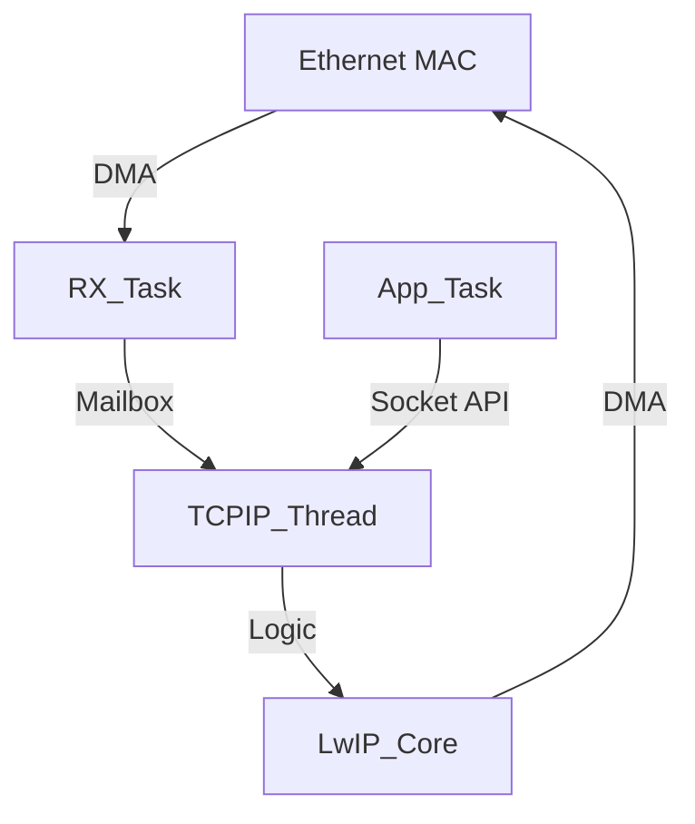

# Day 80: Middleware Integration (LwIP & FreeRTOS)
## Phase 1: Core Embedded Engineering Foundations | Week 12: Capstone Project Phase 1

---

> **📝 Content Creator Instructions:**
> This document is designed to produce **comprehensive, industry-grade educational content**. 
> - **Target Length:** The final filled document should be approximately **1000+ lines** of detailed markdown.
> - **Depth:** Do not skim over details. Explain *why*, not just *how*.
> - **Structure:** If a topic is complex, **DIVIDE IT INTO MULTIPLE PARTS** (Part 1, Part 2, etc.).
> - **Code:** Provide complete, compilable code examples, not just snippets.
> - **Visuals:** Use Mermaid diagrams for flows, architectures, and state machines.

---

## 🎯 Learning Objectives
*By the end of this day, the learner will be able to:*
1.  **Explain** the role of `sys_arch.c` in adapting LwIP to an RTOS.
2.  **Implement** the OS abstraction layer (Semaphores, Mailboxes, Threads) using FreeRTOS primitives.
3.  **Initialize** the LwIP stack in the `Network_Task`.
4.  **Configure** `lwipopts.h` for optimal performance in an RTOS environment.
5.  **Verify** network connectivity (Ping) running alongside other RTOS tasks.

---

## 📚 Prerequisites & Preparation
*   **Hardware Required:**
    *   STM32F4 Discovery Board
    *   Ethernet Cable & Router
*   **Software Required:**
    *   VS Code with ARM GCC Toolchain
    *   LwIP Source Code (v2.1.x)
*   **Prior Knowledge:**
    *   Day 65 (LwIP Sockets)
    *   Day 79 (BSP)

---

## 📖 Theoretical Deep Dive

### 🔹 Part 1: The OS Abstraction Layer (`sys_arch`)
LwIP is designed to be OS-agnostic. To run it with FreeRTOS, we must provide a "Translation Layer" called `sys_arch.c`.
*   **Semaphores:** LwIP needs `sys_sem_new`, `sys_sem_signal`, `sys_sem_wait`. We map these to `xSemaphoreCreateBinary`, `xSemaphoreGive`, `xSemaphoreTake`.
*   **Mailboxes:** LwIP uses mailboxes to pass packets between threads. We map these to FreeRTOS Queues.
*   **Threads:** LwIP needs to spawn the `tcpip_thread`. We map `sys_thread_new` to `xTaskCreate`.
*   **Protection:** `sys_arch_protect` (Critical Section).

### 🔹 Part 2: Threading Model
*   **TCPIP Thread:** The core of LwIP. Handles ARP, IP, TCP, UDP processing.
*   **RX Thread (Ethernet Interface):** Reads from hardware (DMA), wraps frame in `pbuf`, sends to TCPIP Thread via Mailbox.
*   **App Thread:** Calls Socket API (`send`, `recv`). These calls post messages to the TCPIP Thread Mailbox and block on a semaphore until done.



---

## 💻 Implementation: sys_arch.c

> **Instruction:** Implement the key functions required by LwIP.

### 👨‍💻 Code Implementation

#### Step 1: Semaphores
```c
#include "lwip/sys.h"
#include "FreeRTOS.h"
#include "semphr.h"

err_t sys_sem_new(sys_sem_t *sem, u8_t count) {
    *sem = xSemaphoreCreateBinary();
    if (*sem == NULL) return ERR_MEM;
    
    if (count > 0) {
        xSemaphoreGive(*sem);
    }
    return ERR_OK;
}

void sys_sem_free(sys_sem_t *sem) {
    vSemaphoreDelete(*sem);
}

void sys_sem_signal(sys_sem_t *sem) {
    xSemaphoreGive(*sem);
}

u32_t sys_arch_sem_wait(sys_sem_t *sem, u32_t timeout) {
    TickType_t start = xTaskGetTickCount();
    TickType_t delay = (timeout == 0) ? portMAX_DELAY : pdMS_TO_TICKS(timeout);
    
    if (xSemaphoreTake(*sem, delay) == pdTRUE) {
        return (xTaskGetTickCount() - start); // Return elapsed time
    }
    return SYS_ARCH_TIMEOUT;
}
```

#### Step 2: Mailboxes (Queues)
```c
err_t sys_mbox_new(sys_mbox_t *mbox, int size) {
    *mbox = xQueueCreate(size, sizeof(void*));
    return (*mbox == NULL) ? ERR_MEM : ERR_OK;
}

void sys_mbox_post(sys_mbox_t *mbox, void *msg) {
    // Block indefinitely if full (Standard LwIP behavior)
    xQueueSend(*mbox, &msg, portMAX_DELAY);
}

err_t sys_mbox_trypost(sys_mbox_t *mbox, void *msg) {
    return (xQueueSend(*mbox, &msg, 0) == pdTRUE) ? ERR_OK : ERR_MEM;
}

u32_t sys_arch_mbox_fetch(sys_mbox_t *mbox, void **msg, u32_t timeout) {
    TickType_t start = xTaskGetTickCount();
    TickType_t delay = (timeout == 0) ? portMAX_DELAY : pdMS_TO_TICKS(timeout);
    
    if (xQueueReceive(*mbox, msg, delay) == pdTRUE) {
        return (xTaskGetTickCount() - start);
    }
    return SYS_ARCH_TIMEOUT;
}
```

#### Step 3: Threads
```c
sys_thread_t sys_thread_new(const char *name, lwip_thread_fn thread, void *arg, int stacksize, int prio) {
    TaskHandle_t hTask;
    xTaskCreate(thread, name, stacksize, arg, prio, &hTask);
    return hTask;
}
```

---

## 💻 Implementation: Network Task

> **Instruction:** Initialize LwIP in the `Network_Task` created in Day 78.

### 👨‍💻 Code Implementation

#### Step 1: `lwipopts.h` Config
```c
#define NO_SYS                  0  // Use RTOS
#define SYS_LIGHTWEIGHT_PROT    1
#define LWIP_NETCONN            1
#define LWIP_SOCKET             1

// Memory
#define MEM_SIZE                (10 * 1024)
#define MEMP_NUM_PBUF           16
#define MEMP_NUM_TCP_PCB        5

// Thread Priorities (Check FreeRTOSConfig.h)
#define TCPIP_THREAD_PRIO       (configMAX_PRIORITIES - 2)
#define TCPIP_THREAD_STACKSIZE  1024
```

#### Step 2: `app_net.c`
```c
#include "lwip/tcpip.h"
#include "lwip/netif.h"
#include "lwip/dhcp.h"
#include "bsp_net.h" // Your HAL

struct netif gnetif;
ip_addr_t ipaddr, netmask, gw;

void Netif_Status_Callback(struct netif *netif) {
    if (netif_is_up(netif)) {
        printf("Netif UP. IP: %s\n", ip4addr_ntoa(netif_ip4_addr(netif)));
    } else {
        printf("Netif DOWN\n");
    }
}

void vTaskNet(void *p) {
    // 1. Init TCP/IP Stack
    // This spawns the tcpip_thread
    tcpip_init(NULL, NULL);
    
    // 2. Init IP Addresses (0.0.0.0 for DHCP)
    IP4_ADDR(&ipaddr, 0, 0, 0, 0);
    IP4_ADDR(&netmask, 0, 0, 0, 0);
    IP4_ADDR(&gw, 0, 0, 0, 0);
    
    // 3. Add Interface
    // ethernetif_init is the low-level driver (HAL_ETH)
    netif_add(&gnetif, &ipaddr, &netmask, &gw, NULL, &ethernetif_init, &tcpip_input);
    
    // 4. Set Default & Callback
    netif_set_default(&gnetif);
    netif_set_status_callback(&gnetif, Netif_Status_Callback);
    
    // 5. Bring Up
    netif_set_up(&gnetif);
    
    // 6. Start DHCP
    dhcp_start(&gnetif);
    
    while(1) {
        // Check Link Status (PHY) periodically
        // If cable unplugged, netif_set_link_down(&gnetif);
        BSP_Net_CheckLink(&gnetif);
        
        // Handle DHCP fine-grained logic if needed
        vTaskDelay(500);
    }
}
```

---

## 🔬 Lab Exercise: Lab 80.1 - Ping Test

### 1. Lab Objectives
- Compile with `sys_arch.c`.
- Verify DHCP acquisition.
- Ping the board from PC.

### 2. Step-by-Step Guide

#### Phase A: Build
1.  Ensure `sys_arch.c` is added to Makefile/CMake.
2.  Ensure FreeRTOS is running.

#### Phase B: Run
1.  Connect Ethernet.
2.  Reset Board.
3.  **Observation:** UART prints "Netif UP. IP: 192.168.1.X".

#### Phase C: Ping
1.  PC: `ping 192.168.1.X`.
2.  **Observation:** Reply time < 1ms.
3.  **Stress Test:** `ping -f -l 1000 192.168.1.X` (Flood ping).
4.  **Observation:** Board should stay alive. If HardFault, check Stack Sizes or Pbuf memory.

### 3. Verification
If DHCP fails, check if `ethernetif_input` is being called. Usually, this is done in a separate thread or triggered by the ETH ISR giving a semaphore to a helper task.
**Correction:** In RTOS mode, `ethernetif_init` usually spawns a dedicated `ethernetif_input` thread that blocks on a semaphore from the ISR. Ensure this logic exists in your `ethernetif.c`.

---

## 🧪 Additional / Advanced Labs

### Lab 2: Static IP Fallback
- **Goal:** Reliability.
- **Task:**
    1.  If DHCP fails (timeout 10s), switch to Static IP (192.168.1.200).
    2.  Use `dhcp_stop()` and `netif_set_addr()`.

### Lab 3: MbedTLS Integration
- **Goal:** Prepare for Cloud.
- **Task:**
    1.  Add `mbedtls` source.
    2.  Configure `mbedtls_config.h` for FreeRTOS (use `calloc`/`free` which map to `pvPortMalloc`).
    3.  Enable `MBEDTLS_THREADING_C` and implement mutex wrappers in `mbedtls_threading_alt.c`.

---

## 🐞 Debugging & Troubleshooting

### Common Issues

#### 1. Stack Overflow in TCPIP Thread
*   **Cause:** LwIP uses stack for packet processing.
*   **Solution:** Increase `TCPIP_THREAD_STACKSIZE` to 2048 or 4096.

#### 2. Deadlock
*   **Cause:** Calling LwIP functions from ISR.
*   **Rule:** NEVER call `netconn_*` or `socket` functions from ISR. Only `tcpip_callback` or signal a semaphore.

---

## ⚡ Optimization & Best Practices

### Code Quality
- **Zero Copy:** Ensure your Ethernet Driver uses Zero Copy (passes Pbuf chain directly to DMA descriptors) to avoid `memcpy`.
- **Pbuf Pool:** Tune `MEMP_NUM_PBUF` based on traffic. If you drop packets, increase this.

---

## 🧠 Assessment & Review

### Knowledge Check
1.  **Q:** Why do we need `sys_mbox_fetch` to return elapsed time?
    *   **A:** LwIP uses it to manage internal timeouts (e.g., ARP table aging, TCP retransmission) while waiting for a message.
2.  **Q:** What is `tcpip_input`?
    *   **A:** The function that the Ethernet Driver calls to pass a received packet into the LwIP stack (specifically, into the TCPIP Thread's mailbox).

### Challenge Task
> **Task:** Implement "Link Status LED". If Ethernet cable is plugged in, Green LED ON. If Activity (TX/RX), blink Orange LED. Read PHY registers via MDIO.

---

## 📚 Further Reading & References
- [LwIP Wiki - Porting for an OS](https://lwip.fandom.com/wiki/Porting_for_an_OS)

---
