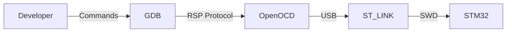

# Day 85: Debugging Tools and Techniques
## Phase 1: Core Embedded Engineering Foundations | Week 13: Debugging and Testing

---

> **📝 Content Creator Instructions:**
> This document is designed to produce **comprehensive, industry-grade educational content**. 
> - **Target Length:** The final filled document should be approximately **1000+ lines** of detailed markdown.
> - **Depth:** Do not skim over details. Explain *why*, not just *how*.
> - **Structure:** If a topic is complex, **DIVIDE IT INTO MULTIPLE PARTS** (Part 1, Part 2, etc.).
> - **Code:** Provide complete, compilable code examples, not just snippets.
> - **Visuals:** Use Mermaid diagrams for flows, architectures, and state machines.

---

## 🎯 Learning Objectives
*By the end of this day, the learner will be able to:*
1.  **Differentiate** between JTAG and SWD interfaces.
2.  **Configure** OpenOCD to connect to the STM32F4 Discovery board.
3.  **Execute** basic GDB commands (break, step, next, print, backtrace).
4.  **Inspect** peripheral registers and memory manually via GDB.
5.  **Automate** debugging tasks using GDB scripts.

---

## 📚 Prerequisites & Preparation
*   **Hardware Required:**
    *   STM32F4 Discovery Board (ST-LINK built-in).
*   **Software Required:**
    *   VS Code with Cortex-Debug Extension.
    *   OpenOCD (Open On-Chip Debugger).
    *   ARM-None-EABI-GDB.
*   **Prior Knowledge:**
    *   Basic C compilation process.
    *   Understanding of Registers.

---

## 📖 Theoretical Deep Dive

### 🔹 Part 1: JTAG vs SWD
*   **JTAG (Joint Test Action Group):**
    *   Standard: IEEE 1149.1.
    *   Pins: TCK, TMS, TDI, TDO, (TRST). 4-5 pins.
    *   Features: Debugging + Boundary Scan (Testing PCB connections).
    *   Pros: Universal.
    *   Cons: Uses many pins.
*   **SWD (Serial Wire Debug):**
    *   Standard: ARM specific.
    *   Pins: SWCLK, SWDIO. 2 pins!
    *   Features: Debugging + Tracing (SWO).
    *   Pros: Low pin count. High speed.
    *   **STM32F4 Discovery:** Uses SWD by default via the ST-LINK/V2.

### 🔹 Part 2: The Debug Chain
1.  **GDB (Client):** The human interface. Sends commands like "Read Memory".
2.  **OpenOCD (Server):** Translates GDB commands into JTAG/SWD signals. Talks to the Debug Probe (ST-LINK).
3.  **Debug Probe (ST-LINK):** Hardware that toggles the pins on the target MCU.
4.  **Target (STM32):** The chip being debugged. Contains a DAP (Debug Access Port).



---

## 💻 Implementation: OpenOCD Setup

> **Instruction:** Connect to the board manually using OpenOCD.

### 👨‍💻 Code Implementation

#### Step 1: Configuration File (`stm32f4discovery.cfg`)
Usually located in `openocd/scripts/board/`.
Content:
```tcl
source [find interface/stlink.cfg]
source [find target/stm32f4x.cfg]
reset_config srst_only
```

#### Step 2: Launch Server
Run in terminal:
```bash
openocd -f board/stm32f4discovery.cfg
```
**Output:**
```text
Info : STLINK V2J14S0 (API v2) VID:PID 0483:3748
Info : Target voltage: 2.909473
Info : stm32f4x.cpu: hardware has 6 breakpoints, 4 watchpoints
```
This means the connection is successful! OpenOCD is listening on Port 3333 (GDB) and 4444 (Telnet).

---

## 💻 Implementation: GDB Session

> **Instruction:** Connect GDB to OpenOCD and debug `main.elf`.

### 👨‍💻 Code Implementation

#### Step 1: Start GDB
In a new terminal:
```bash
arm-none-eabi-gdb build/main.elf
```

#### Step 2: Connect to Target
Inside GDB:
```gdb
(gdb) target remote localhost:3333
(gdb) monitor reset halt
```
*   `target remote`: Connects to OpenOCD.
*   `monitor`: Sends command directly to OpenOCD (bypass GDB).
*   `reset halt`: Resets MCU and stops at the first instruction.

#### Step 3: Basic Commands
```gdb
(gdb) load                  # Flash the binary
(gdb) break main            # Set breakpoint at main()
(gdb) continue              # Run until breakpoint
(gdb) next                  # Step Over
(gdb) step                  # Step Into
(gdb) print myVar           # Inspect variable
(gdb) x/4x 0x20000000       # Examine memory (4 hex words)
```

---

## 🔬 Lab Exercise: Lab 85.1 - The Crash Investigation

### 1. Lab Objectives
- Create a program that HardFaults (dereference NULL).
- Use GDB to find the exact line of code.

### 2. Step-by-Step Guide

#### Phase A: The Buggy Code
```c
void Cause_Crash(void) {
    volatile int *p = NULL;
    *p = 42; // Boom
}

int main(void) {
    HAL_Init();
    Cause_Crash();
    while(1);
}
```

#### Phase B: Debugging
1.  Compile and Run via GDB.
2.  `continue`.
3.  **Observation:** GDB stops. "Program received signal SIGINT" or stuck in `HardFault_Handler`.
4.  `backtrace` (or `bt`).
5.  **Output:**
    ```text
    #0  HardFault_Handler () at Core/Src/stm32f4xx_it.c:60
    #1  <signal handler called>
    #2  Cause_Crash () at Core/Src/main.c:15
    #3  main () at Core/Src/main.c:20
    ```
6.  **Analysis:** Frame #2 shows `Cause_Crash` caused the fault.

### 3. Verification
If `backtrace` only shows `HardFault_Handler` and `??`, it means the stack was corrupted or GDB can't unwind it. Use the `HardFault_Handler` assembly trick (Day 84) to find the PC.

---

## 🧪 Additional / Advanced Labs

### Lab 2: Watchpoints
- **Goal:** Catch who corrupts a variable.
- **Task:**
    1.  Global `int counter`.
    2.  GDB: `watch counter`.
    3.  Run.
    4.  GDB stops *automatically* whenever `counter` changes value.

### Lab 3: Peripheral Inspection
- **Goal:** Check GPIO State.
- **Task:**
    1.  Find GPIOD ODR address (0x40020C14).
    2.  GDB: `x/1x 0x40020C14`.
    3.  Verify if LED bits are set.
    4.  GDB: `set {int}0x40020C14 = 0xF000` (Force LEDs ON).

---

## 🐞 Debugging & Troubleshooting

### Common Issues

#### 1. "Target not found"
*   **Cause:** ST-LINK drivers missing or USB cable bad.
*   **Solution:** Check Device Manager. Install ST-LINK drivers.

#### 2. "Double Fault"
*   **Cause:** Stack Pointer initialized to invalid address.
*   **Solution:** Check Linker Script `_estack`.

---

## ⚡ Optimization & Best Practices

### Code Quality
- **GDB Scripts:** Create a `.gdbinit` file to automate connection:
    ```gdb
    target remote :3333
    monitor reset halt
    load
    break main
    continue
    ```

---

## 🧠 Assessment & Review

### Knowledge Check
1.  **Q:** What is the difference between `step` and `next`?
    *   **A:** `step` goes *into* functions. `next` goes *over* functions (treats them as one line).
2.  **Q:** Can I debug without source code?
    *   **A:** Yes, using `layout asm`. You see Assembly instructions instead of C code.

### Challenge Task
> **Task:** Use "Semihosting". Configure OpenOCD to allow the STM32 to print to the GDB console using `printf`. Requires linking with `--specs=rdimon.specs`.

---

## 📚 Further Reading & References
- [OpenOCD User's Guide](http://openocd.org/doc/html/index.html)
- [GDB Cheat Sheet](https://darkdust.net/files/GDB%20Cheat%20Sheet.pdf)

---
