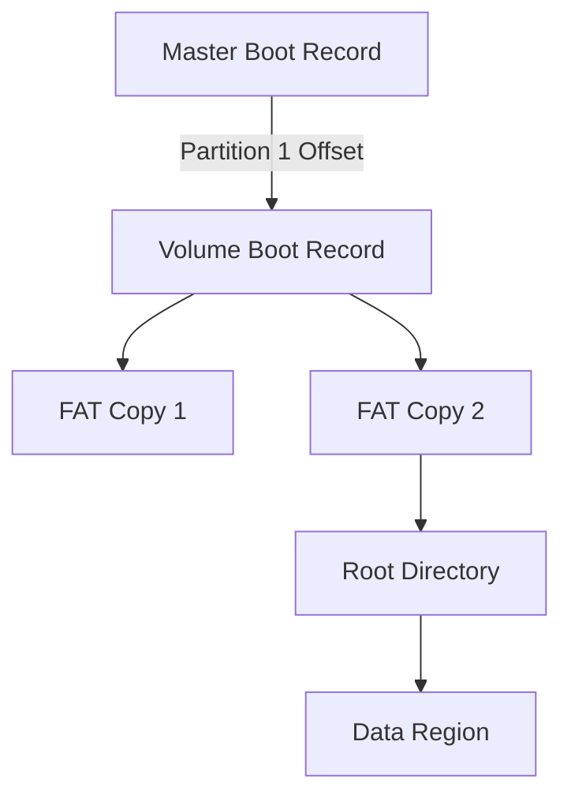

# Day 92: File System Basics
## Phase 1: Core Embedded Engineering Foundations | Week 14: File Systems and Storage

---

> **📝 Content Creator Instructions:**
> This document is designed to produce **comprehensive, industry-grade educational content**. 
> - **Target Length:** The final filled document should be approximately **1000+ lines** of detailed markdown.
> - **Depth:** Do not skim over details. Explain *why*, not just *how*.
> - **Structure:** If a topic is complex, **DIVIDE IT INTO MULTIPLE PARTS** (Part 1, Part 2, etc.).
> - **Code:** Provide complete, compilable code examples, not just snippets.
> - **Visuals:** Use Mermaid diagrams for flows, architectures, and state machines.

---

## 🎯 Learning Objectives
*By the end of this day, the learner will be able to:*
1.  **Explain** the structure of a File System (MBR, Boot Sector, FAT, Root Dir, Data Region).
2.  **Differentiate** between FAT12, FAT16, and FAT32.
3.  **Analyze** a raw hex dump of an SD card to identify file system structures.
4.  **Calculate** Cluster sizes and storage efficiency.
5.  **Implement** a basic "Read Sector" function to inspect the Master Boot Record (MBR).

---

## 📚 Prerequisites & Preparation
*   **Hardware Required:**
    *   STM32F4 Discovery Board
    *   Micro SD Card (2GB - 32GB) + Breakout Board (or built-in slot).
*   **Software Required:**
    *   VS Code with ARM GCC Toolchain
    *   HxD (Hex Editor) on PC.
*   **Prior Knowledge:**
    *   Day 29 (SPI) - Used to talk to SD Card.

---

## 📖 Theoretical Deep Dive

### 🔹 Part 1: Why a File System?
Without a FS, we just have raw sectors (0 to N).
*   **Raw:** Good for simple logging (Sector 0 = Log 1, Sector 1 = Log 2).
*   **FS:** Needed for interoperability (Read on PC), named files, directories, fragmentation handling.

### 🔹 Part 2: The FAT Architecture
FAT (File Allocation Table) is the industry standard for embedded.
1.  **MBR (Master Boot Record):** Sector 0. Contains the Partition Table.
2.  **Volume Boot Record (VBR):** Start of Partition. Contains Bytes Per Sector, Sectors Per Cluster.
3.  **FAT Region:** A linked list map of clusters.
    *   `FAT[N] = M` means "File continues in Cluster M".
    *   `FAT[N] = 0xFFFF` means "End of File".
4.  **Root Directory:** List of file names, sizes, and start clusters.
5.  **Data Region:** The actual file contents.

### 🔹 Part 3: Clusters vs Sectors
*   **Sector:** Physical unit (usually 512 bytes).
*   **Cluster:** Logical unit (e.g., 4KB = 8 Sectors).
*   **Trade-off:** Small cluster = less wasted space (slack) but larger FAT table. Large cluster = faster access but more slack.



---

## 💻 Implementation: Inspecting the MBR

> **Instruction:** Read Sector 0 of the SD Card and parse the Partition Table.

### 👨‍💻 Code Implementation

#### Step 1: SD Driver Stub (SPI)
(We will fully implement SD in Day 94, for now assume `SD_ReadBlock` exists).
```c
#include "sd_driver.h"

typedef struct {
    uint8_t  status;
    uint8_t  chs_start[3];
    uint8_t  type;
    uint8_t  chs_end[3];
    uint32_t lba_start;
    uint32_t sector_count;
} __attribute__((packed)) PartitionEntry_t;

typedef struct {
    uint8_t  bootstrap[446];
    PartitionEntry_t partitions[4];
    uint16_t signature; // 0x55AA
} __attribute__((packed)) MBR_t;

uint8_t buffer[512];
```

#### Step 2: Parse MBR
```c
void Parse_MBR(void) {
    // Read Sector 0
    SD_ReadBlock(0, buffer);
    
    MBR_t *mbr = (MBR_t*)buffer;
    
    if (mbr->signature != 0xAA55) { // Little Endian
        printf("Invalid MBR Signature: %04X\n", mbr->signature);
        return;
    }
    
    printf("MBR Valid.\n");
    for(int i=0; i<4; i++) {
        if (mbr->partitions[i].type != 0) {
            printf("Partition %d: Type 0x%02X, Start LBA: %lu, Size: %lu MB\n",
                   i, 
                   mbr->partitions[i].type,
                   mbr->partitions[i].lba_start,
                   (mbr->partitions[i].sector_count * 512) / (1024*1024));
        }
    }
}
```

---

## 🔬 Lab Exercise: Lab 92.1 - Hex Dump Analysis

### 1. Lab Objectives
- Format an SD card on PC (FAT32).
- Read Sector 0 on STM32.
- Verify the output matches HxD on PC.

### 2. Step-by-Step Guide

#### Phase A: PC Prep
1.  Insert SD into PC.
2.  Format as FAT32.
3.  Open HxD -> Open Disk -> SD Card.
4.  Look at Sector 0. Note the bytes at offset 0x1BE (Partition 1).

#### Phase B: STM32 Run
1.  Run `Parse_MBR`.
2.  **Observation:** UART prints "Type 0x0B (FAT32) or 0x0C (FAT32 LBA)".
3.  Start LBA matches HxD.

### 3. Verification
If Signature is wrong, check Endianness or SPI Read function (CS low/high timing).

---

## 🧪 Additional / Advanced Labs

### Lab 2: Reading the VBR
- **Goal:** Find the Cluster Size.
- **Task:**
    1.  Use `lba_start` from MBR.
    2.  Read that Sector (VBR).
    3.  Parse `BPB_SecPerClus` (Byte at offset 0x0D).
    4.  Calculate Cluster Size in Bytes.

### Lab 3: Finding the Root Directory
- **Goal:** Locate the first file.
- **Task:**
    1.  Calculate Root Dir Sector = `LBA_Start + Reserved_Sectors + (Number_of_FATs * FAT_Size)`.
    2.  Read it.
    3.  Look for ASCII filenames (e.g., "TEST    TXT").

---

## 🐞 Debugging & Troubleshooting

### Common Issues

#### 1. No MBR?
*   **Cause:** Some SD cards (Superfloppy format) don't have an MBR. Sector 0 *is* the VBR.
*   **Check:** If Byte 0 is 0xEB or 0xE9 (JMP instruction), it's a VBR.

#### 2. SPI Read Fail
*   **Cause:** SD Card initialization failed (CMD0, CMD8, ACMD41 sequence).
*   **Solution:** Ensure SD Init is robust (Day 94).

---

## ⚡ Optimization & Best Practices

### Code Quality
- **Alignment:** `__attribute__((packed))` is crucial for structs mapping to binary data. Accessing 32-bit integers inside packed structs can cause Unaligned Access Faults on ARM. Use `memcpy` to extract values safely if needed.

---

## 🧠 Assessment & Review

### Knowledge Check
1.  **Q:** What is the max file size in FAT32?
    *   **A:** 4GB minus 1 byte (32-bit size field).
2.  **Q:** Why use FAT instead of a custom raw format?
    *   **A:** So the user can plug the SD card into Windows/Mac/Linux and read the files without special software.

### Challenge Task
> **Task:** "Manual File Recovery". Delete a file on PC. Put SD in STM32. Scan the Root Directory for entries starting with `0xE5` (Deleted marker). Restore the first character and "Undelete" it.

---

## 📚 Further Reading & References
- [Microsoft FAT Specification](https://academy.cba.mit.edu/classes/networking_communications/SD/FAT.pdf)
- [ELM Chan FatFs Module (The Bible of Embedded FAT)](http://elm-chan.org/fsw/ff/00index_e.html)

---
