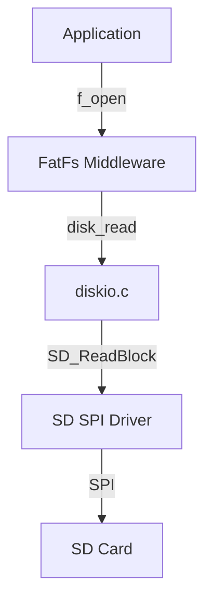

# Day 93: FatFs Library Integration
## Phase 1: Core Embedded Engineering Foundations | Week 14: File Systems and Storage

---

> **📝 Content Creator Instructions:**
> This document is designed to produce **comprehensive, industry-grade educational content**. 
> - **Target Length:** The final filled document should be approximately **1000+ lines** of detailed markdown.
> - **Depth:** Do not skim over details. Explain *why*, not just *how*.
> - **Structure:** If a topic is complex, **DIVIDE IT INTO MULTIPLE PARTS** (Part 1, Part 2, etc.).
> - **Code:** Provide complete, compilable code examples, not just snippets.
> - **Visuals:** Use Mermaid diagrams for flows, architectures, and state machines.

---

## 🎯 Learning Objectives
*By the end of this day, the learner will be able to:*
1.  **Integrate** the ELM Chan FatFs library into an STM32 project.
2.  **Implement** the low-level `diskio.c` interface to link FatFs with the SD SPI driver.
3.  **Perform** standard file operations (`f_mount`, `f_open`, `f_write`, `f_close`).
4.  **Handle** common file system errors (Disk Full, No File, Write Protected).
5.  **Optimize** FatFs configuration (`ffconf.h`) for embedded constraints.

---

## 📚 Prerequisites & Preparation
*   **Hardware Required:**
    *   STM32F4 Discovery Board
    *   Micro SD Card.
*   **Software Required:**
    *   VS Code with ARM GCC Toolchain
    *   [FatFs Source Code (R0.15)](http://elm-chan.org/fsw/ff/00index_e.html)
*   **Prior Knowledge:**
    *   Day 92 (FAT Basics)
    *   Day 29 (SPI)

---

## 📖 Theoretical Deep Dive

### 🔹 Part 1: What is FatFs?
FatFs is a generic FAT/exFAT file system module for small embedded systems.
*   **Platform Independent:** Written in ANSI C.
*   **Separation of Concerns:**
    *   **Application:** Calls `f_open()`.
    *   **FatFs Module:** Handles FAT logic (clusters, chains).
    *   **Disk I/O Layer:** Handles physical reads/writes (SPI/SDIO).

### 🔹 Part 2: The Glue Layer (`diskio.c`)
FatFs requires us to implement 5 functions:
1.  `disk_initialize`: Init hardware.
2.  `disk_status`: Check if card present/write-protected.
3.  `disk_read`: Read N sectors.
4.  `disk_write`: Write N sectors.
5.  `disk_ioctl`: Control commands (Sync, Get Sector Count).



---

## 💻 Implementation: diskio.c

> **Instruction:** Bridge FatFs to our dummy SD driver (Day 94 will implement the real driver).

### 👨‍💻 Code Implementation

#### Step 1: Includes
```c
#include "diskio.h"
#include "sd_driver.h" // Our low-level driver

// Map Drive 0 to SD Card
#define SD_CARD 0
```

#### Step 2: Initialize & Status
```c
DSTATUS disk_status(BYTE pdrv) {
    if (pdrv != SD_CARD) return STA_NOINIT;
    return 0; // Assume OK
}

DSTATUS disk_initialize(BYTE pdrv) {
    if (pdrv != SD_CARD) return STA_NOINIT;
    
    if (SD_Init() == 0) return 0; // OK
    return STA_NOINIT;
}
```

#### Step 3: Read/Write
```c
DRESULT disk_read(BYTE pdrv, BYTE *buff, LBA_t sector, UINT count) {
    if (pdrv != SD_CARD) return RES_PARERR;
    
    // Read 'count' sectors
    for(UINT i=0; i<count; i++) {
        if (SD_ReadBlock(sector + i, buff + (i*512)) != 0) {
            return RES_ERROR;
        }
    }
    return RES_OK;
}

DRESULT disk_write(BYTE pdrv, const BYTE *buff, LBA_t sector, UINT count) {
    if (pdrv != SD_CARD) return RES_PARERR;
    
    for(UINT i=0; i<count; i++) {
        if (SD_WriteBlock(sector + i, buff + (i*512)) != 0) {
            return RES_ERROR;
        }
    }
    return RES_OK;
}
```

#### Step 4: IOCTL (Required for Formatting)
```c
DRESULT disk_ioctl(BYTE pdrv, BYTE cmd, void *buff) {
    if (pdrv != SD_CARD) return RES_PARERR;
    
    switch(cmd) {
        case CTRL_SYNC:
            return RES_OK;
        case GET_SECTOR_COUNT:
            *(DWORD*)buff = 1024 * 1024 * 4; // Dummy 2GB
            return RES_OK;
        case GET_SECTOR_SIZE:
            *(WORD*)buff = 512;
            return RES_OK;
        case GET_BLOCK_SIZE:
            *(DWORD*)buff = 1; // Erase block size
            return RES_OK;
    }
    return RES_PARERR;
}
```

---

## 💻 Implementation: File Operations

> **Instruction:** Create a file, write "Hello", and read it back.

### 👨‍💻 Code Implementation

#### Step 1: Global Objects
```c
FATFS fs;      // File System Object
FIL fil;       // File Object
FRESULT res;   // Return Code
UINT bw, br;   // Bytes Written/Read
```

#### Step 2: The Test Function
```c
void FatFs_Test(void) {
    // 1. Mount
    res = f_mount(&fs, "", 1); // 1 = Mount immediately
    if (res != FR_OK) {
        printf("Mount Failed: %d\n", res);
        return;
    }
    printf("Mount OK.\n");
    
    // 2. Open for Write (Create Always)
    res = f_open(&fil, "hello.txt", FA_WRITE | FA_CREATE_ALWAYS);
    if (res == FR_OK) {
        // 3. Write
        f_write(&fil, "Hello STM32!", 12, &bw);
        printf("Written: %d bytes\n", bw);
        
        // 4. Close
        f_close(&fil);
    }
    
    // 5. Open for Read
    res = f_open(&fil, "hello.txt", FA_READ);
    if (res == FR_OK) {
        char buffer[32] = {0};
        // 6. Read
        f_read(&fil, buffer, sizeof(buffer)-1, &br);
        printf("Read: %s\n", buffer);
        f_close(&fil);
    }
}
```

---

## 🔬 Lab Exercise: Lab 93.1 - The Logger

### 1. Lab Objectives
- Append data to a file (`log.txt`).
- Verify persistence after reset.

### 2. Step-by-Step Guide

#### Phase A: Append Logic
```c
void Log_Append(const char *msg) {
    res = f_open(&fil, "log.txt", FA_WRITE | FA_OPEN_APPEND);
    if (res == FR_OK) {
        f_write(&fil, msg, strlen(msg), &bw);
        f_close(&fil);
    }
}
```

#### Phase B: Run
1.  Call `Log_Append("Boot 1\n")`.
2.  Reset Board.
3.  Call `Log_Append("Boot 2\n")`.
4.  Read file.
5.  **Observation:** File contains both lines.

### 3. Verification
If `f_open` fails with `FR_NO_FILESYSTEM`, ensure the card is formatted FAT32. If `FR_NOT_READY`, check `disk_initialize`.

---

## 🧪 Additional / Advanced Labs

### Lab 2: Directory Listing
- **Goal:** `ls` command.
- **Task:**
    1.  Use `f_opendir` and `f_readdir`.
    2.  Loop until `f_readdir` returns empty `fno.fname`.
    3.  Print Name and Size.

### Lab 3: Formatting
- **Goal:** `mkfs`.
- **Task:**
    1.  Call `f_mkfs("", 0, 0, work_buf, sizeof(work_buf))`.
    2.  **Warning:** This erases the card!

---

## 🐞 Debugging & Troubleshooting

### Common Issues

#### 1. Stack Overflow
*   **Cause:** `FATFS` or `FIL` objects are large structures. Putting them on stack (local variables) can blow the stack.
*   **Solution:** Make them `static` or global, or increase Stack Size.

#### 2. Corrupt Files
*   **Cause:** Removing card while writing.
*   **Solution:** Always `f_close` or `f_sync` immediately after writing critical data.

---

## ⚡ Optimization & Best Practices

### Code Quality
- **LFN (Long File Names):** Enabling LFN in `ffconf.h` requires Unicode support and heap memory. Keep it disabled (`_USE_LFN 0`) for 8.3 filenames (TESTFILE.TXT) to save significant Flash/RAM.

---

## 🧠 Assessment & Review

### Knowledge Check
1.  **Q:** What is the difference between `f_mount` with option 0 vs 1?
    *   **A:** Option 1 forces immediate mounting (checks hardware). Option 0 delays mounting until the first file access.
2.  **Q:** Why do we need `disk_ioctl`?
    *   **A:** Specifically for `CTRL_SYNC` (flush cache) and `GET_SECTOR_COUNT` (needed for `f_mkfs` and `f_lseek` to end of drive).

### Challenge Task
> **Task:** Implement "Sector Caching". In `diskio.c`, keep the last read sector in a RAM buffer. If `disk_read` asks for the same sector again, return RAM copy. Reduces SPI traffic.

---

## 📚 Further Reading & References
- [FatFs Application Note](http://elm-chan.org/fsw/ff/doc/appnote.html)

---
