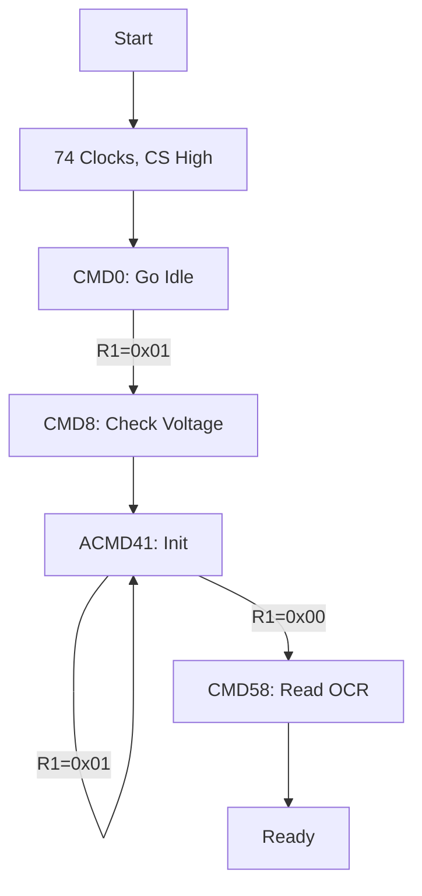

# Day 94: SD Card Interface (SPI Mode)
## Phase 1: Core Embedded Engineering Foundations | Week 14: File Systems and Storage

---

> **📝 Content Creator Instructions:**
> This document is designed to produce **comprehensive, industry-grade educational content**. 
> - **Target Length:** The final filled document should be approximately **1000+ lines** of detailed markdown.
> - **Depth:** Do not skim over details. Explain *why*, not just *how*.
> - **Structure:** If a topic is complex, **DIVIDE IT INTO MULTIPLE PARTS** (Part 1, Part 2, etc.).
> - **Code:** Provide complete, compilable code examples, not just snippets.
> - **Visuals:** Use Mermaid diagrams for flows, architectures, and state machines.

---

## 🎯 Learning Objectives
*By the end of this day, the learner will be able to:*
1.  **Explain** the SD Card Initialization Sequence in SPI Mode.
2.  **Implement** the `SD_Init` function to handle CMD0, CMD8, and ACMD41.
3.  **Develop** `SD_ReadBlock` and `SD_WriteBlock` functions for 512-byte sectors.
4.  **Handle** R1, R3, and R7 response formats.
5.  **Debug** common SD card issues like "Timeout" or "CRC Error".

---

## 📚 Prerequisites & Preparation
*   **Hardware Required:**
    *   STM32F4 Discovery Board
    *   Micro SD Card.
*   **Software Required:**
    *   VS Code with ARM GCC Toolchain
*   **Prior Knowledge:**
    *   Day 29 (SPI)
    *   Day 93 (FatFs - we are building the driver for it).

---

## 📖 Theoretical Deep Dive

### 🔹 Part 1: SD Modes
*   **SDIO (Native):** 4-bit data, high speed (up to 50MHz or UHS). Complex.
*   **SPI (Legacy):** 1-bit data, slower (25MHz max usually). Simple.
    *   **Pins:** CS, MOSI (CMD), MISO (Data), CLK.
    *   **Voltage:** 3.3V.

### 🔹 Part 2: The Command Protocol
*   **Format:** 6 Bytes.
    *   Byte 0: `0x40 | CMD_INDEX` (e.g., CMD0 = 0x40).
    *   Bytes 1-4: Argument (32-bit).
    *   Byte 5: CRC7 + Stop Bit (1).
*   **Response:**
    *   **R1 (1 Byte):** Status (0x00 = Ready, 0x01 = Idle, Other = Error).
    *   **R3/R7 (5 Bytes):** R1 + 32-bit return value (OCR/Voltage).

### 🔹 Part 3: Initialization Flow
1.  **Power Up:** Wait > 1ms. Send > 74 clocks with CS High.
2.  **CMD0:** Reset to Idle State. (Expect R1 = 0x01).
3.  **CMD8:** Check Voltage/Version. (Expect R7).
4.  **ACMD41:** Initialize. Loop until R1 = 0x00 (Ready).
5.  **CMD58:** Read OCR (Check CCS bit for High Capacity).



---

## 💻 Implementation: Low-Level SPI

> **Instruction:** Helper functions to send/receive bytes.

### 👨‍💻 Code Implementation

#### Step 1: SPI Wrappers
```c
uint8_t SPI_TxRx(uint8_t data) {
    uint8_t rx;
    HAL_SPI_TransmitReceive(&hspi1, &data, &rx, 1, 100);
    return rx;
}

void SD_CS_Select(void) {
    HAL_GPIO_WritePin(SD_CS_PORT, SD_CS_PIN, GPIO_PIN_RESET);
}

void SD_CS_Deselect(void) {
    HAL_GPIO_WritePin(SD_CS_PORT, SD_CS_PIN, GPIO_PIN_SET);
    SPI_TxRx(0xFF); // Dummy clock to flush
}
```

#### Step 2: Send Command
```c
uint8_t SD_SendCmd(uint8_t cmd, uint32_t arg, uint8_t crc) {
    SD_CS_Select();
    
    // Wait for Ready (MISO High)
    uint8_t retry = 0;
    while(SPI_TxRx(0xFF) != 0xFF && retry++ < 200);
    
    // Send 6 Bytes
    uint8_t packet[6];
    packet[0] = 0x40 | cmd;
    packet[1] = (arg >> 24) & 0xFF;
    packet[2] = (arg >> 16) & 0xFF;
    packet[3] = (arg >> 8) & 0xFF;
    packet[4] = arg & 0xFF;
    packet[5] = crc;
    
    HAL_SPI_Transmit(&hspi1, packet, 6, 100);
    
    // Receive R1
    uint8_t r1;
    retry = 0;
    do {
        r1 = SPI_TxRx(0xFF);
    } while((r1 & 0x80) && retry++ < 200);
    
    return r1; // CS stays Low!
}
```

---

## 💻 Implementation: Initialization

> **Instruction:** Implement the state machine to wake up the card.

### 👨‍💻 Code Implementation

#### Step 1: SD_Init
```c
uint8_t SD_Init(void) {
    uint8_t r1;
    
    // 1. Power Up Sequence
    SD_CS_Deselect();
    for(int i=0; i<10; i++) SPI_TxRx(0xFF); // 80 clocks
    
    // 2. CMD0 (Go Idle)
    // CRC for CMD0(0) is 0x95
    r1 = SD_SendCmd(0, 0, 0x95);
    SD_CS_Deselect();
    
    if (r1 != 0x01) return 1; // Error
    
    // 3. CMD8 (Check Voltage)
    // Arg: 0x1AA (2.7-3.6V, Pattern 0xAA). CRC 0x87.
    r1 = SD_SendCmd(8, 0x1AA, 0x87);
    if (r1 == 0x01) {
        // Read R7 (4 bytes)
        uint8_t r7[4];
        for(int i=0; i<4; i++) r7[i] = SPI_TxRx(0xFF);
        SD_CS_Deselect();
        
        if (r7[3] != 0xAA) return 2; // Pattern Mismatch
    } else {
        SD_CS_Deselect();
        // Legacy Card (v1.x) logic here...
    }
    
    // 4. ACMD41 (Init)
    uint16_t timeout = 1000;
    do {
        // CMD55 (App Cmd)
        SD_SendCmd(55, 0, 0xFF);
        SD_CS_Deselect();
        
        // ACMD41 (HCS=1)
        r1 = SD_SendCmd(41, 0x40000000, 0xFF);
        SD_CS_Deselect();
        
        HAL_Delay(1);
    } while(r1 != 0x00 && timeout--);
    
    if (timeout == 0) return 3; // Timeout
    
    // 5. CMD58 (Read OCR) - Optional
    
    // Speed up SPI to 10MHz+
    // Modify hspi1.Init.BaudRatePrescaler
    
    return 0; // Success
}
```

---

## 💻 Implementation: Read/Write Block

> **Instruction:** Read 512 bytes.

### 👨‍💻 Code Implementation

#### Step 1: SD_ReadBlock
```c
uint8_t SD_ReadBlock(uint32_t sector, uint8_t *buffer) {
    // CMD17 (Read Single Block)
    if (SD_SendCmd(17, sector, 0xFF) != 0x00) {
        SD_CS_Deselect();
        return 1;
    }
    
    // Wait for Data Token (0xFE)
    uint16_t timeout = 5000;
    while(SPI_TxRx(0xFF) != 0xFE && timeout--);
    if (timeout == 0) return 2;
    
    // Read 512 Bytes
    for(int i=0; i<512; i++) {
        buffer[i] = SPI_TxRx(0xFF);
    }
    
    // Read CRC (2 Bytes) - Ignore
    SPI_TxRx(0xFF);
    SPI_TxRx(0xFF);
    
    SD_CS_Deselect();
    return 0;
}
```

#### Step 2: SD_WriteBlock
```c
uint8_t SD_WriteBlock(uint32_t sector, const uint8_t *buffer) {
    // CMD24 (Write Single Block)
    if (SD_SendCmd(24, sector, 0xFF) != 0x00) {
        SD_CS_Deselect();
        return 1;
    }
    
    // Send Data Token (0xFE)
    SPI_TxRx(0xFE);
    
    // Send 512 Bytes
    for(int i=0; i<512; i++) {
        SPI_TxRx(buffer[i]);
    }
    
    // Send CRC (Dummy)
    SPI_TxRx(0xFF);
    SPI_TxRx(0xFF);
    
    // Read Data Response
    uint8_t resp = SPI_TxRx(0xFF);
    if ((resp & 0x1F) != 0x05) { // 0x05 = Accepted
        SD_CS_Deselect();
        return 2;
    }
    
    // Wait for Busy (MISO Low) to end
    uint32_t busy_timeout = 100000;
    while(SPI_TxRx(0xFF) == 0x00 && busy_timeout--);
    
    SD_CS_Deselect();
    return 0;
}
```

---

## 🔬 Lab Exercise: Lab 94.1 - Raw Sector Test

### 1. Lab Objectives
- Initialize Card.
- Write pattern `0xAA` to Sector 100.
- Read Sector 100 and verify.

### 2. Step-by-Step Guide

#### Phase A: Test Code
```c
void Test_SD_Raw(void) {
    if (SD_Init() != 0) {
        printf("Init Failed\n");
        return;
    }
    
    uint8_t tx[512], rx[512];
    memset(tx, 0xAA, 512);
    
    SD_WriteBlock(100, tx);
    SD_ReadBlock(100, rx);
    
    if (memcmp(tx, rx, 512) == 0) printf("Pass!\n");
    else printf("Fail!\n");
}
```

#### Phase B: Run
1.  Run code.
2.  **Observation:** "Pass!".
3.  **Note:** This destroys data on Sector 100. Don't use Sector 0!

### 3. Verification
If Init fails at CMD0, check connections (CS, MOSI, MISO, CLK). MISO should be pulled up.

---

## 🧪 Additional / Advanced Labs

### Lab 2: High Speed SPI
- **Goal:** Optimize.
- **Task:**
    1.  Start with Prescaler 256 (Low Speed) for Init.
    2.  After Init, reconfigure SPI to Prescaler 2 or 4 (High Speed).
    3.  Measure Read Throughput (MB/s).

### Lab 3: Multi-Block Read
- **Goal:** CMD18.
- **Task:**
    1.  Send CMD18.
    2.  Loop reading blocks until done.
    3.  Send CMD12 (Stop Transmission).
    4.  Much faster than repeated CMD17.

---

## 🐞 Debugging & Troubleshooting

### Common Issues

#### 1. R1 = 0xFF (Timeout)
*   **Cause:** Card not responding.
*   **Solution:** Check Power (3.3V). Check CS pin logic.

#### 2. R1 = 0x05 (Illegal Command)
*   **Cause:** Sending ACMD without CMD55 first.
*   **Solution:** Always prefix ACMD with CMD55.

---

## ⚡ Optimization & Best Practices

### Code Quality
- **DMA:** For `SD_ReadBlock`, use `HAL_SPI_Receive_DMA`. This allows the CPU to do other things while 512 bytes are arriving.
- **CRC:** In SPI mode, CRC is disabled by default (except CMD0/CMD8). You can enable it with CMD59 for robustness.

---

## 🧠 Assessment & Review

### Knowledge Check
1.  **Q:** Why do we need 74 clocks at start?
    *   **A:** To allow the internal voltage ramp-up and state machine of the SD card to stabilize.
2.  **Q:** What is the difference between SDSC and SDHC?
    *   **A:** SDSC (Standard Capacity) uses Byte Addressing. SDHC (High Capacity) uses Block (Sector) Addressing. CMD58 tells us which one it is.

### Challenge Task
> **Task:** Implement "Card Detect". Use the CD pin (if available) or poll CMD13 (Send Status) to detect if the card is removed and re-inserted.

---

## 📚 Further Reading & References
- [SD Physical Layer Simplified Specification](https://www.sdcard.org/downloads/pls/)

---
