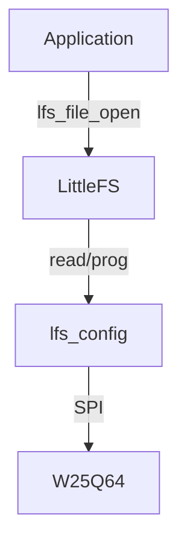

# Day 96: Flash File Systems (LittleFS)
## Phase 1: Core Embedded Engineering Foundations | Week 14: File Systems and Storage

---

> **📝 Content Creator Instructions:**
> This document is designed to produce **comprehensive, industry-grade educational content**. 
> - **Target Length:** The final filled document should be approximately **1000+ lines** of detailed markdown.
> - **Depth:** Do not skim over details. Explain *why*, not just *how*.
> - **Structure:** If a topic is complex, **DIVIDE IT INTO MULTIPLE PARTS** (Part 1, Part 2, etc.).
> - **Code:** Provide complete, compilable code examples, not just snippets.
> - **Visuals:** Use Mermaid diagrams for flows, architectures, and state machines.

---

## 🎯 Learning Objectives
*By the end of this day, the learner will be able to:*
1.  **Explain** why FAT is bad for raw Flash memory (Wear leveling, Power safety).
2.  **Integrate** LittleFS (by ARM) into an STM32 project.
3.  **Implement** the LittleFS HAL (`read`, `prog`, `erase`, `sync`) for an external SPI Flash (W25Qxx).
4.  **Demonstrate** power-loss resilience by interrupting a write operation.
5.  **Manage** directories and files using the POSIX-like LittleFS API.

---

## 📚 Prerequisites & Preparation
*   **Hardware Required:**
    *   STM32F4 Discovery Board
    *   External SPI Flash (e.g., Winbond W25Q64) OR use internal Flash sector.
*   **Software Required:**
    *   VS Code with ARM GCC Toolchain
    *   [LittleFS Source Code](https://github.com/littlefs-project/littlefs)
*   **Prior Knowledge:**
    *   Day 32 (SPI Flash)
    *   Day 92 (File Systems)

---

## 📖 Theoretical Deep Dive

### 🔹 Part 1: The Problem with FAT on Flash
*   **No Wear Leveling:** FAT updates the FAT Table (Sector 1) on *every* write. That sector burns out quickly (100k cycles).
*   **Corruption:** If power fails while updating the FAT table, the entire file system breaks.
*   **Block Size:** Flash must be erased in 4KB blocks. FAT writes 512B sectors. This requires "Read-Modify-Write" cycles, which are slow and dangerous.

### 🔹 Part 2: LittleFS Features
*   **Copy-on-Write (CoW):** Never overwrites data. Always writes to a new block, then updates pointers.
*   **Power-Loss Resilience:** The FS is always in a valid state.
*   **Dynamic Wear Leveling:** Distributes writes across all blocks.
*   **Small Footprint:** < 3KB RAM, < 13KB Flash.

### 🔹 Part 3: Architecture
*   **Superblock:** Contains root directory pointer. Two copies for safety.
*   **CTZ (Count Trailing Zeros) Skip List:** Used for fast file seeking.
*   **Inline Files:** Small files stored directly in directory entry.



---

## 💻 Implementation: LittleFS HAL

> **Instruction:** Bridge LittleFS to the W25Q64 Driver (Day 32).

### 👨‍💻 Code Implementation

#### Step 1: Configuration Struct
```c
#include "lfs.h"
#include "w25qxx.h" // Your SPI Flash Driver

// Read/Prog Size: 256 (Page Size)
// Block Size: 4096 (Sector Size)
// Block Count: 2048 (8MB / 4KB)
// Cache Size: 256 (RAM buffer)
// Lookahead: 128 (Bitmap size)

int user_read(const struct lfs_config *c, lfs_block_t block,
              lfs_off_t off, void *buffer, lfs_size_t size) {
    uint32_t addr = (block * c->block_size) + off;
    W25Q_Read(addr, buffer, size);
    return 0;
}

int user_prog(const struct lfs_config *c, lfs_block_t block,
              lfs_off_t off, const void *buffer, lfs_size_t size) {
    uint32_t addr = (block * c->block_size) + off;
    W25Q_Write(addr, (uint8_t*)buffer, size);
    return 0;
}

int user_erase(const struct lfs_config *c, lfs_block_t block) {
    uint32_t addr = block * c->block_size;
    W25Q_EraseSector(addr);
    return 0;
}

int user_sync(const struct lfs_config *c) {
    return 0; // W25Q_Write is blocking, so we are synced.
}

struct lfs_config cfg = {
    .read  = user_read,
    .prog  = user_prog,
    .erase = user_erase,
    .sync  = user_sync,
    .read_size = 256,
    .prog_size = 256,
    .block_size = 4096,
    .block_count = 2048,
    .cache_size = 256,
    .lookahead_size = 128,
    .block_cycles = 500,
};
```

---

## 💻 Implementation: File Operations

> **Instruction:** Mount, Format if needed, and Write.

### 👨‍💻 Code Implementation

#### Step 1: Global Objects
```c
lfs_t lfs;
lfs_file_t file;
```

#### Step 2: Test Function
```c
void LittleFS_Test(void) {
    // 1. Mount
    int err = lfs_mount(&lfs, &cfg);
    
    // 2. Reformat if mount failed
    if (err) {
        printf("Mount failed, formatting...\n");
        lfs_format(&lfs, &cfg);
        lfs_mount(&lfs, &cfg);
    }
    
    // 3. Open File
    lfs_file_open(&lfs, &file, "boot_count", LFS_O_RDWR | LFS_O_CREAT);
    
    // 4. Read & Update
    uint32_t boot_count = 0;
    lfs_file_read(&lfs, &file, &boot_count, sizeof(boot_count));
    
    boot_count++;
    lfs_file_rewind(&lfs, &file);
    lfs_file_write(&lfs, &file, &boot_count, sizeof(boot_count));
    
    // 5. Close
    lfs_file_close(&lfs, &file);
    
    printf("Boot Count: %lu\n", boot_count);
}
```

---

## 🔬 Lab Exercise: Lab 96.1 - Power Cut Test

### 1. Lab Objectives
- Write a large file continuously.
- Reset the board randomly.
- Verify FS integrity on reboot.

### 2. Step-by-Step Guide

#### Phase A: The Writer
```c
void Stress_Test(void) {
    lfs_file_open(&lfs, &file, "stress.dat", LFS_O_WRONLY | LFS_O_CREAT);
    for(int i=0; i<10000; i++) {
        lfs_file_write(&lfs, &file, &i, sizeof(i));
        // No sync! Let's see what happens.
        if (i % 100 == 0) printf(".");
    }
    lfs_file_close(&lfs, &file);
}
```

#### Phase B: The Reset
1.  Run code.
2.  Press Reset button while printing `...`.
3.  Reboot.
4.  Check file size.
5.  **Observation:** File is valid, but truncated to the last successful block write. No corruption of other files.

### 3. Verification
If `lfs_mount` fails after reset, it means the Superblock was corrupted (very rare, requires power loss exactly during superblock update). LittleFS has 2 superblocks to prevent this.

---

## 🧪 Additional / Advanced Labs

### Lab 2: Directory Tree
- **Goal:** Organize config.
- **Task:**
    1.  `lfs_mkdir(&lfs, "config")`.
    2.  `lfs_file_open(&lfs, &file, "config/network.ini", ...)`
    3.  Verify structure.

### Lab 3: Wear Leveling Check
- **Goal:** See blocks moving.
- **Task:**
    1.  Enable LittleFS Debug Logging (`LFS_YES_TRACE`).
    2.  Write to the same file repeatedly.
    3.  **Observation:** See the physical block address changing in the logs.

---

## 🐞 Debugging & Troubleshooting

### Common Issues

#### 1. "No Space Left on Device"
*   **Cause:** Flash full OR Lookahead buffer too small (can't find free blocks).
*   **Solution:** Increase `lookahead_size`.

#### 2. Slow Writes
*   **Cause:** `prog_size` too small (1 byte).
*   **Solution:** Set `prog_size` to Page Size (256). LittleFS will buffer writes in RAM cache until full page.

---

## ⚡ Optimization & Best Practices

### Code Quality
- **Static Buffer:** Allocate `read_buffer`, `prog_buffer`, `lookahead_buffer` statically in `lfs_config` to avoid malloc.
    ```c
    uint8_t read_buf[256];
    // ...
    cfg.read_buffer = read_buf;
    ```

---

## 🧠 Assessment & Review

### Knowledge Check
1.  **Q:** Can I read LittleFS on Windows?
    *   **A:** Not natively. You need a tool (like `mklittlefs` or a FUSE driver) to extract files. It's not for "Plug and Play" USB sticks.
2.  **Q:** What is "Inline File"?
    *   **A:** If a file is smaller than a directory entry (e.g., < 200 bytes), LittleFS stores data *inside* the pointer, saving a whole 4KB block.

### Challenge Task
> **Task:** Implement "KV Store" wrapper. `KV_Set("wifi_ssid", "MyNet")`. Use LittleFS files (`/kv/wifi_ssid`) to store the values.

---

## 📚 Further Reading & References
- [LittleFS Design Spec](https://github.com/littlefs-project/littlefs/blob/master/DESIGN.md)

---
