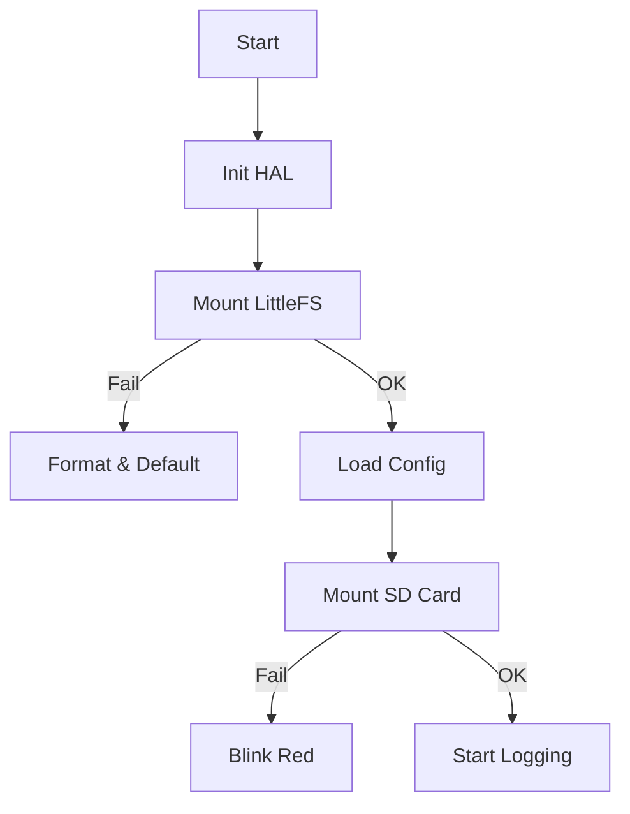

# Day 98: Week 14 Review and Project
## Phase 1: Core Embedded Engineering Foundations | Week 14: File Systems and Storage

---

> **📝 Content Creator Instructions:**
> This document is designed to produce **comprehensive, industry-grade educational content**. 
> - **Target Length:** The final filled document should be approximately **1000+ lines** of detailed markdown.
> - **Depth:** Do not skim over details. Explain *why*, not just *how*.
> - **Structure:** If a topic is complex, **DIVIDE IT INTO MULTIPLE PARTS** (Part 1, Part 2, etc.).
> - **Code:** Provide complete, compilable code examples, not just snippets.
> - **Visuals:** Use Mermaid diagrams for flows, architectures, and state machines.

---

## 🎯 Learning Objectives
*By the end of this day, the learner will be able to:*
1.  **Synthesize** Week 14 concepts (SD, FatFs, LittleFS, Config) into a unified "Smart Data Logger".
2.  **Architect** a dual-storage system: SD Card for bulk data, SPI Flash (LittleFS) for configuration.
3.  **Implement** a robust startup sequence that handles missing SD cards and corrupt config files.
4.  **Develop** a CLI to manage files (ls, cat, rm) and settings (set_interval).
5.  **Validate** the system against power-loss scenarios.

---

## 📚 Prerequisites & Preparation
*   **Hardware Required:**
    *   STM32F4 Discovery Board
    *   SD Card (FatFs).
    *   SPI Flash (LittleFS).
*   **Software Required:**
    *   VS Code with ARM GCC Toolchain
*   **Prior Knowledge:**
    *   Days 92-97.

---

## 📖 Theoretical Deep Dive

### 🔹 Part 1: The Dual-Storage Architecture
*   **Bulk Data (Logs):** Needs GBs of space. Use **SD Card (FAT32)**.
    *   *Pros:* Removable, PC readable.
    *   *Cons:* Vulnerable to vibration/removal.
*   **System Data (Config/State):** Needs reliability. Use **SPI Flash (LittleFS)**.
    *   *Pros:* Soldered down, Power-safe.
    *   *Cons:* Small (MBs).

### 🔹 Part 2: Startup Flow
1.  **Init Hardware:** SPI, GPIO.
2.  **Mount LittleFS:** Load `config.json`.
    *   If fail -> Format & Load Defaults.
3.  **Mount SD Card:**
    *   If fail -> Log error to Flash (FDR) & Blink Red LED.
    *   If success -> Open `log_XXX.csv` for append.



---

## 💻 Implementation: The Smart Logger

> **Instruction:** Combine all drivers into `main.c`.

### 👨‍💻 Code Implementation

#### Step 1: Includes & Globals
```c
#include "fatfs.h"
#include "lfs.h"
#include "sd_driver.h"
#include "w25qxx.h"
#include "bsp_rtc.h"

// Handles
FATFS sdFS;
lfs_t flashFS;
struct lfs_config flashCfg; // Setup as per Day 96

// Config
typedef struct {
    uint32_t log_interval_ms;
    char     file_prefix[16];
} LoggerConfig_t;

LoggerConfig_t gConfig = { .log_interval_ms = 1000, .file_prefix = "log" };
```

#### Step 2: System Init
```c
void System_Init(void) {
    HAL_Init();
    BSP_RTC_Init();
    
    // 1. Init Flash & LittleFS
    W25Q_Init();
    if (lfs_mount(&flashFS, &flashCfg) != 0) {
        lfs_format(&flashFS, &flashCfg);
        lfs_mount(&flashFS, &flashCfg);
    }
    
    // 2. Load Config
    lfs_file_t f;
    if (lfs_file_open(&flashFS, &f, "config.dat", LFS_O_RDONLY) == 0) {
        lfs_file_read(&flashFS, &f, &gConfig, sizeof(gConfig));
        lfs_file_close(&flashFS, &f);
    }
    
    // 3. Init SD & FatFs
    if (f_mount(&sdFS, "", 1) != FR_OK) {
        printf("SD Mount Failed!\n");
        // Don't halt, maybe user wants to fix via CLI
    }
}
```

#### Step 3: The Logging Loop
```c
void App_Loop(void) {
    uint32_t lastLog = 0;
    FIL logFile;
    
    while(1) {
        uint32_t now = HAL_GetTick();
        
        // Logging Task
        if (now - lastLog >= gConfig.log_interval_ms) {
            lastLog = now;
            
            // Generate Filename: log_20231027.csv
            char fname[32];
            RTC_Date_t date = BSP_RTC_GetDate();
            snprintf(fname, 32, "%s_%04d%02d%02d.csv", 
                     gConfig.file_prefix, date.year, date.month, date.day);
            
            // Open Append
            if (f_open(&logFile, fname, FA_WRITE | FA_OPEN_APPEND) == FR_OK) {
                char line[64];
                RTC_Time_t time = BSP_RTC_GetTime();
                int len = snprintf(line, 64, "%02d:%02d:%02d,%d\n",
                                   time.hours, time.minutes, time.seconds,
                                   BSP_Temp_Read());
                
                UINT bw;
                f_write(&logFile, line, len, &bw);
                f_close(&logFile); // Close to save
                
                BSP_LED_Toggle(LED_GREEN); // Heartbeat
            } else {
                BSP_LED_Toggle(LED_RED); // SD Error
            }
        }
        
        // CLI Task (Poll UART)
        CLI_Process();
    }
}
```

---

## 🔬 Lab Exercise: Lab 98.1 - Integration Test

### 1. Lab Objectives
- Configure interval via CLI.
- Log data.
- Remove SD and verify error handling.

### 2. Step-by-Step Guide

#### Phase A: CLI Config
1.  CLI: `set_interval 500`.
2.  CLI: `save_config`. (Writes to LittleFS).
3.  Reset Board.
4.  **Observation:** LED blinks faster (500ms).

#### Phase B: SD Hot Swap
1.  While running, pull out SD card.
2.  **Observation:** Red LED blinks (Open Failed). System does NOT crash.
3.  Insert SD card.
4.  **Observation:** Green LED resumes (Open Success). FatFs handles re-mount automatically if `f_mount` was kept or re-called.
    *   *Note:* FatFs might need `f_mount(NULL)` then `f_mount(&fs)` to detect re-insertion properly.

### 3. Verification
Check `config.dat` on Flash using a CLI `cat` command (reading from LittleFS). Check `.csv` on SD Card using PC.

---

## 🧪 Additional / Advanced Labs

### Lab 2: File Transfer (YMODEM)
- **Goal:** Download logs without removing SD.
- **Task:**
    1.  Implement YMODEM protocol over UART.
    2.  CLI: `download log_2023.csv`.
    3.  Send file byte-by-byte to Terminal.

### Lab 3: Boot Counter in Flash
- **Goal:** Wear Leveling check.
- **Task:**
    1.  Increment `boot_count` in LittleFS on every boot.
    2.  Print it.
    3.  Reset 100 times.
    4.  Verify count is correct and FS is healthy.

---

## 🐞 Debugging & Troubleshooting

### Common Issues

#### 1. HardFault on `f_open`
*   **Cause:** Stack overflow (Filename buffer?) or unaligned access in FatFs.
*   **Solution:** Check stack. Enable `FF_FS_NORTC` if RTC not ready.

#### 2. Config Lost
*   **Cause:** `lfs_file_close` not called before reset.
*   **Solution:** Always close files immediately after writing config.

---

## ⚡ Optimization & Best Practices

### Code Quality
- **Abstraction:** Don't call `f_open` in `main.c`. Create `Log_Manager.c` and `Config_Manager.c`. Main should only call `Log_Update()` and `Config_Init()`.

---

## 🧠 Assessment & Review

### Phase 1 Wrap-Up (Storage)
We have covered:
*   **Raw Flash:** Fast, dangerous.
*   **FAT32 (SD):** Big, compatible, fragile.
*   **LittleFS (Flash):** Small, robust, embedded-friendly.
*   **Config Mgmt:** KV Stores and Versioning.

### Challenge Task
> **Task:** "The Black Box 2.0". Combine Day 91 (FDR) with Day 98. If a crash occurs, write the FDR log to the SD Card on the next boot (`crash_log.txt`).

---

## 📚 Further Reading & References
- [Embedded File Systems (Book)](https://www.amazon.com/Embedded-File-Systems-Know-It-All/dp/0750679320)

---
