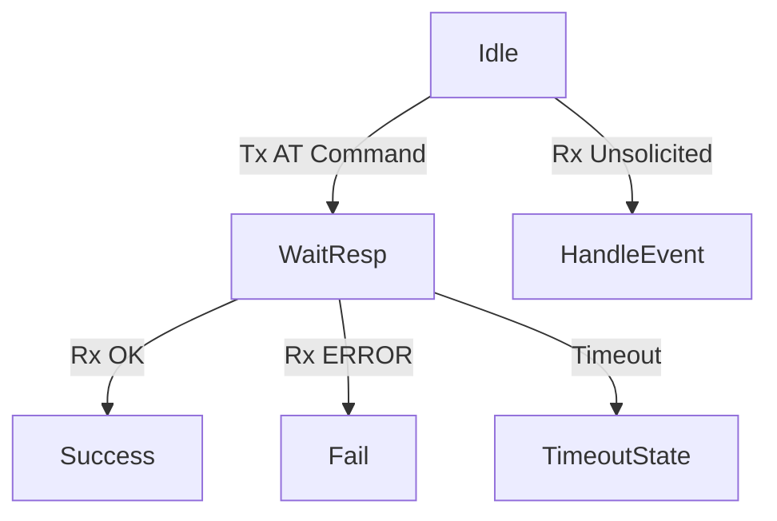

# Day 100: UART-based Wireless Modules
## Phase 1: Core Embedded Engineering Foundations | Week 15: Wireless Communication Basics

---

> **📝 Content Creator Instructions:**
> This document is designed to produce **comprehensive, industry-grade educational content**. 
> - **Target Length:** The final filled document should be approximately **1000+ lines** of detailed markdown.
> - **Depth:** Do not skim over details. Explain *why*, not just *how*.
> - **Structure:** If a topic is complex, **DIVIDE IT INTO MULTIPLE PARTS** (Part 1, Part 2, etc.).
> - **Code:** Provide complete, compilable code examples, not just snippets.
> - **Visuals:** Use Mermaid diagrams for flows, architectures, and state machines.

---

## 🎯 Learning Objectives
*By the end of this day, the learner will be able to:*
1.  **Interface** STM32 with external modules (HC-05, ESP8266) via UART.
2.  **Understand** the "AT Command" standard (Hayes Command Set).
3.  **Implement** a robust, non-blocking AT Command Parser using a State Machine.
4.  **Configure** an HC-05 module as Master or Slave.
5.  **Connect** an ESP8266 to a WiFi network and fetch a webpage (HTTP GET).

---

## 📚 Prerequisites & Preparation
*   **Hardware Required:**
    *   STM32F4 Discovery Board
    *   HC-05 Bluetooth Module.
    *   ESP8266 (ESP-01) WiFi Module.
    *   Logic Level Shifter (5V to 3.3V) if needed (most modules are 3.3V logic now).
*   **Software Required:**
    *   VS Code with ARM GCC Toolchain
    *   Serial Terminal App on Smartphone (for Bluetooth test).
*   **Prior Knowledge:**
    *   Day 22 (UART)
    *   Day 14 (Ring Buffers)

---

## 📖 Theoretical Deep Dive

### 🔹 Part 1: The "Modem" Paradigm
Most simple wireless modules act like old-school modems.
*   **Command Mode:** You send text commands (`AT+NAME=MyBT`). The module replies (`OK`).
*   **Data Mode (Passthrough):** Everything you send is transmitted wirelessly. Everything received wirelessly is sent to you.
*   **Switching:** Usually requires a special sequence (e.g., `+++` with 1s guard time) or a specific pin (KEY pin on HC-05).

### 🔹 Part 2: AT Commands
*   **Test:** `AT` -> `OK`
*   **Query:** `AT+VERSION?` -> `+VERSION:1.0`
*   **Set:** `AT+UART=9600,0,0` -> `OK`
*   **Execute:** `AT+RESET` -> `OK` (then reboots)

### 🔹 Part 3: The Parsing Challenge
*   **Async:** Responses don't come instantly.
*   **Fragmentation:** `OK` might arrive as `O` then `K`.
*   **Unsolicited:** `+WIFI CONNECTED` can arrive at any time.
*   **Solution:** Ring Buffer + State Machine.



---

## 💻 Implementation: AT Command Parser

> **Instruction:** Create a generic parser for UART modules.

### 👨‍💻 Code Implementation

#### Step 1: Data Structures
```c
typedef enum {
    AT_IDLE,
    AT_WAIT_RESPONSE,
    AT_DATA_MODE
} AT_State_t;

typedef struct {
    UART_HandleTypeDef *huart;
    char buffer[256];
    volatile uint16_t head;
    volatile uint16_t tail;
    AT_State_t state;
    char expected_resp[32];
    uint32_t timeout_start;
} AT_Handler_t;

AT_Handler_t esp8266;
```

#### Step 2: Send Command
```c
void AT_SendCommand(AT_Handler_t *at, const char *cmd, const char *expect) {
    // Clear Buffer
    at->head = 0;
    at->tail = 0;
    
    // Set Expectation
    strncpy(at->expected_resp, expect, 32);
    at->state = AT_WAIT_RESPONSE;
    at->timeout_start = HAL_GetTick();
    
    // Send
    char tx_buf[64];
    snprintf(tx_buf, 64, "%s\r\n", cmd);
    HAL_UART_Transmit(at->huart, (uint8_t*)tx_buf, strlen(tx_buf), 100);
}
```

#### Step 3: Process Loop (Call in Main)
```c
int AT_Process(AT_Handler_t *at) {
    // Check Timeout
    if (at->state == AT_WAIT_RESPONSE) {
        if (HAL_GetTick() - at->timeout_start > 2000) {
            at->state = AT_IDLE;
            return -1; // Timeout
        }
        
        // Check Buffer for Expected String
        // (Simplified: assume buffer is linear string for now)
        if (strstr(at->buffer, at->expected_resp)) {
            at->state = AT_IDLE;
            return 0; // Success
        }
        
        if (strstr(at->buffer, "ERROR")) {
            at->state = AT_IDLE;
            return -2; // Error
        }
    }
    return 1; // Busy
}
```

#### Step 4: UART ISR
```c
void HAL_UART_RxCpltCallback(UART_HandleTypeDef *huart) {
    if (huart == esp8266.huart) {
        // Add byte to buffer (Circular logic omitted for brevity, see Day 14)
        // Re-enable Interrupt
    }
}
```

---

## 💻 Implementation: ESP8266 WiFi Client

> **Instruction:** Connect to WiFi and fetch `google.com`.

### 👨‍💻 Code Implementation

#### Step 1: Connect to AP
```c
void ESP_ConnectWiFi(void) {
    // 1. Reset
    AT_SendCommand(&esp8266, "AT+RST", "ready");
    while(AT_Process(&esp8266) == 1);
    
    // 2. Set Mode Station
    AT_SendCommand(&esp8266, "AT+CWMODE=1", "OK");
    while(AT_Process(&esp8266) == 1);
    
    // 3. Join AP
    char cmd[64];
    snprintf(cmd, 64, "AT+CWJAP=\"%s\",\"%s\"", "SSID", "PASS");
    AT_SendCommand(&esp8266, cmd, "OK"); // Can take 10s
    while(AT_Process(&esp8266) == 1);
    
    printf("WiFi Connected!\n");
}
```

#### Step 2: TCP Request
```c
void ESP_HttpGet(void) {
    // 1. Start Connection
    AT_SendCommand(&esp8266, "AT+CIPSTART=\"TCP\",\"google.com\",80", "OK");
    while(AT_Process(&esp8266) == 1);
    
    // 2. Send Data Length
    char req[] = "GET / HTTP/1.1\r\nHost: google.com\r\n\r\n";
    char cmd[32];
    snprintf(cmd, 32, "AT+CIPSEND=%d", strlen(req));
    AT_SendCommand(&esp8266, cmd, ">");
    while(AT_Process(&esp8266) == 1);
    
    // 3. Send Data
    HAL_UART_Transmit(esp8266.huart, (uint8_t*)req, strlen(req), 100);
    
    // 4. Wait for Response (+IPD...)
    // (Handled by ISR/Parser)
}
```

---

## 🔬 Lab Exercise: Lab 100.1 - Bluetooth LED Control

### 1. Lab Objectives
- Configure HC-05.
- Pair with Phone.
- Toggle LED via Terminal App.

### 2. Step-by-Step Guide

#### Phase A: HC-05 Config
1.  Hold Key Button while powering on (Baud 38400).
2.  Send `AT+NAME=STM32_BT`.
3.  Send `AT+UART=9600,0,0` (Set normal baud).
4.  Reboot.

#### Phase B: Code
```c
void BT_Task(void) {
    if (UART_Available()) {
        char c = UART_Read();
        if (c == '1') HAL_GPIO_WritePin(GPIOD, GPIO_PIN_12, 1);
        if (c == '0') HAL_GPIO_WritePin(GPIOD, GPIO_PIN_12, 0);
        UART_Print("OK\n");
    }
}
```

#### Phase C: Run
1.  Open Phone Bluetooth Settings. Pair with `STM32_BT` (Pin 1234).
2.  Open Terminal App. Connect.
3.  Type '1'. LED ON. Type '0'. LED OFF.

### 3. Verification
If pairing fails, check if module is in Master mode (`AT+ROLE=1`). Set to Slave (`AT+ROLE=0`).

---

## 🧪 Additional / Advanced Labs

### Lab 2: Transparent Bridge
- **Goal:** PC <-> STM32 <-> ESP8266.
- **Task:**
    1.  Read byte from UART2 (PC). Send to UART3 (ESP).
    2.  Read byte from UART3 (ESP). Send to UART2 (PC).
    3.  Now you can type AT commands directly from PC terminal to ESP.

### Lab 3: Weather Display
- **Goal:** IoT.
- **Task:**
    1.  Connect ESP8266.
    2.  GET `api.openweathermap.org`.
    3.  Parse JSON (Day 97).
    4.  Display Temp on LCD (Day 45).

---

## 🐞 Debugging & Troubleshooting

### Common Issues

#### 1. Garbage Characters
*   **Cause:** Baud rate mismatch.
*   **Solution:** HC-05 default is 9600. AT Mode is 38400. ESP8266 default is 115200. Check datasheets.

#### 2. Power Instability
*   **Cause:** ESP8266 draws 200mA spikes. STM32 3.3V pin might not supply enough.
*   **Solution:** Use external 3.3V LDO regulator.

---

## ⚡ Optimization & Best Practices

### Code Quality
- **DMA:** Use DMA for UART RX (Circular Mode). This prevents buffer overruns if the CPU is busy processing the previous packet.
- **Timeout:** Always have timeouts. If the module hangs, reset it via a GPIO pin connected to RST.

---

## 🧠 Assessment & Review

### Knowledge Check
1.  **Q:** What is the difference between `\r` and `\n`?
    *   **A:** `\r` (Carriage Return) moves cursor to start. `\n` (Line Feed) moves down. AT commands usually require both (`\r\n`).
2.  **Q:** Why use a State Machine for parsing?
    *   **A:** Because bytes arrive one by one. We can't block `main()` waiting for the full string.

### Challenge Task
> **Task:** "Auto-Connect". Save WiFi SSID/Pass in Flash (Day 97). On boot, read config and auto-connect. If connection fails, switch to AP Mode (SoftAP) so user can configure it via phone.

---

## 📚 Further Reading & References
- [Espressif AT Command Set](https://docs.espressif.com/projects/esp-at/en/latest/)
- [HC-05 Datasheet](https://components101.com/sites/default/files/component_datasheet/HC-05%20Datasheet.pdf)

---
