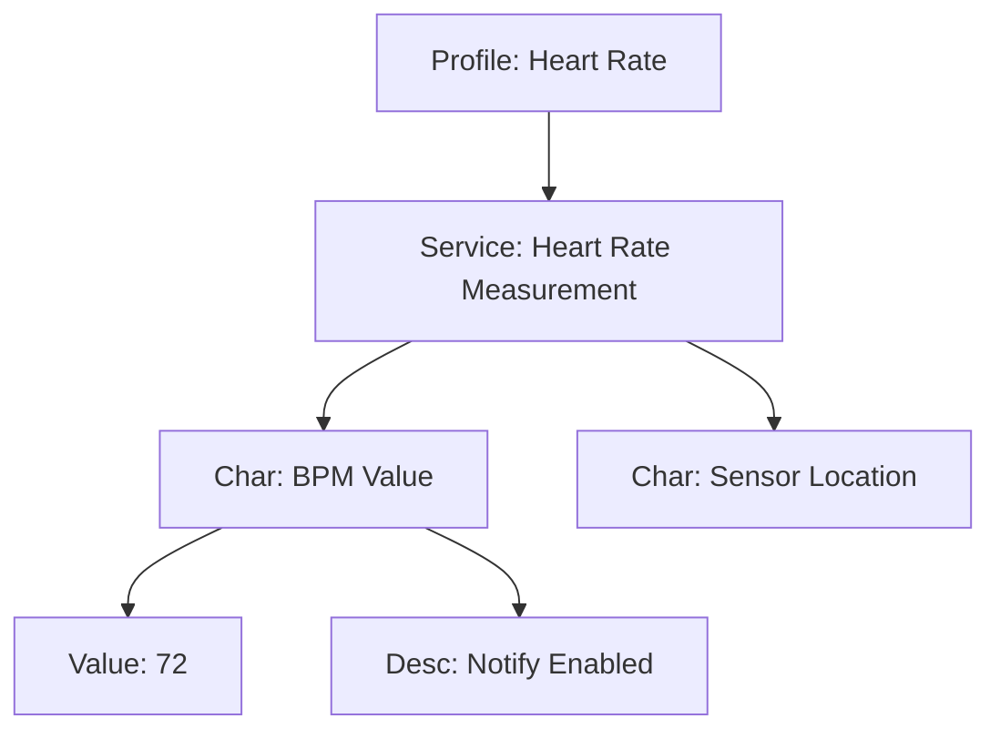

# Day 101: Introduction to BLE (Bluetooth Low Energy)
## Phase 1: Core Embedded Engineering Foundations | Week 15: Wireless Communication Basics

---

> **📝 Content Creator Instructions:**
> This document is designed to produce **comprehensive, industry-grade educational content**. 
> - **Target Length:** The final filled document should be approximately **1000+ lines** of detailed markdown.
> - **Depth:** Do not skim over details. Explain *why*, not just *how*.
> - **Structure:** If a topic is complex, **DIVIDE IT INTO MULTIPLE PARTS** (Part 1, Part 2, etc.).
> - **Code:** Provide complete, compilable code examples, not just snippets.
> - **Visuals:** Use Mermaid diagrams for flows, architectures, and state machines.

---

## 🎯 Learning Objectives
*By the end of this day, the learner will be able to:*
1.  **Differentiate** between Bluetooth Classic (BR/EDR) and Bluetooth Low Energy (BLE).
2.  **Explain** the BLE Stack Architecture: GAP (Generic Access Profile) and GATT (Generic Attribute Profile).
3.  **Design** a custom GATT Service with Characteristics and UUIDs.
4.  **Interface** an STM32 with an HM-10 (CC2541) BLE module via UART.
5.  **Use** a BLE Scanner App (nRF Connect) to inspect and interact with the device.

---

## 📚 Prerequisites & Preparation
*   **Hardware Required:**
    *   STM32F4 Discovery Board
    *   HM-10 or AT-09 BLE Module (UART).
*   **Software Required:**
    *   VS Code with ARM GCC Toolchain
    *   Smartphone with **nRF Connect** or **LightBlue** app.
*   **Prior Knowledge:**
    *   Day 100 (AT Commands) - HM-10 uses AT commands too.

---

## 📖 Theoretical Deep Dive

### 🔹 Part 1: Classic vs BLE
*   **Classic:** Stream oriented (SPP - Serial Port Profile). High throughput (Audio). High power. Always connected.
*   **BLE:** Attribute oriented. Burst data (Sensor readings). Ultra low power (Coin cell for years). Sleeps 99% of the time.

### 🔹 Part 2: GAP (Generic Access Profile)
Defines roles and advertising.
*   **Roles:**
    *   **Central:** The Phone. Scans and initiates connection.
    *   **Peripheral:** The Sensor (STM32). Advertises presence.
*   **Advertising:** Peripheral broadcasts packets (Name, UUIDs) on channels 37, 38, 39.

### 🔹 Part 3: GATT (Generic Attribute Profile)
Defines how data is organized once connected.
*   **Server:** The Peripheral (holds the data).
*   **Client:** The Phone (reads/writes the data).
*   **Hierarchy:**
    *   **Profile:** Collection of Services (e.g., Heart Rate Profile).
    *   **Service:** Logical group of data (e.g., Heart Rate Service - UUID 0x180D).
    *   **Characteristic:** The actual data (e.g., BPM Value - UUID 0x2A37).
        *   **Properties:** Read, Write, Notify, Indicate.
    *   **Descriptor:** Metadata (e.g., Client Characteristic Configuration - CCCD).



---

## 💻 Implementation: HM-10 Configuration

> **Instruction:** Configure HM-10 to act as a custom peripheral.

### 👨‍💻 Code Implementation

#### Step 1: Factory Reset
```c
// Send "AT+RENEW"
AT_SendCommand(&ble, "AT+RENEW", "OK+RENEW");
HAL_Delay(500);
```

#### Step 2: Set Name & Role
```c
// Role 0 = Peripheral
AT_SendCommand(&ble, "AT+ROLE0", "OK+Set:0");
// Name
AT_SendCommand(&ble, "AT+NAMESTM32_BLE", "OK+Set:STM32_BLE");
```

#### Step 3: Custom UUIDs (HM-10 Specific)
HM-10 allows setting one custom Service and one Characteristic via AT commands.
```c
// Set Service UUID to 0xFFE0
AT_SendCommand(&ble, "AT+UUID0xFFE0", "OK+Set:0xFFE0");
// Set Char UUID to 0xFFE1
AT_SendCommand(&ble, "AT+CHAR0xFFE1", "OK+Set:0xFFE1");
```

#### Step 4: Reboot
```c
AT_SendCommand(&ble, "AT+RESET", "OK+RESET");
```

---

## 💻 Implementation: Handling BLE Data

> **Instruction:** Receive data from Phone and toggle LED. Send button press to Phone.

### 👨‍💻 Code Implementation

#### Step 1: BLE Task
```c
void BLE_Task(void) {
    // 1. Check RX (From Phone)
    if (UART_Available()) {
        char c = UART_Read();
        if (c == 'A') {
            HAL_GPIO_WritePin(GPIOD, GPIO_PIN_12, 1); // LED ON
            UART_Print("LED ON\n");
        }
        if (c == 'B') {
            HAL_GPIO_WritePin(GPIOD, GPIO_PIN_12, 0); // LED OFF
            UART_Print("LED OFF\n");
        }
    }
    
    // 2. Check Button (To Phone)
    if (HAL_GPIO_ReadPin(GPIOA, GPIO_PIN_0) == 1) {
        UART_Print("BUTTON_CLICKED");
        HAL_Delay(200); // Debounce
    }
}
```

---

## 🔬 Lab Exercise: Lab 101.1 - nRF Connect Exploration

### 1. Lab Objectives
- Connect to STM32_BLE using Smartphone.
- Explore the GATT Table.
- Write to Characteristic 0xFFE1.
- Read from Characteristic 0xFFE1.

### 2. Step-by-Step Guide

#### Phase A: Connect
1.  Open nRF Connect app.
2.  Scan. Find `STM32_BLE`.
3.  Click "Connect".

#### Phase B: Inspect
1.  You will see "Unknown Service" (UUID 0xFFE0).
2.  Expand it. You see "Unknown Characteristic" (UUID 0xFFE1).
3.  Properties: Read, Write Without Response, Notify.

#### Phase C: Interact
1.  Click "Up Arrow" (Write). Select "Text". Type "A". Send.
2.  **Observation:** STM32 LED turns ON.
3.  Press User Button on STM32.
4.  **Observation:** In App, click "Enable Notifications" (CCCD). You should see "BUTTON_CLICKED" appear.

### 3. Verification
If you don't see the device, ensure HM-10 is powered (LED blinking). If connected, LED usually goes solid.

---

## 🧪 Additional / Advanced Labs

### Lab 2: iBeacon Clone
- **Goal:** Turn HM-10 into an iBeacon.
- **Task:**
    1.  `AT+IBEA1` (Enable iBeacon).
    2.  `AT+MARJ0x1234` (Major ID).
    3.  `AT+MINO0x5678` (Minor ID).
    4.  Use "Locate Beacon" app to see distance estimation.

### Lab 3: Throughput Test
- **Goal:** Measure BLE speed.
- **Task:**
    1.  Phone writes 20 bytes (Max payload for BLE 4.0) repeatedly.
    2.  STM32 counts bytes/sec.
    3.  **Expected:** ~1-2 KB/s (UART limit or BLE interval limit).

---

## 🐞 Debugging & Troubleshooting

### Common Issues

#### 1. "Device Disconnected" immediately
*   **Cause:** Signal integrity or Power.
*   **Solution:** Check 3.3V supply.

#### 2. Can't enter AT Mode
*   **Cause:** Once connected, HM-10 switches to Data Mode.
*   **Solution:** Disconnect from phone to send AT commands. Or pull "BRK" pin low (on some modules).

---

## ⚡ Optimization & Best Practices

### Code Quality
- **UUIDs:** Don't use random UUIDs for production. Use 128-bit random UUIDs generated online (uuidgenerator.net) to avoid collision with standard SIG services.
    *   Standard: `0x180D` (16-bit).
    *   Custom: `12345678-1234-1234-1234-123456789ABC` (128-bit).

---

## 🧠 Assessment & Review

### Knowledge Check
1.  **Q:** What is a "Handle"?
    *   **A:** A 16-bit address for each attribute in the GATT table. The Client uses Handles to read/write data.
2.  **Q:** What is "Notification" vs "Indication"?
    *   **A:** Notification = Fire and Forget (Faster). Indication = Requires App ACK (Reliable but slower).

### Challenge Task
> **Task:** "Proximity Lock". STM32 reads RSSI of the connected phone (`AT+RSSI?`). If RSSI < -90 (Phone far away), lock the "Door" (Servo). If RSSI > -70, unlock.

---

## 📚 Further Reading & References
- [Bluetooth Core Specification (Vol 3: Host)](https://www.bluetooth.com/specifications/specs/)
- [Getting Started with Bluetooth Low Energy (O'Reilly)](https://www.oreilly.com/library/view/getting-started-with/9781491900550/)

---
