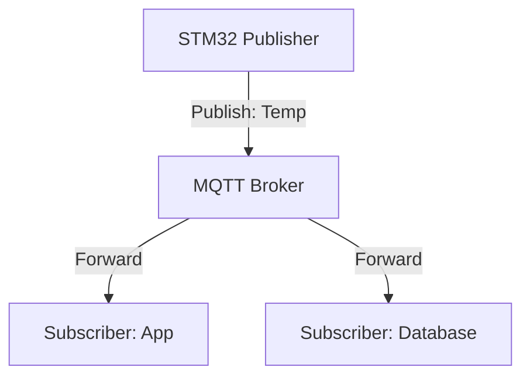

# Day 103: IoT Protocols (MQTT & CoAP)
## Phase 1: Core Embedded Engineering Foundations | Week 15: Wireless Communication Basics

---

> **📝 Content Creator Instructions:**
> This document is designed to produce **comprehensive, industry-grade educational content**. 
> - **Target Length:** The final filled document should be approximately **1000+ lines** of detailed markdown.
> - **Depth:** Do not skim over details. Explain *why*, not just *how*.
> - **Structure:** If a topic is complex, **DIVIDE IT INTO MULTIPLE PARTS** (Part 1, Part 2, etc.).
> - **Code:** Provide complete, compilable code examples, not just snippets.
> - **Visuals:** Use Mermaid diagrams for flows, architectures, and state machines.

---

## 🎯 Learning Objectives
*By the end of this day, the learner will be able to:*
1.  **Contrast** MQTT (TCP-based, Pub/Sub) and CoAP (UDP-based, Req/Res).
2.  **Explain** MQTT concepts: Topics, QoS Levels (0, 1, 2), Retained Messages, and Last Will & Testament (LWT).
3.  **Construct** raw MQTT packets (CONNECT, PUBLISH, SUBSCRIBE) manually to understand the binary format.
4.  **Implement** a minimal MQTT Client using the ESP8266 AT Command stack (TCP Transparent Mode).
5.  **Design** a Topic Hierarchy for a Smart Home system.

---

## 📚 Prerequisites & Preparation
*   **Hardware Required:**
    *   STM32F4 Discovery Board
    *   ESP8266 (for TCP connectivity).
*   **Software Required:**
    *   VS Code with ARM GCC Toolchain
    *   MQTT Broker (Mosquitto installed on PC or use `test.mosquitto.org`).
*   **Prior Knowledge:**
    *   Day 100 (ESP8266 TCP)
    *   Day 82 (Networking Basics)

---

## 📖 Theoretical Deep Dive

### 🔹 Part 1: MQTT (Message Queuing Telemetry Transport)
*   **Architecture:** Client-Server (Broker). Clients don't talk to each other directly.
*   **Pub/Sub:**
    *   **Publisher:** Sends "25.5" to topic `home/livingroom/temp`.
    *   **Subscriber:** Listens to `home/+/temp`.
    *   **Broker:** Routes the message.
*   **Lightweight:** Header is 2 bytes minimum. Perfect for unstable networks.

### 🔹 Part 2: Quality of Service (QoS)
1.  **QoS 0 (At most once):** Fire and forget. No Ack. Fast, unreliable.
2.  **QoS 1 (At least once):** Sender waits for PUBACK. Retries if needed. Duplicates possible.
3.  **QoS 2 (Exactly once):** 4-step handshake. Slow, reliable.

### 🔹 Part 3: CoAP (Constrained Application Protocol)
*   **Architecture:** RESTful (like HTTP) but over UDP.
*   **Methods:** GET, POST, PUT, DELETE.
*   **URI:** `coap://device/sensors/temp`.
*   **Reliability:** Uses "Confirmable" (CON) messages (Application layer ACK) since UDP has no ACK.
*   **Use Case:** Extremely constrained devices where TCP overhead is too high.



---

## 💻 Implementation: MQTT Packet Builder

> **Instruction:** Build a raw MQTT CONNECT packet.

### 👨‍💻 Code Implementation

#### Step 1: Fixed Header
*   Byte 0: Packet Type (4 bits) + Flags (4 bits).
    *   CONNECT = 0x10.
*   Byte 1...: Remaining Length (Variable Byte Integer).

#### Step 2: Variable Header (CONNECT)
*   Protocol Name: `00 04 M Q T T`
*   Protocol Level: `04` (v3.1.1)
*   Connect Flags: `02` (Clean Session).
*   Keep Alive: `00 3C` (60 seconds).

#### Step 3: Payload (Client ID)
*   Length: `00 05`
*   ID: `S T M 3 2`

```c
int MQTT_BuildConnect(uint8_t *buf, const char *client_id) {
    int idx = 0;
    
    // 1. Fixed Header (CONNECT = 0x10)
    buf[idx++] = 0x10;
    
    // Calculate Remaining Length
    // Var Header (10 bytes) + Payload (2 + strlen)
    int rem_len = 10 + (2 + strlen(client_id));
    buf[idx++] = rem_len; // Assuming len < 127 for simplicity
    
    // 2. Variable Header
    // Protocol Name "MQTT"
    buf[idx++] = 0x00; buf[idx++] = 0x04;
    buf[idx++] = 'M'; buf[idx++] = 'Q'; buf[idx++] = 'T'; buf[idx++] = 'T';
    
    buf[idx++] = 0x04; // Level
    buf[idx++] = 0x02; // Flags (Clean Session)
    buf[idx++] = 0x00; buf[idx++] = 0x3C; // Keep Alive 60s
    
    // 3. Payload (Client ID)
    buf[idx++] = 0x00; buf[idx++] = strlen(client_id);
    memcpy(&buf[idx], client_id, strlen(client_id));
    idx += strlen(client_id);
    
    return idx;
}
```

---

## 💻 Implementation: MQTT Publish

> **Instruction:** Build a raw PUBLISH packet (QoS 0).

### 👨‍💻 Code Implementation

#### Step 1: Packet Structure
*   Type: PUBLISH (0x30).
*   Var Header: Topic Name.
*   Payload: Message.

```c
int MQTT_BuildPublish(uint8_t *buf, const char *topic, const char *msg) {
    int idx = 0;
    
    // 1. Fixed Header (PUBLISH = 0x30)
    buf[idx++] = 0x30;
    
    // Remaining Length = TopicLen(2) + Topic + Msg
    int rem_len = 2 + strlen(topic) + strlen(msg);
    buf[idx++] = rem_len;
    
    // 2. Variable Header (Topic)
    buf[idx++] = 0x00; buf[idx++] = strlen(topic);
    memcpy(&buf[idx], topic, strlen(topic));
    idx += strlen(topic);
    
    // 3. Payload (Message)
    memcpy(&buf[idx], msg, strlen(msg));
    idx += strlen(msg);
    
    return idx;
}
```

---

## 🔬 Lab Exercise: Lab 103.1 - Hello World MQTT

### 1. Lab Objectives
- Connect ESP8266 to `test.mosquitto.org` (Port 1883).
- Send CONNECT packet.
- Send PUBLISH packet to `stm32/test`.
- Verify using a PC Client (MQTT Explorer).

### 2. Step-by-Step Guide

#### Phase A: ESP Setup (Transparent Mode)
1.  `AT+CIPSTART="TCP","test.mosquitto.org",1883`
2.  `AT+CIPMODE=1` (Passthrough)
3.  `AT+CIPSEND`
4.  Now UART is directly connected to the TCP socket.

#### Phase B: STM32 Logic
```c
void MQTT_Test(void) {
    uint8_t buf[128];
    
    // 1. Connect
    int len = MQTT_BuildConnect(buf, "STM32_Dev");
    HAL_UART_Transmit(&huart_esp, buf, len, 100);
    HAL_Delay(100); // Wait for CONNACK (0x20 0x02 0x00 0x00)
    
    // 2. Publish
    len = MQTT_BuildPublish(buf, "stm32/test", "Hello from C!");
    HAL_UART_Transmit(&huart_esp, buf, len, 100);
}
```

#### Phase C: Verification
1.  Open MQTT Explorer on PC.
2.  Connect to `test.mosquitto.org`.
3.  Subscribe to `stm32/test`.
4.  Run STM32 code.
5.  **Observation:** "Hello from C!" appears.

### 3. Verification
If disconnected immediately, check Keep Alive. You must send a PINGREQ (0xC0 0x00) every 60s (or whatever you set).

---

## 🧪 Additional / Advanced Labs

### Lab 2: Subscribe & Control
- **Goal:** Remote Control.
- **Task:**
    1.  Send SUBSCRIBE packet (0x82) for topic `stm32/led`.
    2.  Parse incoming SUBACK.
    3.  Wait for PUBLISH packet from Broker.
    4.  Parse Payload ("ON" or "OFF") -> Toggle LED.

### Lab 3: LWT (Last Will)
- **Goal:** Detect offline status.
- **Task:**
    1.  In CONNECT flags, set Will Flag.
    2.  Add Will Topic (`stm32/status`) and Message (`Offline`) to payload.
    3.  Publish `Online` to `stm32/status`.
    4.  Reset STM32 (Hard cut).
    5.  **Observation:** Broker publishes `Offline` automatically.

---

## 🐞 Debugging & Troubleshooting

### Common Issues

#### 1. Connection Refused
*   **Cause:** Client ID conflict (two devices with same ID).
*   **Solution:** Use Unique ID (e.g., STM32 UID register).

#### 2. Malformed Packet
*   **Cause:** Incorrect Remaining Length calculation.
*   **Solution:** Remember that Remaining Length is a "Variable Byte Integer". If length > 127, it takes 2 bytes.
    *   `if (len > 127) { buf[i++] = (len % 128) | 0x80; buf[i++] = len / 128; }`

---

## ⚡ Optimization & Best Practices

### Code Quality
- **Use a Library:** For production, use **Paho MQTT Embedded C** or **LwIP MQTT**. Writing raw packets is good for learning but error-prone for complex features (QoS 2 flows).

---

## 🧠 Assessment & Review

### Knowledge Check
1.  **Q:** Why use MQTT over HTTP?
    *   **A:** MQTT header is 2 bytes. HTTP header is hundreds of bytes. MQTT keeps a persistent connection (push), HTTP requires polling (pull).
2.  **Q:** What is "Retained Message"?
    *   **A:** The Broker stores the last message on a topic. New subscribers get it immediately upon subscription (e.g., "Light is ON").

### Challenge Task
> **Task:** "MQTT Bootloader". (Advanced). Use MQTT to deliver a firmware update. Subscribe to `stm32/ota`. Receive binary chunks. Write to Flash.

---

## 📚 Further Reading & References
- [MQTT 3.1.1 Specification](http://docs.oasis-open.org/mqtt/mqtt/v3.1.1/os/mqtt-v3.1.1-os.html)
- [HiveMQ MQTT Essentials Blog](https://www.hivemq.com/mqtt-essentials/)

---
