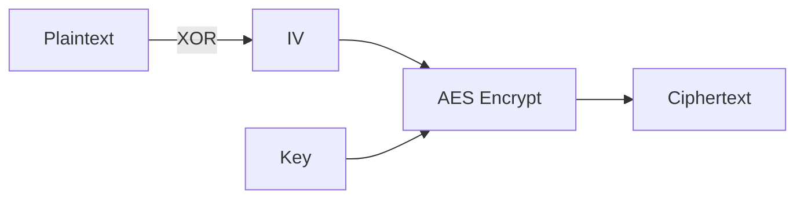

# Day 104: Wireless Security
## Phase 1: Core Embedded Engineering Foundations | Week 15: Wireless Communication Basics

---

> **📝 Content Creator Instructions:**
> This document is designed to produce **comprehensive, industry-grade educational content**. 
> - **Target Length:** The final filled document should be approximately **1000+ lines** of detailed markdown.
> - **Depth:** Do not skim over details. Explain *why*, not just *how*.
> - **Structure:** If a topic is complex, **DIVIDE IT INTO MULTIPLE PARTS** (Part 1, Part 2, etc.).
> - **Code:** Provide complete, compilable code examples, not just snippets.
> - **Visuals:** Use Mermaid diagrams for flows, architectures, and state machines.

---

## 🎯 Learning Objectives
*By the end of this day, the learner will be able to:*
1.  **Identify** the CIA Triad (Confidentiality, Integrity, Availability) in the context of embedded wireless systems.
2.  **Implement** AES-128 (Advanced Encryption Standard) to encrypt data packets.
3.  **Generate** and **Verify** HMAC (Hash-based Message Authentication Code) to prevent tampering.
4.  **Explain** the "Replay Attack" and how to prevent it using Nonces or Counters.
5.  **Secure** an MQTT connection using TLS (Theory & ESP8266 implementation).

---

## 📚 Prerequisites & Preparation
*   **Hardware Required:**
    *   STM32F4 Discovery Board
*   **Software Required:**
    *   VS Code with ARM GCC Toolchain
    *   [TinyAES-C Library](https://github.com/kokke/tiny-AES-c) (or similar).
*   **Prior Knowledge:**
    *   Day 103 (MQTT)
    *   Day 81 (Secure Boot Basics)

---

## 📖 Theoretical Deep Dive

### 🔹 Part 1: The Threat Model
Wireless signals broadcast everywhere. Anyone can listen (Sniffing) or inject (Spoofing).
1.  **Confidentiality:** Only Bob can read Alice's message. (Encryption).
2.  **Integrity:** Bob knows the message wasn't changed by Eve. (Hashing/MAC).
3.  **Authenticity:** Bob knows the message actually came from Alice. (Signatures/MAC).
4.  **Replay Protection:** Eve captures "Open Door" command and plays it back later. (Counters/Nonce).

### 🔹 Part 2: Symmetric vs Asymmetric
*   **Symmetric (AES):** Shared Secret Key. Fast. Good for data encryption.
    *   *Challenge:* Key Distribution (How to give Bob the key securely?).
*   **Asymmetric (RSA/ECC):** Public/Private Key pair. Slow. Good for Key Exchange (ECDH) and Signatures.

### 🔹 Part 3: Block Modes (ECB vs CBC vs CTR)
AES encrypts 16-byte blocks.
*   **ECB (Electronic Codebook):** Identical plaintext = Identical ciphertext. **INSECURE**. (Penguin image stays visible).
*   **CBC (Cipher Block Chaining):** Uses IV (Initialization Vector). Randomizes output. **SECURE**.
*   **CTR (Counter):** Turns block cipher into stream cipher. Parallelizable.



---

## 💻 Implementation: AES Encryption (Software)

> **Instruction:** Encrypt a sensor reading using TinyAES (CTR Mode).

### 👨‍💻 Code Implementation

#### Step 1: Include Library
Download `aes.c` and `aes.h` from TinyAES and add to project.

#### Step 2: Encryption Function
```c
#include "aes.h"

// 128-bit Key (16 bytes) - STORE SECURELY!
uint8_t key[16] = { 0x2b, 0x7e, 0x15, 0x16, 0x28, 0xae, 0xd2, 0xa6, 
                    0xab, 0xf7, 0x15, 0x88, 0x09, 0xcf, 0x4f, 0x3c };

// Initialization Vector (Nonce) - Must be unique for every packet!
uint8_t iv[16]  = { 0x00, 0x01, 0x02, 0x03, 0x04, 0x05, 0x06, 0x07, 
                    0x08, 0x09, 0x0a, 0x0b, 0x0c, 0x0d, 0x0e, 0x0f };

void Secure_Tx(const char *msg) {
    struct AES_ctx ctx;
    AES_init_ctx_iv(&ctx, key, iv);
    
    uint8_t buffer[64];
    memset(buffer, 0, 64);
    strcpy((char*)buffer, msg);
    
    // Encrypt (CTR mode encrypts in place)
    // Note: CTR doesn't require padding to 16 bytes, but library might.
    AES_CTR_xcrypt_buffer(&ctx, buffer, 64);
    
    // Send via UART/Radio
    // Send IV (Clear) + Ciphertext
    // Receiver needs IV to decrypt!
    printf("IV: "); PrintHex(iv, 16);
    printf("Cipher: "); PrintHex(buffer, 64);
}
```

#### Step 3: Decryption Function
```c
void Secure_Rx(uint8_t *iv_in, uint8_t *cipher_in, int len) {
    struct AES_ctx ctx;
    AES_init_ctx_iv(&ctx, key, iv_in);
    
    // Decrypt (CTR encrypt/decrypt is same operation)
    AES_CTR_xcrypt_buffer(&ctx, cipher_in, len);
    
    printf("Plain: %s\n", cipher_in);
}
```

---

## 💻 Implementation: HMAC (Integrity)

> **Instruction:** Add a signature to ensure data wasn't tampered with.

### 👨‍💻 Code Implementation

#### Step 1: Simple Hash (DJB2 - Not crypto secure, but good for demo)
For real security, use SHA-256 (mbedTLS or hardware crypto).
```c
uint32_t HMAC_Simple(uint8_t *key, uint8_t *data, int len) {
    uint32_t hash = 5381;
    // Inner Pad
    for(int i=0; i<16; i++) hash = ((hash << 5) + hash) + (key[i] ^ 0x36);
    // Data
    for(int i=0; i<len; i++) hash = ((hash << 5) + hash) + data[i];
    // Outer Pad
    for(int i=0; i<16; i++) hash = ((hash << 5) + hash) + (key[i] ^ 0x5C);
    
    return hash;
}
```

#### Step 2: Packet Structure
`[IV:16][Ciphertext:N][HMAC:4]`

#### Step 3: Verification
```c
int Verify_Packet(uint8_t *pkt, int len) {
    uint32_t received_hmac = *(uint32_t*)&pkt[len-4];
    uint32_t calc_hmac = HMAC_Simple(key, pkt, len-4);
    
    if (received_hmac == calc_hmac) return 1; // Valid
    return 0; // Tampered!
}
```

---

## 🔬 Lab Exercise: Lab 104.1 - Replay Attack

### 1. Lab Objectives
- Send "OPEN_DOOR" command encrypted.
- Capture the ciphertext.
- Send it again.
- Implement Counter to prevent this.

### 2. Step-by-Step Guide

#### Phase A: Vulnerable Code
Receiver decrypts "OPEN_DOOR" and toggles LED. It ignores the IV uniqueness.

#### Phase B: Attack
1.  Alice sends Packet A. LED turns ON.
2.  Eve (You) copies Packet A bytes.
3.  Eve sends Packet A. LED turns OFF. **Attack Successful.**

#### Phase C: Fix (Monotonic Counter)
1.  Payload = `[Counter:4][Command:...]`.
2.  Receiver stores `Last_Counter`.
3.  If `Rx_Counter <= Last_Counter`, Drop packet.
4.  Update `Last_Counter`.

### 3. Verification
Send the same packet twice. The second time, the receiver should print "Replay Detected" and do nothing.

---

## 🧪 Additional / Advanced Labs

### Lab 2: Hardware RNG
- **Goal:** Generate True Random IVs.
- **Task:**
    1.  Enable STM32 RNG Peripheral (`RCC_AHB2ENR_RNGEN`).
    2.  Read `RNG->DR`.
    3.  Use this to populate `iv` array before every encryption.
    4.  Never reuse an IV with the same Key in CTR mode! (Breaks security completely).

### Lab 3: TLS with ESP8266
- **Goal:** Secure MQTT (MQTTS).
- **Task:**
    1.  `AT+CIPSSLCCONF=2` (Verify Server Cert).
    2.  Load CA Certificate into ESP8266 Flash.
    3.  `AT+CIPSTART="SSL","test.mosquitto.org",8883`.
    4.  Now the link is encrypted end-to-end.

---

## 🐞 Debugging & Troubleshooting

### Common Issues

#### 1. Decryption Garbage
*   **Cause:** Wrong Key, Wrong IV, or Wrong Mode (ECB vs CBC).
*   **Solution:** Verify both sides use exact same parameters. Print Key/IV in Hex on both sides.

#### 2. HardFault in AES
*   **Cause:** Stack overflow. AES context can be large.
*   **Solution:** Increase Stack Size.

---

## ⚡ Optimization & Best Practices

### Code Quality
- **Constant Time Comparison:** When checking HMAC/Hash, do not use `memcmp` (it returns early on mismatch, leaking timing info). Use a constant-time loop.
    ```c
    int Secure_Compare(const void *a, const void *b, size_t len) {
        const uint8_t *ua = a, *ub = b;
        uint8_t diff = 0;
        for(size_t i=0; i<len; i++) diff |= (ua[i] ^ ub[i]);
        return (diff == 0);
    }
    ```

---

## 🧠 Assessment & Review

### Knowledge Check
1.  **Q:** Why is ECB mode bad?
    *   **A:** It reveals patterns. If the image has a large blue area, the encrypted blocks for that area are identical.
2.  **Q:** What happens if I lose the IV?
    *   **A:** You cannot decrypt the first block (in CBC) or any block (in CTR, depending on implementation). The IV must be sent with the message (it's public, not secret).

### Challenge Task
> **Task:** "Rolling Code". Implement a garage door opener algorithm. `Hash(Key, Counter)`. Receiver checks `Hash(Key, Counter ... Counter+100)` to allow for button presses while out of range (desync).

---

## 📚 Further Reading & References
- [Introduction to Modern Cryptography](https://www.amazon.com/Introduction-Modern-Cryptography-Principles-Protocols/dp/1584885513)
- [Mbed TLS Library](https://github.com/Mbed-TLS/mbedtls)

---
