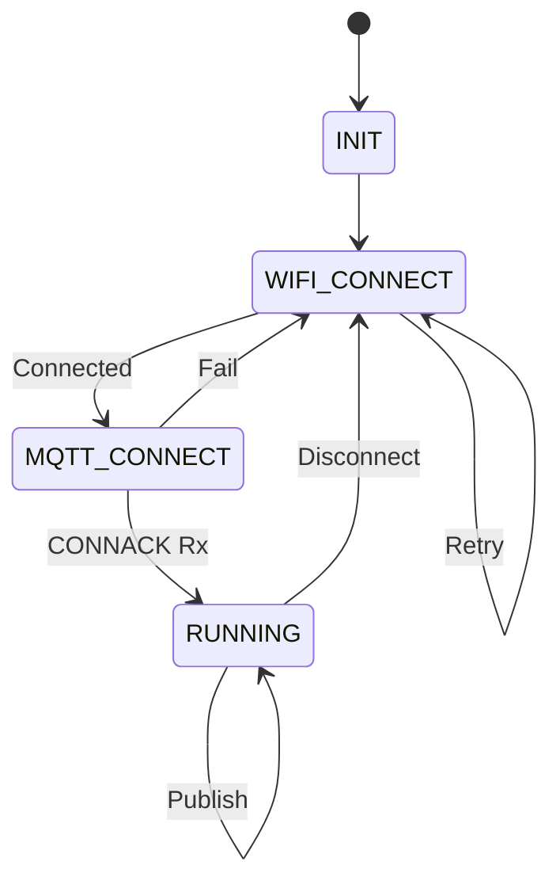

# Day 105: Week 15 Review and Project
## Phase 1: Core Embedded Engineering Foundations | Week 15: Wireless Communication Basics

---

> **📝 Content Creator Instructions:**
> This document is designed to produce **comprehensive, industry-grade educational content**. 
> - **Target Length:** The final filled document should be approximately **1000+ lines** of detailed markdown.
> - **Depth:** Do not skim over details. Explain *why*, not just *how*.
> - **Structure:** If a topic is complex, **DIVIDE IT INTO MULTIPLE PARTS** (Part 1, Part 2, etc.).
> - **Code:** Provide complete, compilable code examples, not just snippets.
> - **Visuals:** Use Mermaid diagrams for flows, architectures, and state machines.

---

## 🎯 Learning Objectives
*By the end of this day, the learner will be able to:*
1.  **Synthesize** Week 15 concepts (RF, UART Modules, MQTT, Security) into a unified IoT project.
2.  **Architect** a "Secure IoT Sensor Node" that samples data, encrypts it, and publishes to the cloud.
3.  **Implement** a robust state machine handling WiFi reconnection, MQTT keep-alive, and sensor polling.
4.  **Verify** end-to-end security by decrypting the payload on a PC client.
5.  **Analyze** power consumption and optimize for battery life (Deep Sleep).

---

## 📚 Prerequisites & Preparation
*   **Hardware Required:**
    *   STM32F4 Discovery Board
    *   ESP8266 (WiFi) or HC-05 (Bluetooth).
    *   Sensors (Temp/Light).
*   **Software Required:**
    *   VS Code with ARM GCC Toolchain
    *   MQTT Broker (Mosquitto).
    *   Python Script (for Decryption).
*   **Prior Knowledge:**
    *   Days 99-104.

---

## 📖 Theoretical Deep Dive

### 🔹 Part 1: The IoT Stack
1.  **Application:** Sensor Logic (Sample every 5s).
2.  **Presentation:** JSON (`{"temp": 25.5}`).
3.  **Security:** AES-128-CTR + HMAC.
4.  **Transport:** MQTT (Topic: `home/sensor/1`).
5.  **Network:** TCP/IP (ESP8266).
6.  **Link:** WiFi (802.11).
7.  **Physical:** 2.4GHz RF.

### 🔹 Part 2: State Machine Design
Wireless is flaky. We need a robust FSM.
*   **INIT:** Setup UART, GPIO.
*   **WIFI_CONNECT:** Send AT commands. Retry if fail.
*   **MQTT_CONNECT:** Send CONNECT packet. Wait for CONNACK.
*   **RUNNING:** Loop (Sample -> Encrypt -> Publish). Check PINGREQ.
*   **ERROR:** Reset ESP8266. Back to INIT.



---

## 💻 Implementation: The Secure Node

> **Instruction:** Combine AES, MQTT, and ESP8266 drivers.

### 👨‍💻 Code Implementation

#### Step 1: Globals & Config
```c
#include "aes.h"
#include "mqtt.h"
#include "esp8266.h"

// Secret Key (Shared with Cloud)
uint8_t aes_key[16] = {0x2B, 0x7E, 0x15, 0x16, 0x28, 0xAE, 0xD2, 0xA6, 
                       0xAB, 0xF7, 0x15, 0x88, 0x09, 0xCF, 0x4F, 0x3C};
uint8_t iv[16]; // Generated randomly per packet

typedef enum { STATE_INIT, STATE_WIFI, STATE_MQTT, STATE_RUN } NodeState_t;
NodeState_t state = STATE_INIT;
```

#### Step 2: The Main Loop
```c
void App_Loop(void) {
    static uint32_t last_pub = 0;
    
    switch(state) {
        case STATE_INIT:
            ESP_Init();
            state = STATE_WIFI;
            break;
            
        case STATE_WIFI:
            if (ESP_Connect("SSID", "PASS") == 0) {
                state = STATE_MQTT;
            } else {
                HAL_Delay(5000); // Retry delay
            }
            break;
            
        case STATE_MQTT:
            if (MQTT_Connect("STM32_Node") == 0) {
                printf("MQTT Connected!\n");
                state = STATE_RUN;
            } else {
                state = STATE_WIFI; // Maybe WiFi dropped?
            }
            break;
            
        case STATE_RUN:
            // 1. Check Incoming (Subscribes)
            MQTT_Process();
            
            // 2. Publish Periodically
            if (HAL_GetTick() - last_pub > 5000) {
                last_pub = HAL_GetTick();
                
                // Sample
                float temp = BSP_Temp_Read();
                char json[64];
                snprintf(json, 64, "{\"t\":%.2f}", temp);
                
                // Encrypt
                RNG_Get(iv); // Generate Random IV
                uint8_t cipher[64];
                AES_Encrypt(json, cipher, iv, aes_key);
                
                // Build Payload: [IV][Cipher]
                uint8_t payload[80];
                memcpy(payload, iv, 16);
                memcpy(payload+16, cipher, strlen(json));
                
                // Publish
                MQTT_Publish("home/secure/temp", payload, 16 + strlen(json));
            }
            break;
    }
}
```

---

## 💻 Implementation: The Cloud Decoder (Python)

> **Instruction:** Write a script to subscribe and decrypt.

### 👨‍💻 Code Implementation

#### Step 1: Python Script
```python
import paho.mqtt.client as mqtt
from Crypto.Cipher import AES
import binascii

KEY = bytes.fromhex("2B7E151628AED2A6ABF7158809CF4F3C")

def on_message(client, userdata, msg):
    payload = msg.payload
    
    # Extract IV (First 16 bytes)
    iv = payload[:16]
    ciphertext = payload[16:]
    
    # Decrypt (CTR Mode)
    cipher = AES.new(KEY, AES.MODE_CTR, nonce=b'', initial_value=iv)
    plaintext = cipher.decrypt(ciphertext)
    
    print(f"Topic: {msg.topic}")
    print(f"Decrypted: {plaintext.decode('utf-8')}")

client = mqtt.Client()
client.on_message = on_message
client.connect("test.mosquitto.org", 1883, 60)
client.subscribe("home/secure/temp")
client.loop_forever()
```

---

## 🔬 Lab Exercise: Lab 105.1 - End-to-End Test

### 1. Lab Objectives
- Flash STM32.
- Run Python Script.
- Verify data flows securely.

### 2. Step-by-Step Guide

#### Phase A: Setup
1.  Configure WiFi credentials in STM32 code.
2.  Start Python script.

#### Phase B: Execution
1.  Reset STM32.
2.  Watch Terminal: `WiFi Connected` -> `MQTT Connected`.
3.  Watch Python:
    ```text
    Topic: home/secure/temp
    Decrypted: {"t":24.50}
    ```

### 3. Verification
If Python crashes with "UTF-8 decode error", decryption failed. Check Key and IV handling. Ensure CTR mode parameters match (Counter size, Endianness).

---

## 🧪 Additional / Advanced Labs

### Lab 2: Remote Config
- **Goal:** Change Sampling Rate securely.
- **Task:**
    1.  Python publishes encrypted JSON `{"interval": 1000}` to `home/secure/config`.
    2.  STM32 subscribes to `home/secure/config`.
    3.  STM32 decrypts, parses JSON, and updates `last_pub` logic.

### Lab 3: Deep Sleep (Power Optimization)
- **Goal:** Battery Life.
- **Task:**
    1.  Connect ESP8266 `RST` to STM32 GPIO.
    2.  STM32: Publish -> Power Down ESP (CH_PD Low) -> STM32 Stop Mode.
    3.  RTC Wakeup (Day 20) -> Wake ESP -> Reconnect -> Publish.

---

## 🐞 Debugging & Troubleshooting

### Common Issues

#### 1. MQTT Disconnects
*   **Cause:** Keep Alive timeout.
*   **Solution:** Ensure you send PINGREQ if idle for > KeepAlive time. Or just publish data frequently enough.

#### 2. WiFi Stuck
*   **Cause:** ESP8266 hangs.
*   **Solution:** Hardware Watchdog. If `STATE_WIFI` persists for > 60s, toggle ESP Power.

---

## ⚡ Optimization & Best Practices

### Code Quality
- **Buffer Safety:** MQTT packets can be large. Ensure `buffer[256]` is enough. Check bounds before `memcpy`.
- **Key Storage:** In production, do not hardcode the Key. Store it in OTP (One Time Programmable) memory or a Secure Element (ATECC608).

---

## 🧠 Assessment & Review

### Phase 1 Wrap-Up (Wireless)
We have covered:
*   **RF Physics:** Link budgets, Modulation.
*   **Modules:** HC-05, ESP8266, HM-10, SX1278.
*   **Protocols:** MQTT, CoAP.
*   **Security:** AES, HMAC.

### Challenge Task
> **Task:** "The Mesh Node". Use LoRa (Day 102) to bridge data from a remote sensor (No WiFi) to a Gateway Node (STM32 + ESP8266), which then publishes to MQTT.

---

## 📚 Further Reading & References
- [AWS IoT Core Documentation](https://docs.aws.amazon.com/iot/)
- [Azure IoT Hub Documentation](https://docs.microsoft.com/en-us/azure/iot-hub/)

---
