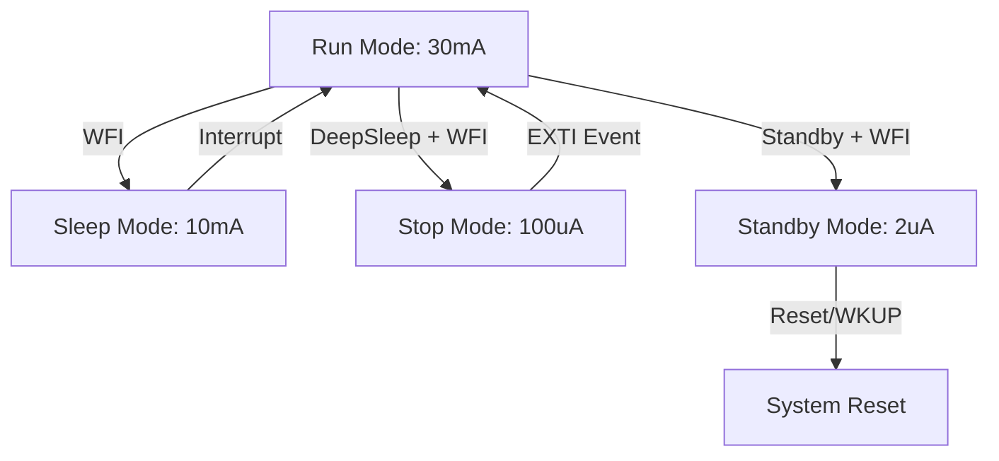

# Day 108: Low Power Optimization
## Phase 1: Core Embedded Engineering Foundations | Week 16: Advanced C & Optimization

---

> **📝 Content Creator Instructions:**
> This document is designed to produce **comprehensive, industry-grade educational content**. 
> - **Target Length:** The final filled document should be approximately **1000+ lines** of detailed markdown.
> - **Depth:** Do not skim over details. Explain *why*, not just *how*.
> - **Structure:** If a topic is complex, **DIVIDE IT INTO MULTIPLE PARTS** (Part 1, Part 2, etc.).
> - **Code:** Provide complete, compilable code examples, not just snippets.
> - **Visuals:** Use Mermaid diagrams for flows, architectures, and state machines.

---

## 🎯 Learning Objectives
*By the end of this day, the learner will be able to:*
1.  **Differentiate** between STM32 Low Power Modes: Sleep, Stop, and Standby.
2.  **Implement** Clock Gating to disable unused peripherals and save dynamic power.
3.  **Configure** the system to enter Stop Mode and wake up via EXTI (Button) or RTC Alarm.
4.  **Measure** current consumption using a multimeter or current sense amplifier.
5.  **Optimize** GPIO states (Analog Input) to minimize leakage current.

---

## 📚 Prerequisites & Preparation
*   **Hardware Required:**
    *   STM32F4 Discovery Board
    *   Multimeter (with uA/mA range).
*   **Software Required:**
    *   VS Code with ARM GCC Toolchain
*   **Prior Knowledge:**
    *   Day 11 (Interrupts)
    *   Day 20 (RTC)

---

## 📖 Theoretical Deep Dive

### 🔹 Part 1: Power Equation
$P = V \times I$.
$I_{total} = I_{dynamic} + I_{static}$.
*   **Dynamic:** Switching transistors. $I \propto f$ (Frequency).
*   **Static:** Leakage. $I \propto T$ (Temperature).

### 🔹 Part 2: STM32 Power Modes
1.  **Run Mode:** Everything on. ~30mA @ 168MHz.
2.  **Sleep Mode:** CPU stopped. Peripherals on. Wake on any Interrupt. ~10mA.
3.  **Stop Mode:** Clocks stopped (HSI/HSE off). SRAM/Registers retained. Wake on EXTI. ~100uA.
4.  **Standby Mode:** 1.2V domain off. SRAM lost (except Backup). Wake on Reset/RTC/WKUP pin. ~2uA.

### 🔹 Part 3: Clock Gating
Every peripheral (UART, SPI, ADC) has a clock enable bit in `RCC`.
*   If bit is 1, clock toggles -> Power consumed.
*   If bit is 0, clock static -> No dynamic power.
*   **Rule:** Always disable clocks for unused peripherals.



---

## 💻 Implementation: Sleep Mode

> **Instruction:** Basic WFI (Wait For Interrupt).

### 👨‍💻 Code Implementation

#### Step 1: The Loop
```c
void App_Loop(void) {
    while(1) {
        // Do work...
        BSP_LED_Toggle(LED_GREEN);
        HAL_Delay(100);
        
        // Enter Sleep
        // CPU stops here. Peripherals (Systick) still run.
        // Systick interrupt will wake CPU every 1ms.
        __WFI(); 
        
        // Resume here after ISR
    }
}
```
**Note:** Since Systick runs, Sleep Mode isn't very effective unless you suspend Systick.

---

## 💻 Implementation: Stop Mode (Deep Sleep)

> **Instruction:** Stop clocks. Wake on Button Press.

### 👨‍💻 Code Implementation

#### Step 1: Configure EXTI
(Day 11 Code) - Configure PA0 (Button) as Interrupt Rising Edge.

#### Step 2: Enter Stop Mode
```c
void Enter_Stop_Mode(void) {
    printf("Entering Stop Mode...\n");
    
    // 1. Disable Systick (so it doesn't wake us)
    HAL_SuspendTick();
    
    // 2. Request Stop Mode (Regulator in Low Power)
    HAL_PWR_EnterSTOPMode(PWR_LOWPOWERREGULATOR_ON, PWR_STOPENTRY_WFI);
    
    // ... Sleeping ... Zzz ...
    
    // 3. Wake Up (Code resumes here)
    // IMPORTANT: HSI is selected as clock source on wake-up!
    // We must re-enable PLL and HSE.
    SystemClock_Config(); 
    
    HAL_ResumeTick();
    printf("Woke Up!\n");
}
```

#### Step 3: GPIO Optimization
Before sleeping, set unused GPIOs to **Analog Mode**.
*   Input Floating: Can oscillate with noise -> Current consumption.
*   Analog: Schmitt trigger disabled. Lowest power.

```c
void GPIO_LowPower_Config(void) {
    GPIO_InitTypeDef GPIO_InitStruct = {0};
    GPIO_InitStruct.Mode = GPIO_MODE_ANALOG;
    GPIO_InitStruct.Pull = GPIO_NOPULL;
    GPIO_InitStruct.Pin = GPIO_PIN_All;
    
    // Apply to Port B, C, D... (Careful not to disable Debug pins PA13/PA14)
    HAL_GPIO_Init(GPIOB, &GPIO_InitStruct);
    HAL_GPIO_Init(GPIOC, &GPIO_InitStruct);
}
```

---

## 🔬 Lab Exercise: Lab 108.1 - Current Measurement

### 1. Lab Objectives
- Measure Run vs Stop current.
- Verify GPIO Analog impact.

### 2. Step-by-Step Guide

#### Phase A: Hardware Setup
1.  Remove JP1 (IDD Jumper) on Discovery Board.
2.  Connect Multimeter (mA mode) in series with JP1 pins.

#### Phase B: Run Mode
1.  Run code blinking LED.
2.  **Observation:** ~40-50mA.

#### Phase C: Stop Mode
1.  Press User Button to trigger `Enter_Stop_Mode`.
2.  **Observation:** Current drops to ~10-20mA (On Discovery board, other chips like ST-LINK and Audio DAC consume power).
3.  **Note:** To see uA, you need a bare chip or cut traces to other components.

### 3. Verification
If current is high in Stop Mode:
*   Check if Debugger is connected (Debug module consumes power).
*   Check floating inputs.

---

## 🧪 Additional / Advanced Labs

### Lab 2: Standby Mode
- **Goal:** Lowest Power.
- **Task:**
    1.  `HAL_PWR_EnterSTANDBYMode()`.
    2.  Wake up via PA0 (WKUP pin).
    3.  **Observation:** Board Resets (LEDs flash init sequence). RAM was lost.

### Lab 3: RTC Alarm Wakeup
- **Goal:** Periodic Wakeup.
- **Task:**
    1.  Set RTC Alarm A for T+10 seconds.
    2.  Enter Stop Mode.
    3.  Wait.
    4.  **Observation:** Board wakes up automatically after 10s.

---

## 🐞 Debugging & Troubleshooting

### Common Issues

#### 1. Can't Connect Debugger
*   **Cause:** If code enters Stop/Standby immediately on boot, debugger loses connection.
*   **Solution:** Hold Reset button. Connect. Release Reset. Or add `HAL_Delay(2000)` at start of main.

#### 2. Clock Speed Wrong after Wake
*   **Cause:** Forgot `SystemClock_Config()` after wake.
*   **Result:** CPU runs at 16MHz (HSI) instead of 168MHz. UART baud rates wrong.

---

## ⚡ Optimization & Best Practices

### Code Quality
- **Batching:** Instead of waking up every 1ms to process 1 byte, wake up every 100ms to process 100 bytes. Wake-up overhead is expensive.

---

## 🧠 Assessment & Review

### Knowledge Check
1.  **Q:** Which mode retains SRAM content?
    *   **A:** Sleep and Stop. Standby loses SRAM (except Backup SRAM).
2.  **Q:** Why set GPIO to Analog?
    *   **A:** To disconnect the input buffer (Schmitt trigger). Floating inputs near the threshold voltage cause the buffer to toggle rapidly, consuming current.

### Challenge Task
> **Task:** "ULP Monitor". Create a system that sleeps in Stop Mode. Wakes up every 1 hour (RTC), reads Temp, logs to Flash (LittleFS), and goes back to sleep. Average current should be < 50uA (theoretical).

---

## 📚 Further Reading & References
- [STM32F4 Power Control (PWR) Reference Manual](https://www.st.com/resource/en/reference_manual/dm00031020.pdf)
- [Optimizing Power on STM32 (App Note AN4365)](https://www.st.com/resource/en/application_note/dm00104169.pdf)

---
