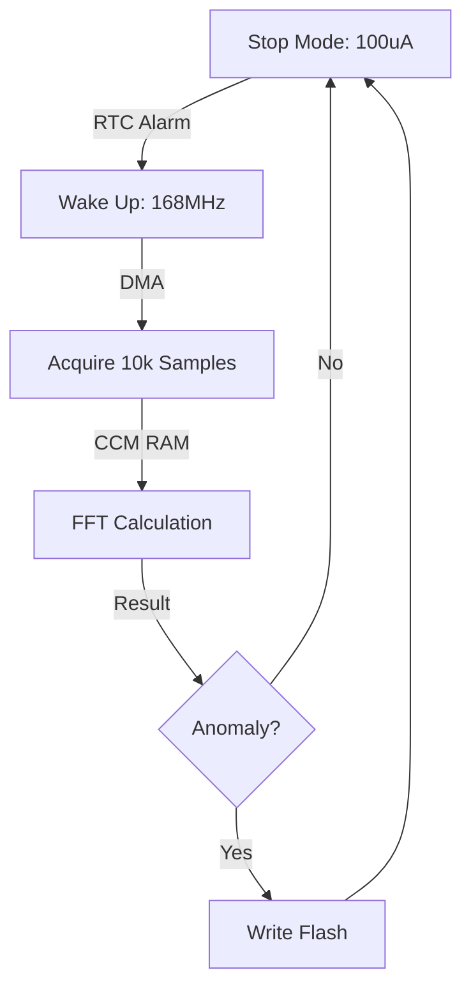

# Day 112: Week 16 Review and Project
## Phase 1: Core Embedded Engineering Foundations | Week 16: Advanced C & Optimization

---

> **📝 Content Creator Instructions:**
> This document is designed to produce **comprehensive, industry-grade educational content**. 
> - **Target Length:** The final filled document should be approximately **1000+ lines** of detailed markdown.
> - **Depth:** Do not skim over details. Explain *why*, not just *how*.
> - **Structure:** If a topic is complex, **DIVIDE IT INTO MULTIPLE PARTS** (Part 1, Part 2, etc.).
> - **Code:** Provide complete, compilable code examples, not just snippets.
> - **Visuals:** Use Mermaid diagrams for flows, architectures, and state machines.

---

## 🎯 Learning Objectives
*By the end of this day, the learner will be able to:*
1.  **Synthesize** Week 16 concepts (Pointers, Optimization, Low Power, Linker Scripts) into a unified project.
2.  **Architect** a "Smart Vibration Monitor" that samples high-speed data, processes it efficiently, and sleeps.
3.  **Optimize** the critical path by placing DSP code in CCM RAM and using `-O3`.
4.  **Profile** the system power consumption and execution time to prove gains.
5.  **Implement** a custom memory allocator for dynamic signal buffers.

---

## 📚 Prerequisites & Preparation
*   **Hardware Required:**
    *   STM32F4 Discovery Board
    *   Accelerometer (optional, can simulate data).
*   **Software Required:**
    *   VS Code with ARM GCC Toolchain
*   **Prior Knowledge:**
    *   Days 106-111.

---

## 📖 Theoretical Deep Dive

### 🔹 Part 1: The Challenge
We need to monitor a motor for vibration anomalies.
*   **Requirement:** Sample at 10kHz for 1 second (10,000 samples).
*   **Process:** Compute FFT to find dominant frequency.
*   **Constraint:** Battery powered. Must sleep 99% of the time.
*   **Constraint:** FFT is math heavy. Needs optimization.

### 🔹 Part 2: Architecture
1.  **Wakeup:** RTC Alarm (every 10s).
2.  **Acquisition:** DMA to SRAM1 (ADC/SPI).
3.  **Processing:** Copy to CCM RAM (if needed) or process in place. Use DSP Lib.
4.  **Decision:** If Peak > Threshold, Log to Flash.
5.  **Sleep:** Stop Mode.



---

## 💻 Implementation: The Optimized Node

> **Instruction:** Combine all techniques.

### 👨‍💻 Code Implementation

#### Step 1: Linker & Memory (`stm32f4.ld`)
Ensure `.ccmram` section exists (Day 111).

#### Step 2: Custom Allocator (`allocator.c`)
Use Pool Allocator (Day 106) for managing FFT buffers to avoid `malloc` overhead.
```c
#include "allocator.h"
// ... Pool Implementation ...
```

#### Step 3: Optimized FFT (`dsp_core.c`)
Place critical math in CCM RAM.
```c
#include "arm_math.h"

// Input buffer in SRAM1 (DMA target)
float input_buf[1024];

// Output buffer in CCM RAM (Fast access)
__attribute__((section(".ccmram")))
float fft_output[1024];

// Function in CCM RAM (Instruction fetch speedup)
__attribute__((section(".ccmram")))
void Process_Vibration(void) {
    arm_cfft_instance_f32 S;
    arm_cfft_init_f32(&S, 1024);
    
    // Process
    arm_cfft_f32(&S, input_buf);
    arm_cmplx_mag_f32(input_buf, fft_output, 1024);
    
    // Find Peak
    float max_val;
    uint32_t max_idx;
    arm_max_f32(fft_output, 1024, &max_val, &max_idx);
    
    printf("Peak Freq Bin: %lu, Mag: %.2f\n", max_idx, max_val);
}
```

#### Step 4: Low Power Loop (`main.c`)
```c
void App_Loop(void) {
    while(1) {
        // 1. Acquire (Simulated)
        for(int i=0; i<1024; i++) input_buf[i] = (float)(rand() % 100);
        
        // 2. Process (Measure Time)
        uint32_t start = DWT->CYCCNT;
        Process_Vibration();
        uint32_t end = DWT->CYCCNT;
        printf("FFT Cycles: %lu\n", end - start);
        
        // 3. Sleep
        printf("Sleeping 5s...\n");
        RTC_SetAlarm_5s();
        Enter_Stop_Mode();
    }
}
```

---

## 🔬 Lab Exercise: Lab 112.1 - The Optimization Challenge

### 1. Lab Objectives
- Measure Baseline Performance (O0, Flash code).
- Apply Optimizations (O3, CCM RAM).
- Compare results.

### 2. Step-by-Step Guide

#### Phase A: Baseline
1.  Compile with `-O0`.
2.  Remove `__attribute__((section(".ccmram")))`.
3.  Run. Record Cycles (e.g., 1,000,000).

#### Phase B: Compiler Opt
1.  Compile with `-O3`.
2.  Run. Record Cycles (e.g., 200,000). **5x Speedup**.

#### Phase C: Memory Opt
1.  Add `__attribute__((section(".ccmram")))` back.
2.  Run. Record Cycles (e.g., 180,000). **10% Speedup** (due to 0-wait state vs Flash wait states).

### 3. Verification
If CCM RAM version crashes, check if `SystemInit` copied the code correctly (Day 111).

---

## 🧪 Additional / Advanced Labs

### Lab 2: Power Profiling
- **Goal:** Calculate Battery Life.
- **Task:**
    1.  Measure Run Current ($I_{run} = 40mA$).
    2.  Measure Stop Current ($I_{stop} = 0.1mA$).
    3.  Measure Run Time ($t_{run} = 10ms$).
    4.  Sleep Time ($t_{sleep} = 9990ms$).
    5.  $I_{avg} = \frac{I_{run}t_{run} + I_{stop}t_{sleep}}{t_{total}}$.
    6.  Calculate days on 2000mAh battery.

### Lab 3: Stack Paint
- **Goal:** Safety.
- **Task:**
    1.  Fill stack with `0xCC`.
    2.  Run FFT.
    3.  Check how deep the stack went.
    4.  Adjust linker script stack size to be safe but not wasteful.

---

## 🐞 Debugging & Troubleshooting

### Common Issues

#### 1. HardFault in `arm_cfft_f32`
*   **Cause:** Stack overflow. FFT uses recursion or large local arrays.
*   **Solution:** Increase Stack Size (0x800 -> 0x2000).

#### 2. RTC Alarm not waking
*   **Cause:** EXTI line 17 (RTC Alarm) interrupt not enabled in NVIC.
*   **Solution:** `HAL_NVIC_EnableIRQ(RTC_Alarm_IRQn)`.

---

## ⚡ Optimization & Best Practices

### Code Quality
- **Function Attributes:** Use `__attribute__((optimize("O3")))` for specific functions (like FFT) even if the rest of the project is `-Os` (for size). This gives best of both worlds.

---

## 🧠 Assessment & Review

### Phase 1 Wrap-Up (Optimization)
We have covered:
*   **Pointers:** Complex types, Pools.
*   **Compiler:** O0-O3, Volatile, Inline.
*   **Power:** Sleep, Stop, Standby.
*   **Boot:** Fast startup.
*   **Size:** Newlib-nano, GC Sections.
*   **Linker:** CCM RAM, Overlays.

### Challenge Task
> **Task:** "Self-Optimizing". Write a bootloader that benchmarks two versions of a function (A and B) at runtime, and permanently selects the faster one for future executions.

---

## 📚 Further Reading & References
- [ARM CMSIS-DSP Library Documentation](https://www.keil.com/pack/doc/CMSIS/DSP/html/index.html)

---
