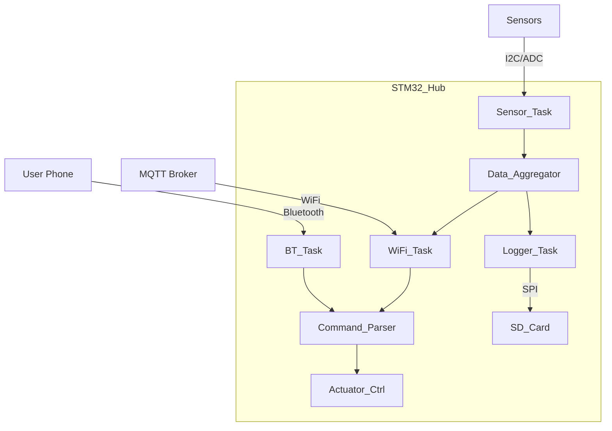

# Day 113: Final Project Architecture & Requirements
## Phase 1: Core Embedded Engineering Foundations | Week 17: Final Project - The Smart Home Hub

---

> **📝 Content Creator Instructions:**
> This document is designed to produce **comprehensive, industry-grade educational content**. 
> - **Target Length:** The final filled document should be approximately **1000+ lines** of detailed markdown.
> - **Depth:** Do not skim over details. Explain *why*, not just *how*.
> - **Structure:** If a topic is complex, **DIVIDE IT INTO MULTIPLE PARTS** (Part 1, Part 2, etc.).
> - **Code:** Provide complete, compilable code examples, not just snippets.
> - **Visuals:** Use Mermaid diagrams for flows, architectures, and state machines.

---

## 🎯 Learning Objectives
*By the end of this day, the learner will be able to:*
1.  **Define** the requirements for a complex embedded system ("Smart Home Hub").
2.  **Design** the system architecture, including hardware selection, software layering, and communication protocols.
3.  **Create** a detailed Interface Control Document (ICD) for inter-module communication.
4.  **Plan** the development phases (Agile/Waterfall hybrid).
5.  **Set up** the project structure (Git, Folder hierarchy, Makefile).

---

## 📚 Prerequisites & Preparation
*   **Hardware Required:**
    *   STM32F4 Discovery Board (The Hub).
    *   ESP8266 (WiFi Gateway).
    *   HC-05 (Bluetooth Interface).
    *   Sensors (Temp, Light).
    *   Actuators (Relay/LED).
    *   SD Card (Logging).
*   **Software Required:**
    *   VS Code with ARM GCC Toolchain
    *   Git
*   **Prior Knowledge:**
    *   All previous 112 Days.

---

## 📖 Theoretical Deep Dive

### 🔹 Part 1: The Vision
We are building a **Smart Home Hub** that:
1.  **Monitors** environment (Temp, Light).
2.  **Controls** appliances (Relays).
3.  **Connects** to Cloud (MQTT via ESP8266).
4.  **Connects** to Phone (BLE/Classic via HC-05).
5.  **Logs** data locally (SD Card).
6.  **Configurable** via CLI and File System.
7.  **Secure** (AES Encryption).
8.  **Reliable** (Watchdog, HardFault Handler).

### 🔹 Part 2: System Architecture
*   **Layer 1: HAL/Drivers:** STM32 HAL, ESP8266 Driver, SD Driver.
*   **Layer 2: Middleware:** FatFs, LittleFS, FreeRTOS (optional, but we'll stick to Super Loop + FSM for simplicity/control), MQTT Client, AES Lib.
*   **Layer 3: Application:** Sensor Manager, Comms Manager, Logger, CLI.



### 🔹 Part 3: Requirements Specification
1.  **REQ-01:** System shall sample sensors every 1 second.
2.  **REQ-02:** System shall publish encrypted JSON to MQTT topic `home/status` every 5 seconds.
3.  **REQ-03:** System shall accept commands (`SET_RELAY=1`) from Bluetooth and MQTT.
4.  **REQ-04:** System shall log all events to `events.log` on SD Card.
5.  **REQ-05:** System shall recover from WiFi loss automatically.

---

## 💻 Implementation: Project Setup

> **Instruction:** Create the folder structure.

### 👨‍💻 Code Implementation

#### Step 1: Directory Tree
```text
SmartHub/
├── Core/
│   ├── Inc/
│   ├── Src/ (main.c, stm32f4xx_it.c)
├── Drivers/
│   ├── BSP/ (Board Support Package)
│   │   ├── bsp_wifi.c
│   │   ├── bsp_bt.c
│   │   ├── bsp_sd.c
│   ├── HAL/ (STM32 HAL)
├── Middlewares/
│   ├── Third_Party/
│   │   ├── FatFs/
│   │   ├── LittleFS/
│   │   ├── MbedTLS/ (or TinyAES)
│   │   ├── cJSON/
├── App/
│   ├── app_main.c
│   ├── tasks/
│   ├── config/
├── Makefile
└── README.md
```

#### Step 2: `app_main.h`
Define the public interface for the application entry point.
```c
#ifndef APP_MAIN_H
#define APP_MAIN_H

void App_Init(void);
void App_Loop(void);
void App_Error_Handler(void);

#endif
```

#### Step 3: `main.c` (The Skeleton)
```c
#include "app_main.h"

int main(void) {
    HAL_Init();
    SystemClock_Config();
    
    App_Init();
    
    while(1) {
        App_Loop();
    }
}
```

---

## 💻 Implementation: Interface Control (ICD)

> **Instruction:** Define the data structures for communication.

### 👨‍💻 Code Implementation

#### Step 1: Internal Message Bus
Since we don't have an OS with queues, we'll use a shared struct with flags (or a simple Ring Buffer for events).

```c
typedef enum {
    EVENT_NONE,
    EVENT_SENSOR_UPDATE,
    EVENT_CMD_RECEIVED,
    EVENT_ERROR
} EventType_t;

typedef struct {
    EventType_t type;
    uint32_t timestamp;
    union {
        struct { float temp; float light; } sensor;
        struct { char cmd[32]; } command;
        struct { int code; } error;
    } payload;
} SystemEvent_t;

// Global Event Queue (Simplified)
#define MAX_EVENTS 10
SystemEvent_t event_queue[MAX_EVENTS];
```

---

## 🔬 Lab Exercise: Lab 113.1 - The Skeleton Run

### 1. Lab Objectives
- Compile the empty project structure.
- Verify Makefile includes all paths.
- Blink LED in `App_Loop`.

### 2. Step-by-Step Guide

#### Phase A: Makefile
Ensure `INCLUDES` points to all new directories (`App`, `Drivers/BSP`, etc.).

#### Phase B: Code
```c
// App/app_main.c
void App_Init(void) {
    printf("Smart Hub Booting...\n");
}

void App_Loop(void) {
    static uint32_t last = 0;
    if (HAL_GetTick() - last > 1000) {
        last = HAL_GetTick();
        printf("Heartbeat\n");
        BSP_LED_Toggle(LED_GREEN);
    }
}
```

#### Phase C: Build & Run
1.  `make clean`
2.  `make all`
3.  Flash.
4.  **Observation:** LED Blinks. "Heartbeat" on UART.

### 3. Verification
If build fails, check header paths. This step is crucial. Do not proceed until the skeleton compiles perfectly.

---

## 🧪 Additional / Advanced Labs

### Lab 2: Git Repo Init
- **Goal:** Version Control.
- **Task:**
    1.  `git init`
    2.  Create `.gitignore` (ignore `build/`, `*.o`, `*.elf`).
    3.  `git add .`
    4.  `git commit -m "Initial Skeleton"`

### Lab 3: CI/CD Prep
- **Goal:** Automation.
- **Task:**
    1.  Create a script `test_build.sh`.
    2.  It runs `make` and checks return code.
    3.  If success, prints "Build Passed".

---

## 🐞 Debugging & Troubleshooting

### Common Issues

#### 1. "No such file or directory"
*   **Cause:** Makefile `C_INCLUDES` missing a folder.
*   **Solution:** Add `-IApp` `-IDrivers/BSP` etc.

#### 2. Multiple Definition Error
*   **Cause:** Defining variables in `.h` files without `extern`.
*   **Solution:** Define in `.c`, `extern` in `.h`.

---

## ⚡ Optimization & Best Practices

### Code Quality
- **Modular Design:** `bsp_wifi.c` should NOT know about `mqtt.c`. It should only provide `WiFi_Send()` and `WiFi_Receive()`. Keep layers separate.

---

## 🧠 Assessment & Review

### Knowledge Check
1.  **Q:** Why use a "Board Support Package" (BSP)?
    *   **A:** To abstract the hardware. If we switch from STM32F4 to STM32L4, we only change the BSP, not the Application logic.
2.  **Q:** What is an "ICD"?
    *   **A:** Interface Control Document. Defines how modules talk (packet formats, API calls).

### Challenge Task
> **Task:** "The Mock". Create mock implementations for WiFi and Sensors. `BSP_Sensor_Read()` returns a random value. `BSP_WiFi_Connect()` always succeeds. This allows developing the App logic before the hardware is ready.

---

## 📚 Further Reading & References
- [Making Embedded Systems (O'Reilly)](https://www.oreilly.com/library/view/making-embedded-systems/9781449308889/)

---
