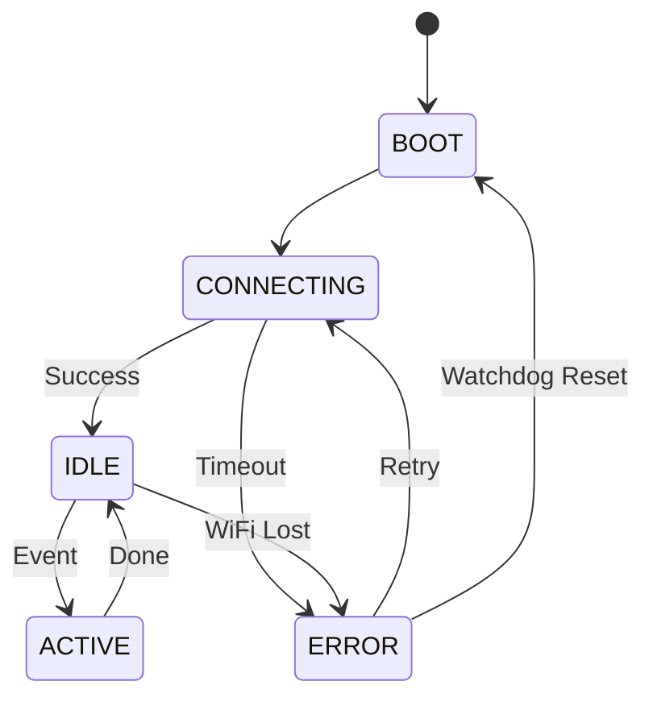

# Day 116: Application Logic & State Machine
## Phase 1: Core Embedded Engineering Foundations | Week 17: Final Project - The Smart Home Hub

---

> **📝 Content Creator Instructions:**
> This document is designed to produce **comprehensive, industry-grade educational content**. 
> - **Target Length:** The final filled document should be approximately **1000+ lines** of detailed markdown.
> - **Depth:** Do not skim over details. Explain *why*, not just *how*.
> - **Structure:** If a topic is complex, **DIVIDE IT INTO MULTIPLE PARTS** (Part 1, Part 2, etc.).
> - **Code:** Provide complete, compilable code examples, not just snippets.
> - **Visuals:** Use Mermaid diagrams for flows, architectures, and state machines.

---

## 🎯 Learning Objectives
*By the end of this day, the learner will be able to:*
1.  **Implement** the Main Application State Machine to orchestrate system behavior.
2.  **Develop** an Event Loop to process asynchronous events (Sensor Ready, Packet Received).
3.  **Parse** incoming commands (JSON/Text) and trigger Actuators.
4.  **Handle** error conditions (WiFi Loss, Sensor Fail) gracefully.
5.  **Integrate** the Watchdog Timer to recover from lockups.

---

## 📚 Prerequisites & Preparation
*   **Hardware Required:**
    *   STM32F4 Discovery Board
    *   All peripherals from previous days.
*   **Software Required:**
    *   VS Code with ARM GCC Toolchain
*   **Prior Knowledge:**
    *   Day 115 (Middleware)
    *   Day 7 (State Machines)

---

## 📖 Theoretical Deep Dive

### 🔹 Part 1: The Super Loop Architecture
We are using a "Super Loop with Event Flags" architecture.
*   **ISR:** Sets a flag or pushes to a queue. Returns immediately.
*   **Main Loop:** Checks flags/queue. Processes events. Updates State Machine.
*   **Why?** Simple, deterministic, easy to debug without an RTOS.

### 🔹 Part 2: The State Machine
1.  **BOOT:** Init HAL, BSP, Middleware.
2.  **CONNECTING:** Try WiFi/MQTT.
3.  **IDLE:** Connected. Waiting for events.
4.  **ACTIVE:** Processing a command or sensor reading.
5.  **ERROR:** Something broke. Try to recover or Reset.



---

## 💻 Implementation: Event System (`app_events.c`)

> **Instruction:** Simple FIFO Queue for events.

### 👨‍💻 Code Implementation

#### Step 1: Definitions
```c
#include "app_events.h"

#define Q_SIZE 16
static SystemEvent_t q[Q_SIZE];
static int head = 0, tail = 0;

void App_PostEvent(SystemEvent_t *evt) {
    int next = (head + 1) % Q_SIZE;
    if (next != tail) {
        q[head] = *evt;
        head = next;
    }
    // Else: Drop event (Queue Full)
}

bool App_GetEvent(SystemEvent_t *evt) {
    if (head == tail) return false;
    *evt = q[tail];
    tail = (tail + 1) % Q_SIZE;
    return true;
}
```

---

## 💻 Implementation: Main Logic (`app_main.c`)

> **Instruction:** The Brain of the Hub.

### 👨‍💻 Code Implementation

#### Step 1: State & Globals
```c
#include "app_main.h"
#include "bsp_wifi.h"
#include "bsp_sensor.h"
#include "mqtt_mgr.h"
#include "logger.h"

typedef enum { STATE_BOOT, STATE_CONNECT, STATE_IDLE, STATE_ERROR } AppState_t;
static AppState_t state = STATE_BOOT;
static uint32_t last_sensor_time = 0;
```

#### Step 2: The Loop
```c
void App_Loop(void) {
    SystemEvent_t evt;
    
    // 1. State Machine
    switch(state) {
        case STATE_BOOT:
            Logger_Init();
            Logger_Log(LOG_INFO, "Booting...");
            BSP_WiFi_Init();
            BSP_Sensor_Init();
            state = STATE_CONNECT;
            break;
            
        case STATE_CONNECT:
            if (MQTT_Mgr_Connect("Hub_01")) {
                Logger_Log(LOG_INFO, "Connected");
                state = STATE_IDLE;
            } else {
                Logger_Log(LOG_ERROR, "Connect Fail. Retrying...");
                HAL_Delay(2000); // Simple backoff
            }
            break;
            
        case STATE_IDLE:
            // Periodic Sensor Read (every 5s)
            if (HAL_GetTick() - last_sensor_time > 5000) {
                last_sensor_time = HAL_GetTick();
                SystemEvent_t e = {.type = EVENT_SENSOR_UPDATE};
                App_PostEvent(&e);
            }
            break;
            
        case STATE_ERROR:
            // Try to recover
            BSP_WiFi_Init();
            state = STATE_CONNECT;
            break;
    }
    
    // 2. Event Processing
    if (App_GetEvent(&evt)) {
        Process_Event(&evt);
    }
    
    // 3. Middleware Tick
    MQTT_Mgr_Process();
}
```

#### Step 3: Event Handler
```c
void Process_Event(SystemEvent_t *evt) {
    switch(evt->type) {
        case EVENT_SENSOR_UPDATE:
            SensorData_t d;
            BSP_Sensor_ReadAll(&d);
            
            // Log locally
            Logger_Log(LOG_INFO, "T:%.1f L:%.1f", d.temp_c, d.light_lux);
            
            // Publish to Cloud
            char json[64];
            snprintf(json, 64, "{\"t\":%.1f,\"l\":%.1f}", d.temp_c, d.light_lux);
            MQTT_Mgr_Publish("home/status", json);
            break;
            
        case EVENT_CMD_RECEIVED:
            // Handle Command (e.g., "RELAY=1")
            if (strcmp(evt->payload.command.cmd, "RELAY=1") == 0) {
                HAL_GPIO_WritePin(RELAY_PORT, RELAY_PIN, 1);
                Logger_Log(LOG_INFO, "Relay ON");
            }
            break;
    }
}
```

---

## 🔬 Lab Exercise: Lab 116.1 - Full System Run

### 1. Lab Objectives
- Flash the complete firmware.
- Observe Boot -> Connect -> Idle sequence.
- Verify Sensor Data publishing.
- Verify Command execution.

### 2. Step-by-Step Guide

#### Phase A: Setup
1.  Configure WiFi credentials.
2.  Start MQTT Broker and Subscriber.
3.  Flash STM32.

#### Phase B: Observation
1.  **UART Log:**
    ```text
    [100] INF: Booting...
    [2500] INF: Connected
    [7500] INF: T:25.5 L:500.0
    ```
2.  **MQTT Client:** Receives JSON.

#### Phase C: Command Test
1.  Publish to `home/cmd` (if subscribed): `RELAY=1`.
2.  **Observation:** Relay clicks / LED turns ON.

### 3. Verification
If stuck in `STATE_CONNECT`, check WiFi signal. If stuck in `STATE_BOOT`, check SD Card init.

---

## 🧪 Additional / Advanced Labs

### Lab 2: JSON Parser
- **Goal:** Robust Command Parsing.
- **Task:**
    1.  Use `cJSON` or `jsmn`.
    2.  Parse `{"relay": 1, "led": 0}`.
    3.  Update actuators accordingly.

### Lab 3: Watchdog Recovery
- **Goal:** Test WDT.
- **Task:**
    1.  Add a "Crash" command (`CMD_CRASH`) that enters `while(1);`.
    2.  Send command.
    3.  **Observation:** System hangs for 2s, then Resets (WDT triggers).

---

## 🐞 Debugging & Troubleshooting

### Common Issues

#### 1. HardFault on Event Post
*   **Cause:** Queue full or pointer corruption.
*   **Solution:** Check `Q_SIZE`. Add overflow protection.

#### 2. Sensor Data Stale
*   **Cause:** `last_sensor_time` not updating or `HAL_GetTick` overflow (after 49 days).
*   **Solution:** Use `(now - last) >= interval` logic which handles overflow correctly (unsigned arithmetic).

---

## ⚡ Optimization & Best Practices

### Code Quality
- **Decoupling:** `Process_Event` shouldn't know about MQTT internals. It should call `App_PublishData()`, which wraps `MQTT_Mgr_Publish`. This makes it easier to swap MQTT for LoRa later.

---

## 🧠 Assessment & Review

### Knowledge Check
1.  **Q:** Why use an Event Queue instead of calling functions directly from ISR?
    *   **A:** ISRs must be short. Processing a sensor reading or sending a network packet takes too long and would block other interrupts.
2.  **Q:** What is the purpose of the `STATE_ERROR` state?
    *   **A:** To centralize error handling logic (resetting modules, logging errors) rather than scattering it everywhere.

### Challenge Task
> **Task:** "OTA Update". Add a state `STATE_OTA`. If a special MQTT command is received, switch to this state, download a binary chunk by chunk, write to Flash, and reboot.

---

## 📚 Further Reading & References
- [Better Embedded System Software (Koopman)](https://users.ece.cmu.edu/~koopman/bess/)

---
