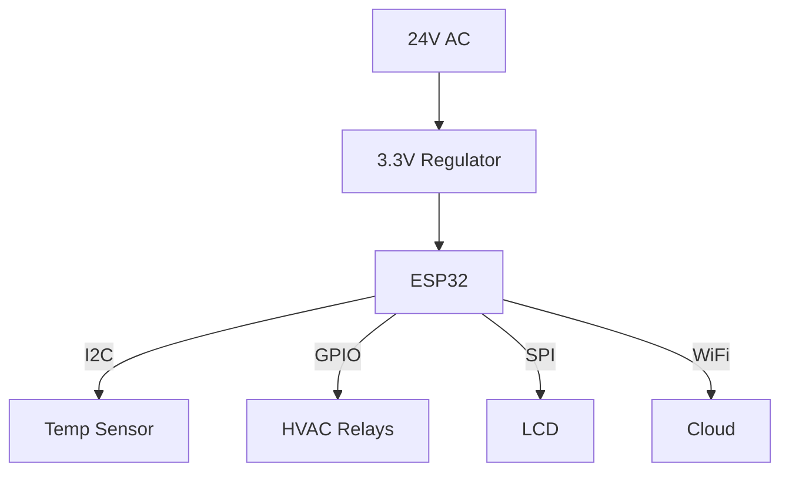

# Day 119: Career & Interview Prep (Embedded Specific)
## Phase 1: Core Embedded Engineering Foundations | Week 17: Final Project - The Smart Home Hub

---

> **📝 Content Creator Instructions:**
> This document is designed to produce **comprehensive, industry-grade educational content**. 
> - **Target Length:** The final filled document should be approximately **1000+ lines** of detailed markdown.
> - **Depth:** Do not skim over details. Explain *why*, not just *how*.
> - **Structure:** If a topic is complex, **DIVIDE IT INTO MULTIPLE PARTS** (Part 1, Part 2, etc.).
> - **Code:** Provide complete, compilable code examples, not just snippets.
> - **Visuals:** Use Mermaid diagrams for flows, architectures, and state machines.

---

## 🎯 Learning Objectives
*By the end of this day, the learner will be able to:*
1.  **Answer** common embedded C interview questions (volatile, static, const, pointers).
2.  **Explain** RTOS concepts (Context Switching, Priority Inversion, Deadlock) clearly.
3.  **Solve** hardware interface problems (I2C vs SPI, Pull-ups, Debouncing).
4.  **Approach** System Design interviews (e.g., "Design a Smart Watch") with a structured method.
5.  **Optimize** their resume to highlight embedded skills (Keywords, Projects).

---

## 📚 Prerequisites & Preparation
*   **Hardware Required:**
    *   Whiteboard / Paper (for practice).
*   **Software Required:**
    *   None.
*   **Prior Knowledge:**
    *   Entire Phase 1.

---

## 📖 Theoretical Deep Dive

### 🔹 Part 1: The "Big 3" Keywords
1.  **`volatile`:**
    *   **Definition:** Tells compiler the variable can change unexpectedly (ISR, Hardware Register). Prevents caching in registers.
    *   **Q:** Can a variable be `const volatile`?
    *   **A:** Yes. A Read-Only Status Register. You can't write to it (`const`), but hardware changes it (`volatile`).
2.  **`static`:**
    *   **Inside Function:** Persists between calls. Stored in `.data`/`.bss`, not Stack.
    *   **Global:** Limits scope to the current file (Private).
3.  **`const`:**
    *   **Definition:** Read-only. Stored in Flash (`.rodata`) usually.
    *   **Q:** `const int *p` vs `int * const p`?
    *   **A:** Read right-to-left. Pointer to Const Int vs Const Pointer to Int.

### 🔹 Part 2: Interrupts
*   **Q:** Can an ISR return a value?
    *   **A:** No. Who would receive it?
*   **Q:** Can an ISR accept parameters?
    *   **A:** No. Hardware calls it.
*   **Q:** What should you NOT do in an ISR?
    *   **A:** `printf` (blocking), `malloc` (non-deterministic), long loops.

### 🔹 Part 3: RTOS Concepts
*   **Priority Inversion:** Low priority task holds mutex. High priority task waits. Medium priority task preempts Low. High is blocked by Medium!
    *   **Fix:** Priority Inheritance.
*   **Deadlock:** Task A holds Mutex 1, wants Mutex 2. Task B holds Mutex 2, wants Mutex 1.
    *   **Fix:** Acquire in same order, or use timeouts.

---

## 💻 Implementation: Coding Challenges

> **Instruction:** Solve these common whiteboard problems.

### 👨‍💻 Code Implementation

#### Challenge 1: Set/Clear Bit
```c
#define BIT(x) (1UL << (x))

// Set Bit 3
reg |= BIT(3);

// Clear Bit 3
reg &= ~BIT(3);

// Toggle Bit 3
reg ^= BIT(3);

// Check Bit 3
if (reg & BIT(3)) { ... }
```

#### Challenge 2: Aligned Malloc
Write a function to allocate memory aligned to 16 bytes.
```c
void *aligned_malloc(size_t size, size_t alignment) {
    // Allocate extra bytes: size + alignment + metadata (pointer to original)
    void *p1 = malloc(size + alignment + sizeof(void*));
    if (!p1) return NULL;
    
    // Calculate aligned address
    size_t addr = (size_t)p1 + alignment + sizeof(void*);
    void *p2 = (void *)(addr - (addr % alignment));
    
    // Store original pointer just before p2
    *((void **)p2 - 1) = p1;
    
    return p2;
}

void aligned_free(void *p2) {
    // Retrieve original pointer
    void *p1 = *((void **)p2 - 1);
    free(p1);
}
```

#### Challenge 3: Endianness
Write a function to check if system is Little Endian.
```c
int is_little_endian(void) {
    uint32_t x = 1;
    // If Little Endian, LSB (1) is at lowest address.
    // If Big Endian, MSB (0) is at lowest address.
    uint8_t *p = (uint8_t*)&x;
    return (*p == 1);
}
```

---

## 💻 Implementation: System Design

> **Instruction:** Design a "Smart Thermostat".

### 👨‍💻 Architecture Design

#### Step 1: Requirements
*   Measure Temp (0-50C, +/- 0.5C).
*   Control HVAC (Relays: Fan, Heat, Cool).
*   WiFi Connectivity (Cloud App).
*   UI (LCD + Buttons).
*   Power: 24V AC (HVAC wire).

#### Step 2: Hardware Selection
*   **MCU:** STM32L4 (Low power not critical if wired, but good for heat). Or ESP32 (Integrated WiFi). Let's pick **ESP32** for cost/WiFi.
*   **Sensors:** SHT30 (I2C, Digital, Calibrated).
*   **Power:** 24V AC -> Rectifier -> Buck Converter -> 3.3V.
*   **Relays:** Solid State Relays (SSR) or Mechanical (Driver ULN2003).

#### Step 3: Software Architecture
*   **OS:** FreeRTOS (ESP-IDF).
*   **Tasks:**
    1.  `WiFi_Task` (MQTT).
    2.  `Sensor_Task` (Read SHT30, Filter data).
    3.  `Control_Task` (PID Loop: Target vs Actual -> Relays).
    4.  `UI_Task` (Update LCD).
*   **Safety:** Watchdog. Hardware thermal fuse.



---

## 🔬 Lab Exercise: Lab 119.1 - Mock Interview

### 1. Lab Objectives
- Simulate a real interview environment.
- Answer 3 technical questions in 30 minutes.

### 2. Step-by-Step Guide

#### Question 1: I2C vs SPI
*   **Interviewer:** "When would you choose I2C over SPI?"
*   **Answer:** "I2C uses fewer pins (2 vs 4), supports multi-master, and has ACK/NACK flow control. It's better for complex sensors or EEPROMs where speed isn't critical. SPI is full-duplex and much faster (MHz vs kHz), better for Displays, SD Cards, or streaming data."

#### Question 2: Volatile Pointer
*   **Interviewer:** "What does `volatile int *p` mean?"
*   **Answer:** "It is a pointer to a volatile integer. The pointer itself can be optimized/cached, but the value it points to (e.g., a register) can change unexpectedly, so the compiler must reload it from memory every time it's dereferenced."

#### Question 3: Debugging a HardFault
*   **Interviewer:** "Your system crashed. How do you debug it?"
*   **Answer:** "1. Check the Stack Pointer (SP) and Program Counter (PC) in the stack frame pushed during exception. 2. Check the CFSR (Configurable Fault Status Register) to see if it was Bus Fault, Usage Fault (Divide by zero), or MemManage Fault. 3. Use a debugger to trace back the LR (Link Register) to find the calling function."

---

## 🧪 Additional / Advanced Labs

### Lab 2: Resume Review
- **Goal:** ATS Optimization.
- **Task:**
    1.  List Skills: C, C++, Python, STM32, ARM Cortex-M, FreeRTOS, I2C, SPI, UART, Git, Oscilloscope.
    2.  Project: "Smart Home Hub - Designed a secure IoT node using STM32F4 and ESP8266, implementing MQTT over TLS and a custom HAL."

### Lab 3: GitHub Portfolio
- **Goal:** Proof of Work.
- **Task:**
    1.  Clean up the `SmartHub` repo.
    2.  Add a `README.md` with:
        *   Architecture Diagram.
        *   Build Instructions.
        *   Demo GIF/Video.
    3.  Pin it to your profile.

---

## 🐞 Debugging & Troubleshooting

### Common Issues

#### 1. "I don't know the answer"
*   **Strategy:** Don't lie. Say "I haven't worked with that specific chip, but based on my experience with X, I assume it works like Y..." Show your thought process.

#### 2. Whiteboard Panic
*   **Strategy:** Talk while you write. "I'm defining a struct here to hold the data..." Ask clarifying questions. "Is this a single-threaded or multi-threaded environment?"

---

## ⚡ Optimization & Best Practices

### Code Quality
- **Coding Standard:** In interviews, stick to a style (e.g., `snake_case` or `CamelCase`) and be consistent. Use `stdint.h` types (`uint32_t`) instead of `int`.

---

## 🧠 Assessment & Review

### Knowledge Check
1.  **Q:** What is a "Memory Leak"?
    *   **A:** Allocating memory (`malloc`) and losing the pointer without freeing it. The memory is occupied but inaccessible. Eventually leads to Out of Memory (OOM).
2.  **Q:** What is "Debouncing"?
    *   **A:** Mechanical buttons bounce (make/break contact rapidly) when pressed. Software must wait for the signal to stabilize (e.g., 20ms) before registering a press.

### Challenge Task
> **Task:** "The Elevator". Design the control logic for an elevator system with N floors. Handle requests from inside and outside. Prioritize direction. (State Machine + Queue).

---

## 📚 Further Reading & References
- [Making Embedded Systems (O'Reilly)](https://www.oreilly.com/library/view/making-embedded-systems/9781449308889/)
- [Cracking the Coding Interview](https://www.crackingthecodinginterview.com/)

---
