# Day 10: Memory Architecture
## Phase 1: Core Embedded Engineering Foundations | Week 2: ARM Cortex-M Architecture

---

> **📝 Content Creator Instructions:**
> This document is designed to produce **comprehensive, industry-grade educational content**. 
> - **Target Length:** The final filled document should be approximately **1000+ lines** of detailed markdown.
> - **Depth:** Do not skim over details. Explain *why*, not just *how*.
> - **Structure:** If a topic is complex, **DIVIDE IT INTO MULTIPLE PARTS** (Part 1, Part 2, etc.).
> - **Code:** Provide complete, compilable code examples, not just snippets.
> - **Visuals:** Use Mermaid diagrams for flows, architectures, and state machines.

---

## 🎯 Learning Objectives
*By the end of this day, the learner will be able to:*
1.  **Dissect** the internal memory organization of an STM32 microcontroller (Flash sectors, SRAM banks).
2.  **Write** a custom linker script (`.ld`) to place code and data in specific memory regions.
3.  **Understand** the boot sequence and vector table placement.
4.  **Optimize** memory usage by analyzing `.map` files.
5.  **Implement** a function that runs from RAM instead of Flash for performance.

---

## 📚 Prerequisites & Preparation
*   **Hardware Required:**
    *   STM32F4 Discovery Board
*   **Software Required:**
    *   VS Code with ARM GCC Toolchain
*   **Prior Knowledge:**
    *   Day 1 (Build Process)
    *   Day 5 (Memory Map)
*   **Datasheets:**
    *   [STM32F407 Reference Manual (Flash/RAM sections)](https://www.st.com/resource/en/reference_manual/dm00031020.pdf)

---

## 📖 Theoretical Deep Dive

### 🔹 Part 1: Physical Memory Organization

#### 1.1 Flash Memory (The Hard Drive)
Flash is where code lives. It is non-volatile but slow.
*   **Organization:** Divided into "Sectors". You cannot erase a single byte; you must erase a whole sector (e.g., 16KB or 128KB).
*   **Wait States:** The CPU runs at 168 MHz, but Flash runs at ~30 MHz. To read instructions, the CPU inserts "Wait States" (stalls).
*   **ART Accelerator:** STM32's cache-like mechanism to prefetch instructions, reducing the performance penalty of Flash.

#### 1.2 SRAM (The RAM)
SRAM is fast (0 wait states) but volatile.
*   **SRAM1 (112KB):** Main working memory.
*   **SRAM2 (16KB):** Auxiliary memory.
*   **CCM RAM (64KB):** Core Coupled Memory. Directly connected to the D-Bus. **Fastest**, but *cannot be used for DMA*.

```mermaid
block-beta
    columns 3
    block:Flash
        Flash_Label["Flash (1MB)"]
        Sector0["Sec 0 (16K)"]
        Sector1["Sec 1 (16K)"]
        SectorX["..."]
    end
    block:SRAM
        SRAM_Label["SRAM (192K)"]
        SRAM1["SRAM1 (112K)"]
        SRAM2["SRAM2 (16K)"]
        CCM["CCM (64K)"]
    end
    block:Bus
        Bus_Label["Bus Matrix"]
        IBus["I-Bus"]
        DBus["D-Bus"]
        SBus["S-Bus"]
    end
    Flash --> IBus
    SRAM1 --> SBus
    CCM --> DBus
```



### 🔹 Part 2: The Linker Script (`.ld`)

The linker script is the map that tells the linker where to put every piece of code and data.

#### 2.1 MEMORY Command
Defines the available hardware memory regions.
```ld
MEMORY
{
    FLASH (rx)      : ORIGIN = 0x08000000, LENGTH = 1024K
    RAM (xrw)       : ORIGIN = 0x20000000, LENGTH = 128K
    CCMRAM (xrw)    : ORIGIN = 0x10000000, LENGTH = 64K
}
```

#### 2.2 SECTIONS Command
Maps input sections (from `.o` files) to output sections (in the binary).

*   **`.text`**: Code and Read-Only constants. Goes to FLASH.
*   **`.data`**: Initialized variables (`int x = 5;`). Lives in FLASH (LMA) but copied to RAM (VMA) at startup.
*   **`.bss`**: Uninitialized variables (`int y;`). Lives in RAM. Zeroed at startup.
*   **`.stack`**: Reserved space for the stack (usually at the end of RAM).

```ld
SECTIONS
{
    .text :
    {
        *(.isr_vector)
        *(.text)
        *(.rodata)
        _etext = .;
    } > FLASH

    .data :
    {
        _sdata = .;
        *(.data)
        _edata = .;
    } > RAM AT> FLASH  /* AT> FLASH specifies Load Address */

    .bss :
    {
        _sbss = .;
        *(.bss)
        _ebss = .;
    } > RAM
}
```

### 🔹 Part 3: Boot Sequence

1.  **Reset:** CPU wakes up.
2.  **Fetch MSP:** Reads the first word at `0x00000000` (or aliased `0x08000000`) into SP.
3.  **Fetch PC:** Reads the second word at `0x00000004` into PC (Reset Handler address).
4.  **Reset_Handler:**
    *   Copy `.data` from Flash to RAM.
    *   Zero `.bss` in RAM.
    *   Call `SystemInit()` (Clock setup).
    *   Call `main()`.

---

## 💻 Implementation: Running Code from RAM

> **Instruction:** We will modify the linker script and code to place a critical function in RAM for maximum performance.

### 🛠️ Hardware/System Configuration
STM32F4 Discovery.

### 👨‍💻 Code Implementation

#### Step 1: Modify Linker Script
Add a section for RAM functions.

```ld
/* In SECTIONS */
.ram_code :
{
    . = ALIGN(4);
    _sram_code = .;
    *(.ram_code)
    *(.ram_code*)
    . = ALIGN(4);
    _eram_code = .;
} > RAM AT> FLASH

_sram_code_load = LOADADDR(.ram_code);
```

#### Step 2: Modify Startup Code (`startup.c`)
Copy the code from Flash to RAM, just like `.data`.

```c
extern uint32_t _sram_code;
extern uint32_t _eram_code;
extern uint32_t _sram_code_load;

void Reset_Handler(void) {
    // ... (Copy .data, Zero .bss) ...

    // Copy .ram_code
    uint32_t *pSrc = &_sram_code_load;
    uint32_t *pDest = &_sram_code;
    while (pDest < &_eram_code) {
        *pDest++ = *pSrc++;
    }

    // ... (Call main) ...
}
```

#### Step 3: The Function (`main.c`)
Use `__attribute__` to tell the compiler to put this function in the `.ram_code` section.

```c
// This function will run from SRAM
__attribute__((section(".ram_code"))) void CriticalFunction(void) {
    for(int i=0; i<1000; i++) {
        __asm("nop");
    }
}

int main(void) {
    CriticalFunction();
    while(1);
}
```

---

## 🔬 Lab Exercise: Lab 10.1 - Map File Analysis

### 1. Lab Objectives
- Generate and analyze the `.map` file produced by the linker.
- Determine exactly how much Flash and RAM is used.
- Find the address of a specific global variable.

### 2. Step-by-Step Guide

#### Phase A: Build
Add `-Wl,-Map=output.map` to your LDFLAGS in the Makefile.
Run `make`.

#### Phase B: Analysis
Open `output.map` in a text editor.
1.  **Memory Configuration:** Check if it matches your `.ld` file.
2.  **Section Summary:** Look for `.text`, `.data`, `.bss` sizes.
3.  **Symbol Table:** Search for `CriticalFunction`.
    *   *Expected:* Address should be in `0x2000xxxx` range (SRAM), not `0x0800xxxx` (Flash).

### 3. Verification
If `CriticalFunction` address starts with `0x08`, you failed to place it in RAM.

---

## 🧪 Additional / Advanced Labs

### Lab 2: Using CCM RAM
- **Goal:** Place a large data array in CCM RAM (64KB) to free up main SRAM.
- **Task:**
    1.  Define `.ccmram` section in linker script.
    2.  Use `__attribute__((section(".ccmram"))) int big_array[1000];`.
    3.  Verify address in `.map` file (should be `0x1000xxxx`).
    4.  **Warning:** Try to use DMA with this array. It will fail (CCM is not connected to DMA bus).

### Lab 3: Stack Paint
- **Goal:** Determine actual stack usage.
- **Task:**
    1.  Fill the stack area with a pattern (e.g., `0xDEADBEEF`) at startup.
    2.  Run the application.
    3.  Pause debugger and inspect stack memory.
    4.  See how much of the pattern is overwritten.

---

## 🐞 Debugging & Troubleshooting

### Common Issues

#### 1. "Section .data overlaps .bss"
*   **Symptom:** Linker error.
*   **Cause:** You ran out of RAM. The sections grew too large and collided.
*   **Solution:** Optimize code, reduce buffer sizes, or move data to CCM RAM.

#### 2. Hard Fault after Reset
*   **Symptom:** System crashes immediately.
*   **Cause:** Startup code didn't copy `.data` or `.ram_code` correctly, or Stack Pointer is invalid.
*   **Solution:** Step through `Reset_Handler` instruction by instruction.

---

## ⚡ Optimization & Best Practices

### Performance Optimization
- **Zero-Wait State Code:** Running critical loops from CCM RAM or SRAM is faster than Flash (even with ART Accelerator) because there are zero wait states.

### Code Quality
- **Linker Script Management:** Keep a clean linker script. Document custom sections. Don't rely on default scripts provided by IDEs without understanding them.

---

## 🧠 Assessment & Review

### Knowledge Check
1.  **Q:** What is the difference between LMA (Load Memory Address) and VMA (Virtual Memory Address)?
    *   **A:** LMA is where the data lives in non-volatile storage (Flash). VMA is where the CPU expects to find it during execution (RAM). For `.data`, LMA != VMA. For `.text`, LMA == VMA.
2.  **Q:** Why does `.bss` not consume space in the Flash binary?
    *   **A:** Because it is all zeros. The binary only needs to store the *size* of the section, and the startup code fills it with zeros at runtime.

### Challenge Task
> **Task:** Create a "No-Init" section in RAM (`.noinit`). Variables in this section should *not* be zeroed out on reset. This allows data to survive a soft reset (e.g., to store a crash log).

---

## 📚 Further Reading & References
- [GNU Linker (LD) Command Language](https://sourceware.org/binutils/docs/ld/Scripts.html)
- [STM32F407 Memory Map](https://www.st.com/resource/en/datasheet/stm32f407vg.pdf)

---
