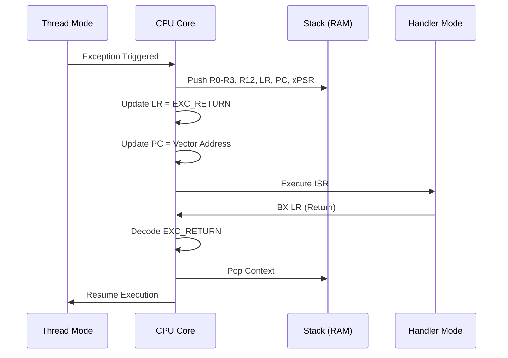

# Day 12: Exception Handling
## Phase 1: Core Embedded Engineering Foundations | Week 2: ARM Cortex-M Architecture

---

> **📝 Content Creator Instructions:**
> This document is designed to produce **comprehensive, industry-grade educational content**. 
> - **Target Length:** The final filled document should be approximately **1000+ lines** of detailed markdown.
> - **Depth:** Do not skim over details. Explain *why*, not just *how*.
> - **Structure:** If a topic is complex, **DIVIDE IT INTO MULTIPLE PARTS** (Part 1, Part 2, etc.).
> - **Code:** Provide complete, compilable code examples, not just snippets.
> - **Visuals:** Use Mermaid diagrams for flows, architectures, and state machines.

---

## 🎯 Learning Objectives
*By the end of this day, the learner will be able to:*
1.  **Differentiate** between Interrupts and System Exceptions in the Cortex-M architecture.
2.  **Analyze** the automatic state preservation (stacking) process during exception entry.
3.  **Implement** Fault Handlers (HardFault, MemManage, BusFault, UsageFault) to diagnose crashes.
4.  **Decode** the `LR` (Link Register) value (EXC_RETURN) to determine the return mode.
5.  **Debug** a system crash by inspecting the stack frame and fault status registers.

---

## 📚 Prerequisites & Preparation
*   **Hardware Required:**
    *   STM32F4 Discovery Board
*   **Software Required:**
    *   VS Code with ARM GCC Toolchain
    *   GDB / OpenOCD
*   **Prior Knowledge:**
    *   Day 9 (Stack Pointers)
    *   Day 11 (NVIC)
*   **Datasheets:**
    *   [Cortex-M4 Generic User Guide (System Control Block)](https://developer.arm.com/documentation/dui0553/latest/)

---

## 📖 Theoretical Deep Dive

### 🔹 Part 1: The Exception Model

#### 1.1 Exceptions vs. Interrupts
In ARM terminology, an **Exception** is any event that causes a change in program flow to a special handler.
*   **System Exceptions:** Generated by the CPU core (Reset, NMI, HardFault, SVCall, SysTick). Numbered 1-15.
*   **Interrupts (IRQs):** Generated by peripherals (Timer, UART, GPIO). Numbered 16+.

#### 1.2 Exception Types
1.  **Reset (1):** Highest priority. Invoked on power-up or reset button.
2.  **NMI (2):** Non-Maskable Interrupt. Cannot be disabled. Used for critical hardware failures (Clock failure, Flash ECC error).
3.  **HardFault (3):** The "Catch-All" fault. Triggered if a fault occurs and the corresponding handler is disabled, or during vector fetch.
4.  **MemManage (4):** MPU violation or unaligned access (if enabled).
5.  **BusFault (5):** Bus error (prefetch abort, data abort). Accessing invalid memory.
6.  **UsageFault (6):** Undefined instruction, divide by zero, unaligned access.
7.  **SVCall (11):** Supervisor Call. Used by OS to switch to privileged mode.
8.  **PendSV (14):** Pendable Service Call. Used by OS for context switching.
9.  **SysTick (15):** System Timer.

### 🔹 Part 2: Exception Entry & Exit

#### 2.1 Stacking (Context Saving)
When an exception occurs, the hardware *automatically* pushes 8 words (32 bytes) onto the current stack (MSP or PSP). This is called the **Stack Frame**.

**Order of Pushing (Top to Bottom):**
1.  **xPSR** (Program Status Register)
2.  **PC** (Return Address)
3.  **LR** (Link Register - value before exception)
4.  **R12** (Scratch)
5.  **R3** (Argument 4)
6.  **R2** (Argument 3)
7.  **R1** (Argument 2)
8.  **R0** (Argument 1)

*Why these 8?* Because AAPCS says R0-R3 and R12 are caller-saved. The hardware saves them so the ISR can use them immediately without corrupting the interrupted code. R4-R11 are callee-saved, so the ISR must save them if it uses them.

#### 2.2 EXC_RETURN (The Magic LR)
During exception entry, the `LR` is updated to a special value called `EXC_RETURN`. It tells the CPU how to return.
*   `0xFFFFFFF1`: Return to Handler Mode, use MSP. (Nested Exception)
*   `0xFFFFFFF9`: Return to Thread Mode, use MSP.
*   `0xFFFFFFFD`: Return to Thread Mode, use PSP. (Typical OS behavior)



### 🔹 Part 3: Fault Analysis

#### 3.1 System Control Block (SCB)
The SCB contains registers to diagnose faults.
*   **SCB->CFSR (Configurable Fault Status Register):**
    *   **UFSR (Usage):** Undefined instruction, Divide by zero.
    *   **BFSR (Bus):** Imprecise data access, Stacking error.
    *   **MMFSR (MemManage):** MPU violation.
*   **SCB->HFSR (Hard Fault Status Register):** Indicates if the HardFault was forced (escalation of another fault).
*   **SCB->MMFAR / BFAR:** Address of the memory access that caused the fault.

---

## 💻 Implementation: The "Crash Reporter"

> **Instruction:** We will implement a robust HardFault handler that prints the stack frame and fault registers to the console (UART/SWO) before halting.

### 🛠️ Hardware/System Configuration
STM32F4 Discovery.

### 👨‍💻 Code Implementation

#### Step 1: Enable Fault Handlers
By default, MemManage, BusFault, and UsageFault are disabled (escalate to HardFault). We must enable them.

```c
#include "stm32f4xx.h"

void Fault_Init(void) {
    // Enable MemManage, BusFault, UsageFault
    SCB->SHCSR |= SCB_SHCSR_MEMFAULTENA_Msk | 
                  SCB_SHCSR_BUSFAULTENA_Msk | 
                  SCB_SHCSR_USGFAULTENA_Msk;
}
```

#### Step 2: The Assembly Wrapper
We need assembly to capture the Stack Pointer value *before* we call any C code (which might change the stack).

```c
__attribute__((naked)) void HardFault_Handler(void) {
    __asm volatile (
        "TST lr, #4 \n"       // Check Bit 2 of LR (0=MSP, 1=PSP)
        "ITE EQ \n"           // If Equal (Zero flag set)
        "MRSEQ r0, MSP \n"    // R0 = MSP
        "MRSNE r0, PSP \n"    // R0 = PSP
        "B HardFault_Handler_C \n" // Jump to C function with R0 as argument
    );
}
```

#### Step 3: The C Handler
```c
#include <stdio.h>

void HardFault_Handler_C(uint32_t *sp) {
    printf("\n=== HARD FAULT ===\n");
    
    // Dump Stack Frame
    printf("R0  = 0x%08X\n", sp[0]);
    printf("R1  = 0x%08X\n", sp[1]);
    printf("R2  = 0x%08X\n", sp[2]);
    printf("R3  = 0x%08X\n", sp[3]);
    printf("R12 = 0x%08X\n", sp[4]);
    printf("LR  = 0x%08X\n", sp[5]);
    printf("PC  = 0x%08X\n", sp[6]);
    printf("PSR = 0x%08X\n", sp[7]);

    // Dump Fault Registers
    printf("HFSR = 0x%08X\n", SCB->HFSR);
    printf("CFSR = 0x%08X\n", SCB->CFSR);
    printf("MMFAR = 0x%08X\n", SCB->MMFAR);
    printf("BFAR = 0x%08X\n", SCB->BFAR);

    while(1); // Halt
}
```

---

## 🔬 Lab Exercise: Lab 12.1 - Triggering Faults

### 1. Lab Objectives
- Intentionally cause different types of faults.
- Verify the Fault Handler catches them and reports the correct PC (Program Counter) where the crash happened.

### 2. Step-by-Step Guide

#### Phase A: Usage Fault (Divide by Zero)
1.  Enable Divide-by-Zero trap: `SCB->CCR |= SCB_CCR_DIV_0_TRP_Msk;`
2.  Code: `volatile int a = 10; volatile int b = 0; int c = a / b;`
3.  Run. Check `CFSR`. Bit `DIVBYZERO` should be set.

#### Phase B: Bus Fault (Invalid Address)
1.  Code: `volatile int *p = (int *)0xDEADBEEF; *p = 0;`
2.  Run. Check `BFAR`. It should contain `0xDEADBEEF`.

#### Phase C: Undefined Instruction
1.  Code: `void (*bad_func)(void) = (void (*)(void))0x20000000; bad_func();` (Assuming random garbage at that address).
2.  Run. Check `CFSR`. Bit `UNDEFINSTR` should be set.

### 3. Verification
In the console output, look at `PC`. Open your `.list` or `.elf` file (using `objdump` or GDB) and look up that address. It should point exactly to the line of code that caused the crash.

---

## 🧪 Additional / Advanced Labs

### Lab 2: Stack Overflow Detection
- **Goal:** Use the MPU to catch a stack overflow.
- **Task:**
    1.  Configure MPU Region 0 at the bottom of the stack (e.g., `0x20000000` to `0x20000020`).
    2.  Set Access Permission to "No Access".
    3.  Write a recursive function that blows the stack.
    4.  Verify `MemManage_Handler` is triggered.

### Lab 3: Soft Reset
- **Goal:** Implement a "Safe Mode" reboot.
- **Task:** In the HardFault handler, instead of `while(1)`, write a "Crash Signature" to a specific RAM location (that is not initialized on startup) and trigger a System Reset (`NVIC_SystemReset()`). On startup, check the signature and blink an LED pattern to indicate "Recovered from Crash".

---

## 🐞 Debugging & Troubleshooting

### Common Issues

#### 1. Handler Not Called
*   **Symptom:** System resets instead of entering `UsageFault_Handler`.
*   **Cause:** You didn't enable the fault in `SCB->SHCSR`. It escalated to HardFault.
*   **Solution:** Call `Fault_Init()` at the start of main.

#### 2. Imprecise Bus Faults
*   **Symptom:** `BFSR` shows `IMPRECISERR`. `BFAR` is invalid.
*   **Cause:** Write buffering. The CPU continued executing instructions after the bad write. The fault happened "later".
*   **Solution:** Disable write buffering (slow) during debugging using `SCB->ACTLR |= SCB_ACTLR_DISDEFWBUF_Msk` (if available on M4 implementation) or use `__DSB()` after critical writes.

---

## ⚡ Optimization & Best Practices

### Code Quality
- **Production Handlers:** In a real product, `while(1)` is bad. The device freezes. You should log the error to Flash/EEPROM and reset the system (Watchdog).
- **Naked Functions:** Be careful with `__attribute__((naked))`. You cannot use local variables in C code inside a naked function because the compiler won't generate stack setup code. Only use inline assembly.

---

## 🧠 Assessment & Review

### Knowledge Check
1.  **Q:** What is the value of `LR` when entering an ISR?
    *   **A:** It is `EXC_RETURN` (e.g., `0xFFFFFFF9`), not the address of the previous instruction.
2.  **Q:** Why do we need to check `LR` bit 2 in the HardFault handler?
    *   **A:** To know which stack pointer (MSP or PSP) was being used when the fault occurred, so we can extract the correct stack frame.

### Challenge Task
> **Task:** Implement a "Backtrace" feature. Using the Frame Pointer (R7 or R11 depending on compiler options), walk up the stack to print the chain of function calls that led to the crash.

---

## 📚 Further Reading & References
- [Debugging Hard Faults on ARM Cortex-M](https://interrupt.memfault.com/blog/cortex-m-fault-debug)
- [Application Note 209: Using Cortex-M3/M4/M7 Fault Exceptions](https://www.keil.com/appnotes/files/apnt_209.pdf)

---
