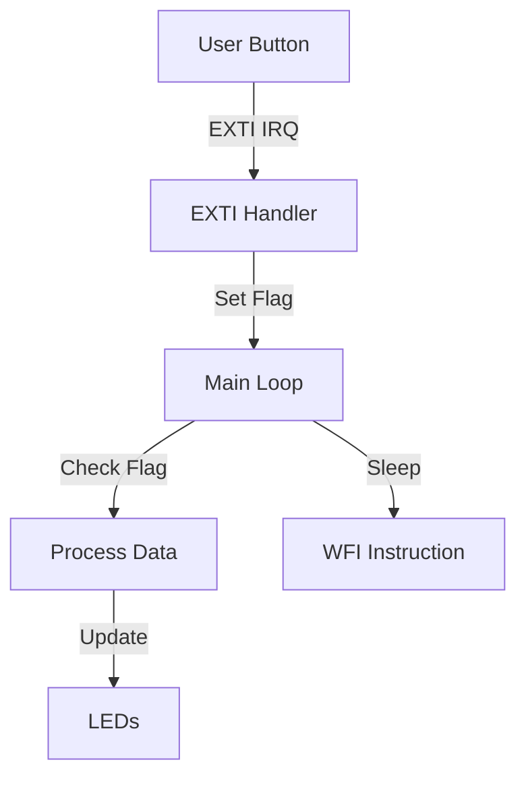

# Day 14: Week 2 Review and Project
## Phase 1: Core Embedded Engineering Foundations | Week 2: ARM Cortex-M Architecture

---

> **📝 Content Creator Instructions:**
> This document is designed to produce **comprehensive, industry-grade educational content**. 
> - **Target Length:** The final filled document should be approximately **1000+ lines** of detailed markdown.
> - **Depth:** Do not skim over details. Explain *why*, not just *how*.
> - **Structure:** If a topic is complex, **DIVIDE IT INTO MULTIPLE PARTS** (Part 1, Part 2, etc.).
> - **Code:** Provide complete, compilable code examples, not just snippets.
> - **Visuals:** Use Mermaid diagrams for flows, architectures, and state machines.

---

## 🎯 Learning Objectives
*By the end of this day, the learner will be able to:*
1.  **Integrate** Week 2 concepts (Cortex-M registers, Exceptions, NVIC, DMA, Memory Map) into a unified system.
2.  **Architect** a non-blocking, interrupt-driven application.
3.  **Debug** complex interactions between ISRs and the main loop.
4.  **Analyze** stack usage and fault scenarios in a real application.
5.  **Deliver** a "Data Acquisition System" project that simulates sensor reading and processing.

---

## 📚 Prerequisites & Preparation
*   **Hardware Required:**
    *   STM32F4 Discovery Board
*   **Software Required:**
    *   VS Code with ARM GCC Toolchain
*   **Prior Knowledge:**
    *   Days 8-13 (Week 2 Content)

---

## 📖 Theoretical Deep Dive

### 🔹 Part 1: System Architecture Review

#### 1.1 The "Super Loop" vs. Event-Driven
*   **Super Loop:** `while(1) { check_sensor(); process(); delay(); }`. Simple, but unresponsive.
*   **Event-Driven:** `while(1) { sleep(); }`. ISRs wake up the CPU, set flags, or put data in queues. The main loop processes the data.

#### 1.2 Critical Sections
When sharing data between Main Loop and ISR, we must protect it.
*   **Atomic Access:** `byte` access is usually atomic. `int` access is atomic on 32-bit bus. `struct` copy is NOT atomic.
*   **Disabling IRQ:** `__disable_irq()` / `__enable_irq()`.

### 🔹 Part 2: Project Architecture

We will build a **Simulated Data Acquisition System**.
*   **Input:** User Button (simulating a "Data Ready" signal from an external ADC).
*   **Processing:** "Filter" the data (math operation).
*   **Output:** LED pattern based on the result.
*   **Constraint:** The CPU must sleep when idle (WFI instruction).



---

## 💻 Implementation: Mini-Project (DAQ System)

> **Project Goal:** 
> 1. Button press triggers EXTI.
> 2. ISR captures a "Timestamp" (SysTick value) and adds it to a circular buffer.
> 3. Main loop detects new data, calculates the difference between the last two timestamps (delta), and displays it on LEDs (binary).
> 4. If delta < 100ms (debounce failure or fast press), trigger a "UsageFault" manually to test the fault handler.

### 🛠️ Hardware/System Configuration
*   **Button:** PA0.
*   **LEDs:** PD12-PD15.

### 👨‍💻 Code Implementation

#### File Structure
*   `main.c`: Application logic.
*   `bsp.c`: Hardware setup.
*   `faults.c`: HardFault handler (from Day 12).

#### Step 1: BSP (`bsp.c`)
```c
#include "stm32f4xx.h"

volatile uint32_t ms_ticks = 0;

void SysTick_Handler(void) {
    ms_ticks++;
}

void BSP_Init(void) {
    // 1. LEDs (PD12-15)
    RCC->AHB1ENR |= (1 << 3);
    GPIOD->MODER |= (0x55 << 24);

    // 2. Button (PA0)
    RCC->AHB1ENR |= (1 << 0);
    RCC->APB2ENR |= (1 << 14); // SYSCFG
    SYSCFG->EXTICR[0] &= ~0xF; // PA0
    EXTI->IMR |= (1 << 0);
    EXTI->RTSR |= (1 << 0);
    NVIC_EnableIRQ(EXTI0_IRQn);

    // 3. SysTick (1ms)
    SysTick_Config(16000000 / 1000); // Assuming 16MHz HSI
    
    // 4. Enable UsageFault
    SCB->SHCSR |= SCB_SHCSR_USGFAULTENA_Msk;
}

void LED_Display(uint8_t val) {
    // Clear PD12-15
    GPIOD->BSRR = (0xF000 << 16);
    // Set bits
    uint32_t set_mask = 0;
    if(val & 1) set_mask |= (1<<12);
    if(val & 2) set_mask |= (1<<13);
    if(val & 4) set_mask |= (1<<14);
    if(val & 8) set_mask |= (1<<15);
    GPIOD->BSRR = set_mask;
}
```

#### Step 2: Main Application (`main.c`)
```c
#include "stm32f4xx.h"
#include "bsp.h"
#include <stdio.h>

#define BUFFER_SIZE 16

volatile uint32_t timestamp_buffer[BUFFER_SIZE];
volatile uint8_t head = 0;
volatile uint8_t tail = 0;

void EXTI0_IRQHandler(void) {
    if (EXTI->PR & (1 << 0)) {
        EXTI->PR |= (1 << 0);
        
        // Add to buffer
        uint8_t next_head = (head + 1) % BUFFER_SIZE;
        if (next_head != tail) {
            timestamp_buffer[head] = ms_ticks;
            head = next_head;
        } else {
            // Buffer Overflow - Optional: Set Error Flag
        }
    }
}

int main(void) {
    BSP_Init();
    
    uint32_t last_process_time = 0;

    while (1) {
        // Check if data available
        if (head != tail) {
            // Critical Section: Read Buffer
            __disable_irq();
            uint32_t current_time = timestamp_buffer[tail];
            tail = (tail + 1) % BUFFER_SIZE;
            __enable_irq();

            uint32_t delta = current_time - last_process_time;
            last_process_time = current_time;

            // Logic Check
            if (delta < 100) {
                // Trigger UsageFault (Divide by Zero)
                SCB->CCR |= SCB_CCR_DIV_0_TRP_Msk;
                volatile int z = 0;
                volatile int crash = 10 / z;
                (void)crash;
            }

            // Display lower 4 bits of delta on LEDs
            LED_Display((uint8_t)delta & 0xF);
        }

        // Sleep until next interrupt
        __asm("wfi");
    }
}
```

---

## 🔬 Lab Exercise: Lab 14.1 - Debugging the Crash

### 1. Lab Objectives
- Verify that pressing the button too fast triggers the UsageFault.
- Use the Fault Handler from Day 12 to identify the line number.

### 2. Step-by-Step Guide

#### Phase A: Setup
Integrate `Fault_Init()` and `HardFault_Handler` from Day 12.

#### Phase B: Execution
1.  Press button slowly (1 sec interval). LEDs should change.
2.  Double-click button rapidly.
3.  System should crash.
4.  Check UART output (if configured) or Debugger.

#### Phase C: Analysis
*   **CFSR:** Should show `DIVBYZERO`.
*   **PC:** Should point to the line `volatile int crash = 10 / z;`.

### 3. Verification
If the system resets instead of halting, check if `UsageFault` was enabled in `SHCSR`.

---

## 🧪 Additional / Advanced Labs

### Lab 2: DMA Integration
- **Goal:** Instead of using `timestamp_buffer` in RAM, use DMA to copy the timestamp to a backup SRAM region (if available) or simulate a transfer to a peripheral.
- **Task:** Trigger a Mem-to-Mem DMA transfer inside the EXTI ISR (careful! ISRs should be short). Better: Set a flag, and trigger DMA in main loop.

### Lab 3: Power Analysis
- **Goal:** Measure current consumption.
- **Task:** Compare current consumption with and without `__asm("wfi")`. Use a multimeter in series with the board's power supply (IDD jumper).

---

## 🐞 Debugging & Troubleshooting

### Common Issues

#### 1. Race Conditions in Ring Buffer
*   **Symptom:** Data corruption or missed events.
*   **Cause:** `head` and `tail` modified by both ISR and Main without protection.
*   **Solution:** We used `__disable_irq()` around the read operation. This is correct.

#### 2. Button Bounce
*   **Symptom:** Multiple events for one press.
*   **Cause:** Mechanical switch.
*   **Solution:** In this project, we *want* the bounce to test the < 100ms logic. In a real app, we would add a software debounce.

---

## ⚡ Optimization & Best Practices

### Code Quality
- **Volatile:** `head`, `tail`, and `timestamp_buffer` must be volatile because they are modified in ISR and read in Main.
- **Modularization:** The `LED_Display` function abstracts the hardware. This is good design.

---

## 🧠 Assessment & Review

### Knowledge Check
1.  **Q:** What does `WFI` do?
    *   **A:** Wait For Interrupt. It stops the CPU clock (saving power) until an interrupt or exception occurs.
2.  **Q:** Why did we enable `SCB_CCR_DIV_0_TRP_Msk`?
    *   **A:** By default, divide-by-zero returns 0 on ARM. We must enable the trap to cause a fault for debugging.

### Challenge Task
> **Task:** Modify the project to use **Priorities**. Add a Timer Interrupt (Priority 2) that blinks a "Heartbeat" LED. Ensure the EXTI Interrupt (Priority 1) can preempt it.

---

## 📚 Further Reading & References
- [Better Embedded System Software (Philip Koopman)](https://users.ece.cmu.edu/~koopman/bess/)
- [Embedded Systems Architecture (Daniele Lacamera)](https://www.packtpub.com/product/embedded-systems-architecture/9781788832502)

---
