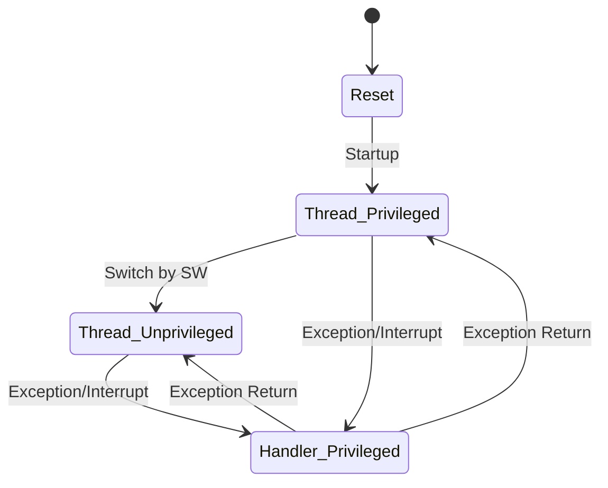

# Day 8: ARM Cortex-M Overview
## Phase 1: Core Embedded Engineering Foundations | Week 2: ARM Cortex-M Architecture

---

> **📝 Content Creator Instructions:**
> This document is designed to produce **comprehensive, industry-grade educational content**. 
> - **Target Length:** The final filled document should be approximately **1000+ lines** of detailed markdown.
> - **Depth:** Do not skim over details. Explain *why*, not just *how*.
> - **Structure:** If a topic is complex, **DIVIDE IT INTO MULTIPLE PARTS** (Part 1, Part 2, etc.).
> - **Code:** Provide complete, compilable code examples, not just snippets.
> - **Visuals:** Use Mermaid diagrams for flows, architectures, and state machines.

---

## 🎯 Learning Objectives
*By the end of this day, the learner will be able to:*
1.  **Distinguish** between the different ARM Cortex profiles (A, R, M) and their use cases.
2.  **Analyze** the key features of the Cortex-M4 processor (Harvard bus, NVIC, FPU).
3.  **Understand** the difference between Thread Mode and Handler Mode.
4.  **Explain** the role of the Memory Protection Unit (MPU) in system stability.
5.  **Identify** the privilege levels (Privileged vs. Unprivileged) and how they enhance security.

---

## 📚 Prerequisites & Preparation
*   **Hardware Required:**
    *   STM32F4 Discovery Board
*   **Software Required:**
    *   VS Code with ARM GCC Toolchain
*   **Prior Knowledge:**
    *   Week 1 concepts (Embedded Systems basics)
*   **Datasheets:**
    *   [ARM Cortex-M4 Generic User Guide](https://developer.arm.com/documentation/dui0553/latest/)

---

## 📖 Theoretical Deep Dive

### 🔹 Part 1: The ARM Ecosystem

#### 1.1 ARM Business Model
ARM (Advanced RISC Machines) does not manufacture chips. They design the *Intellectual Property (IP)*—the processor architecture—and license it to partners like STMicroelectronics, NXP, TI, and Apple. These partners add peripherals (GPIO, UART, Flash) to create a Microcontroller (MCU).

#### 1.2 The Cortex Profiles
*   **Cortex-A (Application):** High performance, MMU (Memory Management Unit) for Linux/Android. Used in Smartphones, Raspberry Pi.
*   **Cortex-R (Real-time):** High reliability, deterministic. Used in Hard Disk Drives, Automotive Braking Systems.
*   **Cortex-M (Microcontroller):** Low power, low cost, deterministic interrupt handling. Used in IoT, Motor Control, Wearables.

#### 1.3 Cortex-M Series Evolution
*   **M0/M0+:** Entry level, 2-stage pipeline, energy efficient. (Replaces 8-bit MCUs).
*   **M3:** Mainstream, hardware divide, bit-banding.
*   **M4:** M3 + DSP (Digital Signal Processing) instructions + FPU (Floating Point Unit). **(Our Focus)**
*   **M7:** High performance, superscalar, cache (L1).

### 🔹 Part 2: Cortex-M4 Architecture Details

#### 2.1 The Bus Matrix
The Cortex-M4 uses a modified Harvard architecture with three main buses:
1.  **I-Code (Instruction):** Fetches instructions from Code memory (Flash).
2.  **D-Code (Data):** Fetches data constants from Code memory.
3.  **System Bus:** Connects to SRAM and Peripherals.

This allows the CPU to fetch an instruction and read data simultaneously, increasing performance.

#### 2.2 Operation Modes
The Cortex-M processor has two modes of operation:
1.  **Thread Mode:** The normal mode where application code runs (e.g., `main()`).
2.  **Handler Mode:** The mode entered when an exception (interrupt) occurs. Code here always runs with *Privileged* access.

#### 2.3 Privilege Levels
1.  **Privileged:** Full access to all instructions and resources (including NVIC and MPU).
2.  **Unprivileged:** Limited access. Cannot disable interrupts or configure the MPU.
    *   *Thread Mode* can be Privileged or Unprivileged.
    *   *Handler Mode* is always Privileged.

**Security Model:** An RTOS typically runs the Kernel in Privileged mode and User Tasks in Unprivileged mode to prevent a buggy task from crashing the system.



### 🔹 Part 3: Memory Protection Unit (MPU)

#### 3.1 What is it?
The MPU is a hardware unit that allows you to divide the memory map into regions and define access permissions (Read/Write/Execute) for each region, separately for Privileged and Unprivileged modes.

#### 3.2 Use Cases
*   **Stack Overflow Detection:** Mark the memory immediately below the stack as "No Access".
*   **Code Protection:** Mark RAM as "No Execute" (XN) to prevent code injection attacks.
*   **Peripheral Protection:** Prevent user tasks from accessing critical hardware registers.

---

## 💻 Implementation: Detecting Privilege Level

> **Instruction:** We will write code to check if we are in Privileged or Unprivileged mode and try to switch modes.

### 🛠️ Hardware/System Configuration
STM32F4 Discovery.

### 👨‍💻 Code Implementation

#### Step 1: Reading the CONTROL Register
The `CONTROL` register determines the privilege level (Bit 0: `nPRIV`).
*   0 = Privileged
*   1 = Unprivileged

We need assembly to read it.

```c
#include <stdint.h>
#include <stdio.h>

// Function to read CONTROL register
uint32_t __get_CONTROL(void) {
    uint32_t result;
    __asm volatile ("MRS %0, control" : "=r" (result) );
    return result;
}

// Function to switch to Unprivileged mode
void SwitchToUnprivileged(void) {
    // Set Bit 0 of CONTROL register
    __asm volatile (
        "MRS r0, CONTROL\n"
        "ORR r0, r0, #1\n"
        "MSR CONTROL, r0\n"
        "ISB\n" // Instruction Synchronization Barrier
    );
}
```

#### Step 2: Main Logic
```c
int main(void) {
    // 1. Check Initial State
    uint32_t ctrl = __get_CONTROL();
    if ((ctrl & 1) == 0) {
        printf("Started in PRIVILEGED mode.\n");
    } else {
        printf("Started in UNPRIVILEGED mode.\n");
    }

    // 2. Switch to Unprivileged
    printf("Switching to Unprivileged...\n");
    SwitchToUnprivileged();

    // 3. Check State Again
    ctrl = __get_CONTROL();
    if ((ctrl & 1) == 1) {
        printf("Now in UNPRIVILEGED mode.\n");
    }

    // 4. Try to Switch Back (Should Fail)
    // Only Privileged code can write to CONTROL to gain privilege.
    // This attempt will be ignored or cause a Fault depending on implementation.
    // To go back, we need to trigger an SVC (Supervisor Call) exception.
    
    while(1);
}
```

---

## 🔬 Lab Exercise: Lab 8.1 - The Forbidden Access

### 1. Lab Objectives
- Demonstrate the difference between Privileged and Unprivileged access.
- Trigger a Hard Fault by trying to access a system register in Unprivileged mode.

### 2. Step-by-Step Guide

#### Phase A: Setup
Use the code from the Implementation section.

#### Phase B: The Experiment
1.  Switch to Unprivileged mode.
2.  Try to disable interrupts using `__disable_irq()` (which executes `CPSID i`).
    *   `CPSID` is a privileged instruction.

```c
void TryDisableIrq(void) {
    __asm volatile ("CPSID i");
}

int main(void) {
    SwitchToUnprivileged();
    
    printf("Attempting to disable IRQ...\n");
    TryDisableIrq(); // This should trigger a Hard Fault!
    
    printf("Success? (You shouldn't see this)\n");
    while(1);
}
```

#### Phase C: Hard Fault Handler
Add a Hard Fault handler to catch the crash.
```c
void HardFault_Handler(void) {
    printf("Hard Fault Detected! System Halted.\n");
    while(1);
}
```

### 3. Verification
Run the code. You should see the "Hard Fault Detected" message (or the debugger stopping in the handler).

---

## 🧪 Additional / Advanced Labs

### Lab 2: MPU Configuration
- **Goal:** Configure the MPU to make a 32-byte region in SRAM Read-Only.
- **Steps:**
    1.  Enable MPU Clock (if needed) and MPU.
    2.  Configure Region 0: Base Address = `&my_const_var`, Size = 32B, Access = RO.
    3.  Try to write to `my_const_var`.
    4.  Observe MemManage Fault.

### Lab 3: FPU Enable
- **Goal:** Verify the Floating Point Unit.
- **Task:**
    1.  Read the `CPACR` (Coprocessor Access Control Register).
    2.  Enable CP10 and CP11 (Full Access).
    3.  Perform a float multiplication `float a = 1.1 * 2.2;`.
    4.  Check assembly to see `VMUL.F32` instruction instead of software library call.

---

## 🐞 Debugging & Troubleshooting

### Common Issues

#### 1. Cannot Switch Back to Privileged
*   **Symptom:** Writing 0 to CONTROL register fails.
*   **Cause:** Security feature. Unprivileged code cannot promote itself.
*   **Solution:** Use an SVC (Supervisor Call) instruction to enter Handler Mode (which is Privileged), and have the handler switch the Thread Mode privilege level.

#### 2. Hard Fault Loop
*   **Symptom:** Debugger stuck in HardFault_Handler.
*   **Cause:** The fault occurred, and the handler is an infinite loop.
*   **Solution:** Inspect the `SCB->HFSR` (Hard Fault Status Register) to know *why* it happened.

---

## ⚡ Optimization & Best Practices

### Performance Optimization
- **FPU Usage:** Always enable the FPU if you are doing math. Software floating point is 10-50x slower.
- **ITM (Instrumentation Trace Macrocell):** Use `printf` via ITM (SWO pin) instead of UART for high-speed, low-overhead logging.

### Code Quality
- **CMSIS Usage:** Always use `__get_CONTROL()`, `__set_CONTROL()` intrinsics provided by `cmsis_gcc.h` instead of inline assembly if possible, for portability.

---

## 🧠 Assessment & Review

### Knowledge Check
1.  **Q:** Which mode does an Interrupt Service Routine (ISR) run in?
    *   **A:** Handler Mode (Always Privileged).
2.  **Q:** What is the purpose of the I-Code bus?
    *   **A:** To fetch instructions from the Code region (Flash) efficiently.

### Challenge Task
> **Task:** Implement a simple "SVC Handler". Trigger `SVC #0` from Unprivileged code. In the handler, print "Hello from Kernel" and return.

---

## 📚 Further Reading & References
- [ARM Cortex-M Programming Guide to Memory Barrier Instructions](https://developer.arm.com/documentation/dai0321/latest/)
- [Using the Cortex-M3/M4 MPU](https://www.keil.com/appnotes/files/apnt_209.pdf)

---
