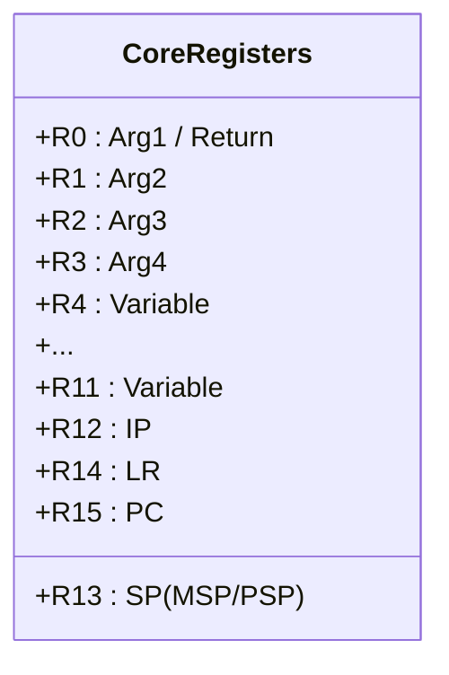

# Day 9: Cortex-M Registers and Instruction Set
## Phase 1: Core Embedded Engineering Foundations | Week 2: ARM Cortex-M Architecture

---

> **📝 Content Creator Instructions:**
> This document is designed to produce **comprehensive, industry-grade educational content**. 
> - **Target Length:** The final filled document should be approximately **1000+ lines** of detailed markdown.
> - **Depth:** Do not skim over details. Explain *why*, not just *how*.
> - **Structure:** If a topic is complex, **DIVIDE IT INTO MULTIPLE PARTS** (Part 1, Part 2, etc.).
> - **Code:** Provide complete, compilable code examples, not just snippets.
> - **Visuals:** Use Mermaid diagrams for flows, architectures, and state machines.

---

## 🎯 Learning Objectives
*By the end of this day, the learner will be able to:*
1.  **Map** the ARM Cortex-M register file (R0-R15) and understand the role of each register.
2.  **Differentiate** between the Main Stack Pointer (MSP) and Process Stack Pointer (PSP).
3.  **Trace** the Link Register (LR) behavior during function calls and exceptions.
4.  **Decode** the Program Status Register (PSR) flags (N, Z, C, V).
5.  **Write** basic inline assembly to manipulate registers directly.

---

## 📚 Prerequisites & Preparation
*   **Hardware Required:**
    *   STM32F4 Discovery Board
*   **Software Required:**
    *   VS Code with ARM GCC Toolchain
    *   GDB (Essential for this day)
*   **Prior Knowledge:**
    *   Day 8 (Architecture Overview)

---

## 📖 Theoretical Deep Dive

### 🔹 Part 1: The Register File (R0-R15)

The Cortex-M processor has 16 core registers, each 32 bits wide.

#### 1.1 General Purpose Registers (R0-R12)
*   **Low Registers (R0-R7):** Accessible by all 16-bit Thumb instructions.
*   **High Registers (R8-R12):** Accessible by fewer 16-bit instructions, mostly used by 32-bit Thumb-2 instructions.
*   **Usage Convention (AAPCS):**
    *   **R0-R3:** Argument / Result registers. Used to pass parameters to functions and return values. **Caller-saved** (Scratch).
    *   **R4-R11:** Variable registers. **Callee-saved** (Must be preserved by the function).
    *   **R12 (IP):** Intra-Procedure-call scratch register.

#### 1.2 Special Registers (R13-R15)
*   **R13 (SP - Stack Pointer):** Points to the top of the stack.
    *   **MSP (Main Stack Pointer):** Used by OS Kernel and Exception Handlers.
    *   **PSP (Process Stack Pointer):** Used by User Tasks (Thread Mode).
    *   *Why two?* So a user task blowing its stack doesn't crash the Kernel/Interrupts.
*   **R14 (LR - Link Register):** Stores the return address when a function is called (`BL` instruction).
*   **R15 (PC - Program Counter):** Points to the *next* instruction to be fetched.
    *   *Note:* Due to pipelining, reading PC often returns `Current Address + 4`.



### 🔹 Part 2: Program Status Register (xPSR)

The PSR is a composite of three registers:
1.  **APSR (Application PSR):** ALU flags.
    *   **N (Negative):** Result was negative.
    *   **Z (Zero):** Result was zero.
    *   **C (Carry):** Unsigned overflow / Carry out.
    *   **V (Overflow):** Signed overflow.
2.  **IPSR (Interrupt PSR):** Contains the Exception Number of the current ISR (0 = Thread Mode).
3.  **EPSR (Execution PSR):** Execution state (Thumb bit).
    *   **T Bit:** Must always be 1 for Cortex-M (Thumb mode). If 0, Hard Fault.

### 🔹 Part 3: Thumb-2 Instruction Set

Cortex-M uses the Thumb-2 instruction set, a mix of 16-bit and 32-bit instructions.
*   **16-bit:** Compact code size (e.g., `MOV r0, #1`).
*   **32-bit:** High performance (e.g., `MOV.W r0, #0x12345678`).

**Common Instructions:**
*   `MOV Rd, Rn`: Move data.
*   `LDR Rd, [Rn, #offset]`: Load Register from memory.
*   `STR Rd, [Rn, #offset]`: Store Register to memory.
*   `ADD`, `SUB`, `MUL`: Arithmetic.
*   `B label`: Branch (Jump).
*   `BL label`: Branch with Link (Call function).
*   `BX Rm`: Branch and Exchange (Return).

---

## 💻 Implementation: Assembly in C

> **Instruction:** We will use Inline Assembly to observe register behavior that is normally hidden by the C compiler.

### 🛠️ Hardware/System Configuration
STM32F4 Discovery.

### 👨‍💻 Code Implementation

#### Step 1: Basic Register Manipulation
```c
#include <stdint.h>
#include <stdio.h>

void asm_demo(void) {
    int val1 = 10;
    int val2 = 20;
    int result;

    // Inline Assembly
    // Syntax: "instruction" : output : input : clobber
    __asm volatile (
        "MOV r0, %1\n"      // Move val1 into R0
        "MOV r1, %2\n"      // Move val2 into R1
        "ADD r0, r0, r1\n"  // R0 = R0 + R1
        "MOV %0, r0\n"      // Move R0 into result
        : "=r" (result)     // Output
        : "r" (val1), "r" (val2) // Inputs
        : "r0", "r1"        // Clobbered registers
    );

    printf("10 + 20 = %d\n", result);
}
```

#### Step 2: Accessing Special Registers
```c
uint32_t get_PSP(void) {
    uint32_t result;
    __asm volatile ("MRS %0, psp" : "=r" (result) );
    return result;
}

uint32_t get_MSP(void) {
    uint32_t result;
    __asm volatile ("MRS %0, msp" : "=r" (result) );
    return result;
}

void print_stacks(void) {
    printf("MSP: 0x%08X\n", get_MSP());
    printf("PSP: 0x%08X\n", get_PSP());
}
```

---

## 🔬 Lab Exercise: Lab 9.1 - Stack Frame Analysis

### 1. Lab Objectives
- Observe how the stack grows.
- Identify the Stack Frame created during a function call.

### 2. Step-by-Step Guide

#### Phase A: Code
```c
void leaf_function(int a, int b, int c, int d) {
    int local_var = 0xDEADBEEF;
    // Breakpoint here
}

int main(void) {
    leaf_function(1, 2, 3, 4);
    while(1);
}
```

#### Phase B: Debugging (GDB)
1.  Compile with `-g -O0`.
2.  Run in GDB. Set breakpoint inside `leaf_function`.
3.  Run `info registers sp`. Note the address.
4.  Run `x/8x $sp`. Inspect memory at SP.

#### Phase C: Analysis
You should see:
*   The arguments (if they didn't fit in R0-R3).
*   The return address (LR) pushed to stack? (Only if `leaf_function` calls another function).
*   The local variable `0xDEADBEEF`.

**Note:** In AAPCS, R0-R3 pass the first 4 arguments. If there were 5 arguments, the 5th would be on the stack.

---

## 🧪 Additional / Advanced Labs

### Lab 2: The 5th Argument
- **Goal:** Verify AAPCS argument passing.
- **Task:**
    1.  Create a function `void test(int a, int b, int c, int d, int e)`.
    2.  Call it `test(1, 2, 3, 4, 5)`.
    3.  In assembly, check where `5` is stored. It should be at `[SP]`.

### Lab 3: Manual Context Switch (Intro)
- **Goal:** Save R4-R11 to stack manually.
- **Task:** Write an assembly function that pushes R4-R11 to the stack (`STMDB sp!, {r4-r11}`) and then pops them back (`LDMIA sp!, {r4-r11}`). Verify SP changes by 32 bytes (8 regs * 4 bytes).

---

## 🐞 Debugging & Troubleshooting

### Common Issues

#### 1. Stack Overflow
*   **Symptom:** SP points to invalid memory or overwrites static variables.
*   **Cause:** Deep recursion or large local arrays (`int buf[10000]`).
*   **Solution:** Increase stack size in linker script or use static allocation.

#### 2. Hard Fault on Return
*   **Symptom:** Crash when a function returns.
*   **Cause:** Stack corruption. The return address (LR) saved on the stack was overwritten by a buffer overflow.
*   **Solution:** Check array bounds of local variables.

---

## ⚡ Optimization & Best Practices

### Performance Optimization
- **Leaf Functions:** Functions that don't call other functions are faster because they don't need to save LR to the stack.
- **Register Variables:** Use `register int x` to hint the compiler (though modern compilers are usually smarter than you).

### Code Quality
- **Avoid Inline Assembly:** Unless absolutely necessary (like accessing SP/PSP). It makes code non-portable to other architectures (e.g., RISC-V).

---

## 🧠 Assessment & Review

### Knowledge Check
1.  **Q:** What happens to R0-R3 when a function returns?
    *   **A:** Their values are undefined (scratch registers), except R0 which holds the return value.
2.  **Q:** Why is the LSB of the PC always 1 in Cortex-M?
    *   **A:** To indicate Thumb mode. If it's 0, the processor attempts to switch to ARM mode, which Cortex-M doesn't support, causing a Hard Fault.

### Challenge Task
> **Task:** Write a function `uint32_t get_PC(void)` using inline assembly.
> **Hint:** `MOV r0, pc`. Remember the PC pipeline offset!

---

## 📚 Further Reading & References
- [Procedure Call Standard for the Arm Architecture (AAPCS)](https://github.com/ARM-software/abi-aa/blob/main/aapcs32/aapcs32.rst)
- [ARMv7-M Architecture Reference Manual](https://developer.arm.com/documentation/ddi0403/latest/)

---
