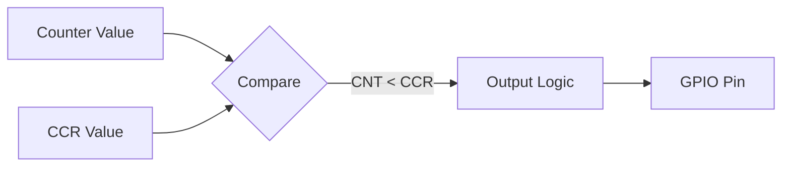

# Day 17: PWM Generation
## Phase 1: Core Embedded Engineering Foundations | Week 3: Timers and GPIO

---

> **📝 Content Creator Instructions:**
> This document is designed to produce **comprehensive, industry-grade educational content**. 
> - **Target Length:** The final filled document should be approximately **1000+ lines** of detailed markdown.
> - **Depth:** Do not skim over details. Explain *why*, not just *how*.
> - **Structure:** If a topic is complex, **DIVIDE IT INTO MULTIPLE PARTS** (Part 1, Part 2, etc.).
> - **Code:** Provide complete, compilable code examples, not just snippets.
> - **Visuals:** Use Mermaid diagrams for flows, architectures, and state machines.

---

## 🎯 Learning Objectives
*By the end of this day, the learner will be able to:*
1.  **Explain** the principles of Pulse Width Modulation (Frequency vs. Duty Cycle).
2.  **Configure** STM32 Timers in Output Compare (PWM) Mode.
3.  **Calculate** register values for specific servo motor control signals (50Hz).
4.  **Implement** a "Breathing LED" effect using smooth duty cycle updates.
5.  **Control** an RGB LED using three independent PWM channels.

---

## 📚 Prerequisites & Preparation
*   **Hardware Required:**
    *   STM32F4 Discovery Board
    *   LEDs (External or On-board)
    *   Servo Motor (Optional)
*   **Software Required:**
    *   VS Code with ARM GCC Toolchain
*   **Prior Knowledge:**
    *   Day 16 (Timer Basics)
    *   Day 15 (Alternate Functions)
*   **Datasheets:**
    *   [STM32F407 Reference Manual (Timer PWM Section)](https://www.st.com/resource/en/reference_manual/dm00031020.pdf)

---

## 📖 Theoretical Deep Dive

### 🔹 Part 1: PWM Fundamentals

#### 1.1 What is PWM?
PWM is a technique to control analog devices (LED brightness, Motor speed) using a digital signal.
*   **Period (T):** The time for one complete cycle.
*   **Frequency (f):** $1/T$. How fast the cycle repeats.
*   **Duty Cycle (D):** The percentage of time the signal is High.
    *   $V_{avg} = V_{DD} \times D$

#### 1.2 Output Compare Mode
The Timer compares the Counter (`CNT`) with a Capture/Compare Register (`CCR`).
*   **PWM Mode 1:** Output is High when `CNT < CCR`, Low when `CNT >= CCR`.
*   **PWM Mode 2:** Output is Low when `CNT < CCR`, High when `CNT >= CCR`.



### 🔹 Part 2: STM32 PWM Configuration

To output PWM on a pin, we need:
1.  **GPIO:** Configure pin as Alternate Function (AF).
2.  **Timer Base:** Configure `PSC` and `ARR` for Frequency.
3.  **Output Channel:** Configure `CCMR` (Capture/Compare Mode Register) for PWM Mode.
4.  **Enable Output:** Set `CCER` (Capture/Compare Enable Register).

**Example: Servo Motor**
*   Target: 50 Hz (20ms period).
*   Clock: 1 MHz (1 us ticks).
*   ARR: 19999 (20000 ticks = 20ms).
*   CCR: 1500 (1.5ms pulse = Center position).

---

## 💻 Implementation: Breathing LED

> **Instruction:** We will use TIM4 Channel 1 (connected to PD12 on Discovery Board) to fade the Green LED in and out.

### 🛠️ Hardware/System Configuration
*   **Pin:** PD12 (Green LED).
*   **AF Mapping:** PD12 -> AF2 (TIM4_CH1).

### 👨‍💻 Code Implementation

#### Step 1: Initialization (`pwm.c`)

```c
#include "stm32f4xx.h"

void PWM_Init(void) {
    // 1. Enable Clocks
    RCC->AHB1ENR |= (1 << 3); // GPIOD
    RCC->APB1ENR |= (1 << 2); // TIM4

    // 2. Configure PD12 as AF
    GPIOD->MODER &= ~(0x3 << 24); // Clear
    GPIOD->MODER |= (0x2 << 24);  // AF Mode
    
    // 3. Select AF2 for PD12 (AFR[1] is for pins 8-15)
    // PD12 is in AFRH (AFR[1]). 12 - 8 = 4. 4 * 4 bits = 16.
    GPIOD->AFR[1] &= ~(0xF << 16);
    GPIOD->AFR[1] |= (0x2 << 16); // AF2

    // 4. Configure Timer Base
    // F_APB1 = 16 MHz.
    // We want 1 kHz PWM (1ms period).
    TIM4->PSC = 15; // 1 MHz ticks
    TIM4->ARR = 999; // 1000 ticks = 1ms

    // 5. Configure Channel 1 as PWM Mode 1
    // CCMR1 controls CH1 and CH2.
    // OC1M (Output Compare 1 Mode) bits 6:4 = 110 (PWM Mode 1)
    // OC1PE (Preload Enable) bit 3 = 1
    TIM4->CCMR1 |= (6 << 4) | (1 << 3);

    // 6. Enable Output 1
    // CCER bit 0 (CC1E)
    TIM4->CCER |= (1 << 0);

    // 7. Start Timer
    TIM4->CR1 |= (1 << 0);
}
```

#### Step 2: Main Loop (Breathing Effect)
```c
void Delay_ms(uint32_t ms); // Assume implemented

int main(void) {
    PWM_Init();
    
    int brightness = 0;
    int step = 10;

    while(1) {
        // Update Duty Cycle
        TIM4->CCR1 = brightness;
        
        // Logic
        brightness += step;
        if (brightness >= 1000 || brightness <= 0) {
            step = -step; // Reverse direction
        }
        
        Delay_ms(10); // Smooth transition
    }
}
```

---

## 🔬 Lab Exercise: Lab 17.1 - Servo Control

### 1. Lab Objectives
- Generate a precise 50Hz signal to control a standard hobby servo.
- Map 0-180 degrees to 1ms-2ms pulse width.

### 2. Step-by-Step Guide

#### Phase A: Calculation
*   Clock: 16 MHz.
*   PSC: 15 (-> 1 MHz, 1us resolution).
*   ARR: 19999 (-> 20ms period).

#### Phase B: Coding
```c
void Servo_Init(void) {
    // ... (Similar setup to PWM_Init) ...
    TIM4->PSC = 15;
    TIM4->ARR = 19999;
}

void Servo_SetAngle(uint8_t angle) {
    // Map 0-180 to 1000-2000 us
    // 0 deg -> 1000 us
    // 180 deg -> 2000 us
    // slope = 1000 / 180 = 5.55
    uint32_t pulse = 1000 + (angle * 1000 / 180);
    TIM4->CCR1 = pulse;
}
```

#### Phase C: Testing
Sweep the servo from 0 to 180 and back.

### 3. Verification
Use an oscilloscope to verify the pulse width is exactly 1ms at 0 degrees and 2ms at 180 degrees.

---

## 🧪 Additional / Advanced Labs

### Lab 2: RGB LED Controller
- **Goal:** Control color mixing.
- **Task:**
    1.  Use TIM4 CH1 (Red), CH2 (Green), CH3 (Blue).
    2.  Implement `SetColor(r, g, b)`.
    3.  Cycle through the color wheel.

### Lab 3: Audio Generation (DAC via PWM)
- **Goal:** Play a tone.
- **Task:**
    1.  Set PWM frequency to 44.1 kHz.
    2.  Use a Timer Interrupt to update `CCR` with sine wave samples every cycle.
    3.  Connect an RC Low-Pass Filter to the pin to smooth the PWM into analog audio.

---

## 🐞 Debugging & Troubleshooting

### Common Issues

#### 1. LED Not Fading
*   **Cause:** `ARR` too small (frequency too high for eye to see, or resolution too low).
*   **Solution:** Ensure `ARR` > 100 for decent resolution.

#### 2. Glitches on Duty Cycle Change
*   **Cause:** Preload not enabled (`OC1PE`).
*   **Detail:** If you write to `CCR` while the counter is near the match value, you might miss a match or get a double match.
*   **Solution:** Always enable Preload.

#### 3. Pin Stuck High/Low
*   **Cause:** `MOE` (Main Output Enable) bit in `BDTR` register not set (Only for Advanced Timers TIM1/TIM8).
*   **Solution:** For TIM1/TIM8, you MUST set `TIM1->BDTR |= (1<<15);`.

---

## ⚡ Optimization & Best Practices

### Performance Optimization
- **Center-Aligned Mode:** Reduces EMI and current ripples in motor control applications compared to Edge-Aligned mode.

### Code Quality
- **Resolution:** Higher `ARR` = Higher Resolution.
    *   ARR=99 -> 1% steps.
    *   ARR=9999 -> 0.01% steps.
    *   Trade-off: Higher ARR means Lower Frequency (for fixed clock).

---

## 🧠 Assessment & Review

### Knowledge Check
1.  **Q:** What is the resolution of a PWM signal if ARR = 99?
    *   **A:** 100 steps (0 to 99). 1%.
2.  **Q:** Why do we need a Low Pass Filter for Audio PWM?
    *   **A:** To remove the high-frequency carrier wave (the PWM frequency) and leave only the average voltage (the audio signal).

### Challenge Task
> **Task:** Implement "Complementary PWM" using TIM1. CH1 is PWM, CH1N is the inverted PWM. Add Dead-Time to prevent shoot-through currents (simulating an H-Bridge driver).

---

## 📚 Further Reading & References
- [STM32 PWM Tutorial](https://deepbluembedded.com/stm32-pwm-example-timer-pwm-mode-tutorial/)
- [Motor Control with STM32 Timers](https://www.st.com/resource/en/application_note/dm00119036-general-purpose-timer-cookbook-stmicroelectronics.pdf)

---
