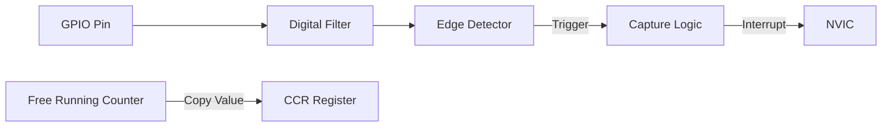

# Day 18: Input Capture
## Phase 1: Core Embedded Engineering Foundations | Week 3: Timers and GPIO

---

> **📝 Content Creator Instructions:**
> This document is designed to produce **comprehensive, industry-grade educational content**. 
> - **Target Length:** The final filled document should be approximately **1000+ lines** of detailed markdown.
> - **Depth:** Do not skim over details. Explain *why*, not just *how*.
> - **Structure:** If a topic is complex, **DIVIDE IT INTO MULTIPLE PARTS** (Part 1, Part 2, etc.).
> - **Code:** Provide complete, compilable code examples, not just snippets.
> - **Visuals:** Use Mermaid diagrams for flows, architectures, and state machines.

---

## 🎯 Learning Objectives
*By the end of this day, the learner will be able to:*
1.  **Explain** the Input Capture mechanism and how it differs from GPIO interrupts.
2.  **Configure** a Timer to capture the counter value on rising/falling edges.
3.  **Measure** the frequency and duty cycle of an external signal.
4.  **Implement** an Ultrasonic Distance Sensor (HC-SR04) driver using Input Capture.
5.  **Handle** timer overflows when measuring long pulses.

---

## 📚 Prerequisites & Preparation
*   **Hardware Required:**
    *   STM32F4 Discovery Board
    *   Signal Generator (or another MCU generating PWM)
    *   HC-SR04 Ultrasonic Sensor (Optional)
*   **Software Required:**
    *   VS Code with ARM GCC Toolchain
*   **Prior Knowledge:**
    *   Day 16 (Timer Basics)
    *   Day 11 (Interrupts)
*   **Datasheets:**
    *   [STM32F407 Reference Manual (Input Capture Section)](https://www.st.com/resource/en/reference_manual/dm00031020.pdf)

---

## 📖 Theoretical Deep Dive

### 🔹 Part 1: Input Capture Basics

#### 1.1 The Concept
Input Capture allows the timer to "snapshot" the value of the counter (`CNT`) into a capture register (`CCR`) when an external event (edge) occurs on a pin.
*   **Precision:** Unlike GPIO interrupts, which have software latency (stacking, vector fetch), Input Capture is handled by hardware. The captured value represents the *exact* moment the edge occurred.

#### 1.2 Architecture
1.  **Input Filter:** Removes noise (glitches).
2.  **Edge Detector:** Selects Rising, Falling, or Both edges.
3.  **Prescaler:** Can capture every Nth event (e.g., measure high speed fans).
4.  **Capture Register:** Stores the timestamp.



### 🔹 Part 2: Measuring Pulse Width

To measure the width of a pulse:
1.  Configure Capture on **Rising Edge**.
2.  On Interrupt:
    *   Save `CCR` value as $t_1$.
    *   Change polarity to **Falling Edge**.
3.  On next Interrupt:
    *   Save `CCR` value as $t_2$.
    *   Width = $t_2 - t_1$.
    *   Change polarity back to Rising.

**The Overflow Problem:**
If the timer overflows (rolls over from ARR to 0) between $t_1$ and $t_2$, the calculation is wrong.
*   *Solution:* Count overflows. Width = $(t_2 - t_1) + (Overflows \times ARR)$.

---

## 💻 Implementation: Frequency Counter

> **Instruction:** We will measure the frequency of a signal connected to PA0 (TIM2_CH1).

### 🛠️ Hardware/System Configuration
*   **Input:** PA0 (TIM2_CH1).
*   **Signal Source:** Connect PD12 (PWM from Day 17) to PA0.

### 👨‍💻 Code Implementation

#### Step 1: Initialization (`ic.c`)

```c
#include "stm32f4xx.h"

void InputCapture_Init(void) {
    // 1. Enable Clocks
    RCC->AHB1ENR |= (1 << 0); // GPIOA
    RCC->APB1ENR |= (1 << 0); // TIM2

    // 2. Configure PA0 as AF1 (TIM2_CH1)
    GPIOA->MODER |= (2 << 0);
    GPIOA->AFR[0] |= (1 << 0);

    // 3. Configure Timer Base
    TIM2->PSC = 15; // 1 MHz ticks (1 us)
    TIM2->ARR = 0xFFFFFFFF; // Max range

    // 4. Configure Input Capture Channel 1
    // CCMR1: CC1S = 01 (Input TI1)
    TIM2->CCMR1 |= (1 << 0);

    // 5. Configure Edge (Rising)
    // CCER: CC1P=0, CC1NP=0
    TIM2->CCER &= ~(0xA);

    // 6. Enable Capture
    TIM2->CCER |= (1 << 0);

    // 7. Enable Interrupt
    TIM2->DIER |= (1 << 1); // CC1IE (Capture/Compare 1 Interrupt Enable)
    NVIC_EnableIRQ(TIM2_IRQn);

    // 8. Start Timer
    TIM2->CR1 |= (1 << 0);
}
```

#### Step 2: Interrupt Handler
```c
volatile uint32_t last_capture = 0;
volatile uint32_t current_capture = 0;
volatile uint32_t period = 0;
volatile uint32_t frequency = 0;

void TIM2_IRQHandler(void) {
    if (TIM2->SR & (1 << 1)) { // CC1IF
        TIM2->SR &= ~(1 << 1); // Clear Flag
        
        last_capture = current_capture;
        current_capture = TIM2->CCR1;
        
        if (current_capture >= last_capture) {
            period = current_capture - last_capture;
        } else {
            // Handle 32-bit Rollover
            period = (0xFFFFFFFF - last_capture) + current_capture + 1;
        }
        
        if (period > 0) {
            frequency = 1000000 / period; // f = 1/T
        }
    }
}
```

#### Step 3: Main Loop
```c
#include <stdio.h>

int main(void) {
    InputCapture_Init();
    // Setup PWM on another pin to test...
    
    while(1) {
        printf("Freq: %lu Hz\n", frequency);
        for(int i=0; i<1000000; i++); // Delay
    }
}
```

---

## 🔬 Lab Exercise: Lab 18.1 - Ultrasonic Sensor (HC-SR04)

### 1. Lab Objectives
- Interface with an HC-SR04 sensor.
- Trigger a measurement and measure the echo pulse width.

### 2. Step-by-Step Guide

#### Phase A: Protocol
1.  Send 10us HIGH pulse on TRIG pin.
2.  Sensor sends HIGH pulse on ECHO pin. Length proportional to distance.
3.  Distance (cm) = Width (us) / 58.

#### Phase B: Coding
1.  **TRIG:** GPIO Output (e.g., PA1).
2.  **ECHO:** Input Capture (PA0 / TIM2_CH1).
3.  **Logic:**
    *   Pulse TRIG.
    *   Wait for Rising Edge on ECHO -> Record $t_1$.
    *   Wait for Falling Edge on ECHO -> Record $t_2$.
    *   Calculate Distance.

#### Phase C: Implementation Detail
Use `TIM2->CCER` to toggle polarity inside the ISR.
```c
void TIM2_IRQHandler(void) {
    if (TIM2->SR & (1 << 1)) {
        TIM2->SR &= ~(1 << 1);
        
        if (IsRisingEdge) {
            t1 = TIM2->CCR1;
            // Switch to Falling Edge
            TIM2->CCER |= (1 << 1); // CC1P = 1
            IsRisingEdge = 0;
        } else {
            t2 = TIM2->CCR1;
            width = t2 - t1;
            // Switch to Rising Edge
            TIM2->CCER &= ~(1 << 1); // CC1P = 0
            IsRisingEdge = 1;
            DataReady = 1;
        }
    }
}
```

### 3. Verification
Move an object in front of the sensor and verify the distance via printf.

---

## 🧪 Additional / Advanced Labs

### Lab 2: PWM Input Mode
- **Goal:** Measure Frequency AND Duty Cycle simultaneously using hardware.
- **Feature:** STM32 timers have a special "PWM Input Mode".
- **Task:**
    1.  Map TI1 to CCR1 (Rising Edge).
    2.  Map TI1 to CCR2 (Falling Edge).
    3.  Configure Slave Mode Controller to Reset Counter on TI1 Rising Edge.
    4.  Result: CCR1 = Period, CCR2 = Pulse Width. No CPU math needed!

### Lab 3: IR Remote Decoder
- **Goal:** Decode signals from a TV remote (NEC Protocol).
- **Task:** Measure the distance between pulses to decode 0s and 1s.

---

## 🐞 Debugging & Troubleshooting

### Common Issues

#### 1. Noise / Jitter
*   **Symptom:** Frequency readings jump around.
*   **Cause:** Noisy signal triggering false edges.
*   **Solution:** Enable the Digital Filter in `CCMR1` (`IC1F` bits). It requires N consecutive samples to validate an edge.

#### 2. Overflow Handling
*   **Symptom:** Period is massive occasionally.
*   **Cause:** Timer overflowed multiple times between edges.
*   **Solution:** Enable Update Interrupt (`UIE`) to count overflows and add `OverflowCount * ARR` to the result.

---

## ⚡ Optimization & Best Practices

### Performance Optimization
- **DMA:** Use DMA to transfer captured values to a buffer. Useful for analyzing high-speed signal trains (like IR codes) without interrupting the CPU for every edge.

### Code Quality
- **Timeout:** Always implement a timeout. If the signal stops (wire cut), the code shouldn't hang waiting for the next edge.

---

## 🧠 Assessment & Review

### Knowledge Check
1.  **Q:** What is the difference between Input Capture and External Interrupt (EXTI)?
    *   **A:** EXTI triggers code execution but doesn't capture the timer value. Input Capture hardware-latches the timer value instantly, providing much higher timing accuracy.
2.  **Q:** How does PWM Input Mode work?
    *   **A:** It uses two capture channels on the same input pin: one for period (Reset trigger) and one for pulse width.

### Challenge Task
> **Task:** Build a "Guitar Tuner". Amplify a microphone signal, feed it to the Input Capture pin, measure the frequency, and light up LEDs to indicate if the note is Flat, Sharp, or In Tune (e.g., A4 = 440Hz).

---

## 📚 Further Reading & References
- [STM32 Input Capture Application Note](https://www.st.com/resource/en/application_note/dm00236305-general-purpose-timer-cookbook-stmicroelectronics.pdf)

---
