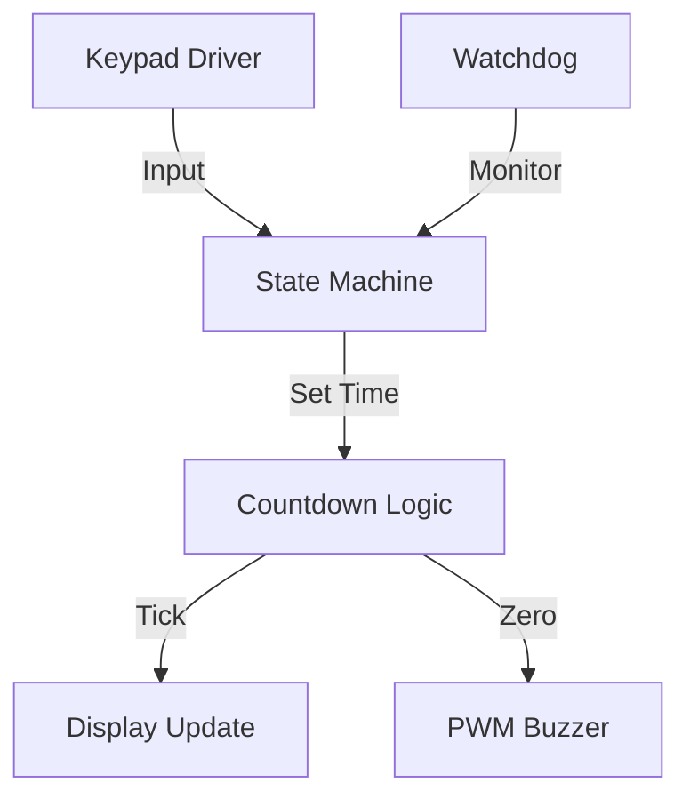

# Day 21: Week 3 Review and Project
## Phase 1: Core Embedded Engineering Foundations | Week 3: Timers and GPIO

---

> **📝 Content Creator Instructions:**
> This document is designed to produce **comprehensive, industry-grade educational content**. 
> - **Target Length:** The final filled document should be approximately **1000+ lines** of detailed markdown.
> - **Depth:** Do not skim over details. Explain *why*, not just *how*.
> - **Structure:** If a topic is complex, **DIVIDE IT INTO MULTIPLE PARTS** (Part 1, Part 2, etc.).
> - **Code:** Provide complete, compilable code examples, not just snippets.
> - **Visuals:** Use Mermaid diagrams for flows, architectures, and state machines.

---

## 🎯 Learning Objectives
*By the end of this day, the learner will be able to:*
1.  **Synthesize** Week 3 concepts (Timers, PWM, Input Capture, GPIO, Watchdogs, RTC) into a complex system.
2.  **Architect** a multi-peripheral application with non-blocking logic.
3.  **Debug** resource conflicts (e.g., Timer channels sharing pins).
4.  **Implement** a "Smart Kitchen Timer" with display, input, and alarm features.
5.  **Conduct** a self-assessment of Week 3 knowledge.

---

## 📚 Prerequisites & Preparation
*   **Hardware Required:**
    *   STM32F4 Discovery Board
    *   4x4 Keypad (from Day 15)
    *   Buzzer (PWM)
    *   LEDs
*   **Software Required:**
    *   VS Code with ARM GCC Toolchain
*   **Prior Knowledge:**
    *   Days 15-20 (Week 3 Content)

---

## 📖 Theoretical Deep Dive

### 🔹 Part 1: System Integration Challenges

#### 1.1 Pin Conflicts
When combining multiple features, you often run out of pins or timers.
*   **Example:** You want PWM on PA0 (TIM2_CH1) but also Input Capture on PA0 (TIM2_CH1).
*   **Solution:** Remap pins (Alternate Functions) or use a different Timer.

#### 1.2 Interrupt Priority Management
*   **Scenario:** High-speed Input Capture (100 kHz) vs. Low-speed UI update (10 Hz).
*   **Strategy:** Give Input Capture higher priority (lower number) to prevent missing edges.

### 🔹 Part 2: Project Architecture

We will build a **Smart Kitchen Timer**.
*   **Input:** Keypad (Set time in Minutes:Seconds).
*   **Display:** UART (Print "MM:SS").
*   **Countdown:** RTC or General Purpose Timer.
*   **Alarm:** PWM Buzzer (Variable tone).
*   **Safety:** IWDG (Reset if system hangs).



---

## 💻 Implementation: Smart Kitchen Timer

> **Project Goal:**
> 1.  **Idle Mode:** Wait for Keypad input (e.g., "0", "5", "0", "#" -> 05:00).
> 2.  **Run Mode:** Count down every second. Print to UART.
> 3.  **Alarm Mode:** Beep Buzzer (PWM) when time is up.
> 4.  **Watchdog:** Refresh IWDG in main loop.

### 🛠️ Hardware/System Configuration
*   **Keypad:** GPIOE (Rows/Cols).
*   **Buzzer:** PB6 (TIM4_CH1).
*   **UART:** PA2/PA3 (USART2).

### 👨‍💻 Code Implementation

#### Step 1: Drivers (Reuse/Refine)
Assume `Keypad_Init`, `Keypad_Scan`, `PWM_Init` (for Buzzer), `UART_Init` are available.

#### Step 2: Timer Logic (`main.c`)

```c
#include "stm32f4xx.h"
#include <stdio.h>
#include "keypad.h"
#include "pwm.h"
#include "uart.h"

// State Machine
typedef enum {
    STATE_IDLE,
    STATE_INPUT,
    STATE_RUN,
    STATE_ALARM
} State_t;

State_t current_state = STATE_IDLE;
uint32_t total_seconds = 0;
char input_buffer[5]; // "MMSS"
uint8_t input_idx = 0;

// 1Hz Timer Interrupt (TIM2)
void TIM2_Init(void) {
    RCC->APB1ENR |= (1 << 0);
    TIM2->PSC = 15999; // 1kHz
    TIM2->ARR = 999;   // 1Hz
    TIM2->DIER |= (1 << 0); // UIE
    NVIC_EnableIRQ(TIM2_IRQn);
    TIM2->CR1 |= (1 << 0);
}

void TIM2_IRQHandler(void) {
    if (TIM2->SR & (1 << 0)) {
        TIM2->SR &= ~(1 << 0);
        
        if (current_state == STATE_RUN) {
            if (total_seconds > 0) {
                total_seconds--;
                printf("Time: %02lu:%02lu\r", total_seconds / 60, total_seconds % 60);
            } else {
                current_state = STATE_ALARM;
            }
        }
    }
}

int main(void) {
    // Init Drivers
    Keypad_Init();
    PWM_Init(); // Buzzer off initially
    UART_Init();
    TIM2_Init();
    
    // Init Watchdog (2s timeout)
    IWDG->KR = 0x5555;
    IWDG->PR = 4;
    IWDG->RLR = 1000;
    IWDG->KR = 0xCCCC;

    printf("Kitchen Timer Ready.\n");

    while(1) {
        IWDG->KR = 0xAAAA; // Kick Dog

        char key = Keypad_Scan();
        
        switch(current_state) {
            case STATE_IDLE:
                if (key >= '0' && key <= '9') {
                    input_idx = 0;
                    input_buffer[input_idx++] = key;
                    printf("Input: %c", key);
                    current_state = STATE_INPUT;
                }
                break;

            case STATE_INPUT:
                if (key >= '0' && key <= '9') {
                    if (input_idx < 4) {
                        input_buffer[input_idx++] = key;
                        printf("%c", key);
                    }
                } else if (key == '#') { // Enter
                    // Parse "MMSS"
                    int mm = (input_buffer[0]-'0')*10 + (input_buffer[1]-'0');
                    int ss = (input_buffer[2]-'0')*10 + (input_buffer[3]-'0');
                    total_seconds = mm * 60 + ss;
                    printf("\nStarting: %d sec\n", total_seconds);
                    current_state = STATE_RUN;
                } else if (key == '*') { // Cancel
                    current_state = STATE_IDLE;
                    printf("\nCancelled.\n");
                }
                break;

            case STATE_RUN:
                if (key == '*') { // Cancel
                    current_state = STATE_IDLE;
                    printf("\nStopped.\n");
                }
                break;

            case STATE_ALARM:
                // Beep Buzzer
                TIM4->CCR1 = 500; // 50% Duty
                if (key == '*') { // Stop Alarm
                    TIM4->CCR1 = 0;
                    current_state = STATE_IDLE;
                    printf("\nAlarm Cleared.\n");
                }
                break;
        }
        
        // Small delay to prevent key bounce spamming
        for(int i=0; i<100000; i++);
    }
}
```

---

## 🔬 Lab Exercise: Lab 21.1 - Feature Creep

### 1. Lab Objectives
- Add functionality to an existing codebase without breaking it.
- Add a "Pause" feature.

### 2. Step-by-Step Guide

#### Phase A: Requirement
If 'A' is pressed during `STATE_RUN`, pause the countdown. Press 'A' again to resume.

#### Phase B: Implementation
1.  Add `STATE_PAUSE`.
2.  In `STATE_RUN`: `if (key == 'A') current_state = STATE_PAUSE;`
3.  In `STATE_PAUSE`: `if (key == 'A') current_state = STATE_RUN;`
4.  Update `TIM2_IRQHandler`: Do nothing if `STATE_PAUSE`.

### 3. Verification
Test the flow: Start -> Pause -> Resume -> Alarm.

---

## 🧪 Additional / Advanced Labs

### Lab 2: Low Power Mode
- **Goal:** Save battery when Idle.
- **Task:**
    1.  If in `STATE_IDLE` for > 10 seconds, enter STOP mode.
    2.  Configure Keypad Row pins as EXTI Interrupts to wake up the MCU.
    3.  Note: You'll need to change the Keypad driver to set all Rows Low before sleeping, so any button press triggers a Falling Edge on a Column (configured as Input Pull-up).

### Lab 3: RTC Integration
- **Goal:** Show real time when Idle.
- **Task:**
    1.  In `STATE_IDLE`, print RTC time every second.
    2.  Use the `TIM2` interrupt to trigger the print (flag set in ISR, print in Main).

---

## 🐞 Debugging & Troubleshooting

### Common Issues

#### 1. Watchdog Reset
*   **Symptom:** System restarts during `STATE_RUN`.
*   **Cause:** `Keypad_Scan` or `printf` taking too long? Unlikely.
*   **Cause:** `while` loop logic blocking `IWDG_Refresh`.
*   **Solution:** Ensure the main `while(1)` loop cycles at least once every 2 seconds.

#### 2. Buzzer not loud
*   **Cause:** GPIO Drive Strength too low.
*   **Solution:** Set `OSPEEDR` to High Speed. Ensure transistor driver is used (GPIO cannot drive a buzzer directly usually).

---

## ⚡ Optimization & Best Practices

### Code Quality
- **State Machines:** Using `enum` and `switch` is the standard way to manage complex logic. It avoids "Spaghetti Code" with nested `if` statements.
- **Input Sanitization:** The code assumes the user enters exactly 4 digits. Real code should handle cases like "5#" (00:05) or "9999#" (Invalid?).

---

## 🧠 Assessment & Review

### Knowledge Check
1.  **Q:** How do you generate a specific tone with PWM?
    *   **A:** Change the `ARR` (Period) to change frequency ($f = 1/T$). Change `CCR` to 50% of `ARR` for a square wave.
2.  **Q:** What happens to the Timer Counter when you stop the timer (`CEN=0`)?
    *   **A:** It holds its value. It does not reset to 0 automatically.

### Challenge Task
> **Task:** Implement "Pomodoro Timer" presets. Key 'B' = 25 min. Key 'C' = 5 min. Key 'D' = 15 min.

---

## 📚 Further Reading & References
- [Embedded Systems: Real-Time Interfacing to ARM Cortex-M Microcontrollers (Valvano)](https://users.ece.utexas.edu/~valvano/Volume2/E-Book/)

---
