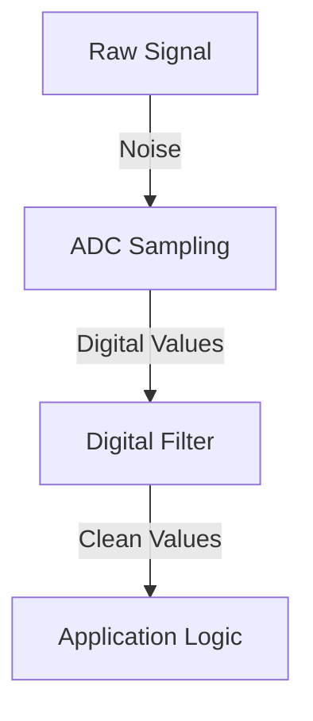

# Day 24: Analog Signal Processing
## Phase 1: Core Embedded Engineering Foundations | Week 4: Analog Interfacing

---

> **📝 Content Creator Instructions:**
> This document is designed to produce **comprehensive, industry-grade educational content**. 
> - **Target Length:** The final filled document should be approximately **1000+ lines** of detailed markdown.
> - **Depth:** Do not skim over details. Explain *why*, not just *how*.
> - **Structure:** If a topic is complex, **DIVIDE IT INTO MULTIPLE PARTS** (Part 1, Part 2, etc.).
> - **Code:** Provide complete, compilable code examples, not just snippets.
> - **Visuals:** Use Mermaid diagrams for flows, architectures, and state machines.

---

## 🎯 Learning Objectives
*By the end of this day, the learner will be able to:*
1.  **Explain** the Nyquist-Shannon Sampling Theorem and the phenomenon of Aliasing.
2.  **Design** a Moving Average Filter (MAF) to clean up noisy ADC data.
3.  **Implement** a Median Filter to remove outliers (salt-and-pepper noise).
4.  **Visualize** raw vs. filtered data using a serial plotter.
5.  **Understand** the trade-off between filter latency and smoothness.

---

## 📚 Prerequisites & Preparation
*   **Hardware Required:**
    *   STM32F4 Discovery Board
    *   Potentiometer (to generate "signal")
    *   Long wires (to act as antennas and generate "noise")
*   **Software Required:**
    *   VS Code with ARM GCC Toolchain
    *   Serial Plotter (e.g., Arduino IDE Serial Plotter, SerialPlot, or Python script)
*   **Prior Knowledge:**
    *   Day 23 (ADC DMA)
*   **Datasheets:**
    *   N/A (Theory heavy)

---

## 📖 Theoretical Deep Dive

### 🔹 Part 1: Sampling Theory

#### 1.1 Nyquist-Shannon Theorem
To perfectly reconstruct a signal of frequency $f_{max}$, you must sample it at a rate $f_s > 2 \times f_{max}$.
*   **Nyquist Rate:** $2 \times f_{max}$.
*   **Nyquist Frequency:** $f_s / 2$.

#### 1.2 Aliasing
If you sample slower than the Nyquist Rate ($f_s < 2f_{max}$), high-frequency signals "fold back" and appear as low-frequency signals.
*   **Example:** A wagon wheel in a movie appearing to spin backwards.
*   **Solution:** Anti-Aliasing Filter (Low-Pass RC Filter) *before* the ADC pin to remove frequencies $> f_s/2$.

### 🔹 Part 2: Digital Filtering

#### 2.1 Moving Average Filter (MAF)
The simplest Low-Pass Filter. It averages the last $N$ samples.
*   $y[n] = \frac{1}{N} \sum_{k=0}^{N-1} x[n-k]$
*   **Pros:** Easy to implement, smooths random noise.
*   **Cons:** Adds latency (lag). Sharp edges become slopes.

#### 2.2 Median Filter
Sorts the last $N$ samples and picks the middle one.
*   **Pros:** Excellent at removing "spikes" (outliers) while preserving sharp edges.
*   **Cons:** Computationally expensive (sorting takes time).



---

## 💻 Implementation: Filters in C

> **Instruction:** We will read a noisy ADC channel and apply both Moving Average and Median filters, printing all three values to the Serial Plotter.

### 🛠️ Hardware/System Configuration
*   **Input:** PA1 (Potentiometer).
*   **Noise:** Touch the wire or add a loose connection to create spikes.

### 👨‍💻 Code Implementation

#### Step 1: Circular Buffer for MAF (`filters.c`)

```c
#include <stdint.h>
#include <string.h>

#define MAF_WINDOW 16

typedef struct {
    uint16_t buffer[MAF_WINDOW];
    uint8_t index;
    uint32_t sum;
} MAF_t;

void MAF_Init(MAF_t *filter) {
    memset(filter, 0, sizeof(MAF_t));
}

uint16_t MAF_Update(MAF_t *filter, uint16_t new_sample) {
    // Subtract oldest sample from sum
    filter->sum -= filter->buffer[filter->index];
    
    // Add new sample to buffer and sum
    filter->buffer[filter->index] = new_sample;
    filter->sum += new_sample;
    
    // Increment index (Circular)
    filter->index++;
    if (filter->index >= MAF_WINDOW) {
        filter->index = 0;
    }
    
    // Return Average
    return (uint16_t)(filter->sum / MAF_WINDOW);
}
```

#### Step 2: Median Filter
```c
#define MEDIAN_WINDOW 5

uint16_t Median_Update(uint16_t new_sample) {
    static uint16_t buffer[MEDIAN_WINDOW];
    static uint8_t idx = 0;
    
    // Add new sample
    buffer[idx] = new_sample;
    idx = (idx + 1) % MEDIAN_WINDOW;
    
    // Create a temporary copy to sort
    uint16_t sorted[MEDIAN_WINDOW];
    memcpy(sorted, buffer, sizeof(buffer));
    
    // Bubble Sort (Simple for small N)
    for (int i = 0; i < MEDIAN_WINDOW - 1; i++) {
        for (int j = 0; j < MEDIAN_WINDOW - i - 1; j++) {
            if (sorted[j] > sorted[j+1]) {
                uint16_t temp = sorted[j];
                sorted[j] = sorted[j+1];
                sorted[j+1] = temp;
            }
        }
    }
    
    // Return middle element
    return sorted[MEDIAN_WINDOW / 2];
}
```

#### Step 3: Main Loop
```c
#include <stdio.h>
#include "adc.h" // Assume from Day 22

MAF_t my_maf;

int main(void) {
    ADC1_Init();
    MAF_Init(&my_maf);
    
    while(1) {
        uint16_t raw = ADC1_Read();
        uint16_t avg = MAF_Update(&my_maf, raw);
        uint16_t med = Median_Update(raw);
        
        // Format for Serial Plotter: "Raw,Avg,Med\n"
        printf("%d,%d,%d\n", raw, avg, med);
        
        // Sampling Rate Control (e.g., 100 Hz)
        Delay_ms(10);
    }
}
```

---

## 🔬 Lab Exercise: Lab 24.1 - Visualizing Noise

### 1. Lab Objectives
- Use a Serial Plotter to see the effect of filters in real-time.
- Compare the lag of MAF vs. the responsiveness of Median.

### 2. Step-by-Step Guide

#### Phase A: Setup
1.  Open Serial Plotter (baud rate 115200).
2.  Turn the potentiometer quickly.
3.  Observe: `Avg` line lags behind `Raw`.
4.  Introduce Noise (tap the wire).
5.  Observe: `Raw` spikes. `Avg` bumps slightly. `Med` ignores the spike completely.

#### Phase B: Tuning
1.  Change `MAF_WINDOW` to 64.
2.  Observe: Extremely smooth line, but huge lag.
3.  Change `MAF_WINDOW` to 4.
4.  Observe: Fast response, but still noisy.

### 3. Verification
The "Goldilocks" zone depends on your application. For a user interface knob, Window=8 or 16 is usually good.

---

## 🧪 Additional / Advanced Labs

### Lab 2: Exponential Moving Average (EMA)
- **Goal:** Implement an IIR (Infinite Impulse Response) filter.
- **Formula:** $y[n] = \alpha \times x[n] + (1 - \alpha) \times y[n-1]$.
- **Task:**
    1.  Implement EMA with $\alpha = 0.1$.
    2.  Compare memory usage with MAF. (EMA needs only 1 variable, MAF needs a buffer).

### Lab 3: Hysteresis
- **Goal:** Stabilize a value that toggles between two integers (e.g., 100, 101, 100...).
- **Task:** Implement logic: Only update output if input changes by more than `THRESHOLD`.

---

## 🐞 Debugging & Troubleshooting

### Common Issues

#### 1. Integer Overflow
*   **Symptom:** MAF output drops to near zero suddenly.
*   **Cause:** `sum` variable overflowed.
*   **Solution:** Ensure `sum` type is large enough. `uint32_t` can hold $65535 \times 65535$, which is plenty for 12-bit ADC.

#### 2. Lag is too high
*   **Cause:** Window size too large or sampling rate too low.
*   **Solution:** Increase sampling rate or decrease window size.

---

## ⚡ Optimization & Best Practices

### Performance Optimization
- **Power of 2 Window:** If `MAF_WINDOW` is a power of 2 (e.g., 16), the division `/ 16` can be replaced by bit shift `>> 4`. This is much faster on MCUs without hardware dividers (though M4 has one).
    ```c
    return (uint16_t)(filter->sum >> 4); // For Window=16
    ```

### Code Quality
- **Fixed Point Math:** Avoid `float` for filters on MCUs if possible. Use fixed-point scaling (e.g., multiply by 1000) to maintain precision with integers.

---

## 🧠 Assessment & Review

### Knowledge Check
1.  **Q:** What is the main advantage of a Median filter over an Average filter?
    *   **A:** It removes outliers (spikes) completely without blurring the signal edges.
2.  **Q:** If I sample a 1 kHz sine wave at 1.5 kHz, what frequency will I see?
    *   **A:** Aliasing occurs. $1.5 - 1 = 0.5 kHz$. You will see a 500 Hz wave.

### Challenge Task
> **Task:** Implement a "Debounced Analog Button". Read the ADC. If the value stays within a specific range (e.g., 2000-2100) for 50ms, trigger an action. This is used for resistor-ladder buttons on steering wheels.

---

## 📚 Further Reading & References
- [The Scientist and Engineer's Guide to Digital Signal Processing](https://www.dspguide.com/) - Free online book. Chapter 15 (Moving Average Filters).

---
