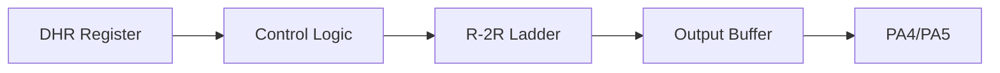

# Day 25: DAC Fundamentals
## Phase 1: Core Embedded Engineering Foundations | Week 4: Analog Interfacing

---

> **📝 Content Creator Instructions:**
> This document is designed to produce **comprehensive, industry-grade educational content**. 
> - **Target Length:** The final filled document should be approximately **1000+ lines** of detailed markdown.
> - **Depth:** Do not skim over details. Explain *why*, not just *how*.
> - **Structure:** If a topic is complex, **DIVIDE IT INTO MULTIPLE PARTS** (Part 1, Part 2, etc.).
> - **Code:** Provide complete, compilable code examples, not just snippets.
> - **Visuals:** Use Mermaid diagrams for flows, architectures, and state machines.

---

## 🎯 Learning Objectives
*By the end of this day, the learner will be able to:*
1.  **Explain** the R-2R Ladder architecture used in DACs.
2.  **Configure** the STM32 DAC peripheral to output a specific DC voltage.
3.  **Generate** simple waveforms (Sawtooth, Triangle) using software loops.
4.  **Analyze** the output using an oscilloscope to understand settling time and glitches.
5.  **Control** LED brightness using DAC (Analog) vs. PWM (Digital pulsing).

---

## 📚 Prerequisites & Preparation
*   **Hardware Required:**
    *   STM32F4 Discovery Board
    *   LED + Resistor (or Oscilloscope)
    *   Multimeter
*   **Software Required:**
    *   VS Code with ARM GCC Toolchain
*   **Prior Knowledge:**
    *   Day 22 (ADC - Opposite concept)
    *   Day 15 (GPIO Analog Mode)
*   **Datasheets:**
    *   [STM32F407 Reference Manual (DAC Section)](https://www.st.com/resource/en/reference_manual/dm00031020.pdf)

---

## 📖 Theoretical Deep Dive

### 🔹 Part 1: DAC Architecture

#### 1.1 Digital to Analog
A DAC takes a binary number (e.g., 12-bit: 0 to 4095) and converts it into a voltage (0 to $V_{REF}$).
*   $V_{out} = V_{REF} \times \frac{DAC\_Value}{4095}$

#### 1.2 R-2R Ladder
Most integrated DACs use a resistor ladder network.
*   **Concept:** A network of resistors with only two values ($R$ and $2R$) allows binary weighted currents to be summed.
*   **Buffer:** The output of the ladder has high impedance. An internal Op-Amp (Buffer) is usually added to drive loads.
    *   *Enabled:* Can drive small loads (e.g., 5kΩ). Rail-to-rail swing might be limited (e.g., 0.2V to $V_{DDA}-0.2V$).
    *   *Disabled:* High impedance output. Rail-to-rail possible, but needs external buffer.

### 🔹 Part 2: STM32 DAC Features

*   **Resolution:** 12-bit (0-4095) or 8-bit (0-255).
*   **Channels:** Two independent channels (DAC1 on PA4, DAC2 on PA5).
*   **Triggering:** Can be triggered by Timers or EXTI (for precise timing).
*   **Noise/Wave Generation:** Hardware can generate white noise or triangle waves automatically.



---

## 💻 Implementation: DC Voltage Generator

> **Instruction:** We will configure DAC Channel 1 (PA4) to output 1.5V.

### 🛠️ Hardware/System Configuration
*   **Pin:** PA4 (DAC_OUT1).
*   **Measurement:** Multimeter on PA4 and GND.

### 👨‍💻 Code Implementation

#### Step 1: Initialization (`dac.c`)

```c
#include "stm32f4xx.h"

void DAC_Init(void) {
    // 1. Enable Clocks
    RCC->AHB1ENR |= (1 << 0); // GPIOA
    RCC->APB1ENR |= (1 << 29); // DAC

    // 2. Configure PA4 as Analog
    GPIOA->MODER |= (3 << 8); // 11: Analog
    // Note: No Pull-up/Pull-down for DAC pins

    // 3. Configure DAC Channel 1
    // CR Register:
    // EN1 (Bit 0) = 1
    // BOFF1 (Bit 1) = 0 (Buffer Enabled - Default)
    // TEN1 (Bit 2) = 0 (Trigger Disabled - Default)
    
    DAC->CR |= (1 << 0); // Enable Channel 1
}
```

#### Step 2: Set Voltage Function
```c
void DAC_SetVoltage(float voltage) {
    // V_out = V_ref * (DOR / 4095)
    // DOR = (V_out / V_ref) * 4095
    // Assume V_ref = 3.3V
    
    if (voltage > 3.3f) voltage = 3.3f;
    if (voltage < 0.0f) voltage = 0.0f;
    
    uint16_t val = (uint16_t)((voltage / 3.3f) * 4095.0f);
    
    // Write to 12-bit Right Aligned Holding Register
    DAC->DHR12R1 = val;
}
```

#### Step 3: Main Loop
```c
int main(void) {
    DAC_Init();
    
    // Output 1.5V
    DAC_SetVoltage(1.5f);
    
    while(1) {
        // Do nothing
    }
}
```

---

## 🔬 Lab Exercise: Lab 25.1 - Waveform Generation

### 1. Lab Objectives
- Generate a Sawtooth wave and a Triangle wave using software loops.
- Observe the waveform on an oscilloscope (or LED fading).

### 2. Step-by-Step Guide

#### Phase A: Sawtooth
Ramp up from 0 to 4095, then drop to 0.
```c
while(1) {
    for (int i = 0; i < 4096; i += 10) {
        DAC->DHR12R1 = i;
        Delay_us(10);
    }
}
```

#### Phase B: Triangle
Ramp up from 0 to 4095, then ramp down to 0.
```c
while(1) {
    // Up
    for (int i = 0; i < 4096; i += 10) {
        DAC->DHR12R1 = i;
        Delay_us(10);
    }
    // Down
    for (int i = 4095; i >= 0; i -= 10) {
        DAC->DHR12R1 = i;
        Delay_us(10);
    }
}
```

### 3. Verification
*   **LED:** Connect LED (with resistor) to PA4. It should fade in and out smoothly.
*   **Scope:** You should see the linear ramps. Zoom in to see the "steps" (quantization).

---

## 🧪 Additional / Advanced Labs

### Lab 2: Hardware Noise Generation
- **Goal:** Use the DAC's built-in noise generator.
- **Task:**
    1.  Enable Trigger (TEN1=1). Select Software Trigger (TSEL1=111).
    2.  Enable Noise Wave (WAVE1=01).
    3.  Set Mask (MAMP1) to max amplitude.
    4.  In loop, fire Software Trigger (`SWTRIG1`).
    5.  Observe random noise on Scope.

### Lab 3: DAC vs PWM
- **Goal:** Compare Analog vs Digital control.
- **Task:**
    1.  Set DAC to 1.65V (50%). Connect LED.
    2.  Set PWM to 50% Duty. Connect LED.
    3.  **Observation:** Both LEDs look same brightness.
    4.  **Scope:** DAC is a flat line at 1.65V. PWM is a square wave 0V-3.3V.

---

## 🐞 Debugging & Troubleshooting

### Common Issues

#### 1. Output is Clipped
*   **Symptom:** Voltage doesn't reach 0V or 3.3V.
*   **Cause:** Output Buffer is enabled. The Op-Amp cannot go fully rail-to-rail.
*   **Solution:** Disable Buffer (`BOFF1=1`) if you need full range, but ensure your load impedance is high (> 1MΩ).

#### 2. Glitches
*   **Symptom:** Spikes in the waveform.
*   **Cause:** Code execution interruptions (Interrupts) pausing the software ramp.
*   **Solution:** Use DMA (Day 26) for smooth waveforms.

---

## ⚡ Optimization & Best Practices

### Performance Optimization
- **Data Alignment:** Use `DHR8R1` (8-bit register) if you only need 8-bit resolution. It saves bus bandwidth.

### Code Quality
- **Settling Time:** The DAC takes time (~3us) to settle to the new voltage. Don't update it faster than this, or the output will be distorted.

---

## 🧠 Assessment & Review

### Knowledge Check
1.  **Q:** What is the purpose of the Output Buffer?
    *   **A:** To provide current drive capability so the DAC can drive external loads (like resistors) without voltage drop.
2.  **Q:** If I write to `DHR12R1`, when does the output actually change?
    *   **A:** Immediately (if Trigger is disabled). If Trigger is enabled, it waits for the trigger event to transfer DHR to DOR (Data Output Register).

### Challenge Task
> **Task:** Create a "Staircase" generator. Output 0V, 0.5V, 1.0V, ... 3.0V in steps, holding each for 1 second. Verify voltages with a multimeter.

---

## 📚 Further Reading & References
- [STM32 DAC Application Note (AN3126)](https://www.st.com/resource/en/application_note/cd00259245-audio-and-waveform-generation-using-the-dac-in-stm32-microcontrollers-stmicroelectronics.pdf)

---
