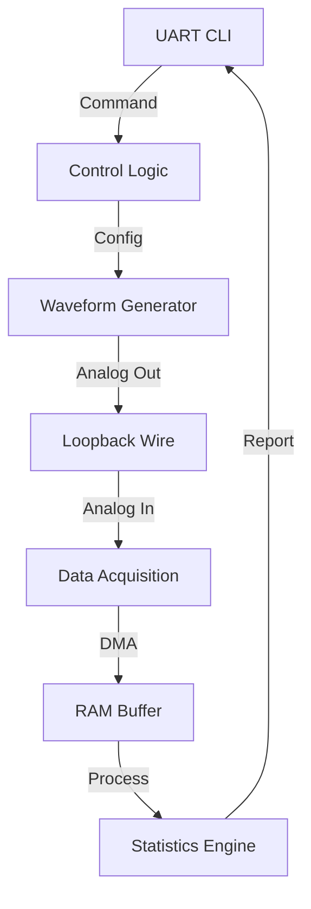

# Day 28: Week 4 Review and Project
## Phase 1: Core Embedded Engineering Foundations | Week 4: Analog Interfacing

---

> **📝 Content Creator Instructions:**
> This document is designed to produce **comprehensive, industry-grade educational content**. 
> - **Target Length:** The final filled document should be approximately **1000+ lines** of detailed markdown.
> - **Depth:** Do not skim over details. Explain *why*, not just *how*.
> - **Structure:** If a topic is complex, **DIVIDE IT INTO MULTIPLE PARTS** (Part 1, Part 2, etc.).
> - **Code:** Provide complete, compilable code examples, not just snippets.
> - **Visuals:** Use Mermaid diagrams for flows, architectures, and state machines.

---

## 🎯 Learning Objectives
*By the end of this day, the learner will be able to:*
1.  **Synthesize** Week 4 concepts (ADC, DAC, DMA, Filtering, Comparators) into a unified system.
2.  **Architect** a "Digital Signal Analyzer" that captures, processes, and generates signals.
3.  **Debug** mixed-signal issues (Digital noise coupling into Analog lines).
4.  **Implement** a command-line interface (CLI) to control the analyzer via UART.
5.  **Conduct** a self-assessment of Week 4 knowledge.

---

## 📚 Prerequisites & Preparation
*   **Hardware Required:**
    *   STM32F4 Discovery Board
    *   Signal Generator (or use DAC output connected to ADC input)
    *   USB-UART Bridge
*   **Software Required:**
    *   VS Code with ARM GCC Toolchain
    *   Serial Terminal (PuTTY / TeraTerm)
*   **Prior Knowledge:**
    *   Days 22-27 (Week 4 Content)

---

## 📖 Theoretical Deep Dive

### 🔹 Part 1: Mixed-Signal Design

#### 1.1 Grounding
*   **AGND vs. DGND:** Analog circuits are sensitive. Digital circuits are noisy (fast switching).
*   **Star Ground:** Connect AGND and DGND at a single point (usually near the power supply) to prevent digital return currents from flowing through the analog ground path.

#### 1.2 Noise Coupling
*   **Crosstalk:** Running an ADC trace next to a high-speed SPI clock trace.
*   **Solution:** Keep analog and digital traces separate. Use ground planes.

### 🔹 Part 2: Project Architecture

We will build a **Mini Signal Analyzer**.
*   **Generator (DAC):** Outputs a Sine, Square, or Triangle wave (configurable freq).
*   **Acquisition (ADC):** Samples the signal (configurable rate).
*   **Processing:** Calculates Min, Max, Average, and Vpp.
*   **Interface (UART):**
    *   `SET WAVE SINE 1000` (Set 1kHz Sine)
    *   `GET STATS` (Print Vpp, Avg)
    *   `STREAM ON` (Dump raw data for plotting)



---

## 💻 Implementation: Signal Analyzer

> **Project Goal:** Loopback PA4 (DAC) to PA1 (ADC). Generate a signal and measure it.

### 🛠️ Hardware/System Configuration
*   **Connect:** PA4 to PA1.

### 👨‍💻 Code Implementation

#### Step 1: Drivers (Reuse)
Assume `ADC_DMA_Init`, `DAC_DMA_Init`, `TIM6_Init` (DAC Trigger), `UART_Init` are available.

#### Step 2: Signal Generation (`gen.c`)
```c
#include "stm32f4xx.h"
#include <math.h>

#define LUT_SIZE 100
uint16_t dac_lut[LUT_SIZE];

void Gen_UpdateWave(int type) {
    for(int i=0; i<LUT_SIZE; i++) {
        if (type == 0) { // Sine
            dac_lut[i] = 2048 + 2047 * sin(2 * 3.14159 * i / LUT_SIZE);
        } else if (type == 1) { // Triangle
            if (i < 50) dac_lut[i] = (i * 4095) / 50;
            else dac_lut[i] = 4095 - ((i-50) * 4095) / 50;
        }
    }
}

void Gen_SetFreq(uint32_t freq) {
    // F_timer = 84 MHz.
    // F_sample = freq * LUT_SIZE.
    // ARR = 84000000 / (freq * 100) - 1.
    TIM6->ARR = (84000000 / (freq * 100)) - 1;
}
```

#### Step 3: Signal Processing (`stats.c`)
```c
#define ADC_BUF_SIZE 1024
uint16_t adc_buffer[ADC_BUF_SIZE];

typedef struct {
    uint16_t min;
    uint16_t max;
    uint16_t avg;
    float vpp;
} Stats_t;

void Process_Stats(Stats_t *stats) {
    uint32_t sum = 0;
    stats->min = 4095;
    stats->max = 0;
    
    for(int i=0; i<ADC_BUF_SIZE; i++) {
        uint16_t val = adc_buffer[i];
        if (val < stats->min) stats->min = val;
        if (val > stats->max) stats->max = val;
        sum += val;
    }
    
    stats->avg = sum / ADC_BUF_SIZE;
    stats->vpp = (stats->max - stats->min) * 3.3f / 4095.0f;
}
```

#### Step 4: Main Logic (`main.c`)
```c
#include <stdio.h>
#include <string.h>

// Global Buffers
extern uint16_t dac_lut[];
extern uint16_t adc_buffer[];

int main(void) {
    // Init All
    UART_Init();
    DAC_DMA_Init(); // Uses dac_lut
    ADC_DMA_Init(); // Uses adc_buffer
    TIM6_Init(); // Starts DAC
    
    // Default: 100Hz Sine
    Gen_UpdateWave(0);
    Gen_SetFreq(100);
    
    printf("Signal Analyzer Ready.\n");
    printf("Commands: SINE, TRI, FREQ <Hz>, STATS\n");

    char rx_buf[32];
    
    while(1) {
        if (UART_GetLine(rx_buf)) { // Blocking or Polling
            if (strncmp(rx_buf, "SINE", 4) == 0) {
                Gen_UpdateWave(0);
                printf("Wave: Sine\n");
            } else if (strncmp(rx_buf, "TRI", 3) == 0) {
                Gen_UpdateWave(1);
                printf("Wave: Triangle\n");
            } else if (strncmp(rx_buf, "FREQ", 4) == 0) {
                int f;
                sscanf(rx_buf+5, "%d", &f);
                Gen_SetFreq(f);
                printf("Freq: %d Hz\n", f);
            } else if (strncmp(rx_buf, "STATS", 5) == 0) {
                Stats_t s;
                Process_Stats(&s);
                printf("Min: %d, Max: %d, Avg: %d, Vpp: %.2f V\n", 
                       s.min, s.max, s.avg, s.vpp);
            }
        }
    }
}
```

---

## 🔬 Lab Exercise: Lab 28.1 - Loopback Test

### 1. Lab Objectives
- Verify that the ADC correctly measures the DAC output.
- Observe the effect of frequency on ADC accuracy (Sampling Theorem).

### 2. Step-by-Step Guide

#### Phase A: Low Frequency
1.  Set Freq = 100 Hz.
2.  Get Stats.
3.  Expected: Vpp ~ 3.3V (full scale).

#### Phase B: High Frequency
1.  Set Freq = 10 kHz.
2.  Get Stats.
3.  If ADC sampling rate is low (e.g., 100 kHz), you might see aliasing or reduced Vpp if you miss the peaks.
4.  **Fix:** Ensure ADC samples at least 10x faster than signal freq for good Vpp measurement.

### 3. Verification
Use an external oscilloscope to verify the DAC output is actually what you requested.

---

## 🧪 Additional / Advanced Labs

### Lab 2: FFT (Fast Fourier Transform)
- **Goal:** Calculate the frequency spectrum.
- **Task:**
    1.  Use the ARM CMSIS-DSP Library (`arm_rfft_fast_f32`).
    2.  Process `adc_buffer`.
    3.  Find the bin with the highest magnitude.
    4.  Print "Detected Freq: X Hz".

### Lab 3: Triggered Capture
- **Goal:** Oscilloscope-like triggering.
- **Task:**
    1.  Don't fill buffer continuously.
    2.  Wait for ADC value to cross 2048 (Rising Edge).
    3.  *Then* start filling the buffer.
    4.  This stabilizes the waveform display if you stream it to a plotter.

---

## 🐞 Debugging & Troubleshooting

### Common Issues

#### 1. Vpp is 0
*   **Cause:** Wire not connected between PA4 and PA1.
*   **Cause:** DAC or ADC not started.

#### 2. UART Commands Ignored
*   **Cause:** Line ending mismatch (`\r\n` vs `\n`).
*   **Solution:** Handle both in `UART_GetLine`.

---

## ⚡ Optimization & Best Practices

### Code Quality
- **Decoupling:** The Generator code (`gen.c`) knows nothing about the Analyzer code (`stats.c`). They interact only via hardware (the wire) or shared data structures if integrated.
- **Volatile:** `adc_buffer` is modified by DMA. Accessing it in `Process_Stats` requires care. Ideally, pause DMA or use Double Buffering to ensure data doesn't change *while* processing.

---

## 🧠 Assessment & Review

### Knowledge Check
1.  **Q:** If the DAC outputs 3.3V but the ADC reads 3.2V, what could be the cause?
    *   **A:** Gain error, Offset error, or voltage drop in the wire/breadboard. Also, $V_{DDA}$ might not be exactly 3.3V.
2.  **Q:** How do you prevent "Tearing" (reading the buffer while DMA is writing it)?
    *   **A:** Use Double Buffering (Half-Transfer Interrupt). Process the first half while DMA writes the second half.

### Challenge Task
> **Task:** Implement "Auto-Scale". If the input signal is too small (Vpp < 0.5V), enable an external Op-Amp with Gain=10 (controlled by a GPIO) to boost the signal, then divide the result by 10 in software.

---

## 📚 Further Reading & References
- [Analog-to-Digital Converter Design Guide (Microchip)](https://ww1.microchip.com/downloads/en/DeviceDoc/21841B.pdf)

---
