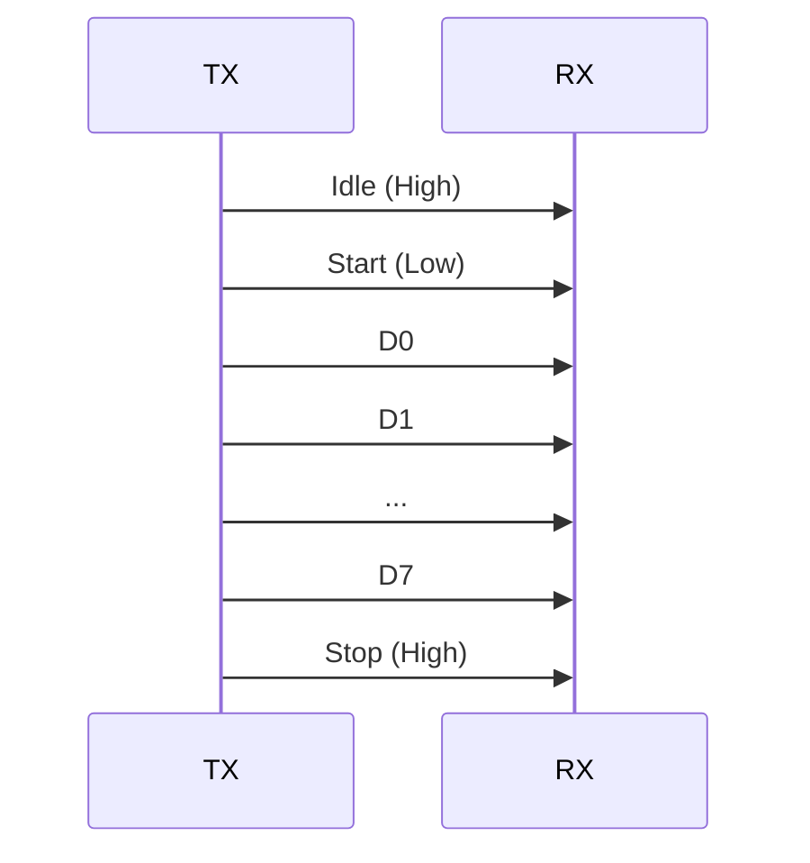

# Day 29: UART Protocols & Hardware
## Phase 1: Core Embedded Engineering Foundations | Week 5: Serial Communication Protocols

---

> **📝 Content Creator Instructions:**
> This document is designed to produce **comprehensive, industry-grade educational content**. 
> - **Target Length:** The final filled document should be approximately **1000+ lines** of detailed markdown.
> - **Depth:** Do not skim over details. Explain *why*, not just *how*.
> - **Structure:** If a topic is complex, **DIVIDE IT INTO MULTIPLE PARTS** (Part 1, Part 2, etc.).
> - **Code:** Provide complete, compilable code examples, not just snippets.
> - **Visuals:** Use Mermaid diagrams for flows, architectures, and state machines.

---

## 🎯 Learning Objectives
*By the end of this day, the learner will be able to:*
1.  **Explain** the UART frame structure (Start, Data, Parity, Stop bits).
2.  **Calculate** the BRR (Baud Rate Register) value for standard rates (9600, 115200) given the APB clock.
3.  **Configure** the STM32 USART peripheral for Polling-based transmission and reception.
4.  **Implement** `printf` retargeting to send debug messages to a PC console.
5.  **Troubleshoot** common UART issues like baud rate mismatch and framing errors.

---

## 📚 Prerequisites & Preparation
*   **Hardware Required:**
    *   STM32F4 Discovery Board
    *   USB-to-TTL Serial Adapter (FTDI/CP2102)
*   **Software Required:**
    *   VS Code with ARM GCC Toolchain
    *   Serial Terminal (PuTTY, TeraTerm, or Minicom)
*   **Prior Knowledge:**
    *   Day 13 (Clocks)
    *   Day 15 (GPIO Alternate Functions)
*   **Datasheets:**
    *   [STM32F407 Reference Manual (USART Section)](https://www.st.com/resource/en/reference_manual/dm00031020.pdf)

---

## 📖 Theoretical Deep Dive

### 🔹 Part 1: The UART Protocol

#### 1.1 Asynchronous Communication
UART (Universal Asynchronous Receiver-Transmitter) is "Asynchronous" because there is no shared clock signal. The receiver must sync to the transmitter using the **Start Bit** and known timing (**Baud Rate**).

#### 1.2 Frame Structure
*   **Idle State:** Logic High (1).
*   **Start Bit:** Logic Low (0). Signals the beginning of a byte.
*   **Data Bits:** Usually 8 bits (LSB first).
*   **Parity Bit (Optional):** Error checking (Even/Odd).
*   **Stop Bit:** Logic High (1). 1, 1.5, or 2 bits duration.



#### 1.3 Baud Rate Generation
The bit duration $T_{bit} = 1 / BaudRate$.
*   **Oversampling:** The receiver samples the input 16 times per bit (Oversampling x16) to find the center of the bit.
*   **Equation:** $Tx/Rx Baud = \frac{f_{CK}}{8 \times (2 - OVER8) \times USARTDIV}$
*   **USARTDIV:** A fixed-point number stored in the `BRR` register.

### 🔹 Part 2: STM32 USART Architecture

*   **Pins:** TX (Transmit) and RX (Receive).
*   **Data Register (DR):** 9 bits wide (can handle 8 data + 1 parity).
*   **Status Register (SR):**
    *   `TXE` (Transmit Data Register Empty): Ready to write next byte.
    *   `TC` (Transmission Complete): All data shifted out.
    *   `RXNE` (Read Data Register Not Empty): Data received and ready to read.

---

## 💻 Implementation: Hello World (Polling)

> **Instruction:** We will configure USART2 (PA2/PA3) at 115200 baud, 8N1.

### 🛠️ Hardware/System Configuration
*   **TX:** PA2 (Connect to RX of USB Adapter).
*   **RX:** PA3 (Connect to TX of USB Adapter).
*   **GND:** Connect Grounds!

### 👨‍💻 Code Implementation

#### Step 1: Initialization (`uart.c`)

```c
#include "stm32f4xx.h"
#include <stdio.h>

void USART2_Init(void) {
    // 1. Enable Clocks
    RCC->AHB1ENR |= (1 << 0);  // GPIOA
    RCC->APB1ENR |= (1 << 17); // USART2

    // 2. Configure PA2 (TX) and PA3 (RX) as AF7
    GPIOA->MODER &= ~(0xF << 4); // Clear bits 4-7
    GPIOA->MODER |= (0xA << 4);  // Set to 10 (AF)
    
    GPIOA->AFR[0] |= (7 << 8) | (7 << 12); // AF7 for Pin 2 and 3

    // 3. Configure Baud Rate
    // F_APB1 = 16 MHz (Default HSI).
    // Target = 115200.
    // DIV = 16,000,000 / (16 * 115200) = 8.6805
    // Mantissa = 8.
    // Fraction = 0.6805 * 16 = 10.88 -> 11 (0xB).
    // BRR = 0x8B.
    USART2->BRR = 0x8B;

    // 4. Configure Control Register
    // TE (Tx Enable), RE (Rx Enable), UE (USART Enable)
    USART2->CR1 |= (1 << 3) | (1 << 2) | (1 << 13);
}
```

#### Step 2: Send and Receive Functions
```c
void USART2_Write(int ch) {
    // Wait until TXE (Transmit Empty) is set
    while (!(USART2->SR & (1 << 7)));
    USART2->DR = (ch & 0xFF);
}

char USART2_Read(void) {
    // Wait until RXNE (Read Not Empty) is set
    while (!(USART2->SR & (1 << 5)));
    return (char)(USART2->DR & 0xFF);
}
```

#### Step 3: Retargeting printf
To use `printf`, we must override the `_write` system call (for GCC).
```c
int _write(int file, char *ptr, int len) {
    for (int i = 0; i < len; i++) {
        USART2_Write(ptr[i]);
    }
    return len;
}
```

#### Step 4: Main Loop
```c
int main(void) {
    USART2_Init();
    
    printf("Hello, UART!\r\n");
    
    while(1) {
        printf("Type a character: ");
        char c = USART2_Read();
        printf("%c\r\n", c);
    }
}
```

---

## 🔬 Lab Exercise: Lab 29.1 - Baud Rate Mismatch

### 1. Lab Objectives
- Observe the garbage output when baud rates don't match.
- Understand why timing accuracy is critical.

### 2. Step-by-Step Guide

#### Phase A: Correct Setup
1.  Code: 115200. Terminal: 115200.
2.  Result: "Hello, UART!"

#### Phase B: Mismatch
1.  Change Terminal to 9600.
2.  Reset Board.
3.  Result: Garbage characters (e.g., `€˜˜`).
    *   *Why?* The receiver is sampling at the wrong times, interpreting bits incorrectly.

#### Phase C: Clock Drift
1.  Use HSI (Internal RC Oscillator). It has ~1% error.
2.  Heat up the chip (finger or hot air).
3.  At high baud rates (e.g., 921600), the 1% drift might cause framing errors.
4.  *Lesson:* Use HSE (Crystal) for reliable high-speed UART.

### 3. Verification
Check the `FE` (Framing Error) flag in `SR` if you can inspect it with a debugger during the mismatch.

---

## 🧪 Additional / Advanced Labs

### Lab 2: Echo Server
- **Goal:** Create a loopback.
- **Task:**
    1.  Read a byte.
    2.  Immediately write it back.
    3.  Result: Typing in the terminal shows the characters. If you disconnect the wire, typing shows nothing (local echo disabled).

### Lab 3: Controlling LEDs via UART
- **Goal:** Simple CLI.
- **Task:**
    1.  Receive char.
    2.  If '1', Turn LED ON.
    3.  If '0', Turn LED OFF.
    4.  Print "LED ON" or "LED OFF".

---

## 🐞 Debugging & Troubleshooting

### Common Issues

#### 1. No Output
*   **Cause:** TX/RX swapped. (Most common).
*   **Solution:** Swap wires. TX of MCU goes to RX of Dongle.

#### 2. Garbage Output
*   **Cause:** Baud rate mismatch.
*   **Cause:** Ground not connected.

#### 3. Stuck in `USART2_Write`
*   **Cause:** Clock not enabled for USART2 or GPIOA.
*   **Cause:** `UE` bit not set.

---

## ⚡ Optimization & Best Practices

### Performance Optimization
- **Polling is Bad:** The `while` loops in `Read` and `Write` block the CPU. If the user types nothing, the CPU is stuck forever in `Read`.
- **Solution:** Use Interrupts (Day 30) or DMA.

### Code Quality
- **Macros:** Don't hardcode `0x8B`. Use a macro `compute_uart_div(PCLK, BAUD)`.

---

## 🧠 Assessment & Review

### Knowledge Check
1.  **Q:** What happens if the Parity bit is wrong?
    *   **A:** The `PE` (Parity Error) flag is set in `SR`. The data in `DR` is likely corrupted.
2.  **Q:** How many wires are needed for UART?
    *   **A:** Minimum 3: TX, RX, and GND.

### Challenge Task
> **Task:** Implement "Auto-Baud Detection". Configure a Timer to measure the width of the Start Bit (Input Capture). Calculate the baud rate from the pulse width and reconfigure the USART `BRR` automatically.

---

## 📚 Further Reading & References
- [STM32 UART Application Note (AN4013)](https://www.st.com/resource/en/application_note/dm00036691-stm32f405-415-stm32f407-417-stm32f427-437-and-stm32f429-439-lines-usart-application-examples-stmicroelectronics.pdf)

---
