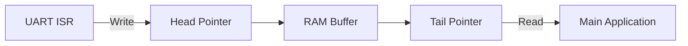

# Day 30: UART Interrupts & Ring Buffers
## Phase 1: Core Embedded Engineering Foundations | Week 5: Serial Communication Protocols

---

> **📝 Content Creator Instructions:**
> This document is designed to produce **comprehensive, industry-grade educational content**. 
> - **Target Length:** The final filled document should be approximately **1000+ lines** of detailed markdown.
> - **Depth:** Do not skim over details. Explain *why*, not just *how*.
> - **Structure:** If a topic is complex, **DIVIDE IT INTO MULTIPLE PARTS** (Part 1, Part 2, etc.).
> - **Code:** Provide complete, compilable code examples, not just snippets.
> - **Visuals:** Use Mermaid diagrams for flows, architectures, and state machines.

---

## 🎯 Learning Objectives
*By the end of this day, the learner will be able to:*
1.  **Explain** why polling UART is inefficient and how interrupts solve the blocking problem.
2.  **Implement** a Circular Buffer (Ring Buffer) for robust data buffering.
3.  **Handle** `RXNE` (Receive) and `TXE` (Transmit) interrupts correctly.
4.  **Design** a non-blocking `UART_Read` and `UART_Write` API.
5.  **Debug** race conditions and buffer overflows in interrupt-driven systems.

---

## 📚 Prerequisites & Preparation
*   **Hardware Required:**
    *   STM32F4 Discovery Board
    *   USB-to-TTL Serial Adapter
*   **Software Required:**
    *   VS Code with ARM GCC Toolchain
*   **Prior Knowledge:**
    *   Day 29 (UART Basics)
    *   Day 11 (NVIC)
    *   Day 13 (DMA - Conceptually similar buffering)
*   **Datasheets:**
    *   [STM32F407 Reference Manual (USART Interrupts)](https://www.st.com/resource/en/reference_manual/dm00031020.pdf)

---

## 📖 Theoretical Deep Dive

### 🔹 Part 1: The Polling Problem
In Day 29, `USART2_Read` waited for a character:
```c
while (!(USART2->SR & (1 << 5))); // Blocks forever!
```
If the main loop is doing other work (e.g., blinking an LED), it might miss the character if it arrives while the CPU is busy. Or, if we wait for the character, the LED stops blinking.

**Solution:** Interrupts. The CPU does its work. When a byte arrives, the UART hardware taps the CPU on the shoulder (`RXNE` Interrupt). The CPU grabs the byte, puts it in a buffer, and goes back to work.

### 🔹 Part 2: Ring Buffers (Circular Queues)
We need a place to store the incoming bytes until the main application is ready to process them.
*   **Head:** Where we write new data (ISR moves Head).
*   **Tail:** Where we read data (Main loop moves Tail).
*   **Empty:** Head == Tail.
*   **Full:** (Head + 1) % Size == Tail.



---

## 💻 Implementation: Interrupt-Driven UART Driver

> **Instruction:** We will implement a fully buffered UART driver.

### 🛠️ Hardware/System Configuration
*   **UART:** USART2 (PA2/PA3).
*   **Baud:** 115200.

### 👨‍💻 Code Implementation

#### Step 1: Ring Buffer Structure (`ring_buffer.h`)

```c
#include <stdint.h>

#define UART_BUFFER_SIZE 128

typedef struct {
    unsigned char buffer[UART_BUFFER_SIZE];
    volatile unsigned int head;
    volatile unsigned int tail;
} RingBuffer;

void RingBuffer_Init(RingBuffer *rb);
int RingBuffer_Write(RingBuffer *rb, unsigned char c);
int RingBuffer_Read(RingBuffer *rb, unsigned char *c);
int RingBuffer_IsEmpty(RingBuffer *rb);
```

#### Step 2: Ring Buffer Logic (`ring_buffer.c`)
```c
#include "ring_buffer.h"

void RingBuffer_Init(RingBuffer *rb) {
    rb->head = 0;
    rb->tail = 0;
}

int RingBuffer_Write(RingBuffer *rb, unsigned char c) {
    unsigned int next_head = (rb->head + 1) % UART_BUFFER_SIZE;
    if (next_head == rb->tail) {
        return -1; // Buffer Full
    }
    rb->buffer[rb->head] = c;
    rb->head = next_head;
    return 0;
}

int RingBuffer_Read(RingBuffer *rb, unsigned char *c) {
    if (rb->head == rb->tail) {
        return -1; // Buffer Empty
    }
    *c = rb->buffer[rb->tail];
    rb->tail = (rb->tail + 1) % UART_BUFFER_SIZE;
    return 0;
}
```

#### Step 3: UART Driver (`uart_irq.c`)
```c
#include "stm32f4xx.h"
#include "ring_buffer.h"

RingBuffer rx_buffer;
RingBuffer tx_buffer;

void USART2_Init_IRQ(void) {
    // ... (Clock, GPIO, Baud Rate setup from Day 29) ...
    // Assuming USART2->BRR, CR1, etc. are set.

    RingBuffer_Init(&rx_buffer);
    RingBuffer_Init(&tx_buffer);

    // Enable RXNE Interrupt
    USART2->CR1 |= (1 << 5); // RXNEIE

    // Enable NVIC
    NVIC_EnableIRQ(USART2_IRQn);
    
    // Enable UART
    USART2->CR1 |= (1 << 13);
}

void USART2_IRQHandler(void) {
    // Check RXNE (Receive)
    if (USART2->SR & (1 << 5)) {
        char c = USART2->DR; // Reading DR clears RXNE
        RingBuffer_Write(&rx_buffer, c);
    }

    // Check TXE (Transmit)
    if ((USART2->SR & (1 << 7)) && (USART2->CR1 & (1 << 7))) {
        unsigned char c;
        if (RingBuffer_Read(&tx_buffer, &c) == 0) {
            USART2->DR = c;
        } else {
            // Buffer Empty, Disable TXE Interrupt
            USART2->CR1 &= ~(1 << 7); // TXEIE
        }
    }
}

void UART_SendChar(char c) {
    // Add to buffer
    while (RingBuffer_Write(&tx_buffer, c) != 0); // Block if full (or handle error)
    
    // Enable TXE Interrupt to start transmission
    USART2->CR1 |= (1 << 7); // TXEIE
}

int UART_GetChar(char *c) {
    return RingBuffer_Read(&rx_buffer, c);
}
```

#### Step 4: Main Loop
```c
int main(void) {
    USART2_Init_IRQ();
    
    UART_SendChar('H');
    UART_SendChar('i');
    UART_SendChar('\n');

    while(1) {
        char c;
        if (UART_GetChar(&c) == 0) {
            // Echo back
            UART_SendChar(c);
        }
        
        // Blink LED to show we are not blocking
        Toggle_LED();
        Delay_ms(100);
    }
}
```

---

## 🔬 Lab Exercise: Lab 30.1 - Stress Test

### 1. Lab Objectives
- Flood the UART with data and verify no bytes are lost.
- Observe the Ring Buffer filling up.

### 2. Step-by-Step Guide

#### Phase A: Setup
1.  Connect to PC.
2.  Copy a large text block (e.g., 500 chars).
3.  Paste it into the Terminal.

#### Phase B: Observation
1.  The MCU should echo everything back perfectly.
2.  If `UART_BUFFER_SIZE` is too small (e.g., 16), and the processing is slow (e.g., `Delay_ms(100)`), the buffer will overflow.
3.  **Experiment:** Reduce buffer size to 16. Paste 50 chars. Observe missing characters.

### 3. Verification
Check `RingBuffer_Write` return value. If it returns -1, light a Red LED to indicate overflow.

---

## 🧪 Additional / Advanced Labs

### Lab 2: Line Buffering
- **Goal:** Process data only when a newline `\n` is received.
- **Task:**
    1.  In `UART_GetChar`, peek at the buffer.
    2.  Or, maintain a separate `line_ready` flag set by the ISR when it sees `\n`.
    3.  Main loop: `if (line_ready) ProcessCommand();`

### Lab 3: Flow Control (RTS/CTS)
- **Goal:** Prevent overflow hardware-style.
- **Task:**
    1.  Enable Hardware Flow Control in `CR3` (`RTSE`, `CTSE`).
    2.  Connect RTS/CTS pins to the USB adapter.
    3.  When the MCU buffer is full, the RTS pin goes High, telling the PC to stop sending.

---

## 🐞 Debugging & Troubleshooting

### Common Issues

#### 1. TX Stops Working
*   **Symptom:** Sends a few bytes then stops.
*   **Cause:** Forgot to enable `TXEIE` when adding new data to the buffer.
*   **Solution:** `UART_SendChar` must always ensure `TXEIE` is set.

#### 2. Race Conditions
*   **Symptom:** Buffer corruption.
*   **Cause:** Main loop modifies `tail`, ISR modifies `head`. Usually safe. But if `count` variable is used, it's unsafe.
*   **Solution:** Ring Buffer design with Head/Tail indices is interrupt-safe for single-producer/single-consumer without locks, *provided* writes are atomic (32-bit aligned).

---

## ⚡ Optimization & Best Practices

### Performance Optimization
- **DMA:** For large blocks of data, DMA is better than Interrupts (Day 31/32). Interrupts still have overhead (stacking/unstacking) for *every byte*. DMA has overhead only per *block*.

### Code Quality
- **Atomic Access:** `volatile` keyword is essential for `head` and `tail`.

---

## 🧠 Assessment & Review

### Knowledge Check
1.  **Q:** When does the `TXE` interrupt fire?
    *   **A:** Whenever the Data Register is empty. If you enable it and don't write to DR, it will fire continuously (infinite loop). That's why we disable it when the buffer is empty.
2.  **Q:** What is the difference between `TXE` and `TC`?
    *   **A:** `TXE` means "Ready for next byte" (Shift register might still be busy). `TC` means "Shift register is empty too" (Wire is idle). Use `TC` before disabling the UART or entering Sleep.

### Challenge Task
> **Task:** Implement "Software Flow Control" (XON/XOFF). If buffer > 80% full, send XOFF (0x13). If buffer < 20% full, send XON (0x11).

---

## 📚 Further Reading & References
- [Making Embedded Systems (Elecia White)](https://www.oreilly.com/library/view/making-embedded-systems/9781449302139/) - Chapter on Buffers.

---
