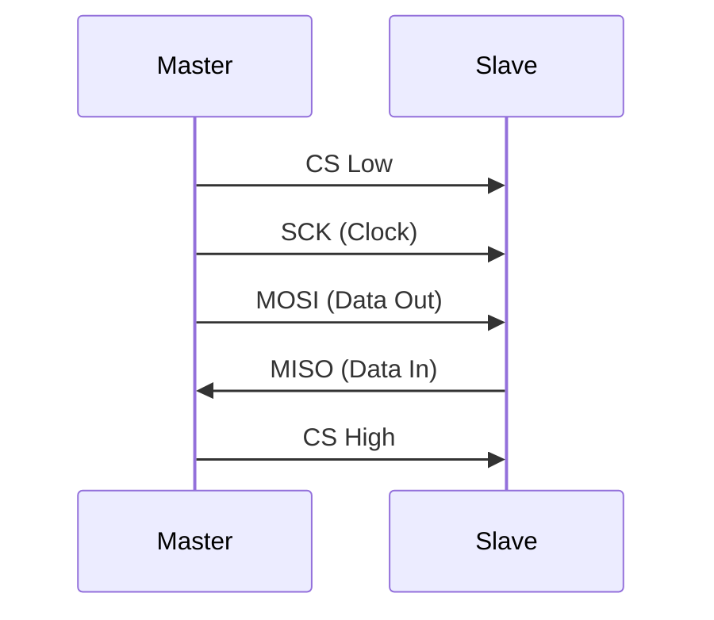

# Day 31: SPI Essentials
## Phase 1: Core Embedded Engineering Foundations | Week 5: Serial Communication Protocols

---

> **📝 Content Creator Instructions:**
> This document is designed to produce **comprehensive, industry-grade educational content**. 
> - **Target Length:** The final filled document should be approximately **1000+ lines** of detailed markdown.
> - **Depth:** Do not skim over details. Explain *why*, not just *how*.
> - **Structure:** If a topic is complex, **DIVIDE IT INTO MULTIPLE PARTS** (Part 1, Part 2, etc.).
> - **Code:** Provide complete, compilable code examples, not just snippets.
> - **Visuals:** Use Mermaid diagrams for flows, architectures, and state machines.

---

## 🎯 Learning Objectives
*By the end of this day, the learner will be able to:*
1.  **Explain** the SPI (Serial Peripheral Interface) 4-wire protocol (MISO, MOSI, SCK, CS).
2.  **Analyze** Clock Polarity (CPOL) and Clock Phase (CPHA) modes.
3.  **Configure** the STM32 SPI peripheral in Master Mode.
4.  **Interface** with the onboard LIS3DSH Accelerometer (or external sensor).
5.  **Debug** common SPI issues like mode mismatch and floating Chip Select lines.

---

## 📚 Prerequisites & Preparation
*   **Hardware Required:**
    *   STM32F4 Discovery Board (Has LIS3DSH on SPI1).
*   **Software Required:**
    *   VS Code with ARM GCC Toolchain
*   **Prior Knowledge:**
    *   Day 29 (Serial Concept)
    *   Day 15 (GPIO AF)
*   **Datasheets:**
    *   [STM32F407 Reference Manual (SPI Section)](https://www.st.com/resource/en/reference_manual/dm00031020.pdf)
    *   [LIS3DSH Datasheet](https://www.st.com/resource/en/datasheet/lis3dsh.pdf)

---

## 📖 Theoretical Deep Dive

### 🔹 Part 1: The SPI Protocol

#### 1.1 Architecture
SPI is a **Synchronous**, **Full-Duplex**, **Master-Slave** protocol.
*   **SCK (Serial Clock):** Generated by Master.
*   **MOSI (Master Out Slave In):** Data from Master to Slave.
*   **MISO (Master In Slave Out):** Data from Slave to Master.
*   **CS/SS (Chip Select / Slave Select):** Active Low. Selects the target slave.

#### 1.2 Data Transfer
Data is shifted out and shifted in *simultaneously*.
*   To read a byte, you must write a dummy byte (usually 0xFF or 0x00).
*   "Exchange" is a better term than "Read/Write".

#### 1.3 SPI Modes (CPOL/CPHA)
*   **CPOL (Clock Polarity):** Idle state of SCK. (0=Low, 1=High).
*   **CPHA (Clock Phase):** Sampling edge. (0=1st Edge, 1=2nd Edge).
*   **Mode 0:** CPOL=0, CPHA=0. (Most common).
*   **Mode 3:** CPOL=1, CPHA=1.



### 🔹 Part 2: STM32 SPI Architecture

*   **Shift Register:** The hardware that moves bits.
*   **DR (Data Register):** Access to the RX and TX buffers.
*   **Baud Rate:** Derived from APB clock. Max $f_{PCLK}/2$.

---

## 💻 Implementation: Reading LIS3DSH ID

> **Instruction:** We will configure SPI1 to talk to the onboard accelerometer (LIS3DSH) connected to PA5, PA6, PA7, and PE3 (CS).

### 🛠️ Hardware/System Configuration
*   **SCK:** PA5 (AF5).
*   **MISO:** PA6 (AF5).
*   **MOSI:** PA7 (AF5).
*   **CS:** PE3 (GPIO Output).

### 👨‍💻 Code Implementation

#### Step 1: Initialization (`spi.c`)

```c
#include "stm32f4xx.h"

void SPI1_Init(void) {
    // 1. Enable Clocks
    RCC->AHB1ENR |= (1 << 0) | (1 << 4); // GPIOA, GPIOE
    RCC->APB2ENR |= (1 << 12); // SPI1

    // 2. Configure GPIO Pins (PA5, PA6, PA7) as AF5
    GPIOA->MODER &= ~(0xFC00); // Clear
    GPIOA->MODER |= (0xA800);  // 10 10 10
    GPIOA->AFR[0] |= (5 << 20) | (5 << 24) | (5 << 28);

    // 3. Configure CS Pin (PE3) as Output
    GPIOE->MODER |= (1 << 6);
    GPIOE->ODR |= (1 << 3); // Set High (Deselect)

    // 4. Configure SPI1
    // Master Mode (MSTR = 1)
    // Baud Rate: f_PCLK2 / 16 (BR = 011) -> 84MHz/16 = 5.25 MHz
    // CPOL=1, CPHA=1 (Mode 3 for LIS3DSH) - Check Datasheet!
    // SSM=1, SSI=1 (Software Slave Management)
    // DFF=0 (8-bit)
    // MSB First (LSBFIRST=0)
    
    SPI1->CR1 |= (1 << 2) | (1 << 9) | (1 << 8) | (3 << 3) | (1 << 1) | (1 << 0);
    
    // Enable SPI
    SPI1->CR1 |= (1 << 6);
}
```

#### Step 2: Transceive Function
```c
uint8_t SPI1_Transfer(uint8_t data) {
    // Wait until TX buffer is empty
    while (!(SPI1->SR & (1 << 1))); // TXE
    
    // Send Data
    SPI1->DR = data;
    
    // Wait until RX buffer is not empty
    while (!(SPI1->SR & (1 << 0))); // RXNE
    
    // Return received data
    return SPI1->DR;
}
```

#### Step 3: LIS3DSH Driver
```c
#define LIS3DSH_WHO_AM_I 0x0F
#define CS_LOW()  (GPIOE->BSRR = (1 << 19)) // Reset PE3
#define CS_HIGH() (GPIOE->BSRR = (1 << 3))  // Set PE3

uint8_t LIS3DSH_ReadID(void) {
    uint8_t id;
    
    CS_LOW();
    // Bit 0: READ(1)/WRITE(0). Address 0x0F.
    SPI1_Transfer(0x80 | LIS3DSH_WHO_AM_I); 
    id = SPI1_Transfer(0x00); // Dummy byte to clock in data
    CS_HIGH();
    
    return id;
}
```

#### Step 4: Main Loop
```c
#include <stdio.h>

int main(void) {
    // Init UART...
    SPI1_Init();
    
    while(1) {
        uint8_t id = LIS3DSH_ReadID();
        printf("Device ID: 0x%02X\r\n", id); // Should be 0x3F
        
        Delay_ms(500);
    }
}
```

---

## 🔬 Lab Exercise: Lab 31.1 - Reading Acceleration

### 1. Lab Objectives
- Initialize the LIS3DSH (Power Up).
- Read X, Y, Z registers.

### 2. Step-by-Step Guide

#### Phase A: Configuration
Write to `CTRL_REG4` (0x20) to enable X, Y, Z and set Data Rate.
```c
void LIS3DSH_Write(uint8_t reg, uint8_t value) {
    CS_LOW();
    SPI1_Transfer(reg); // Write command (Bit 0 is 0)
    SPI1_Transfer(value);
    CS_HIGH();
}

// In Init:
LIS3DSH_Write(0x20, 0x77); // ODR=100Hz, Enable All Axes
```

#### Phase B: Reading Data
Read registers 0x28 (OUT_X_L) to 0x2D (OUT_Z_H).
```c
void LIS3DSH_ReadAxes(int16_t *x, int16_t *y, int16_t *z) {
    CS_LOW();
    SPI1_Transfer(0x80 | 0x28); // Read from 0x28
    *x = SPI1_Transfer(0) | (SPI1_Transfer(0) << 8);
    *y = SPI1_Transfer(0) | (SPI1_Transfer(0) << 8);
    *z = SPI1_Transfer(0) | (SPI1_Transfer(0) << 8);
    CS_HIGH();
}
```
*Wait!* Does LIS3DSH support auto-increment? Yes, but usually you need to set a bit in the address or use a specific command. For LIS3DSH, usually setting bit 6? Check datasheet. Actually, standard SPI reads usually require separate transactions or a specific burst mode bit.

### 3. Verification
Tilt the board. X and Y should change. Z should be ~1g (16384 or similar depending on sensitivity) when flat.

---

## 🧪 Additional / Advanced Labs

### Lab 2: Bit-Banging SPI
- **Goal:** Understand the timing diagram manually.
- **Task:**
    1.  Implement `SoftSPI_Transfer` using GPIO Set/Reset.
    2.  Toggle SCK manually.
    3.  Read MISO, Write MOSI.
    4.  Compare speed with Hardware SPI.

### Lab 3: SD Card Initialization (Preview)
- **Goal:** Send 80 clocks with CS High (SD Card wakeup).
- **Task:**
    1.  Set CS High.
    2.  Send 10 bytes of 0xFF.
    3.  This is the first step of SD Card SPI mode initialization.

---

## 🐞 Debugging & Troubleshooting

### Common Issues

#### 1. ID is 0x00 or 0xFF
*   **Cause:** Wrong CPOL/CPHA.
*   **Cause:** CS not toggling correctly.
*   **Cause:** MISO/MOSI swapped (less common on onboard chips, but common on external wiring).
*   **Solution:** Check timing with Logic Analyzer.

#### 2. Data is shifted
*   **Cause:** Reading too early or late.
*   **Solution:** Ensure `while(!RXNE)` is checked before reading DR.

---

## ⚡ Optimization & Best Practices

### Performance Optimization
- **Clock Speed:** SPI can go very fast (42 MHz on F4). Ensure your wires are short and impedance matched for high speeds.
- **Burst Read:** Reading 6 bytes (X,Y,Z) in one transaction is faster than 6 separate transactions because you save the command byte overhead.

### Code Quality
- **Abstraction:** Create a `SPI_Driver` struct so you can easily swap between SPI1, SPI2, etc.

---

## 🧠 Assessment & Review

### Knowledge Check
1.  **Q:** What happens if you disconnect MISO?
    *   **A:** The Master will read 0x00 or 0xFF (depending on pull-up/down) for every byte.
2.  **Q:** Why is CS Active Low?
    *   **A:** Historical reasons (TTL logic), and it allows the idle state (High) to be easily maintained by a pull-up resistor during reset.

### Challenge Task
> **Task:** Implement "Daisy Chaining". If you have two shift registers (74HC595), connect them in a chain and send 16 bits of data via SPI to control 16 LEDs.

---

## 📚 Further Reading & References
- [Introduction to SPI (SparkFun)](https://learn.sparkfun.com/tutorials/serial-peripheral-interface-spi/all)

---
