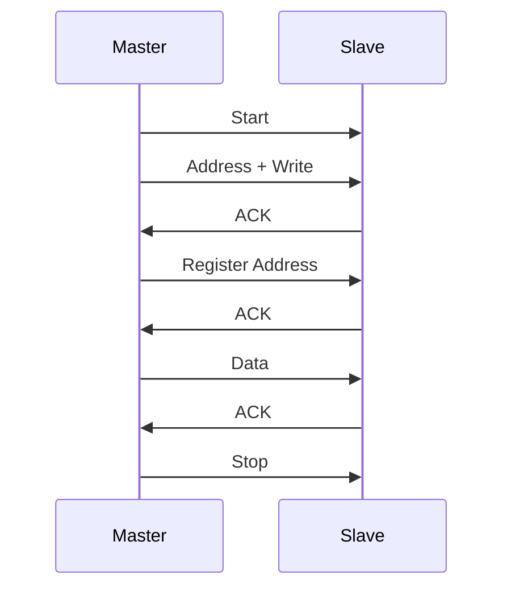

# Day 33: I2C Fundamentals
## Phase 1: Core Embedded Engineering Foundations | Week 5: Serial Communication Protocols

---

> **📝 Content Creator Instructions:**
> This document is designed to produce **comprehensive, industry-grade educational content**. 
> - **Target Length:** The final filled document should be approximately **1000+ lines** of detailed markdown.
> - **Depth:** Do not skim over details. Explain *why*, not just *how*.
> - **Structure:** If a topic is complex, **DIVIDE IT INTO MULTIPLE PARTS** (Part 1, Part 2, etc.).
> - **Code:** Provide complete, compilable code examples, not just snippets.
> - **Visuals:** Use Mermaid diagrams for flows, architectures, and state machines.

---

## 🎯 Learning Objectives
*By the end of this day, the learner will be able to:*
1.  **Explain** the I2C (Inter-Integrated Circuit) protocol (SDA, SCL, Start, Stop, ACK/NACK).
2.  **Analyze** the Open-Drain architecture and the necessity of Pull-Up resistors.
3.  **Configure** the STM32 I2C peripheral in Master Mode.
4.  **Scan** the I2C bus to detect connected devices (I2C Scanner).
5.  **Read/Write** registers from the onboard CS43L22 Audio DAC (or external EEPROM).

---

## 📚 Prerequisites & Preparation
*   **Hardware Required:**
    *   STM32F4 Discovery Board (Has CS43L22 on I2C1).
    *   External I2C Device (OLED, EEPROM, Sensor) - Optional.
*   **Software Required:**
    *   VS Code with ARM GCC Toolchain
*   **Prior Knowledge:**
    *   Day 15 (Open-Drain GPIO)
    *   Day 29 (Serial Concept)
*   **Datasheets:**
    *   [STM32F407 Reference Manual (I2C Section)](https://www.st.com/resource/en/reference_manual/dm00031020.pdf)
    *   [CS43L22 Datasheet](https://www.cirrus.com/products/cs43l22/)

---

## 📖 Theoretical Deep Dive

### 🔹 Part 1: The I2C Protocol

#### 1.1 Architecture
I2C is a **Synchronous**, **Half-Duplex**, **Multi-Master** protocol.
*   **SDA (Serial Data):** Bidirectional data line.
*   **SCL (Serial Clock):** Clock line (controlled by Master).
*   **Addressing:** 7-bit (or 10-bit) address. Up to 127 devices on one bus.

#### 1.2 Open-Drain Logic
Both lines are Open-Drain. They are pulled High by resistors. Devices pull them Low to signal '0'.
*   **Clock Stretching:** A Slave can hold SCL Low to pause the Master.
*   **Arbitration:** If two Masters transmit, the one sending '0' wins (because '0' overrides '1').

#### 1.3 Transaction Format
1.  **Start Condition:** SDA goes Low while SCL is High.
2.  **Address Byte:** 7-bit Address + R/W bit (0=Write, 1=Read).
3.  **ACK/NACK:** Receiver pulls SDA Low to ACK.
4.  **Data Bytes:** 8 bits + ACK.
5.  **Stop Condition:** SDA goes High while SCL is High.



### 🔹 Part 2: STM32 I2C Architecture

*   **CR1/CR2:** Control Registers.
*   **OAR1/OAR2:** Own Address Registers (for Slave mode).
*   **DR:** Data Register.
*   **SR1/SR2:** Status Registers. (Complex! Must be read in specific order to clear flags).

---

## 💻 Implementation: I2C Scanner

> **Instruction:** We will configure I2C1 (PB6, PB9) to scan for devices.

### 🛠️ Hardware/System Configuration
*   **SCL:** PB6 (AF4).
*   **SDA:** PB9 (AF4).
*   **Pull-Ups:** Internal Pull-Ups are usually too weak (40k). External 4.7k recommended. On Discovery board, CS43L22 has pull-ups.

### 👨‍💻 Code Implementation

#### Step 1: Initialization (`i2c.c`)

```c
#include "stm32f4xx.h"

void I2C1_Init(void) {
    // 1. Enable Clocks
    RCC->AHB1ENR |= (1 << 1); // GPIOB
    RCC->APB1ENR |= (1 << 21); // I2C1

    // 2. Configure PB6, PB9 as AF4 (Open-Drain)
    GPIOB->MODER &= ~(0xF000F000); // Clear
    GPIOB->MODER |= (0xA000A000);  // AF
    GPIOB->OTYPER |= (1 << 6) | (1 << 9); // Open-Drain
    GPIOB->PUPDR |= (1 << 12) | (1 << 18); // Pull-Up (Just in case)
    
    GPIOB->AFR[0] |= (4 << 24); // PB6 AF4
    GPIOB->AFR[1] |= (4 << 4);  // PB9 AF4

    // 3. Reset I2C
    I2C1->CR1 |= (1 << 15); // SWRST
    I2C1->CR1 &= ~(1 << 15);

    // 4. Configure I2C Speed (Standard Mode 100kHz)
    // APB1 = 16 MHz.
    I2C1->CR2 = 16; // FREQ = 16 MHz
    
    // CCR = F_PCLK1 / (2 * F_I2C) = 16M / 200k = 80.
    I2C1->CCR = 80;
    
    // TRISE = F_PCLK1 + 1 = 17.
    I2C1->TRISE = 17;

    // 5. Enable I2C
    I2C1->CR1 |= (1 << 0); // PE
}
```

#### Step 2: Start/Stop Functions
```c
void I2C_Start(void) {
    I2C1->CR1 |= (1 << 8); // START
    while (!(I2C1->SR1 & (1 << 0))); // Wait for SB (Start Bit)
}

void I2C_Stop(void) {
    I2C1->CR1 |= (1 << 9); // STOP
}

void I2C_Write(uint8_t data) {
    I2C1->DR = data;
    while (!(I2C1->SR1 & (1 << 7))); // Wait for TXE
}

void I2C_Address(uint8_t addr) {
    I2C1->DR = addr;
    while (!(I2C1->SR1 & (1 << 1))); // Wait for ADDR
    // Clear ADDR by reading SR1 then SR2
    uint32_t temp = I2C1->SR1;
    temp = I2C1->SR2;
    (void)temp;
}
```

#### Step 3: Scanner Logic
```c
int I2C_IsDeviceConnected(uint8_t addr) {
    // Try to send Start + Address
    I2C1->CR1 |= (1 << 8); // START
    while (!(I2C1->SR1 & (1 << 0))); // Wait SB
    
    I2C1->DR = addr;
    
    // Wait for ADDR or AF (Acknowledge Failure)
    while (!(I2C1->SR1 & ((1 << 1) | (1 << 10))));
    
    if (I2C1->SR1 & (1 << 1)) { // ADDR set (ACK received)
        // Clear ADDR
        uint32_t temp = I2C1->SR1;
        temp = I2C1->SR2;
        I2C_Stop();
        return 1; // Found
    } else {
        // AF set (NACK)
        I2C1->SR1 &= ~(1 << 10); // Clear AF
        I2C_Stop();
        return 0; // Not Found
    }
}

int main(void) {
    I2C1_Init();
    printf("Scanning I2C Bus...\n");
    
    for (uint8_t i = 1; i < 128; i++) {
        if (I2C_IsDeviceConnected(i << 1)) {
            printf("Found device at 0x%02X\n", i << 1);
        }
    }
    
    while(1);
}
```

---

## 🔬 Lab Exercise: Lab 33.1 - Reading CS43L22 ID

### 1. Lab Objectives
- Communicate with the onboard Audio DAC.
- Read the Chip ID register (0x01).

### 2. Step-by-Step Guide

#### Phase A: Datasheet Check
*   **Address:** 0x94 (Write), 0x95 (Read).
*   **Reset Pin:** PD4 must be High to enable the chip.

#### Phase B: Implementation
1.  Set PD4 High.
2.  Start.
3.  Send 0x94 (Write Addr).
4.  Send 0x01 (Register Pointer).
5.  Repeated Start.
6.  Send 0x95 (Read Addr).
7.  Read byte (NACK).
8.  Stop.

```c
uint8_t CS43L22_ReadID(void) {
    // Enable PD4
    RCC->AHB1ENR |= (1 << 3);
    GPIOD->MODER |= (1 << 8);
    GPIOD->ODR |= (1 << 4);
    
    I2C_Start();
    I2C_Address(0x94);
    I2C_Write(0x01);
    
    I2C_Start(); // Repeated Start
    I2C1->DR = 0x95;
    while (!(I2C1->SR1 & (1 << 1))); // Wait ADDR
    
    // Disable ACK before clearing ADDR for 1-byte read
    I2C1->CR1 &= ~(1 << 10); 
    
    // Clear ADDR
    uint32_t temp = I2C1->SR1;
    temp = I2C1->SR2;
    
    I2C_Stop();
    
    while (!(I2C1->SR1 & (1 << 6))); // Wait RxNE
    return I2C1->DR;
}
```

### 3. Verification
The ID should be `0xE0` (or similar, check datasheet).

---

## 🧪 Additional / Advanced Labs

### Lab 2: Writing to EEPROM
- **Goal:** Store data in an external AT24C32.
- **Task:**
    1.  Write byte 0xAA to address 0x0000.
    2.  Wait 5ms (Write Cycle Time).
    3.  Read back.

### Lab 3: I2C LCD (16x2)
- **Goal:** Drive a standard LCD via PCF8574 expander.
- **Task:**
    1.  Send 4-bit mode initialization sequence.
    2.  Print "Hello World".

---

## 🐞 Debugging & Troubleshooting

### Common Issues

#### 1. Bus Stuck Low
*   **Cause:** Master reset while Slave was driving SDA Low (ACK). Slave is waiting for clock.
*   **Solution:** Toggle SCL 9 times manually (Bit-Bang) to flush the bus.

#### 2. ADDR Flag Stuck
*   **Cause:** Forgot to read SR1 and SR2.
*   **Solution:** The sequence `Read SR1 -> Read SR2` is mandatory to clear the ADDR flag.

#### 3. Noise
*   **Cause:** Long wires, missing pull-ups.
*   **Solution:** Use shielded cables, lower the speed (10 kHz), check pull-ups.

---

## ⚡ Optimization & Best Practices

### Performance Optimization
- **Fast Mode:** 400 kHz. Requires changing `CCR` and `TRISE`.
- **DMA:** I2C is slow. Use DMA to transfer large blocks (Day 34).

### Code Quality
- **Timeouts:** `while` loops in I2C are dangerous. If the bus locks up, the code hangs. Always add a timeout counter.

---

## 🧠 Assessment & Review

### Knowledge Check
1.  **Q:** What is the difference between I2C and SPI?
    *   **A:** I2C uses 2 wires, is half-duplex, and uses addresses. SPI uses 4 wires, is full-duplex, and uses Chip Selects. SPI is much faster.
2.  **Q:** Why do we need Pull-Up resistors?
    *   **A:** Because the drivers are Open-Drain. They can only drive Low. The resistor drives High.

### Challenge Task
> **Task:** Implement "Software I2C" (Bit-Banging). Use two GPIOs in Open-Drain mode. Write functions for Start, Stop, WriteBit, ReadBit. Compare the code size and complexity with Hardware I2C.

---

## 📚 Further Reading & References
- [I2C Bus Specification (NXP)](https://www.nxp.com/docs/en/user-guide/UM10204.pdf)

---
