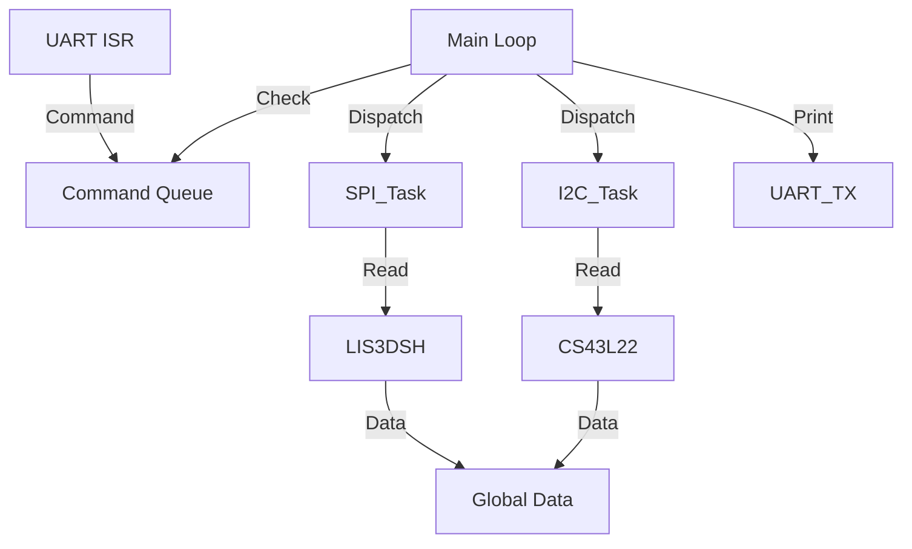

# Day 35: Week 5 Review and Project
## Phase 1: Core Embedded Engineering Foundations | Week 5: Serial Communication Protocols

---

> **📝 Content Creator Instructions:**
> This document is designed to produce **comprehensive, industry-grade educational content**. 
> - **Target Length:** The final filled document should be approximately **1000+ lines** of detailed markdown.
> - **Depth:** Do not skim over details. Explain *why*, not just *how*.
> - **Structure:** If a topic is complex, **DIVIDE IT INTO MULTIPLE PARTS** (Part 1, Part 2, etc.).
> - **Code:** Provide complete, compilable code examples, not just snippets.
> - **Visuals:** Use Mermaid diagrams for flows, architectures, and state machines.

---

## 🎯 Learning Objectives
*By the end of this day, the learner will be able to:*
1.  **Synthesize** Week 5 concepts (UART, SPI, I2C, DMA, Interrupts) into a unified system.
2.  **Architect** a "Sensor Hub" that aggregates data from multiple buses and reports it via UART.
3.  **Debug** protocol conflicts and timing issues in a multi-peripheral system.
4.  **Implement** a command-line interface (CLI) to query specific sensors.
5.  **Conduct** a self-assessment of Week 5 knowledge.

---

## 📚 Prerequisites & Preparation
*   **Hardware Required:**
    *   STM32F4 Discovery Board
    *   LIS3DSH (SPI) - Onboard.
    *   CS43L22 (I2C) - Onboard (We will just read ID).
    *   USB-UART Bridge.
*   **Software Required:**
    *   VS Code with ARM GCC Toolchain
*   **Prior Knowledge:**
    *   Days 29-34 (Week 5 Content)

---

## 📖 Theoretical Deep Dive

### 🔹 Part 1: System Integration
Real embedded systems often have:
*   **High Speed Sensors:** SPI (IMU, Flash).
*   **Low Speed Sensors:** I2C (Temp, Barometer, EEPROM).
*   **Debug/Control:** UART (Console, BLE, WiFi).

**Challenge:** Managing the CPU time. If I2C blocks for 10ms, the SPI buffer might overflow.
**Solution:**
1.  **DMA:** Offload SPI and I2C data movement.
2.  **State Machines:** Non-blocking logic.
3.  **Priorities:** UART RX > SPI DMA > I2C Event > Main Loop.

### 🔹 Part 2: Project Architecture

We will build a **Sensor Hub**.
*   **SPI Task:** Reads Accelerometer (XYZ) at 10 Hz.
*   **I2C Task:** Reads Audio DAC ID (as a "Health Check") at 1 Hz.
*   **UART Task:** Listens for commands (`GET ACCEL`, `GET ID`, `STREAM`).
*   **Main Loop:** Dispatches tasks.



---

## 💻 Implementation: Sensor Hub

> **Project Goal:** Integrate UART, SPI, and I2C drivers into one application.

### 🛠️ Hardware/System Configuration
*   **UART:** PA2/PA3.
*   **SPI:** PA5/PA6/PA7/PE3.
*   **I2C:** PB6/PB9.

### 👨‍💻 Code Implementation

#### Step 1: Drivers (Reuse)
Assume `UART_Init`, `SPI_Init`, `I2C_Init`, `LIS3DSH_ReadAxes`, `CS43L22_ReadID` are available.

#### Step 2: Global Data Structure
```c
typedef struct {
    int16_t x, y, z;
    uint8_t dac_id;
    uint32_t timestamp;
} SensorData_t;

volatile SensorData_t sensors;
```

#### Step 3: Non-Blocking Tasks
```c
uint32_t last_spi_time = 0;
uint32_t last_i2c_time = 0;

void Task_SPI(void) {
    if ((ms_ticks - last_spi_time) > 100) { // 10 Hz
        last_spi_time = ms_ticks;
        LIS3DSH_ReadAxes(&sensors.x, &sensors.y, &sensors.z);
    }
}

void Task_I2C(void) {
    if ((ms_ticks - last_i2c_time) > 1000) { // 1 Hz
        last_i2c_time = ms_ticks;
        sensors.dac_id = CS43L22_ReadID();
    }
}
```

#### Step 4: UART CLI
```c
void Task_UART(void) {
    char cmd[32];
    if (UART_GetLine(cmd)) {
        if (strcmp(cmd, "GET ACCEL") == 0) {
            printf("X:%d Y:%d Z:%d\r\n", sensors.x, sensors.y, sensors.z);
        } else if (strcmp(cmd, "GET ID") == 0) {
            printf("DAC ID: 0x%02X\r\n", sensors.dac_id);
        } else {
            printf("Unknown Command\r\n");
        }
    }
}
```

#### Step 5: Main Loop
```c
int main(void) {
    SysTick_Config(SystemCoreClock / 1000); // 1ms Tick
    UART_Init();
    SPI_Init();
    I2C_Init();
    
    printf("Sensor Hub Booted.\r\n");
    
    while(1) {
        Task_SPI();
        Task_I2C();
        Task_UART();
    }
}
```

---

## 🔬 Lab Exercise: Lab 35.1 - The Bottleneck

### 1. Lab Objectives
- Identify what happens when a task takes too long.
- Simulate a blocking I2C fault.

### 2. Step-by-Step Guide

#### Phase A: Normal Operation
Run the code. Type `GET ACCEL`. It works instantly.

#### Phase B: Fault Injection
1.  In `Task_I2C`, add `Delay_ms(500)` (simulating a slow sensor or timeout).
2.  Type `GET ACCEL` immediately after the 1Hz I2C update.
3.  **Observation:** The CLI feels sluggish. The SPI task is also delayed (sample rate drops).

#### Phase C: The Fix (Interrupts/DMA)
1.  Move SPI reading to a Timer Interrupt.
2.  Move I2C reading to a State Machine (Start -> Wait -> Read -> Stop) called from Main Loop, so it doesn't block.

### 3. Verification
With the fix, the CLI remains responsive even if I2C is slow.

---

## 🧪 Additional / Advanced Labs

### Lab 2: Bridge Mode
- **Goal:** UART-to-I2C Bridge.
- **Task:**
    1.  User types `I2C WRITE 94 01`.
    2.  MCU parses string, sends I2C command.
    3.  Useful for debugging new sensors without writing firmware.

### Lab 3: SPI Flash Logging
- **Goal:** Log sensor data to external SPI Flash (if available) or simulate it.
- **Task:**
    1.  Every 1 second, write `sensors` struct to a buffer.
    2.  When buffer full (Page Size 256 bytes), write to Flash via SPI.

---

## 🐞 Debugging & Troubleshooting

### Common Issues

#### 1. HardFault on printf
*   **Cause:** Stack overflow (printf uses a lot of stack).
*   **Solution:** Increase Stack Size in linker script (`.ld`).

#### 2. I2C/SPI Conflict
*   **Cause:** Sharing pins? (Unlikely on F4 Discovery).
*   **Cause:** Interrupt Priority Inversion. High priority I2C ISR blocking a lower priority SPI ISR?
*   **Solution:** Check NVIC priorities.

---

## ⚡ Optimization & Best Practices

### Code Quality
- **Endianness:** When sending multi-byte data (int16_t) over UART, decide on Little Endian (default for ARM) or Big Endian (Network order).
- **Packetizing:** Instead of ASCII `X:100`, send binary `[0xAA][0x55][X_L][X_H]...` for efficiency.

---

## 🧠 Assessment & Review

### Knowledge Check
1.  **Q:** Which protocol is best for long distances (e.g., 10 meters)?
    *   **A:** UART (with RS232/RS485 transceivers). I2C and SPI are for short distances (PCB level).
2.  **Q:** Can you have multiple Masters on SPI?
    *   **A:** Not easily. It requires complex handshake logic. I2C handles multi-master natively.

### Challenge Task
> **Task:** Implement a "Virtual COM Port" over USB (CDC Class) instead of UART. (Preview of USB Week). For now, just optimize the UART driver to use DMA for TX to support high-speed logging.

---

## 📚 Further Reading & References
- [Embedded Systems Patterns (O'Reilly)](https://www.oreilly.com/library/view/design-patterns-for/9781449314309/)

---
