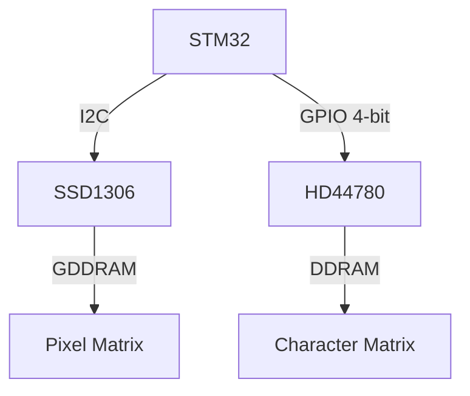

# Day 36: Interfacing LCDs/OLEDs
## Phase 1: Core Embedded Engineering Foundations | Week 6: Sensors and Actuators

---

> **📝 Content Creator Instructions:**
> This document is designed to produce **comprehensive, industry-grade educational content**. 
> - **Target Length:** The final filled document should be approximately **1000+ lines** of detailed markdown.
> - **Depth:** Do not skim over details. Explain *why*, not just *how*.
> - **Structure:** If a topic is complex, **DIVIDE IT INTO MULTIPLE PARTS** (Part 1, Part 2, etc.).
> - **Code:** Provide complete, compilable code examples, not just snippets.
> - **Visuals:** Use Mermaid diagrams for flows, architectures, and state machines.

---

## 🎯 Learning Objectives
*By the end of this day, the learner will be able to:*
1.  **Interface** a standard 16x2 Character LCD (HD44780) using 4-bit GPIO mode.
2.  **Interface** a Graphic OLED (SSD1306) using I2C.
3.  **Implement** a Framebuffer for the OLED to draw pixels, lines, and text.
4.  **Optimize** display updates to minimize flickering and bus traffic.
5.  **Create** custom characters (glyphs) for the 16x2 LCD.

---

## 📚 Prerequisites & Preparation
*   **Hardware Required:**
    *   STM32F4 Discovery Board
    *   16x2 LCD (HD44780 controller) + Potentiometer (Contrast)
    *   0.96" OLED (SSD1306, I2C)
*   **Software Required:**
    *   VS Code with ARM GCC Toolchain
    *   Font Array (e.g., 5x7 ASCII)
*   **Prior Knowledge:**
    *   Day 15 (GPIO)
    *   Day 33 (I2C)
*   **Datasheets:**
    *   [HD44780 Datasheet](https://www.sparkfun.com/datasheets/LCD/HD44780.pdf)
    *   [SSD1306 Datasheet](https://cdn-shop.adafruit.com/datasheets/SSD1306.pdf)

---

## 📖 Theoretical Deep Dive

### 🔹 Part 1: Character LCDs (HD44780)
*   **Interface:** Parallel (8-bit or 4-bit). We use 4-bit to save pins.
*   **Control Pins:**
    *   **RS (Register Select):** 0=Command, 1=Data.
    *   **RW (Read/Write):** Grounded (Write only).
    *   **E (Enable):** Falling edge triggers data latch.
*   **Memory:** DDRAM (Display Data RAM) stores ASCII codes. CGRAM (Character Generator RAM) stores custom fonts.

### 🔹 Part 2: Graphic OLEDs (SSD1306)
*   **Interface:** I2C or SPI.
*   **Resolution:** 128x64 pixels.
*   **Memory:** GDDRAM (Graphic Display Data RAM). 1 bit per pixel.
*   **Page Addressing:** Memory is divided into 8 pages (rows). Each page is 128 columns. Each column contains 8 vertical pixels (1 byte).



---

## 💻 Implementation: 16x2 LCD Driver (4-bit)

> **Instruction:** Connect RS->PE7, E->PE8, D4-D7 -> PE9-PE12.

### 🛠️ Hardware/System Configuration
*   **RS:** PE7
*   **E:** PE8
*   **D4-D7:** PE9, PE10, PE11, PE12

### 👨‍💻 Code Implementation

#### Step 1: Low Level Pulse (`lcd.c`)

```c
#include "stm32f4xx.h"

#define LCD_PORT GPIOE
#define RS_PIN (1 << 7)
#define E_PIN  (1 << 8)

void LCD_PulseEnable(void) {
    LCD_PORT->ODR |= E_PIN;
    Delay_us(5); // Enable pulse width > 450ns
    LCD_PORT->ODR &= ~E_PIN;
    Delay_us(50); // Execution time
}

void LCD_Send4Bits(uint8_t data) {
    // Clear D4-D7 (Bits 9-12)
    LCD_PORT->ODR &= ~(0xF << 9);
    // Set D4-D7
    LCD_PORT->ODR |= ((data & 0xF) << 9);
    LCD_PulseEnable();
}

void LCD_SendByte(uint8_t byte, uint8_t is_data) {
    if (is_data) LCD_PORT->ODR |= RS_PIN;
    else         LCD_PORT->ODR &= ~RS_PIN;

    // High Nibble
    LCD_Send4Bits(byte >> 4);
    // Low Nibble
    LCD_Send4Bits(byte & 0xF);
}
```

#### Step 2: Initialization
```c
void LCD_Init(void) {
    // GPIO Init... (Output Push-Pull)
    
    Delay_ms(50); // Wait for power up
    
    // 4-bit Magic Sequence
    LCD_PORT->ODR &= ~RS_PIN;
    LCD_Send4Bits(0x03); Delay_ms(5);
    LCD_Send4Bits(0x03); Delay_us(150);
    LCD_Send4Bits(0x03);
    LCD_Send4Bits(0x02); // Switch to 4-bit mode

    // Function Set: 4-bit, 2 Line, 5x8 Font
    LCD_SendByte(0x28, 0);
    // Display On, Cursor Off
    LCD_SendByte(0x0C, 0);
    // Clear Display
    LCD_SendByte(0x01, 0); Delay_ms(2);
    // Entry Mode Set
    LCD_SendByte(0x06, 0);
}
```

#### Step 3: Print String
```c
void LCD_Print(char *str) {
    while(*str) {
        LCD_SendByte(*str++, 1);
    }
}
```

---

## 💻 Implementation: OLED Framebuffer

> **Instruction:** I2C1 (PB6/PB9).

### 👨‍💻 Code Implementation

#### Step 1: Buffer
```c
#define SSD1306_WIDTH 128
#define SSD1306_HEIGHT 64

uint8_t ssd1306_buffer[SSD1306_WIDTH * SSD1306_HEIGHT / 8];

void SSD1306_DrawPixel(int x, int y, int color) {
    if (x >= SSD1306_WIDTH || y >= SSD1306_HEIGHT) return;

    if (color) {
        ssd1306_buffer[x + (y / 8) * SSD1306_WIDTH] |= (1 << (y % 8));
    } else {
        ssd1306_buffer[x + (y / 8) * SSD1306_WIDTH] &= ~(1 << (y % 8));
    }
}
```

#### Step 2: Update Display
```c
void SSD1306_UpdateScreen(void) {
    // Set Column Address 0-127
    // Set Page Address 0-7
    // Send Buffer via I2C DMA (from Day 34)
    OLED_Update_DMA(ssd1306_buffer);
}
```

---

## 🔬 Lab Exercise: Lab 36.1 - Custom Characters

### 1. Lab Objectives
- Create a "Battery Icon" on the 16x2 LCD.

### 2. Step-by-Step Guide

#### Phase A: Design
5x8 Pixel Grid.
```
0x0E, //  ###
0x1B, // # # #
0x11, // #   #
0x11, // #   #
0x1F, // #####
0x1F, // #####
0x1F, // #####
0x00  //
```

#### Phase B: Load to CGRAM
1.  Command 0x40 (Set CGRAM Address 0).
2.  Write 8 bytes of data.
3.  Command 0x80 (Return to DDRAM).

#### Phase C: Display
1.  `LCD_SendByte(0, 1);` // Print Character 0.

### 3. Verification
A battery icon should appear.

---

## 🧪 Additional / Advanced Labs

### Lab 2: OLED Animation
- **Goal:** Bouncing Ball.
- **Task:**
    1.  Clear Buffer.
    2.  Update X, Y of ball.
    3.  `DrawPixel` (or DrawCircle).
    4.  `UpdateScreen`.
    5.  Repeat.

### Lab 3: Double Buffering (OLED)
- **Goal:** Prevent tearing.
- **Task:**
    1.  Use two buffers.
    2.  DMA sends Buffer A.
    3.  CPU draws to Buffer B.
    4.  Swap pointers.

---

## 🐞 Debugging & Troubleshooting

### Common Issues

#### 1. LCD Garbage Characters
*   **Cause:** Timing violation. The HD44780 is slow. `Delay_us` might be too short.
*   **Solution:** Increase delays.

#### 2. OLED Random Noise
*   **Cause:** Reset pin not handled (if present).
*   **Cause:** Initialization sequence incorrect (Charge Pump not enabled).
*   **Solution:** Copy the Init sequence exactly from the datasheet or a trusted library (Adafruit/u8g2).

---

## ⚡ Optimization & Best Practices

### Performance Optimization
- **Dirty Rectangles:** Only update the part of the OLED that changed (e.g., just the clock digits) instead of the whole 1KB buffer. Saves I2C bandwidth.

### Code Quality
- **Fonts:** Store font arrays in Flash (`const uint8_t font[]`) to save RAM.

---

## 🧠 Assessment & Review

### Knowledge Check
1.  **Q:** Why do we use 4-bit mode on the LCD?
    *   **A:** To save 4 GPIO pins. Speed is rarely an issue for character displays.
2.  **Q:** How does the OLED map bytes to pixels?
    *   **A:** Vertical mapping. Bit 0 is top pixel, Bit 7 is bottom pixel of a byte.

### Challenge Task
> **Task:** Implement "Smooth Scrolling". Scroll a long text string across the 16x2 LCD using the `Shift Display` command (0x18/0x1C).

---

## 📚 Further Reading & References
- [HD44780 Instruction Set](https://en.wikipedia.org/wiki/Hitachi_HD44780_LCD_controller)

---
