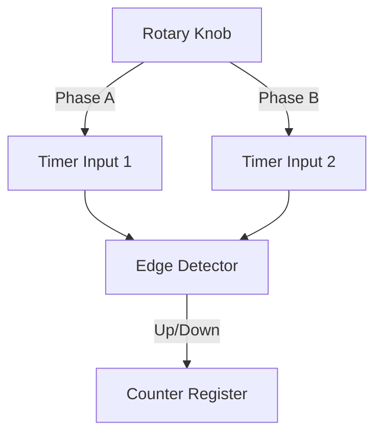

# Day 39: Rotary Encoders
## Phase 1: Core Embedded Engineering Foundations | Week 6: Sensors and Actuators

---

> **📝 Content Creator Instructions:**
> This document is designed to produce **comprehensive, industry-grade educational content**. 
> - **Target Length:** The final filled document should be approximately **1000+ lines** of detailed markdown.
> - **Depth:** Do not skim over details. Explain *why*, not just *how*.
> - **Structure:** If a topic is complex, **DIVIDE IT INTO MULTIPLE PARTS** (Part 1, Part 2, etc.).
> - **Code:** Provide complete, compilable code examples, not just snippets.
> - **Visuals:** Use Mermaid diagrams for flows, architectures, and state machines.

---

## 🎯 Learning Objectives
*By the end of this day, the learner will be able to:*
1.  **Explain** the working principle of Quadrature Encoders (Phase A, Phase B).
2.  **Configure** STM32 Timers in Encoder Interface Mode (Hardware decoding).
3.  **Implement** software debouncing for mechanical encoders (User Interface knobs).
4.  **Calculate** RPM and distance from encoder counts.
5.  **Handle** timer overflow/underflow for continuous rotation.

---

## 📚 Prerequisites & Preparation
*   **Hardware Required:**
    *   STM32F4 Discovery Board
    *   Rotary Encoder Module (KY-040 or similar)
*   **Software Required:**
    *   VS Code with ARM GCC Toolchain
*   **Prior Knowledge:**
    *   Day 16 (Timers)
    *   Day 11 (Interrupts)
*   **Datasheets:**
    *   [STM32F407 Reference Manual (Timer Encoder Mode)](https://www.st.com/resource/en/reference_manual/dm00031020.pdf)

---

## 📖 Theoretical Deep Dive

### 🔹 Part 1: Quadrature Encoding
An encoder generates two square waves (A and B) shifted by 90 degrees.
*   **Clockwise (CW):** A leads B. (A goes High, then B goes High).
*   **Counter-Clockwise (CCW):** B leads A. (B goes High, then A goes High).
*   **Resolution:**
    *   **X1:** Count rising edge of A.
    *   **X2:** Count rising/falling edge of A.
    *   **X4:** Count rising/falling edges of A AND B. (Highest resolution).

### 🔹 Part 2: STM32 Hardware Encoder Mode
STM32 Timers (TIM1, TIM2, TIM3, etc.) have a built-in Encoder Interface.
*   **Inputs:** CH1 (Phase A) and CH2 (Phase B).
*   **Counter (CNT):** Automatically increments or decrements based on direction.
*   **Advantages:** Zero CPU overhead. Glitch filtering built-in.



---

## 💻 Implementation: Hardware Encoder (TIM3)

> **Instruction:** Connect Encoder A to PA6 (TIM3_CH1) and B to PA7 (TIM3_CH2).

### 🛠️ Hardware/System Configuration
*   **PA6:** TIM3_CH1 (AF2).
*   **PA7:** TIM3_CH2 (AF2).
*   **Pull-Ups:** Enable Internal Pull-Ups if the encoder module doesn't have them.

### 👨‍💻 Code Implementation

#### Step 1: Initialization (`encoder.c`)

```c
#include "stm32f4xx.h"

void Encoder_Init(void) {
    // 1. Enable Clocks
    RCC->AHB1ENR |= (1 << 0); // GPIOA
    RCC->APB1ENR |= (1 << 1); // TIM3

    // 2. Configure GPIO (AF2)
    GPIOA->MODER |= (2 << 12) | (2 << 14); // AF
    GPIOA->PUPDR |= (1 << 12) | (1 << 14); // Pull-Up
    GPIOA->AFR[0] |= (2 << 24) | (2 << 28); // AF2

    // 3. Configure Timer in Encoder Mode
    // SMCR (Slave Mode Control Register)
    // SMS = 011 (Encoder Mode 3 - Count on both TI1 and TI2 edges -> X4)
    TIM3->SMCR |= (3 << 0);

    // 4. Configure Inputs
    // CC1S = 01 (Input TI1)
    // CC2S = 01 (Input TI2)
    TIM3->CCMR1 |= (1 << 0) | (1 << 8);
    
    // Filter (Optional but recommended for mechanical encoders)
    // IC1F = 1111 (F_DTS / 32, N=8)
    TIM3->CCMR1 |= (0xF << 4) | (0xF << 12);

    // 5. Set ARR (Auto Reload)
    // Max count before wrapping. 0xFFFF for 16-bit timer.
    TIM3->ARR = 0xFFFF;
    
    // 6. Enable Timer
    TIM3->CR1 |= (1 << 0);
}
```

#### Step 2: Read Function
```c
int16_t Encoder_GetCount(void) {
    return (int16_t)TIM3->CNT;
}

// To get delta (change since last read)
int16_t Encoder_GetDelta(void) {
    static int16_t last_cnt = 0;
    int16_t curr_cnt = (int16_t)TIM3->CNT;
    int16_t delta = curr_cnt - last_cnt;
    last_cnt = curr_cnt;
    return delta;
}
```

#### Step 3: Main Loop
```c
int main(void) {
    Encoder_Init();
    
    while(1) {
        int16_t delta = Encoder_GetDelta();
        if (delta != 0) {
            printf("Delta: %d, Abs: %d\r\n", delta, TIM3->CNT);
        }
        Delay_ms(100);
    }
}
```

---

## 🔬 Lab Exercise: Lab 39.1 - User Interface Knob

### 1. Lab Objectives
- Use the encoder to navigate a menu on the LCD (from Day 36).
- Implement "Click" button (SW pin).

### 2. Step-by-Step Guide

#### Phase A: Menu Logic
*   `MenuIndex` variable.
*   CW -> `MenuIndex++`.
*   CCW -> `MenuIndex--`.
*   Clamp between 0 and `MAX_ITEMS`.

#### Phase B: Implementation
```c
char *menu_items[] = {"Start", "Settings", "Info", "Exit"};
int menu_idx = 0;

void Update_Menu(void) {
    int16_t delta = Encoder_GetDelta();
    
    // Divide by 4 because X4 mode gives 4 counts per detent usually
    if (delta > 0) menu_idx++;
    if (delta < 0) menu_idx--;
    
    if (menu_idx < 0) menu_idx = 0;
    if (menu_idx > 3) menu_idx = 3;
    
    LCD_Clear();
    LCD_Print(menu_items[menu_idx]);
}
```

### 3. Verification
Turning the knob changes the text on the LCD.

---

## 🧪 Additional / Advanced Labs

### Lab 2: Motor Speed Measurement
- **Goal:** Measure RPM of a DC motor with an optical encoder disk.
- **Task:**
    1.  Attach encoder disk to motor.
    2.  Use Encoder Mode to count pulses.
    3.  Use another Timer (TIM2) to generate an interrupt every 100ms.
    4.  In ISR: `RPM = (DeltaCounts / PPR) * (60 / 0.1s)`.

### Lab 3: Velocity Control Loop
- **Goal:** Maintain constant speed.
- **Task:**
    1.  Measure RPM.
    2.  `Error = TargetRPM - MeasuredRPM`.
    3.  `PWM += Kp * Error`. (Simple P-Controller).
    4.  Apply PWM to Motor.

---

## 🐞 Debugging & Troubleshooting

### Common Issues

#### 1. Counts fluctuate (Jitter)
*   **Cause:** Mechanical bounce.
*   **Solution:** Increase the Input Filter (`IC1F` bits in `CCMR1`). Or add external RC filters (10k + 10nF).

#### 2. Direction is wrong
*   **Cause:** A and B swapped.
*   **Solution:** Swap wires or set `CC1P` (Polarity) bit in `CCER`.

#### 3. Counter overflow
*   **Cause:** Spinning too fast or too long.
*   **Solution:** Handle the overflow interrupt (`UIF`) to track "Revolutions". `TotalPos = (Revs * 65536) + CNT`.

---

## ⚡ Optimization & Best Practices

### Performance Optimization
- **Hardware Mode:** Always use the hardware encoder mode if pins are available. Software polling (reading GPIOs in a loop) is unreliable at high speeds and wastes CPU.

### Code Quality
- **Atomic Reads:** Reading a 32-bit counter (on 32-bit timers like TIM2/TIM5) is atomic. Reading 16-bit is atomic. But calculating `TotalPos` (64-bit) needs a critical section (disable interrupts) if the Update Interrupt can fire during the read.

---

## 🧠 Assessment & Review

### Knowledge Check
1.  **Q:** What is the resolution of a 100 PPR encoder in X4 mode?
    *   **A:** 400 counts per revolution.
2.  **Q:** Why do we need the Z-index (Index channel)?
    *   **A:** It gives a pulse once per revolution. Used for absolute positioning (homing).

### Challenge Task
> **Task:** Implement a "Safe Lock". The user must turn: 3 clicks CW, 2 clicks CCW, 5 clicks CW. If the sequence matches, unlock (LED Green). If not, reset.

---

## 📚 Further Reading & References
- [STM32 Timer Encoder Mode Application Note](https://www.st.com/resource/en/application_note/dm00042534-stm32-cross-series-timer-overview-stmicroelectronics.pdf)

---
