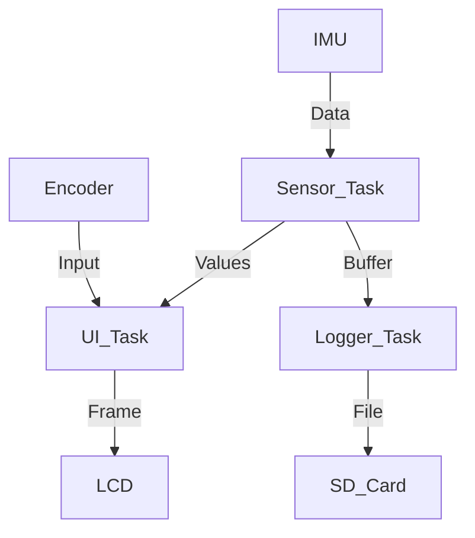

# Day 42: Week 6 Review and Project
## Phase 1: Core Embedded Engineering Foundations | Week 6: Sensors and Actuators

---

> **📝 Content Creator Instructions:**
> This document is designed to produce **comprehensive, industry-grade educational content**. 
> - **Target Length:** The final filled document should be approximately **1000+ lines** of detailed markdown.
> - **Depth:** Do not skim over details. Explain *why*, not just *how*.
> - **Structure:** If a topic is complex, **DIVIDE IT INTO MULTIPLE PARTS** (Part 1, Part 2, etc.).
> - **Code:** Provide complete, compilable code examples, not just snippets.
> - **Visuals:** Use Mermaid diagrams for flows, architectures, and state machines.

---

## 🎯 Learning Objectives
*By the end of this day, the learner will be able to:*
1.  **Synthesize** Week 6 concepts (LCD, IMU, Motors, Encoders, SD Card) into a unified system.
2.  **Architect** a "Black Box Recorder" that logs IMU data to SD and displays status on LCD.
3.  **Debug** power consumption and bus contention issues in a sensor-rich system.
4.  **Implement** a robust menu system using the Rotary Encoder.
5.  **Conduct** a self-assessment of Week 6 knowledge.

---

## 📚 Prerequisites & Preparation
*   **Hardware Required:**
    *   STM32F4 Discovery Board
    *   LCD/OLED
    *   IMU (LIS3DSH)
    *   SD Card Module
    *   Rotary Encoder
*   **Software Required:**
    *   VS Code with ARM GCC Toolchain
*   **Prior Knowledge:**
    *   Days 36-41 (Week 6 Content)

---

## 📖 Theoretical Deep Dive

### 🔹 Part 1: System Integration Challenges
*   **Pin Conflicts:** LCD needs many pins. SD Card needs SPI. IMU needs SPI.
    *   **Solution:** Share SPI bus (CS pins separate). Use I2C for LCD if possible.
*   **Timing:** Logging to SD Card (Write Latency) can block the UI.
    *   **Solution:** Buffer data. Write in large chunks. Use DMA.

### 🔹 Part 2: Project Architecture

We will build a **Vehicle Data Recorder**.
*   **Inputs:** IMU (Accel/Gyro), Encoder (Menu).
*   **Outputs:** LCD (Dashboard), SD Card (Black Box).
*   **Logic:**
    *   **Idle:** Show Live Data.
    *   **Record:** Log data to `trip_X.csv`.
    *   **Menu:** Settings (Sample Rate, Unit).



---

## 💻 Implementation: Vehicle Data Recorder

### 🛠️ Hardware/System Configuration
*   **SPI1:** IMU (PA5/6/7, CS=PE3).
*   **SPI2:** SD Card (PB13/14/15, CS=PB12).
*   **I2C1:** OLED (PB6/9).
*   **TIM3:** Encoder (PA6/7).

### 👨‍💻 Code Implementation

#### Step 1: Global State
```c
typedef enum { STATE_IDLE, STATE_RECORDING } State_t;
State_t current_state = STATE_IDLE;
uint32_t start_time = 0;
```

#### Step 2: Logger Task
```c
void Task_Logger(void) {
    static uint32_t last_log = 0;
    if (current_state != STATE_RECORDING) return;
    
    if ((ms_ticks - last_log) > 100) { // 10 Hz
        last_log = ms_ticks;
        
        int16_t x, y, z;
        LIS3DSH_ReadAxes(&x, &y, &z);
        
        char buf[64];
        sprintf(buf, "%d,%d,%d,%d\n", ms_ticks, x, y, z);
        
        UINT bw;
        f_write(&file, buf, strlen(buf), &bw);
        
        // Sync every 10 seconds
        if ((ms_ticks - start_time) % 10000 < 100) f_sync(&file);
    }
}
```

#### Step 3: UI Task
```c
void Task_UI(void) {
    // Read Encoder
    // Update OLED
    char buf[32];
    sprintf(buf, "State: %s", current_state == STATE_RECORDING ? "REC" : "IDLE");
    SSD1306_SetCursor(0,0);
    SSD1306_WriteString(buf);
    
    // Check Button (Encoder Switch)
    if (Button_Pressed()) {
        if (current_state == STATE_IDLE) {
            // Start Recording
            f_open(&file, "trip.csv", FA_WRITE | FA_CREATE_ALWAYS);
            current_state = STATE_RECORDING;
            start_time = ms_ticks;
        } else {
            // Stop Recording
            f_close(&file);
            current_state = STATE_IDLE;
        }
    }
    
    SSD1306_UpdateScreen();
}
```

#### Step 4: Main Loop
```c
int main(void) {
    // Init All Drivers...
    f_mount(&fs, "", 1);
    
    while(1) {
        Task_Logger();
        Task_UI();
    }
}
```

---

## 🔬 Lab Exercise: Lab 42.1 - Crash Detection

### 1. Lab Objectives
- Automatically save and stop recording if a crash is detected.

### 2. Step-by-Step Guide

#### Phase A: Logic
1.  Calculate Magnitude $G = \sqrt{x^2+y^2+z^2}$.
2.  If $G > 3g$ (Threshold):
    *   Stop Recording immediately.
    *   Rename file to `CRASH.CSV`.
    *   Display "CRASH DETECTED" on LCD.

#### Phase B: Implementation
```c
if (magnitude > 3000) { // 3000 mg
    f_close(&file);
    f_rename("trip.csv", "CRASH.CSV");
    current_state = STATE_IDLE;
    LCD_ShowAlert("CRASH!");
    while(1); // Halt
}
```

### 3. Verification
Shake the board violently. Verify the file is renamed.

---

## 🧪 Additional / Advanced Labs

### Lab 2: Playback Mode
- **Goal:** Replay a trip on the LCD.
- **Task:**
    1.  Open `trip.csv`.
    2.  Read line by line.
    3.  Visualize G-force on a graph on the OLED.
    4.  Use Encoder to scrub forward/backward.

### Lab 3: GPS Integration
- **Goal:** Add location.
- **Task:**
    1.  Connect GPS module to UART.
    2.  Parse NMEA sentences ($GPGGA).
    3.  Log Lat/Lon to CSV.

---

## 🐞 Debugging & Troubleshooting

### Common Issues

#### 1. SD Card Corruption
*   **Cause:** Removing card while writing.
*   **Solution:** Always press the Stop button (f_close) before removing. Add a "Safe to Remove" LED.

#### 2. Slow UI
*   **Cause:** SD Write blocking the main loop.
*   **Solution:** Use DMA for SD SPI, or use an RTOS (Phase 2 preview) to run UI in a higher priority task.

---

## ⚡ Optimization & Best Practices

### Code Quality
- **Error Handling:** Check return codes of every `f_` function. If `f_write` fails (disk full), stop recording and notify user.

---

## 🧠 Assessment & Review

### Knowledge Check
1.  **Q:** How do you share an SPI bus between SD Card and Sensor?
    *   **A:** Connect SCK, MISO, MOSI together. Use separate CS pins. Ensure only one CS is Low at a time.
2.  **Q:** What is the benefit of a circular buffer for logging?
    *   **A:** If the SD card is busy (internal housekeeping), the sensor data can pile up in RAM instead of being lost.

### Challenge Task
> **Task:** Implement "Pre-Trigger Buffer". Continuously record to a RAM ring buffer (last 10 seconds). When a button is pressed (or crash detected), dump the RAM buffer to SD, then continue recording. This captures the moments *before* the event.

---

## 📚 Further Reading & References
- [Building Embedded Systems (O'Reilly)](https://www.oreilly.com/library/view/building-embedded-systems/9781491922095/)

---
