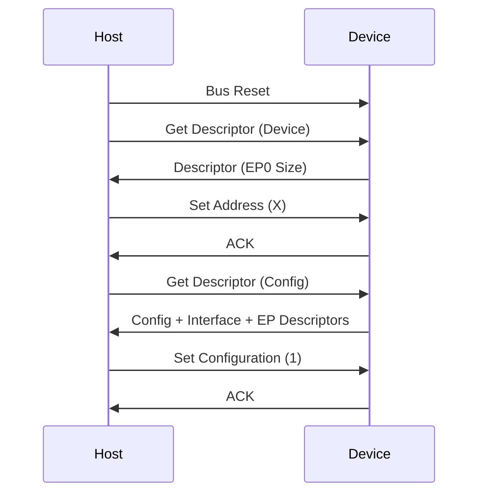

# Day 45: USB Device Basics (Enumeration)
## Phase 1: Core Embedded Engineering Foundations | Week 7: Advanced Peripherals

---

> **📝 Content Creator Instructions:**
> This document is designed to produce **comprehensive, industry-grade educational content**. 
> - **Target Length:** The final filled document should be approximately **1000+ lines** of detailed markdown.
> - **Depth:** Do not skim over details. Explain *why*, not just *how*.
> - **Structure:** If a topic is complex, **DIVIDE IT INTO MULTIPLE PARTS** (Part 1, Part 2, etc.).
> - **Code:** Provide complete, compilable code examples, not just snippets.
> - **Visuals:** Use Mermaid diagrams for flows, architectures, and state machines.

---

## 🎯 Learning Objectives
*By the end of this day, the learner will be able to:*
1.  **Explain** the USB 2.0 Full Speed architecture (Host, Device, Endpoints).
2.  **Analyze** the Enumeration Process (Reset, Address, Config).
3.  **Construct** USB Descriptors (Device, Configuration, Interface, Endpoint).
4.  **Configure** the STM32 USB OTG FS peripheral in Device Mode.
5.  **Debug** enumeration failures using a USB Analyzer (Wireshark/USBPcap).

---

## 📚 Prerequisites & Preparation
*   **Hardware Required:**
    *   STM32F4 Discovery Board (Micro-USB cable to CN5 - USB OTG).
*   **Software Required:**
    *   VS Code with ARM GCC Toolchain
    *   [TinyUSB Stack](https://github.com/hathach/tinyusb) or STM32 HAL USB Library (We will look at the concepts, maybe implement a minimal stack or use TinyUSB).
    *   USB Tree View (Windows) or `lsusb` (Linux).
*   **Prior Knowledge:**
    *   Day 11 (Interrupts)
*   **Datasheets:**
    *   [USB 2.0 Specification](https://www.usb.org/document-library/usb-20-specification)

---

## 📖 Theoretical Deep Dive

### 🔹 Part 1: USB Architecture
*   **Host Controlled:** The Host (PC) initiates all transfers. The Device cannot speak unless spoken to (polled).
*   **Endpoints (EP):** Logical buffers in the device.
    *   **EP0:** Control Endpoint. Mandatory. Used for Enumeration.
    *   **EP1-15:** Data Endpoints (IN/OUT).
*   **Pipes:** Connection between Host software and Device Endpoint.
*   **Transfer Types:**
    *   **Control:** Setup packets (Command/Status).
    *   **Interrupt:** Small data, low latency (Mouse/Keyboard).
    *   **Bulk:** Large data, guaranteed delivery (Flash Drive).
    *   **Isochronous:** Streaming, guaranteed bandwidth, no retry (Audio/Video).

### 🔹 Part 2: Enumeration
When you plug in a device:
1.  **Power:** Host detects pull-up on D+ (Full Speed).
2.  **Reset:** Host drives Bus Reset (SE0 for > 10ms).
3.  **Get Descriptor (Device):** Host asks "Who are you?". Device replies with Max Packet Size of EP0.
4.  **Set Address:** Host assigns an address (e.g., 5). Device responds to 5 from now on.
5.  **Get Descriptor (Full):** Host asks for everything (VID, PID, Strings).
6.  **Set Configuration:** Host selects a driver configuration. Device is now active.



---

## 💻 Implementation: USB Descriptors

> **Instruction:** We will define the C structures that describe a simple "Virtual COM Port" (CDC Class).

### 👨‍💻 Code Implementation

#### Step 1: Device Descriptor
```c
#include <stdint.h>

// Standard USB Descriptor Types
#define USB_DESC_TYPE_DEVICE 0x01
#define USB_DESC_TYPE_CONFIGURATION 0x02
#define USB_DESC_TYPE_STRING 0x03
#define USB_DESC_TYPE_INTERFACE 0x04
#define USB_DESC_TYPE_ENDPOINT 0x05

const uint8_t USBD_DeviceDesc[] = {
    0x12,                       // bLength (18 bytes)
    USB_DESC_TYPE_DEVICE,       // bDescriptorType
    0x00, 0x02,                 // bcdUSB (2.00)
    0x02,                       // bDeviceClass (CDC)
    0x00,                       // bDeviceSubClass
    0x00,                       // bDeviceProtocol
    0x40,                       // bMaxPacketSize0 (64 bytes)
    0x83, 0x04,                 // idVendor (0x0483 - ST)
    0x40, 0x57,                 // idProduct (0x5740 - Virtual COM)
    0x00, 0x02,                 // bcdDevice (2.00)
    0x01,                       // iManufacturer (String Index)
    0x02,                       // iProduct (String Index)
    0x03,                       // iSerialNumber (String Index)
    0x01                        // bNumConfigurations
};
```

#### Step 2: Configuration Descriptor
This is a hierarchy: Config -> Interface -> Endpoint.
```c
const uint8_t USBD_ConfigDesc[] = {
    // --- Configuration Descriptor ---
    0x09, 0x02, 0x43, 0x00, 0x02, 0x01, 0x00, 0xC0, 0x32,
    // Total Length: 67 bytes. 2 Interfaces. Self-powered. 100mA.

    // --- Interface 0 (CDC Control) ---
    0x09, 0x04, 0x00, 0x00, 0x01, 0x02, 0x02, 0x01, 0x00,
    // Class: Comm (0x02). 1 Endpoint (Interrupt).

    // ... CDC Functional Descriptors (Header, Call Mgmt, ACM, Union) ...
    
    // --- Endpoint (Interrupt IN) ---
    0x07, 0x05, 0x82, 0x03, 0x08, 0x00, 0xFF,
    // EP2 IN. Type: Interrupt. Size: 8. Interval: 255ms.

    // --- Interface 1 (CDC Data) ---
    0x09, 0x04, 0x01, 0x00, 0x02, 0x0A, 0x00, 0x00, 0x00,
    // Class: Data (0x0A). 2 Endpoints (Bulk).

    // --- Endpoint (Bulk OUT) ---
    0x07, 0x05, 0x01, 0x02, 0x40, 0x00, 0x00,
    // EP1 OUT. Type: Bulk. Size: 64.

    // --- Endpoint (Bulk IN) ---
    0x07, 0x05, 0x81, 0x02, 0x40, 0x00, 0x00
    // EP1 IN. Type: Bulk. Size: 64.
};
```

---

## 💻 Implementation: STM32 USB OTG FS Init

> **Note:** Implementing a full USB stack from scratch is a 5000-line task. We will focus on the *Initialization* and *Interrupt Handling* logic using the register definitions.

### 🛠️ Hardware/System Configuration
*   **Pins:** PA11 (D-), PA12 (D+).
*   **VBUS:** PA9 (Sensing).
*   **Clock:** 48 MHz is MANDATORY.
    *   PLL Setup: HSE (8MHz) -> /M(8) -> *N(336) -> /P(2) = 168MHz (SysClk).
    *   PLL48CLK: HSE -> /M(8) -> *N(336) -> /Q(7) = 48 MHz.

### 👨‍💻 Code Implementation

#### Step 1: Clock Init
```c
void USB_Clock_Init(void) {
    // Enable GPIOA, OTG FS
    RCC->AHB1ENR |= (1 << 0);
    RCC->AHB2ENR |= (1 << 7); // OTG FS
    
    // Configure PA11, PA12 as AF10 (OTG_FS)
    GPIOA->MODER |= (2 << 22) | (2 << 24);
    GPIOA->AFR[1] |= (10 << 12) | (10 << 16);
    
    // Configure PA9 (VBUS) as Input? Or ignore if NO_VBUS_SENSING
}
```

#### Step 2: Core Init
```c
void USB_Core_Init(void) {
    USB_OTG_FS->GUSBCFG |= (1 << 30); // Force Device Mode
    Delay_ms(50);
    
    // Init Device Config
    USB_OTG_FS_DEVICE->DCFG |= (3 << 0); // Speed: Full Speed
    
    // Enable Interrupts
    USB_OTG_FS->GINTMSK |= (1 << 11) | (1 << 12) | (1 << 13) | (1 << 4) | (1 << 19); 
    // USBSusp, USBReset, EnumDone, RXFLVL, OEPINT/IEPINT
    
    // Connect (Soft Disconnect = 0)
    USB_OTG_FS_DEVICE->DCTL &= ~(1 << 1);
}
```

---

## 🔬 Lab Exercise: Lab 45.1 - Device Detection

### 1. Lab Objectives
- Plug the board into PC.
- Verify PC detects "Unknown Device" (because we haven't handled the requests yet) or "STM32 Device".

### 2. Step-by-Step Guide

#### Phase A: Run Code
Flash the code with Clock and Core Init.

#### Phase B: Plug In
Connect USB.

#### Phase C: Check Device Manager
*   Windows: Should see a device appear (maybe with error Code 43 "Descriptor Request Failed").
*   **Success:** This means the Pull-Up on D+ was enabled, and the Host saw it. The Host tried to talk, but we didn't reply, so it timed out.

### 3. Verification
If nothing happens, check the 48 MHz clock. USB DOES NOT WORK without exactly 48 MHz (+/- 0.25%).

---

## 🧪 Additional / Advanced Labs

### Lab 2: Handling Reset
- **Goal:** Detect Bus Reset.
- **Task:**
    1.  In `OTG_FS_IRQHandler`, check `USBRST` flag.
    2.  If set, clear it. Reset Address to 0. Set Endpoints to NAK.

### Lab 3: Handling Enumeration Done
- **Goal:** Read Speed.
- **Task:**
    1.  Check `ENUMDNE` flag.
    2.  Read `DSTS` register to confirm Full Speed.
    3.  Set Max Packet Size of EP0 to 64 bytes in `DIEPCTL0`.

---

## 🐞 Debugging & Troubleshooting

### Common Issues

#### 1. Device Not Recognized
*   **Cause:** Clock issue.
*   **Cause:** D+/D- swapped (unlikely on Discovery board).
*   **Cause:** Stack overflow (USB interrupts use stack).

#### 2. Code 10 / Code 43
*   **Cause:** Descriptor errors. VID/PID mismatch.
*   **Solution:** Use a USB Analyzer (software or hardware) to see exactly where it fails.

---

## ⚡ Optimization & Best Practices

### Code Quality
- **Use a Stack:** Writing a USB stack is reinventing the wheel. Use **TinyUSB** or **CherryUSB**. They handle the complex state machine (Enumeration, Setup Packets) and let you focus on the Application (CDC, HID, MSC).

---

## 🧠 Assessment & Review

### Knowledge Check
1.  **Q:** What is the difference between VID and PID?
    *   **A:** VID (Vendor ID) is assigned by USB-IF (costs $5000+). PID (Product ID) is assigned by the Vendor.
2.  **Q:** Why is EP0 special?
    *   **A:** It is bidirectional and used for control transfers. All devices must support EP0.

### Challenge Task
> **Task:** Implement a "Blinky" USB. When the Host sends a specific Vendor Request (e.g., `bRequest = 0x01`), toggle the LED.

---

## 📚 Further Reading & References
- [USB in a NutShell](https://www.beyondlogic.org/usbnutshell/usb1.shtml)

---
