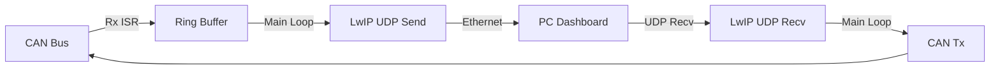

# Day 49: Week 7 Review and Project
## Phase 1: Core Embedded Engineering Foundations | Week 7: Advanced Peripherals

---

> **📝 Content Creator Instructions:**
> This document is designed to produce **comprehensive, industry-grade educational content**. 
> - **Target Length:** The final filled document should be approximately **1000+ lines** of detailed markdown.
> - **Depth:** Do not skim over details. Explain *why*, not just *how*.
> - **Structure:** If a topic is complex, **DIVIDE IT INTO MULTIPLE PARTS** (Part 1, Part 2, etc.).
> - **Code:** Provide complete, compilable code examples, not just snippets.
> - **Visuals:** Use Mermaid diagrams for flows, architectures, and state machines.

---

## 🎯 Learning Objectives
*By the end of this day, the learner will be able to:*
1.  **Synthesize** Week 7 concepts (CAN, USB, Ethernet) into a complex gateway system.
2.  **Architect** a "CAN-Ethernet Gateway" that forwards CAN frames to UDP and vice versa.
3.  **Debug** high-speed data paths and buffer overflows.
4.  **Implement** a robust packet format for encapsulation.
5.  **Conduct** a self-assessment of Week 7 knowledge.

---

## 📚 Prerequisites & Preparation
*   **Hardware Required:**
    *   STM32F4 Board with Ethernet and CAN.
    *   CAN Bus (Another node or Loopback).
    *   PC with Wireshark and Packet Sender tool.
*   **Software Required:**
    *   VS Code with ARM GCC Toolchain
*   **Prior Knowledge:**
    *   Days 43-48 (Week 7 Content)

---

## 📖 Theoretical Deep Dive

### 🔹 Part 1: Gateway Architecture
A gateway translates between two protocols.
*   **Upstream (Ethernet):** High bandwidth (100 Mbps). Long distance (LAN/WAN).
*   **Downstream (CAN):** Low bandwidth (500 kbps). Real-time control.
*   **Encapsulation:** We need to wrap the CAN frame (ID, DLC, Data) inside a UDP packet.

### 🔹 Part 2: Packet Format
Simple custom protocol over UDP Port 3000.
```c
typedef struct {
    uint32_t id;      // CAN ID
    uint8_t  dlc;     // Data Length
    uint8_t  data[8]; // Payload
    uint8_t  flags;   // RTR, ExtID
} CanUdpPacket_t; // Size = 14 bytes
```



---

## 💻 Implementation: CAN-Ethernet Gateway

### 🛠️ Hardware/System Configuration
*   **CAN1:** 500 kbps.
*   **ETH:** Static IP 192.168.1.10.
*   **PC:** IP 192.168.1.5.

### 👨‍💻 Code Implementation

#### Step 1: UDP Initialization
```c
struct udp_pcb *upcb;

void UDP_Gateway_Init(void) {
    upcb = udp_new();
    udp_bind(upcb, IP_ADDR_ANY, 3000); // Listen on Port 3000
    udp_recv(upcb, udp_recv_callback, NULL);
}
```

#### Step 2: Forwarding CAN -> UDP
```c
// Called from Main Loop (Polling Ring Buffer)
void Process_CAN_to_UDP(void) {
    CanMsg_t msg;
    if (RingBuffer_Read(&can_rx_buf, &msg)) {
        struct pbuf *p = pbuf_alloc(PBUF_TRANSPORT, sizeof(CanUdpPacket_t), PBUF_RAM);
        
        CanUdpPacket_t *pkt = (CanUdpPacket_t *)p->payload;
        pkt->id = msg.id;
        pkt->dlc = msg.len;
        memcpy(pkt->data, msg.data, 8);
        
        // Send to PC (Broadcast or Unicast)
        ip_addr_t dest;
        IP4_ADDR(&dest, 192, 168, 1, 5);
        
        udp_sendto(upcb, p, &dest, 3000);
        pbuf_free(p);
    }
}
```

#### Step 3: Forwarding UDP -> CAN
```c
void udp_recv_callback(void *arg, struct udp_pcb *pcb, struct pbuf *p, 
                       const ip_addr_t *addr, u16_t port) {
    if (p->len == sizeof(CanUdpPacket_t)) {
        CanUdpPacket_t *pkt = (CanUdpPacket_t *)p->payload;
        
        // Send to CAN
        CAN1_Tx(pkt->id, pkt->data, pkt->dlc);
    }
    pbuf_free(p);
}
```

#### Step 4: Main Loop
```c
int main(void) {
    // Init CAN, ETH, LwIP
    UDP_Gateway_Init();
    
    while(1) {
        ethernetif_input(&gnetif); // Poll ETH
        sys_check_timeouts();      // LwIP Timers
        
        Process_CAN_to_UDP();      // Forwarding
    }
}
```

---

## 🔬 Lab Exercise: Lab 49.1 - Remote Control

### 1. Lab Objectives
- Control the STM32 LEDs via UDP from PC.
- See the CAN traffic generated by the STM32 on the PC.

### 2. Step-by-Step Guide

#### Phase A: PC Sender
1.  Open "Packet Sender" (Free tool).
2.  Send UDP to 192.168.1.10:3000.
3.  Hex: `00 00 01 23 01 01` (ID 0x123, DLC 1, Data 0x01).
4.  **Result:** STM32 receives UDP, sends CAN frame 0x123. (If Loopback is ON, it receives it back).

#### Phase B: PC Listener
1.  Bind Packet Sender to Port 3000 (UDP).
2.  Push Button on STM32 -> Sends CAN 0x321.
3.  **Result:** Packet Sender shows incoming hex data.

### 3. Verification
Use Wireshark to see the UDP packets flying.

---

## 🧪 Additional / Advanced Labs

### Lab 2: USB-CAN Adapter
- **Goal:** Use USB instead of Ethernet.
- **Task:**
    1.  Use CDC Class (Day 46).
    2.  Protocol: SLCAN (Lawicel). `t1231AA\r` (Standard ID 123, Len 1, Data AA).
    3.  This makes the STM32 compatible with Linux `slcand` tools!

### Lab 3: High Load Test
- **Goal:** Flood CAN bus.
- **Task:**
    1.  Generate 1000 CAN frames/sec.
    2.  Verify if UDP drops packets (UDP is unreliable).
    3.  Observe LwIP `pbuf` allocation failures if PC is slow to receive.

---

## 🐞 Debugging & Troubleshooting

### Common Issues

#### 1. Endianness
*   **Issue:** CAN ID 0x12345678 arrives as 0x78563412.
*   **Solution:** Use `htonl` (Host to Network Long) and `ntohl` when putting/getting 32-bit integers in the packet. Network byte order is Big Endian. ARM is Little Endian.

#### 2. UDP Packet Loss
*   **Cause:** No buffer space in LwIP or Ethernet Switch congestion.
*   **Solution:** Increase `PBUF_POOL_SIZE`. Use TCP for reliable transfer (but higher latency).

---

## ⚡ Optimization & Best Practices

### Code Quality
- **Zero Copy:** In `Process_CAN_to_UDP`, if we allocate a pbuf, we copy data. Advanced: Use a custom pbuf that points to the Ring Buffer memory directly (dangerous if Ring Buffer overwrites before send completes).

---

## 🧠 Assessment & Review

### Knowledge Check
1.  **Q:** Why use UDP for CAN tunneling?
    *   **A:** Low overhead, low latency. If a CAN frame is lost, it's usually better to drop it than to pause everything for TCP retransmission (which ruins real-time behavior).
2.  **Q:** What is the max throughput of CAN?
    *   **A:** 1 Mbps (Classical CAN). ~50% efficiency -> 500 kbps payload. Ethernet (100 Mbps) can easily swallow this.

### Challenge Task
> **Task:** Implement "Web Dashboard". Serve a webpage (Day 48) with a WebSocket. Stream CAN data to the browser via WebSocket (TCP) for a real-time graph.

---

## 📚 Further Reading & References
- [SocketCAN (Linux Kernel)](https://www.kernel.org/doc/html/latest/networking/can.html)

---
