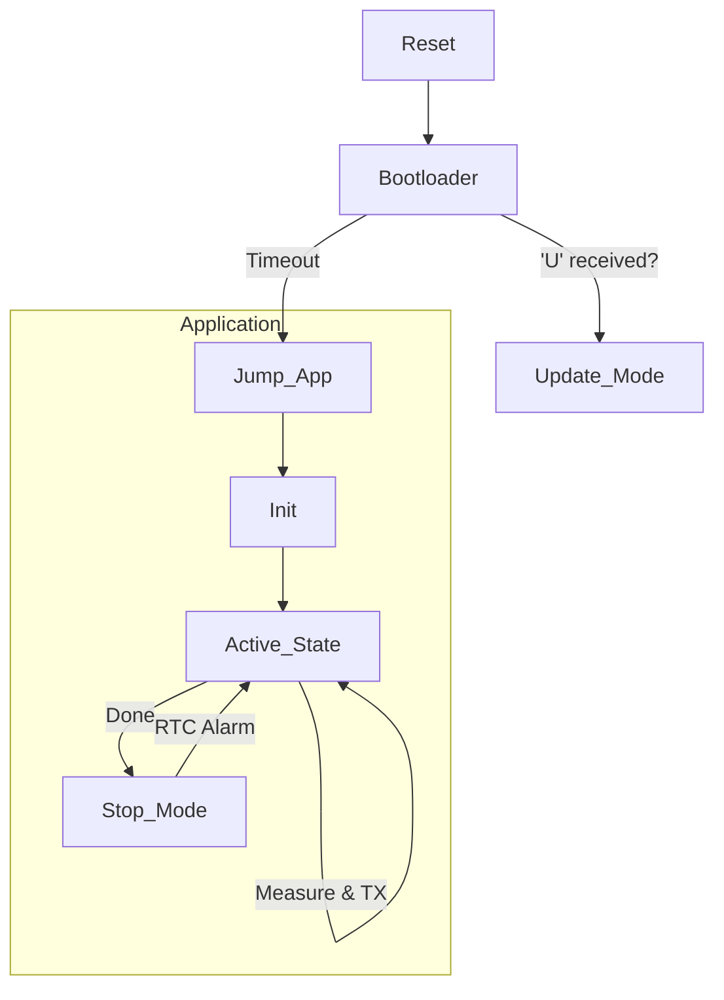

# Day 56: Week 8 Review and Project
## Phase 1: Core Embedded Engineering Foundations | Week 8: Power Management & Bootloaders

---

> **📝 Content Creator Instructions:**
> This document is designed to produce **comprehensive, industry-grade educational content**. 
> - **Target Length:** The final filled document should be approximately **1000+ lines** of detailed markdown.
> - **Depth:** Do not skim over details. Explain *why*, not just *how*.
> - **Structure:** If a topic is complex, **DIVIDE IT INTO MULTIPLE PARTS** (Part 1, Part 2, etc.).
> - **Code:** Provide complete, compilable code examples, not just snippets.
> - **Visuals:** Use Mermaid diagrams for flows, architectures, and state machines.

---

## 🎯 Learning Objectives
*By the end of this day, the learner will be able to:*
1.  **Synthesize** Week 8 concepts (Low Power, Bootloaders, Flash, Watchdogs) into a unified system.
2.  **Architect** a "Green IoT Node" that sleeps 99% of the time and updates firmware over UART.
3.  **Debug** wakeup issues and flash programming errors.
4.  **Implement** a robust main loop with "Task Flags" and "Sleep Permission".
5.  **Conduct** a self-assessment of Week 8 knowledge.

---

## 📚 Prerequisites & Preparation
*   **Hardware Required:**
    *   STM32F4 Discovery Board
    *   UART Bridge.
    *   Multimeter (Current).
*   **Software Required:**
    *   VS Code with ARM GCC Toolchain
    *   Python Script (from Day 53).
*   **Prior Knowledge:**
    *   Days 50-55 (Week 8 Content)

---

## 📖 Theoretical Deep Dive

### 🔹 Part 1: The "Green" Architecture
An IoT node typically does this:
1.  **Wake Up** (Timer or Event).
2.  **Sense** (Read ADC/I2C).
3.  **Process** (Filter/Average).
4.  **Transmit** (LoRa/BLE/WiFi).
5.  **Sleep** (Stop/Standby).

**Challenge:** How to handle Firmware Updates?
*   We can't update while sleeping.
*   **Solution:** Check for update request immediately after wakeup. Or use a specific "Maintenance Window".

### 🔹 Part 2: Project Architecture

We will build a **Green IoT Node**.
*   **Bootloader:** Checks for 'U' on UART at Reset. If yes, update. If no, jump to App.
*   **App:**
    *   Configures IWDG (Safety).
    *   Reads Internal Temp Sensor.
    *   Prints to UART.
    *   Enters STOP Mode for 5 seconds (RTC Wakeup).



---

## 💻 Implementation: The Green Node

### 🛠️ Hardware/System Configuration
*   **UART:** PA2/PA3.
*   **RTC:** LSI/LSE Clock.
*   **IWDG:** 10s Timeout.

### 👨‍💻 Code Implementation

#### Step 1: Shared Data (Bootloader <-> App)
We need a way to tell the Bootloader "Stay in Bootloader Mode" if the App crashes.
```c
#define SHARED_RAM_ADDR 0x20000000
#define BOOT_KEY 0xDEADBEEF
```

#### Step 2: Application Main Loop
```c
int main(void) {
    HAL_Init();
    SystemClock_Config();
    
    // 1. Init Peripherals
    UART_Init();
    RTC_Init(); // Setup 5s Alarm
    IWDG_Init(); // 10s timeout
    
    // 2. Check Reset Cause
    if (RCC->CSR & (1 << 29)) {
        UART_Print("Recovered from IWDG Reset!\r\n");
        RCC->CSR |= (1 << 24);
    }
    
    while(1) {
        // --- ACTIVE PHASE ---
        IWDG_Kick();
        
        // Measure Temp
        int temp = ADC_ReadTemp();
        UART_Printf("Temp: %d C\r\n", temp);
        
        // Wait for UART TX Complete (Important before sleep!)
        while(!(USART2->SR & (1 << 6)));
        
        // --- SLEEP PHASE ---
        // Disable Peripherals
        ADC_Disable();
        
        // Enter Stop Mode
        UART_Print("Sleeping...\r\n");
        Enter_StopMode(); 
        
        // --- WAKEUP PHASE ---
        SystemClock_Config(); // Restore PLL
        UART_Init(); // Restore UART
        UART_Print("Woke Up!\r\n");
    }
}
```

#### Step 3: Bootloader Logic (Refined)
```c
int main(void) {
    HAL_Init();
    UART_Init();
    
    // Check Shared RAM or Button
    if (*(uint32_t*)SHARED_RAM_ADDR == BOOT_KEY || Button_Pressed()) {
        // Enter Update Mode
        *(uint32_t*)SHARED_RAM_ADDR = 0; // Clear key
        Run_Update_Loop();
    }
    
    // Default: Jump
    UART_Print("Jumping to App...\r\n");
    JumpToApp();
}
```

---

## 🔬 Lab Exercise: Lab 56.1 - The Full Cycle

### 1. Lab Objectives
- Flash Bootloader.
- Flash App (v1).
- Verify Sleep/Wake cycle.
- Update to App (v2) via UART.

### 2. Step-by-Step Guide

#### Phase A: Initial Flash
1.  Flash `bootloader.elf`.
2.  Flash `app_v1.elf` (Blinks Red LED).
3.  Reset.
4.  **Observe:** "Jumping..." -> Red Blink -> Sleep -> Red Blink.

#### Phase B: Update
1.  Hold Button (Force Bootloader).
2.  Reset.
3.  **Observe:** Bootloader waits.
4.  Run Python Script with `app_v2.bin` (Blinks Green LED).
5.  Script finishes. Board Resets.
6.  **Observe:** "Jumping..." -> Green Blink -> Sleep.

### 3. Verification
Measure current in Sleep. Should be low. Verify IWDG doesn't reset the board during Sleep (Stop mode freezes IWDG? No! IWDG runs on LSI. It continues counting! **CRITICAL BUG**)

**Correction:** IWDG *does* run in Stop Mode. If we sleep for 5s and IWDG is 10s, we are fine. If we sleep for 1 hour, IWDG will reset us.
*   **Solution:** Wake up periodically to kick dog, or use Vbat/RTC to wake up, or disable IWDG in Stop (LSI off? No, LSI runs).
*   **Better Solution:** Use **WWDG** (stops in Stop mode if clock stops? No).
*   **Real Solution:** The `FLASH_OB_USER` option byte `IWDG_STOP` can be configured to freeze IWDG in Stop mode. We should set this bit!

---

## 🧪 Additional / Advanced Labs

### Lab 2: Safe Fallback
- **Goal:** If App v2 crashes (IWDG Reset), Bootloader should detect it and NOT jump back to the broken App.
- **Task:**
    1.  App v2 has `while(1);` in `main`.
    2.  IWDG resets.
    3.  Bootloader checks `RCC->CSR`. If IWDG Reset, stay in Bootloader and blink Error LED.

### Lab 3: Encrypted Update
- **Goal:** Use the AES logic from Day 53.
- **Task:**
    1.  Generate `app_v2.enc`.
    2.  Update.
    3.  Verify it works.

---

## 🐞 Debugging & Troubleshooting

### Common Issues

#### 1. UART Garbage after Wakeup
*   **Cause:** HSI frequency drift or PLL not re-initialized correctly.
*   **Solution:** Always call `SystemClock_Config()` immediately after `__WFI()`.

#### 2. Immediate Reset after Update
*   **Cause:** Watchdog enabled in Bootloader but not kicked during update?
*   **Solution:** Disable IWDG in Bootloader (don't enable it). Or kick it in the update loop.

---

## ⚡ Optimization & Best Practices

### Code Quality
- **Version Control:** Store Firmware Version at a fixed address in App (e.g., `0x0800 4100`). Bootloader can read this to decide if update is needed.

---

## 🧠 Assessment & Review

### Knowledge Check
1.  **Q:** Why do we need to disable peripherals before Stop Mode?
    *   **A:** To save power. Even if the clock is stopped, some analog peripherals (ADC) or IOs might consume power.
2.  **Q:** What is the "Vector Table Offset"?
    *   **A:** The address shift required so the CPU finds the Application's ISRs instead of the Bootloader's.

### Challenge Task
> **Task:** Implement "Dual Bank Bootloader" (Simulated). Divide Flash into Slot A (Sector 1-5) and Slot B (Sector 6-10). Bootloader checks which slot has the higher version number and jumps there. Update writes to the inactive slot.

---

## 📚 Further Reading & References
- [STM32F4 IAP (In-Application Programming) using UART (AN3965)](https://www.st.com/resource/en/application_note/dm00004502-stm32f40x-stm32f41x-in-application-programming-using-the-usart-stmicroelectronics.pdf)

---
