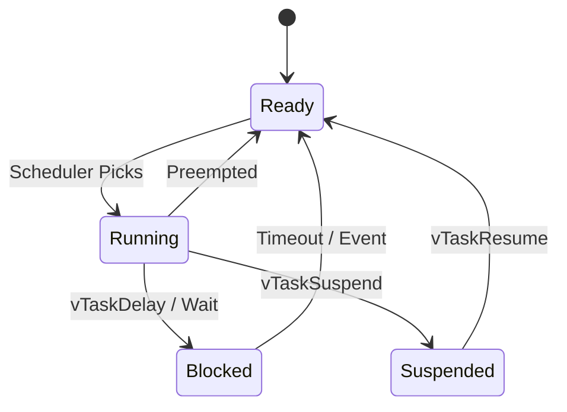

# Day 58: Tasks & Scheduling
## Phase 1: Core Embedded Engineering Foundations | Week 9: RTOS Fundamentals

---

> **📝 Content Creator Instructions:**
> This document is designed to produce **comprehensive, industry-grade educational content**. 
> - **Target Length:** The final filled document should be approximately **1000+ lines** of detailed markdown.
> - **Depth:** Do not skim over details. Explain *why*, not just *how*.
> - **Structure:** If a topic is complex, **DIVIDE IT INTO MULTIPLE PARTS** (Part 1, Part 2, etc.).
> - **Code:** Provide complete, compilable code examples, not just snippets.
> - **Visuals:** Use Mermaid diagrams for flows, architectures, and state machines.

---

## 🎯 Learning Objectives
*By the end of this day, the learner will be able to:*
1.  **Diagram** the FreeRTOS Task State Machine (Running, Ready, Blocked, Suspended).
2.  **Analyze** the scheduling algorithm (Fixed Priority Preemptive Scheduling).
3.  **Implement** dynamic priority changes using `vTaskPrioritySet`.
4.  **Control** task execution using `vTaskSuspend` and `vTaskResume`.
5.  **Understand** the Idle Task and the Hook function.

---

## 📚 Prerequisites & Preparation
*   **Hardware Required:**
    *   STM32F4 Discovery Board
*   **Software Required:**
    *   VS Code with ARM GCC Toolchain
    *   FreeRTOS
*   **Prior Knowledge:**
    *   Day 57 (RTOS Intro)
*   **Datasheets:**
    *   [FreeRTOS Task Control API](https://www.freertos.org/a00112.html)

---

## 📖 Theoretical Deep Dive

### 🔹 Part 1: Task States
A task is not just "running" or "stopped". It has 4 states:
1.  **Running:** The CPU is executing this task right now. (Only 1 task on single core).
2.  **Ready:** Able to run, but waiting for a higher priority task to finish.
3.  **Blocked:** Waiting for an event (Time delay, Semaphore, Queue). Does not consume CPU.
4.  **Suspended:** Explicitly halted (`vTaskSuspend`). Will not run until resumed.



### 🔹 Part 2: Scheduling Algorithm
FreeRTOS uses **Fixed Priority Preemptive Scheduling with Time Slicing**.
*   **Fixed Priority:** The Scheduler always runs the highest priority Ready task.
*   **Preemptive:** If a high priority task becomes Ready (e.g., interrupt), it immediately interrupts the running low priority task.
*   **Time Slicing:** If multiple tasks have the *same* priority, they share the CPU (Round Robin) every tick (1ms).

---

## 💻 Implementation: Task Control

> **Instruction:** Create 3 tasks.
> *   **Task 1 (High):** Blinks LED fast (100ms).
> *   **Task 2 (Medium):** Blinks LED slow (500ms).
> *   **Task 3 (Controller):** Checks Button. If pressed, Suspends Task 1. If released, Resumes Task 1.

### 👨‍💻 Code Implementation

#### Step 1: Handles
```c
TaskHandle_t hTask1, hTask2, hTask3;
```

#### Step 2: Task Functions
```c
void vTask1_Fast(void *params) {
    while(1) {
        GPIOD->ODR ^= (1 << 12); // Green
        vTaskDelay(pdMS_TO_TICKS(100));
    }
}

void vTask2_Slow(void *params) {
    while(1) {
        GPIOD->ODR ^= (1 << 13); // Orange
        vTaskDelay(pdMS_TO_TICKS(500));
    }
}

void vTask3_Control(void *params) {
    uint8_t suspended = 0;
    while(1) {
        if (Button_Pressed()) {
            if (!suspended) {
                vTaskSuspend(hTask1);
                suspended = 1;
            } else {
                vTaskResume(hTask1);
                suspended = 0;
            }
            // Debounce delay
            vTaskDelay(pdMS_TO_TICKS(300));
        }
        vTaskDelay(pdMS_TO_TICKS(50));
    }
}
```

#### Step 3: Main
```c
int main(void) {
    // ... Init ...
    
    xTaskCreate(vTask1_Fast, "Fast", 128, NULL, 3, &hTask1); // Prio 3
    xTaskCreate(vTask2_Slow, "Slow", 128, NULL, 2, &hTask2); // Prio 2
    xTaskCreate(vTask3_Control, "Ctrl", 128, NULL, 1, &hTask3); // Prio 1
    
    vTaskStartScheduler();
    while(1);
}
```

---

## 🔬 Lab Exercise: Lab 58.1 - Starvation

### 1. Lab Objectives
- Demonstrate that a high priority task can starve lower ones if it doesn't block.

### 2. Step-by-Step Guide

#### Phase A: The Bad Task
1.  Create `vTaskBad` with Priority 3.
2.  Code: `while(1) { GPIOD->ODR ^= (1<<14); Delay_Software(100000); }`
3.  **Note:** Use a software delay loop, NOT `vTaskDelay`.
4.  Create `vTaskGood` with Priority 2.
5.  Code: `while(1) { Toggle_LED(); vTaskDelay(100); }`

#### Phase B: Observation
1.  Run the code.
2.  **Result:** Only `vTaskBad` runs. `vTaskGood` never blinks. The Watchdog (if enabled) might reset the system because the Idle task never runs either!

#### Phase C: The Fix
1.  Change `vTaskBad` to use `vTaskDelay`.
2.  Now `vTaskGood` runs during the delay.

### 3. Verification
This proves that "Blocking" is essential in RTOS.

---

## 🧪 Additional / Advanced Labs

### Lab 2: Dynamic Priority
- **Goal:** Boost priority on event.
- **Task:**
    1.  Task A (Low) is running.
    2.  Task B (High) is blocked.
    3.  Button Press -> ISR -> `xTaskResumeFromISR`.
    4.  Task B wakes up, boosts Task A priority to High (`vTaskPrioritySet`), does work, lowers it back.

### Lab 3: Task Deletion
- **Goal:** Kill a task.
- **Task:**
    1.  Create a "One Shot" task.
    2.  It does initialization (e.g., Mount SD Card).
    3.  Calls `vTaskDelete(NULL)` at the end.
    4.  Verify memory is reclaimed (Idle task does the cleanup).

---

## 🐞 Debugging & Troubleshooting

### Common Issues

#### 1. Zombie Tasks
*   **Cause:** Deleting a task but the Idle task never runs (starvation).
*   **Result:** Memory not freed. Eventually `xTaskCreate` fails.
*   **Solution:** Ensure high priority tasks block sufficiently to let Idle task run.

#### 2. Priority Confusion
*   **Note:** In STM32 (NVIC), Lower number = Higher Priority. In FreeRTOS, **Higher number = Higher Priority**.
*   **Conflict:** `configMAX_SYSCALL_INTERRUPT_PRIORITY`. ISRs using FreeRTOS API must have logical priority *lower* (numeric value higher) than this threshold.

---

## ⚡ Optimization & Best Practices

### Code Quality
- **DelayUntil:** Use `vTaskDelayUntil` for precise periodic execution. `vTaskDelay` is relative (sleep for 100ms from *now*). `vTaskDelayUntil` is absolute (wake up at time X + 100ms). Prevents drift.

---

## 🧠 Assessment & Review

### Knowledge Check
1.  **Q:** What happens if two tasks have Priority 2?
    *   **A:** They share the CPU. Task A runs for 1 tick, then Task B runs for 1 tick (Round Robin).
2.  **Q:** Can a task suspend itself?
    *   **A:** Yes, `vTaskSuspend(NULL)`.

### Challenge Task
> **Task:** Implement "Rate Monotonic Scheduling" manually. Create 3 tasks with periods 100ms, 200ms, 500ms. Assign priorities such that Shortest Period = Highest Priority. Verify timing accuracy.

---

## 📚 Further Reading & References
- [FreeRTOS Scheduling Internals](https://www.freertos.org/implementation/a00005.html)

---
