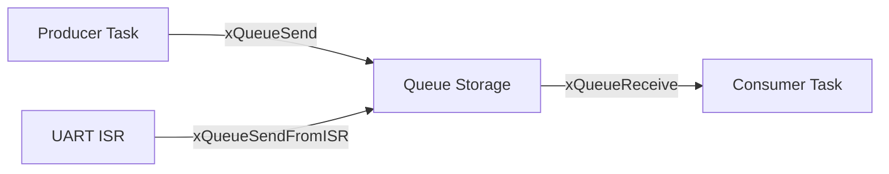

# Day 59: Queues & Inter-Task Communication
## Phase 1: Core Embedded Engineering Foundations | Week 9: RTOS Fundamentals

---

> **📝 Content Creator Instructions:**
> This document is designed to produce **comprehensive, industry-grade educational content**. 
> - **Target Length:** The final filled document should be approximately **1000+ lines** of detailed markdown.
> - **Depth:** Do not skim over details. Explain *why*, not just *how*.
> - **Structure:** If a topic is complex, **DIVIDE IT INTO MULTIPLE PARTS** (Part 1, Part 2, etc.).
> - **Code:** Provide complete, compilable code examples, not just snippets.
> - **Visuals:** Use Mermaid diagrams for flows, architectures, and state machines.

---

## 🎯 Learning Objectives
*By the end of this day, the learner will be able to:*
1.  **Identify** the dangers of using global variables for inter-task communication (Race Conditions).
2.  **Explain** how FreeRTOS Queues work (FIFO, Copy-by-Value).
3.  **Implement** a Producer-Consumer architecture using Queues.
4.  **Send** data to a Queue from an Interrupt Service Routine (`xQueueSendFromISR`).
5.  **Design** a "Mailbox" system for passing complex structures between tasks.

---

## 📚 Prerequisites & Preparation
*   **Hardware Required:**
    *   STM32F4 Discovery Board
*   **Software Required:**
    *   VS Code with ARM GCC Toolchain
    *   FreeRTOS
*   **Prior Knowledge:**
    *   Day 58 (Tasks)
    *   Day 6 (Structs)
*   **Datasheets:**
    *   [FreeRTOS Queue API](https://www.freertos.org/a00018.html)

---

## 📖 Theoretical Deep Dive

### 🔹 Part 1: The Problem with Globals
Task A writes to `GlobalVar`. Task B reads `GlobalVar`.
*   **Scenario:** Task A writes the first byte of a 32-bit int. Interrupt happens. Task B runs and reads the variable. It gets a mix of old and new bytes (Tearing).
*   **Solution:** Atomic operations or Thread-Safe primitives like Queues.

### 🔹 Part 2: FreeRTOS Queues
A Queue is a FIFO buffer managed by the kernel.
*   **Thread Safe:** The kernel disables interrupts/locks scheduler during access.
*   **Blocking:**
    *   **Reader:** Can block (sleep) if Queue is empty. Wakes up when data arrives.
    *   **Writer:** Can block if Queue is full. Wakes up when space is available.
*   **Copy by Value:** FreeRTOS copies the data *into* the queue.
    *   **Pros:** The sender can reuse the variable immediately.
    *   **Cons:** Slow for large data (structs).
    *   **Optimization:** For large data, send a *pointer* (Copy by Reference).



---

## 💻 Implementation: Sensor Data Pipeline

> **Instruction:**
> *   **Task 1 (Sensor):** Generates dummy sensor data (struct) every 100ms. Sends to Queue.
> *   **Task 2 (Display):** Waits for Queue. Prints data to UART.

### 👨‍💻 Code Implementation

#### Step 1: Define Data Structure
```c
typedef struct {
    uint32_t timestamp;
    uint16_t value;
    uint8_t  sensor_id;
} SensorData_t;

QueueHandle_t hSensorQueue;
```

#### Step 2: Producer Task
```c
void vTaskSensor(void *params) {
    SensorData_t data;
    data.sensor_id = 1;
    
    while(1) {
        data.timestamp = xTaskGetTickCount();
        data.value = rand() % 100;
        
        // Send to Queue
        // Wait 10ms if full
        if (xQueueSend(hSensorQueue, &data, pdMS_TO_TICKS(10)) != pdTRUE) {
            // Queue Full Error
            printf("Queue Full!\n");
        }
        
        vTaskDelay(pdMS_TO_TICKS(100));
    }
}
```

#### Step 3: Consumer Task
```c
void vTaskDisplay(void *params) {
    SensorData_t recv_data;
    
    while(1) {
        // Block indefinitely until data arrives
        if (xQueueReceive(hSensorQueue, &recv_data, portMAX_DELAY) == pdTRUE) {
            printf("Time: %lu, ID: %d, Val: %d\n", 
                   recv_data.timestamp, recv_data.sensor_id, recv_data.value);
        }
    }
}
```

#### Step 4: Main
```c
int main(void) {
    // ... Init ...
    
    // Create Queue of 10 items, each size of SensorData_t
    hSensorQueue = xQueueCreate(10, sizeof(SensorData_t));
    
    if (hSensorQueue == NULL) {
        // Heap Error
        while(1);
    }
    
    xTaskCreate(vTaskSensor, "Sens", 256, NULL, 2, NULL);
    xTaskCreate(vTaskDisplay, "Disp", 256, NULL, 1, NULL);
    
    vTaskStartScheduler();
    while(1);
}
```

---

## 🔬 Lab Exercise: Lab 59.1 - UART ISR Queue

### 1. Lab Objectives
- Receive characters via UART Interrupt.
- Send them to a Queue.
- Process them in a Task (Deferred Interrupt Processing).

### 2. Step-by-Step Guide

#### Phase A: ISR
```c
void USART2_IRQHandler(void) {
    BaseType_t xHigherPriorityTaskWoken = pdFALSE;
    
    if (USART2->SR & (1 << 5)) { // RXNE
        char c = USART2->DR;
        
        // Send to Queue
        xQueueSendFromISR(hUARTQueue, &c, &xHigherPriorityTaskWoken);
    }
    
    // Force Context Switch if needed
    portYIELD_FROM_ISR(xHigherPriorityTaskWoken);
}
```

#### Phase B: Processing Task
```c
void vTaskUART(void *params) {
    char c;
    while(1) {
        xQueueReceive(hUARTQueue, &c, portMAX_DELAY);
        // Process char (e.g., build command string)
        Process_Char(c);
    }
}
```

### 3. Verification
Type fast in the terminal. The ISR is very short (just pushes to queue). The Task handles the logic. No data loss.

---

## 🧪 Additional / Advanced Labs

### Lab 2: Queue Sets
- **Goal:** Wait on multiple queues.
- **Task:**
    1.  Create `QueueA` and `QueueB`.
    2.  Create a `QueueSet`. Add A and B.
    3.  Task waits on Set.
    4.  If A has data, read A. If B has data, read B.

### Lab 3: Mailbox (Overwrite)
- **Goal:** Always get latest value.
- **Task:**
    1.  Create Queue of Length 1.
    2.  Use `xQueueOverwrite`.
    3.  Reader uses `xQueuePeek` (doesn't remove data) or `xQueueReceive`.
    4.  Useful for "Current Status" display.

---

## 🐞 Debugging & Troubleshooting

### Common Issues

#### 1. HardFault in `xQueueSend`
*   **Cause:** Calling `xQueueSend` from an ISR.
*   **Solution:** MUST use `xQueueSendFromISR`. FreeRTOS checks context and asserts if wrong API is used.

#### 2. Queue Full
*   **Cause:** Consumer too slow.
*   **Solution:** Increase Queue depth. Optimize Consumer. Or drop data (if acceptable).

#### 3. Data Corruption
*   **Cause:** Sending pointers to stack variables.
*   **Scenario:** Task A sends `&myVar`. Task A returns/loops. Stack frame changes. Task B reads `*ptr` -> Garbage.
*   **Solution:** Send by Value (copy struct) or `malloc` the data (and let Consumer `free` it).

---

## ⚡ Optimization & Best Practices

### Code Quality
- **Zero Copy:** For large buffers (e.g., Ethernet packets), don't copy 1500 bytes into the queue. Put the buffer in a global pool/heap, and send the *pointer* (4 bytes) to the queue.

---

## 🧠 Assessment & Review

### Knowledge Check
1.  **Q:** What is `portYIELD_FROM_ISR`?
    *   **A:** It triggers the scheduler (PendSV). If the ISR woke up a high priority task (e.g., UART Task), we want to switch to it *immediately* after the ISR, not wait for the next tick.
2.  **Q:** Can I send data from Task to ISR?
    *   **A:** Technically yes (`xQueueReceiveFromISR`), but rare. ISRs shouldn't block waiting for data.

### Challenge Task
> **Task:** Implement a "Command Parser". UART ISR pushes chars to Queue. Task A reads chars, builds a string until '\n'. When '\n' found, sends string pointer to Task B (Command Executor).

---

## 📚 Further Reading & References
- [FreeRTOS Queue Management](https://www.freertos.org/Embedded-RTOS-Queues.html)

---
