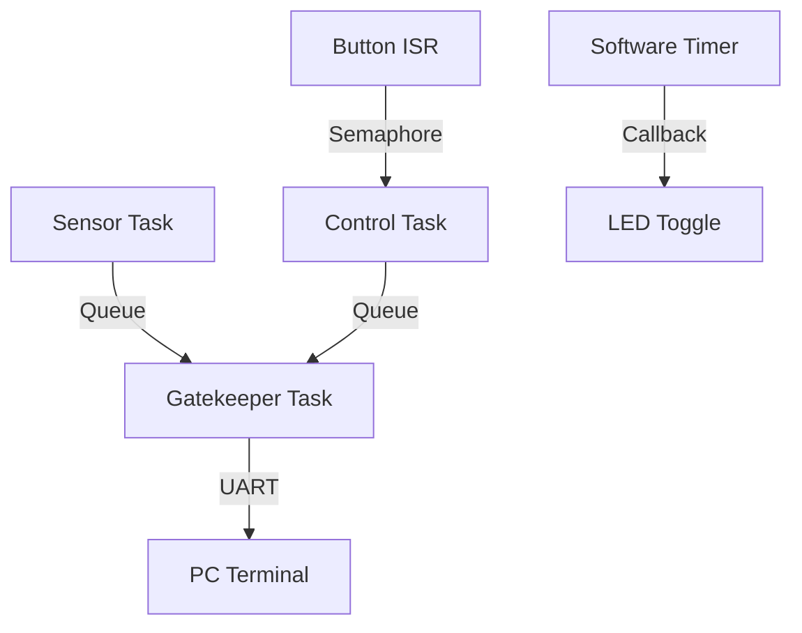

# Day 63: Week 9 Review and Project
## Phase 1: Core Embedded Engineering Foundations | Week 9: RTOS Fundamentals

---

> **📝 Content Creator Instructions:**
> This document is designed to produce **comprehensive, industry-grade educational content**. 
> - **Target Length:** The final filled document should be approximately **1000+ lines** of detailed markdown.
> - **Depth:** Do not skim over details. Explain *why*, not just *how*.
> - **Structure:** If a topic is complex, **DIVIDE IT INTO MULTIPLE PARTS** (Part 1, Part 2, etc.).
> - **Code:** Provide complete, compilable code examples, not just snippets.
> - **Visuals:** Use Mermaid diagrams for flows, architectures, and state machines.

---

## 🎯 Learning Objectives
*By the end of this day, the learner will be able to:*
1.  **Synthesize** Week 9 concepts (Tasks, Queues, Semaphores, Timers) into a complex application.
2.  **Architect** a multi-threaded "RTOS Dashboard" system.
3.  **Implement** robust inter-task communication pipelines.
4.  **Debug** timing issues and stack overflows in a live system.
5.  **Conduct** a self-assessment of Week 9 knowledge.

---

## 📚 Prerequisites & Preparation
*   **Hardware Required:**
    *   STM32F4 Discovery Board
    *   UART Bridge.
*   **Software Required:**
    *   VS Code with ARM GCC Toolchain
    *   FreeRTOS
*   **Prior Knowledge:**
    *   Days 57-62 (Week 9 Content)

---

## 📖 Theoretical Deep Dive

### 🔹 Part 1: System Architecture
We are building a **Dashboard** that monitors the system health and sensor data.

*   **Inputs:**
    *   **Sensor Task:** Simulates reading a sensor (e.g., Temperature) every 200ms.
    *   **Button Task:** Detects user input to switch modes (Normal / Maintenance).
*   **Processing:**
    *   **Control Task:** Processes button events and updates system state.
*   **Outputs:**
    *   **Gatekeeper Task:** Manages UART (Thread-safe printing).
    *   **Heartbeat Timer:** Visual indication of "Alive".



---

## 💻 Implementation: RTOS Dashboard

### 🛠️ Hardware/System Configuration
*   **UART:** PA2/PA3 (115200 baud).
*   **Button:** PA0.
*   **LEDs:** PD12 (Green - Heartbeat), PD13 (Orange - Mode).

### 👨‍💻 Code Implementation

#### Step 1: Includes & Handles
```c
#include "stm32f4xx.h"
#include "FreeRTOS.h"
#include "task.h"
#include "queue.h"
#include "semphr.h"
#include "timers.h"
#include <stdio.h>
#include <string.h>

// Handles
TaskHandle_t hSensorTask, hControlTask, hGatekeeperTask;
QueueHandle_t hPrintQueue;
SemaphoreHandle_t hButtonSem;
TimerHandle_t hHeartbeatTimer;

// System State
typedef enum { MODE_NORMAL, MODE_MAINTENANCE } SystemMode_t;
SystemMode_t currentMode = MODE_NORMAL;

// Print Message Structure
typedef struct {
    char text[64];
} PrintMsg_t;
```

#### Step 2: Gatekeeper Task (UART)
```c
void vTaskGatekeeper(void *params) {
    PrintMsg_t msg;
    
    while(1) {
        if (xQueueReceive(hPrintQueue, &msg, portMAX_DELAY)) {
            HAL_UART_Transmit(&huart2, (uint8_t*)msg.text, strlen(msg.text), 100);
        }
    }
}

// Helper to send print
void Print_Safe(const char *format, ...) {
    PrintMsg_t msg;
    va_list args;
    va_start(args, format);
    vsnprintf(msg.text, sizeof(msg.text), format, args);
    va_end(args);
    
    xQueueSend(hPrintQueue, &msg, pdMS_TO_TICKS(10));
}
```

#### Step 3: Sensor Task
```c
void vTaskSensor(void *params) {
    uint32_t val = 0;
    
    while(1) {
        if (currentMode == MODE_NORMAL) {
            val = (val + 1) % 100; // Simulate data
            Print_Safe("Sensor: %lu\r\n", val);
        }
        vTaskDelay(pdMS_TO_TICKS(500));
    }
}
```

#### Step 4: Control Task (Button)
```c
void vTaskControl(void *params) {
    while(1) {
        // Wait for Button Semaphore
        if (xSemaphoreTake(hButtonSem, portMAX_DELAY)) {
            // Toggle Mode
            if (currentMode == MODE_NORMAL) {
                currentMode = MODE_MAINTENANCE;
                GPIOD->ODR |= (1 << 13); // Orange ON
                Print_Safe("Mode: MAINTENANCE\r\n");
            } else {
                currentMode = MODE_NORMAL;
                GPIOD->ODR &= ~(1 << 13); // Orange OFF
                Print_Safe("Mode: NORMAL\r\n");
            }
            
            // Debounce
            vTaskDelay(pdMS_TO_TICKS(300));
            // Clear any pending semaphore from bounces
            xSemaphoreTake(hButtonSem, 0); 
        }
    }
}
```

#### Step 5: Timer Callback
```c
void vHeartbeatCallback(TimerHandle_t xTimer) {
    GPIOD->ODR ^= (1 << 12); // Toggle Green
}
```

#### Step 6: ISR & Main
```c
void EXTI0_IRQHandler(void) {
    BaseType_t xHigherPriorityTaskWoken = pdFALSE;
    if (EXTI->PR & 1) {
        EXTI->PR |= 1;
        xSemaphoreGiveFromISR(hButtonSem, &xHigherPriorityTaskWoken);
    }
    portYIELD_FROM_ISR(xHigherPriorityTaskWoken);
}

int main(void) {
    HAL_Init();
    SystemClock_Config();
    UART_Init();
    Button_Init();
    LED_Init();
    
    // Create Objects
    hPrintQueue = xQueueCreate(10, sizeof(PrintMsg_t));
    hButtonSem = xSemaphoreCreateBinary();
    hHeartbeatTimer = xTimerCreate("HB", pdMS_TO_TICKS(1000), pdTRUE, NULL, vHeartbeatCallback);
    
    // Create Tasks
    xTaskCreate(vTaskGatekeeper, "Gate", 256, NULL, 1, &hGatekeeperTask);
    xTaskCreate(vTaskSensor, "Sens", 256, NULL, 2, &hSensorTask);
    xTaskCreate(vTaskControl, "Ctrl", 256, NULL, 3, &hControlTask); // High Prio
    
    // Start Timer
    xTimerStart(hHeartbeatTimer, 0);
    
    // Start Scheduler
    vTaskStartScheduler();
    
    while(1);
}
```

---

## 🔬 Lab Exercise: Lab 63.1 - System Integration

### 1. Lab Objectives
- Verify Mode Switching.
- Verify Sensor Data stops in Maintenance Mode.
- Verify Heartbeat continues.

### 2. Step-by-Step Guide

#### Phase A: Run
1.  Flash code.
2.  **Observe:** Green LED blinks (1Hz). UART prints "Sensor: 0", "Sensor: 1"...

#### Phase B: Interact
1.  Press Button.
2.  **Observe:** Orange LED turns ON. UART prints "Mode: MAINTENANCE". Sensor prints STOP.
3.  Press Button again.
4.  **Observe:** Orange LED OFF. Sensor prints resume.

### 3. Verification
If Button response is sluggish, check Control Task priority. It should be high to respond quickly.

---

## 🧪 Additional / Advanced Labs

### Lab 2: CPU Load Monitor
- **Goal:** Add a task that calculates CPU usage.
- **Task:**
    1.  Use `vTaskGetRunTimeStats`.
    2.  Print stats to UART every 5 seconds.
    3.  Observe how Sensor Task consumes CPU vs Idle Task.

### Lab 3: Emergency Stop
- **Goal:** Immediate Shutdown.
- **Task:**
    1.  Add a "Long Press" detection to Button.
    2.  If Long Press -> `vTaskSuspendAll()`. Turn on Red LED. Halt system.

---

## 🐞 Debugging & Troubleshooting

### Common Issues

#### 1. Stack Overflow in Print
*   **Cause:** `vsnprintf` uses a lot of stack. `PrintMsg_t` is also on stack.
*   **Solution:** Increase stack size of tasks calling `Print_Safe`.

#### 2. Queue Full
*   **Cause:** Sensor producing faster than UART can transmit (9600 baud is slow!).
*   **Solution:** Increase Baud Rate (115200). Increase Queue Size.

---

## ⚡ Optimization & Best Practices

### Code Quality
- **Decoupling:** The Sensor Task doesn't know about UART. It just knows about the Queue. This allows us to swap the Gatekeeper (e.g., send to SD Card instead of UART) without changing the Sensor Task.

---

## 🧠 Assessment & Review

### Knowledge Check
1.  **Q:** Why use a Semaphore for the button instead of a Queue?
    *   **A:** We only care about the *event* (Press), not data. A Binary Semaphore is perfect for signaling.
2.  **Q:** What happens if the Gatekeeper blocks?
    *   **A:** If the Gatekeeper blocks (e.g., UART hardware stuck), the Queue fills up. Then Client tasks block waiting for Queue. The whole system might stall (Cascade Failure). Use Timeouts!

### Challenge Task
> **Task:** Implement "CLI" (Command Line Interface). Gatekeeper also listens to UART RX. If user types "status", it prints system state. If "reset", it resets the MCU.

---

## 📚 Further Reading & References
- [FreeRTOS Practical Guide](https://www.freertos.org/FreeRTOS-Plus/FreeRTOS_Plus_TCP/index.html)

---
