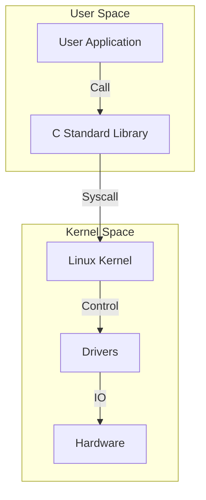

# Day 121: Introduction to Linux Kernel
## Phase 2: Linux Kernel & Device Drivers | Week 18: Linux Kernel Fundamentals

---

> **📝 Content Creator Instructions:**
> This document is designed to produce **comprehensive, industry-grade educational content**. 
> - **Target Length:** The final filled document should be approximately **1000+ lines** of detailed markdown.
> - **Depth:** Do not skim over details. Explain *why*, not just *how*.
> - **Structure:** If a topic is complex, **DIVIDE IT INTO MULTIPLE PARTS** (Part 1, Part 2, etc.).
> - **Code:** Provide complete, compilable code examples, not just snippets.
> - **Visuals:** Use Mermaid diagrams for flows, architectures, and state machines.

---

## 🎯 Learning Objectives
*By the end of this day, the learner will be able to:*
1.  **Explain** the high-level architecture of the Linux Kernel (Monolithic vs Microkernel).
2.  **Differentiate** between Kernel Space and User Space, and how they interact via System Calls.
3.  **Navigate** the Linux Kernel Source Tree and understand the purpose of key directories (`arch`, `drivers`, `kernel`, `mm`).
4.  **Download** and **Extract** the mainline Linux kernel source code.
5.  **Build** a minimal Linux kernel from source using `make` and `kbuild`.

---

## 📚 Prerequisites & Preparation
*   **Hardware Required:**
    *   PC with Linux (Ubuntu/Debian recommended) or WSL2.
    *   At least 20GB free disk space.
    *   At least 4GB RAM (8GB+ recommended for compilation).
*   **Software Required:**
    *   `build-essential`, `git`, `libncurses-dev`, `bison`, `flex`, `libssl-dev`, `libelf-dev`.
*   **Prior Knowledge:**
    *   Basic Linux Command Line (Phase 1, Day 120).
    *   C Programming (Phase 1).

---

## 📖 Theoretical Deep Dive

### 🔹 Part 1: What is a Kernel?
The kernel is the core of the operating system. It has complete control over everything in the system. It is the "Manager" of resources.
*   **CPU:** The kernel decides which program runs and for how long (Scheduling).
*   **RAM:** The kernel decides which program gets memory and where (Memory Management).
*   **I/O:** The kernel talks to hardware (Disk, Network, USB) so programs don't have to (Device Drivers).

#### Monolithic vs Microkernel
*   **Monolithic (Linux):** All OS services (Scheduler, Drivers, FS, Net) run in the same address space (Kernel Space).
    *   *Pros:* High Performance (Function calls are fast).
    *   *Cons:* A bug in a driver can crash the whole system (Kernel Panic).
*   **Microkernel (Minix, QNX):** Only minimal services (IPC, Scheduling) in Kernel. Drivers and FS run as User Processes.
    *   *Pros:* Stability (Driver crash doesn't kill OS).
    *   *Cons:* Performance overhead (Message passing is slower than function calls).

### 🔹 Part 2: Kernel Space vs User Space
To protect the system, modern CPUs operate in different "Modes" or "Rings".
*   **Ring 0 (Kernel Mode):** Full access to all instructions and hardware.
*   **Ring 3 (User Mode):** Restricted access. Cannot touch hardware directly. Cannot access Kernel RAM.

#### The Barrier: System Calls
How does `printf("Hello")` write to the screen?
1.  User App calls `printf` (C Library).
2.  C Library calls `write()` (System Call Wrapper).
3.  CPU switches to Ring 0 (Software Interrupt `int 0x80` or `syscall` instruction).
4.  Kernel handles `sys_write`.
5.  Kernel talks to Video Driver.
6.  Kernel returns to Ring 3.



### 🔹 Part 3: The Linux Source Tree
When you download Linux, you get a massive folder. Here is the map:

| Directory | Purpose |
| :--- | :--- |
| `arch/` | Architecture-specific code (x86, arm, arm64, riscv). The "BSP" of the kernel. |
| `block/` | Block I/O layer (HDD, SSD handling). |
| `certs/` | Certificate handling for module signing. |
| `crypto/` | Cryptographic algorithms (AES, SHA). |
| `Documentation/` | Text files explaining how things work. **Read this!** |
| `drivers/` | The biggest folder. 60%+ of code. (GPIO, I2C, USB, GPU). |
| `fs/` | File Systems (ext4, fat, ntfs, proc). |
| `include/` | Header files (`.h`). `include/linux` is the public API. |
| `init/` | Kernel boot code (`main.c` is here!). |
| `ipc/` | Inter-Process Communication (Semaphores, Queues). |
| `kernel/` | The Core. Scheduler (`sched/`), Signal handling, Power Mgmt. |
| `lib/` | Helper library (memcpy, string functions, compression). |
| `mm/` | Memory Management (Page tables, Slab allocator). |
| `net/` | Networking Stack (TCP/IP, Ethernet, WiFi). |
| `scripts/` | Build scripts (Kconfig, Menuconfig). |
| `security/` | Security modules (SELinux, AppArmor). |
| `sound/` | Audio subsystem (ALSA). |
| `tools/` | User-space tools (perf, objtool). |
| `virt/` | Virtualization (KVM). |

---

## 💻 Implementation: Setting Up the Environment

> **Instruction:** Prepare your Linux machine for kernel development.

### 👨‍💻 Command Line Steps

#### Step 1: Install Dependencies
```bash
sudo apt update
sudo apt install build-essential libncurses-dev bison flex libssl-dev libelf-dev git dwarves
```
*   `build-essential`: GCC, Make.
*   `libncurses-dev`: For `menuconfig` UI.
*   `bison/flex`: For parsing Kconfig files.
*   `libssl-dev`: For signing modules.
*   `dwarves`: For BTF (BPF Type Format) generation.

#### Step 2: Download Source
We will use the "Mainline" kernel from kernel.org.
```bash
# Create a workspace
mkdir -p ~/linux_kernel_course
cd ~/linux_kernel_course

# Download tarball (Long Term Support - LTS is recommended, e.g., 6.1 or 6.6)
wget https://cdn.kernel.org/pub/linux/kernel/v6.x/linux-6.6.1.tar.xz

# Extract
tar -xvf linux-6.6.1.tar.xz
cd linux-6.6.1
```

#### Step 3: Explore
```bash
ls -F
# You should see arch/, drivers/, init/, etc.
```

---

## 💻 Implementation: Building Your First Kernel

> **Instruction:** Compile the kernel for your current architecture (x86_64).

### 👨‍💻 Command Line Steps

#### Step 1: Configuration
Before building, we must decide *what* to build. (Which drivers? Which FS?).
We can copy the config from our current running system.
```bash
cp /boot/config-$(uname -r) .config
```
*   `.config` is the hidden file controlling the build.

#### Step 2: Update Config
Since the running kernel might be older/newer, update the config to match the source tree.
```bash
make olddefconfig
```
*   `olddefconfig`: Sets new options to their default values.

#### Step 3: The Build
This takes time! Use `-j` to run in parallel. `nproc` gives number of CPU cores.
```bash
make -j$(nproc)
```
*   **Output:**
    *   `vmlinux`: The raw uncompressed kernel (huge).
    *   `arch/x86/boot/bzImage`: The compressed bootable kernel image (Big Z Image).

#### Step 4: Modules
Compile the loadable modules (`.ko` files).
```bash
make modules -j$(nproc)
```

---

## 🔬 Lab Exercise: Lab 121.1 - The "Local Version" Mark

### 1. Lab Objectives
- Modify the kernel configuration to add a custom tag to the version string.
- Verify that the build picks it up.

### 2. Step-by-Step Guide

#### Phase A: Menuconfig
1.  Run `make menuconfig`.
2.  A blue text-based UI appears.
3.  Navigate to **General setup** -> **Local version - append to kernel release**.
4.  Press Enter.
5.  Type `"-student-v1"`.
6.  Press OK.
7.  Exit and Save.

#### Phase B: Verify .config
1.  `grep "CONFIG_LOCALVERSION" .config`
2.  Output should be `CONFIG_LOCALVERSION="-student-v1"`.

#### Phase C: Rebuild
1.  `make -j$(nproc) bzImage`
2.  Wait for completion.
3.  Run `strings arch/x86/boot/bzImage | grep "student-v1"`
4.  **Observation:** You should see the version string embedded in the binary.

### 3. Verification
If you boot this kernel, `uname -r` would show `6.6.1-student-v1`.

---

## 🧪 Additional / Advanced Labs

### Lab 2: Ctags Navigation
- **Goal:** Make code navigation easier.
- **Task:**
    1.  Install `ctags`.
    2.  Run `make tags`.
    3.  Use `vim` or VS Code to jump to definitions (Ctrl+]).
    4.  Find definition of `start_kernel` in `init/main.c`.

### Lab 3: Cleaning Up
- **Goal:** Understand build artifacts.
- **Task:**
    1.  `make clean`: Removes object files, keeps config.
    2.  `make mrproper`: Removes everything + config. (Dangerous if you didn't backup .config!).
    3.  `make distclean`: Removes editor backup files too.

---

## 🐞 Debugging & Troubleshooting

### Common Issues

#### 1. "No space left on device"
*   **Cause:** Kernel build creates GBs of temporary files.
*   **Solution:** Ensure you have 20GB+. `make clean` to free space.

#### 2. "openssl/bio.h: No such file"
*   **Cause:** Missing `libssl-dev`.
*   **Solution:** `sudo apt install libssl-dev`.

#### 3. "pahole" errors
*   **Cause:** Missing `dwarves` package (needed for BTF).
*   **Solution:** `sudo apt install dwarves` OR disable CONFIG_DEBUG_INFO_BTF in menuconfig.

---

## ⚡ Optimization & Best Practices

### Code Quality
- **Out-of-Tree Build:** Keep source clean. Build in a separate folder.
    *   `mkdir build_x86`
    *   `make O=./build_x86 menuconfig`
    *   `make O=./build_x86 -j$(nproc)`
    *   This keeps the `linux-6.6.1` folder pristine.

---

## 🧠 Assessment & Review

### Knowledge Check
1.  **Q:** What is `vmlinux` vs `bzImage`?
    *   **A:** `vmlinux` is the static ELF binary (uncompressed, with symbols). `bzImage` is the compressed, bootable image loaded by GRUB/U-Boot.
2.  **Q:** Where is the entry point of the kernel?
    *   **A:** Architecture specific assembly (e.g., `arch/x86/kernel/head_64.S`) which eventually calls `start_kernel()` in `init/main.c`.

### Challenge Task
> **Task:** "Minimal Config". Run `make tinyconfig`. This creates the absolute smallest possible kernel. Build it. Check the size of `bzImage`. It should be tiny (< 1MB). Compare with the full build (~10MB).

---

## 📚 Further Reading & References
- [Linux Kernel Newbies](https://kernelnewbies.org/)
- [The Linux Kernel Documentation](https://www.kernel.org/doc/html/latest/)
- [Elixir Bootlin (Source Browser)](https://elixir.bootlin.com/)

---
