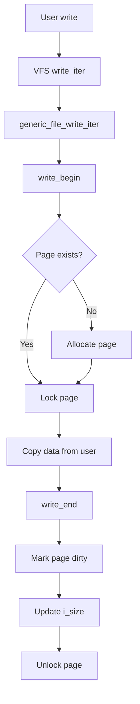

# Day 235: Writing a Writable RAM Filesystem
## Phase 2: Linux Kernel & Device Drivers | Week 35: Advanced Storage & Filesystems

---

> **📝 Content Creator Instructions:**
> This document is designed to produce **comprehensive, industry-grade educational content**. 
> - **Target Length:** The final filled document should be approximately **1000+ lines** of detailed markdown.
> - **Depth:** Do not skim over details. Explain *why*, not just *how*.
> - **Structure:** If a topic is complex, **DIVIDE IT INTO MULTIPLE PARTS** (Part 1, Part 2, etc.).
> - **Code:** Provide complete, compilable code examples, not just snippets.
> - **Visuals:** Use Mermaid diagrams for flows, architectures, and state machines.

---

## 🎯 Learning Objectives
*By the end of this day, the learner will be able to:*
1.  **Implement** write operations (`write_iter`, `write_begin`, `write_end`).
2.  **Handle** dirty inode tracking and writeback.
3.  **Implement** `sync_fs` for data consistency.
4.  **Manage** memory allocation for file data.

---

## 📚 Prerequisites & Preparation
*   **Hardware Required:**
    *   Linux PC.
*   **Software Required:**
    *   Kernel Source.
*   **Prior Knowledge:**
    *   Day 233 (Inodes), Day 234 (Read-Only FS).

---

## 📖 Theoretical Deep Dive

### 🔹 Part 1: The Write Path
*   **User:** `write()` syscall.
*   **VFS:** Calls `file->f_op->write_iter()`.
*   **Filesystem:** Two approaches:
    1.  **Direct:** Implement `write_iter` directly (simple but limited).
    2.  **Page Cache:** Use `generic_file_write_iter()` + `address_space_operations`.

### 🔹 Part 2: Address Space Operations
*   **`write_begin`:** Prepare a page for writing (allocate if needed).
*   **`write_end`:** Finalize the write (mark dirty).
*   **`writepage`:** Write dirty page to backing store (for RAM FS, this is a no-op or error).
*   **`readpage`:** Read page from backing store.

### 🔹 Part 3: Dirty Tracking
*   **Dirty Inode:** When file metadata changes (size, mtime).
*   **Dirty Page:** When file data changes.
*   **Writeback:** Kernel periodically flushes dirty pages/inodes.
*   **For RAM FS:** We keep everything in RAM, so writeback is trivial.

---

## 💻 Implementation: The Writable RAM FS

> **Instruction:** Extend our filesystem to support writing files.

### 👨‍💻 Code Implementation

```c
#include <linux/module.h>
#include <linux/fs.h>
#include <linux/pagemap.h>
#include <linux/highmem.h>

#define MYRAMFS_MAGIC 0xABCD1234

// Address Space Operations
static int myramfs_write_begin(struct file *file, struct address_space *mapping,
                               loff_t pos, unsigned len, unsigned flags,
                               struct page **pagep, void **fsdata) {
    // Use simple_write_begin which handles page allocation
    return simple_write_begin(file, mapping, pos, len, flags, pagep, fsdata);
}

static int myramfs_write_end(struct file *file, struct address_space *mapping,
                             loff_t pos, unsigned len, unsigned copied,
                             struct page *page, void *fsdata) {
    // Use simple_write_end which marks page dirty and updates i_size
    return simple_write_end(file, mapping, pos, len, copied, page, fsdata);
}

static int myramfs_readpage(struct file *file, struct page *page) {
    // For RAM FS, if page doesn't exist, it's a hole (zeros)
    clear_highpage(page);
    flush_dcache_page(page);
    SetPageUptodate(page);
    unlock_page(page);
    return 0;
}

static const struct address_space_operations myramfs_aops = {
    .readpage       = myramfs_readpage,
    .write_begin    = myramfs_write_begin,
    .write_end      = myramfs_write_end,
    .set_page_dirty = __set_page_dirty_no_writeback,
};

// File Operations
static const struct file_operations myramfs_file_operations = {
    .read_iter      = generic_file_read_iter,
    .write_iter     = generic_file_write_iter,
    .mmap           = generic_file_mmap,
    .fsync          = noop_fsync,
    .splice_read    = generic_file_splice_read,
    .splice_write   = iter_file_splice_write,
    .llseek         = generic_file_llseek,
};

// Inode Operations for Files
static const struct inode_operations myramfs_file_inode_operations = {
    .setattr        = simple_setattr,
    .getattr        = simple_getattr,
};

// Create a new inode
static struct inode *myramfs_get_inode(struct super_block *sb,
                                       const struct inode *dir,
                                       umode_t mode, dev_t dev) {
    struct inode *inode = new_inode(sb);
    
    if (!inode)
        return NULL;

    inode->i_ino = get_next_ino();
    inode_init_owner(&init_user_ns, inode, dir, mode);
    inode->i_mapping->a_ops = &myramfs_aops;
    mapping_set_gfp_mask(inode->i_mapping, GFP_HIGHUSER);
    mapping_set_unevictable(inode->i_mapping);
    inode->i_atime = inode->i_mtime = inode->i_ctime = current_time(inode);

    switch (mode & S_IFMT) {
    default:
        init_special_inode(inode, mode, dev);
        break;
    case S_IFREG:
        inode->i_op = &myramfs_file_inode_operations;
        inode->i_fop = &myramfs_file_operations;
        break;
    case S_IFDIR:
        inode->i_op = &myramfs_dir_inode_operations;
        inode->i_fop = &simple_dir_operations;
        inc_nlink(inode);
        break;
    case S_IFLNK:
        inode->i_op = &page_symlink_inode_operations;
        inode_nohighmem(inode);
        break;
    }
    return inode;
}

// Directory Operations
static int myramfs_mknod(struct user_namespace *mnt_userns,
                        struct inode *dir, struct dentry *dentry,
                        umode_t mode, dev_t dev) {
    struct inode *inode = myramfs_get_inode(dir->i_sb, dir, mode, dev);
    int error = -ENOSPC;

    if (inode) {
        d_instantiate(dentry, inode);
        dget(dentry);
        error = 0;
        dir->i_mtime = dir->i_ctime = current_time(dir);
    }
    return error;
}

static int myramfs_mkdir(struct user_namespace *mnt_userns,
                        struct inode *dir, struct dentry *dentry,
                        umode_t mode) {
    int retval = myramfs_mknod(mnt_userns, dir, dentry, mode | S_IFDIR, 0);
    if (!retval)
        inc_nlink(dir);
    return retval;
}

static int myramfs_create(struct user_namespace *mnt_userns,
                         struct inode *dir, struct dentry *dentry,
                         umode_t mode, bool excl) {
    return myramfs_mknod(mnt_userns, dir, dentry, mode | S_IFREG, 0);
}

static int myramfs_symlink(struct user_namespace *mnt_userns,
                          struct inode *dir, struct dentry *dentry,
                          const char *symname) {
    struct inode *inode;
    int error = -ENOSPC;

    inode = myramfs_get_inode(dir->i_sb, dir, S_IFLNK|S_IRWXUGO, 0);
    if (inode) {
        int l = strlen(symname)+1;
        error = page_symlink(inode, symname, l);
        if (!error) {
            d_instantiate(dentry, inode);
            dget(dentry);
            dir->i_mtime = dir->i_ctime = current_time(dir);
        } else
            iput(inode);
    }
    return error;
}

static const struct inode_operations myramfs_dir_inode_operations = {
    .create         = myramfs_create,
    .lookup         = simple_lookup,
    .link           = simple_link,
    .unlink         = simple_unlink,
    .symlink        = myramfs_symlink,
    .mkdir          = myramfs_mkdir,
    .rmdir          = simple_rmdir,
    .mknod          = myramfs_mknod,
    .rename         = simple_rename,
};

// Superblock Operations
static int myramfs_statfs(struct dentry *dentry, struct kstatfs *buf) {
    buf->f_type = MYRAMFS_MAGIC;
    buf->f_bsize = PAGE_SIZE;
    buf->f_namelen = NAME_MAX;
    return 0;
}

static const struct super_operations myramfs_ops = {
    .statfs         = myramfs_statfs,
    .drop_inode     = generic_delete_inode,
    .show_options   = generic_show_options,
};

// Fill Super
static int myramfs_fill_super(struct super_block *sb, void *data, int silent) {
    struct inode *inode;
    
    save_mount_options(sb, data);

    sb->s_maxbytes      = MAX_LFS_FILESIZE;
    sb->s_blocksize     = PAGE_SIZE;
    sb->s_blocksize_bits = PAGE_SHIFT;
    sb->s_magic         = MYRAMFS_MAGIC;
    sb->s_op            = &myramfs_ops;
    sb->s_time_gran     = 1;

    inode = myramfs_get_inode(sb, NULL, S_IFDIR | 0755, 0);
    sb->s_root = d_make_root(inode);
    if (!sb->s_root)
        return -ENOMEM;

    return 0;
}

// Mount
static struct dentry *myramfs_mount(struct file_system_type *fs_type,
                                   int flags, const char *dev_name,
                                   void *data) {
    return mount_nodev(fs_type, flags, data, myramfs_fill_super);
}

static void myramfs_kill_sb(struct super_block *sb) {
    kill_litter_super(sb);
}

static struct file_system_type myramfs_fs_type = {
    .name           = "myramfs",
    .mount          = myramfs_mount,
    .kill_sb        = myramfs_kill_sb,
    .fs_flags       = FS_USERNS_MOUNT,
};

static int __init init_myramfs_fs(void) {
    return register_filesystem(&myramfs_fs_type);
}

static void __exit exit_myramfs_fs(void) {
    unregister_filesystem(&myramfs_fs_type);
}

module_init(init_myramfs_fs);
module_exit(exit_myramfs_fs);

MODULE_LICENSE("GPL");
MODULE_AUTHOR("Embedded Engineer");
MODULE_DESCRIPTION("Simple RAM Filesystem with Write Support");
```

---

## 🔬 Lab Exercise: Lab 235.1 - Testing Write Operations

### 1. Lab Objectives
- Mount the filesystem.
- Create files and write data.
- Verify data persistence within the mount session.

### 2. Step-by-Step Guide
1.  **Compile and Load:**
    ```bash
    make
    sudo insmod myramfs.ko
    ```

2.  **Mount:**
    ```bash
    sudo mkdir -p /mnt/myramfs
    sudo mount -t myramfs none /mnt/myramfs
    ```

3.  **Create and Write:**
    ```bash
    echo "Hello World" > /mnt/myramfs/test.txt
    cat /mnt/myramfs/test.txt
    ```

4.  **Create Directory:**
    ```bash
    mkdir /mnt/myramfs/subdir
    echo "Nested file" > /mnt/myramfs/subdir/nested.txt
    ```

5.  **Verify:**
    ```bash
    ls -lR /mnt/myramfs
    cat /mnt/myramfs/subdir/nested.txt
    ```

6.  **Check Size:**
    ```bash
    df -h /mnt/myramfs
    du -sh /mnt/myramfs/*
    ```

---

## 🧪 Additional / Advanced Labs

### Lab 2: Large File Handling
- **Goal:** Test with large files.
- **Task:**
    1.  Create a 100MB file:
        ```bash
        dd if=/dev/zero of=/mnt/myramfs/bigfile bs=1M count=100
        ```
    2.  Verify:
        ```bash
        ls -lh /mnt/myramfs/bigfile
        md5sum /mnt/myramfs/bigfile
        ```
    3.  Check memory usage:
        ```bash
        free -h
        ```
    4.  Note: RAM FS consumes actual RAM!

### Lab 3: Memory Pressure
- **Goal:** Understand eviction behavior.
- **Task:**
    1.  Fill the filesystem until system runs low on memory.
    2.  Observe what happens (OOM killer might trigger).
    3.  Note: `mapping_set_unevictable` prevents page eviction.
    4.  Try removing that flag and see if pages get swapped.

### Lab 4: Symbolic Links
- **Goal:** Test symlink support.
- **Task:**
    ```bash
    ln -s /mnt/myramfs/test.txt /mnt/myramfs/link
    ls -l /mnt/myramfs/link
    cat /mnt/myramfs/link
    ```

### Lab 5: Hard Links
- **Goal:** Test hard link support.
- **Task:**
    ```bash
    ln /mnt/myramfs/test.txt /mnt/myramfs/hardlink
    ls -li /mnt/myramfs/
    # Should show same inode number
    echo "Modified" >> /mnt/myramfs/hardlink
    cat /mnt/myramfs/test.txt
    # Should show "Modified"
    ```

---

## 🐞 Debugging & Troubleshooting

### Common Issues

#### 1. "No space left on device"
*   **Cause:** System ran out of RAM.
*   **Fix:** Free up memory or limit filesystem usage.
*   **Prevention:** Implement quota support (advanced).

#### 2. Data corruption
*   **Cause:** Race conditions in concurrent writes.
*   **Fix:** Ensure proper locking (VFS handles most of this).
*   **Debug:** Use `CONFIG_DEBUG_PAGEALLOC` to catch issues.

#### 3. Memory leaks
*   **Cause:** Pages not being freed on file deletion.
*   **Fix:** Ensure `truncate_inode_pages_final` is called.
*   **Debug:** Check `/proc/meminfo` for PageCache growth.

#### 4. Permission denied
*   **Cause:** Incorrect permission handling in `inode_init_owner`.
*   **Fix:** Verify mode bits are set correctly.

---

## ⚡ Optimization & Best Practices

### 1. Memory Efficiency
*   **Sparse Files:** Our implementation naturally supports sparse files (holes).
*   **Page Sharing:** Consider using `ksm` (Kernel Samepage Merging) for deduplication.

### 2. Performance
*   **Direct I/O:** Can be supported via `generic_file_direct_write`.
*   **AIO:** Async I/O works automatically with `generic_file_*` helpers.

### 3. Scalability
*   **Per-CPU Counters:** For statistics tracking.
*   **RCU Lookups:** Already handled by VFS dentry cache.

### 4. Security
*   **Namespace Support:** `FS_USERNS_MOUNT` allows unprivileged mounts in user namespaces.
*   **SELinux/AppArmor:** Integrate with LSM hooks (already done via VFS).

---

## 📊 Performance Analysis

### Benchmarking Tools
1.  **fio (Flexible I/O Tester):**
    ```bash
    fio --name=test --filename=/mnt/myramfs/testfile \
        --rw=randwrite --bs=4k --size=100M --numjobs=4
    ```

2.  **iozone:**
    ```bash
    iozone -a -s 100M -f /mnt/myramfs/testfile
    ```

3.  **Comparison:**
    *   Compare against `tmpfs` (the standard RAM FS).
    *   Our implementation should be similar in performance.

---

## 🧠 Assessment & Review

### Knowledge Check

1.  **Q:** What is the difference between `write_begin` and `write_end`?
    *   **A:** `write_begin` prepares a page for writing (allocates if needed, locks it). `write_end` finalizes the write (marks dirty, updates size, unlocks).

2.  **Q:** Why use `simple_write_begin` instead of implementing from scratch?
    *   **A:** It handles common tasks: page allocation, locking, and error handling. Reduces code duplication and bugs.

3.  **Q:** What does `SetPageUptodate` mean?
    *   **A:** Marks a page as containing valid data. VFS won't try to read it from disk again.

4.  **Q:** Why `__set_page_dirty_no_writeback`?
    *   **A:** For RAM FS, we don't have a backing store to write back to. This marks the page dirty but tells the kernel not to try flushing it.

5.  **Q:** What happens on unmount?
    *   **A:** All data is lost! RAM FS is volatile. `kill_litter_super` frees all inodes and pages.

### Challenge Tasks

#### Challenge 1: "The Quota System"
> **Task:** Implement a simple quota mechanism.
> *   Add a mount option: `size=100M`.
> *   Track total bytes used in `sb->s_fs_info`.
> *   Fail writes when quota exceeded.

#### Challenge 2: "The Persistent RAM FS"
> **Task:** Add optional persistence.
> *   On unmount, serialize the filesystem to a file.
> *   On mount, deserialize if the file exists.
> *   Hint: Walk the dentry tree and write inodes + data.

#### Challenge 3: "The Compressed RAM FS"
> **Task:** Compress data in memory.
> *   Use `zlib` or `lzo` to compress pages.
> *   Decompress on read.
> *   Trade CPU for memory savings.

---

## 🔍 Deep Dive: Page Cache Internals

### How Pages Are Managed



### Memory Lifecycle

1.  **Allocation:** `__page_cache_alloc(gfp_mask)`.
2.  **Addition:** `add_to_page_cache_lru(page, mapping, index)`.
3.  **Dirty Tracking:** `__set_page_dirty_nobuffers(page)`.
4.  **Writeback:** (Skipped for RAM FS).
5.  **Eviction:** `truncate_inode_pages(mapping, lstart)`.
6.  **Freeing:** `__free_pages(page, order)`.

---

## 📚 Further Reading & References

### Kernel Documentation
- [Documentation/filesystems/vfs.rst](https://www.kernel.org/doc/html/latest/filesystems/vfs.html)
- [Documentation/filesystems/ramfs-rootfs-initramfs.rst](https://www.kernel.org/doc/html/latest/filesystems/ramfs-rootfs-initramfs.html)

### Source Code References
- `fs/ramfs/inode.c` - The canonical RAM FS implementation
- `mm/filemap.c` - Page cache operations
- `fs/libfs.c` - Helper functions for simple filesystems

### Books
- "Linux Kernel Development" by Robert Love - Chapter on VFS
- "Understanding the Linux Kernel" by Bovet & Cesati - Filesystem chapter

### Online Resources
- [LWN.net Filesystem Articles](https://lwn.net/Kernel/Index/#Filesystems)
- [Kernel Newbies: VFS](https://kernelnewbies.org/VFS)

---

## 🎓 Summary

In this day, we've learned:

1.  **Write Path:** How data flows from userspace to the page cache.
2.  **Address Space Ops:** The key operations for managing file data.
3.  **RAM FS Design:** A complete, writable, in-memory filesystem.
4.  **Memory Management:** How pages are allocated, tracked, and freed.
5.  **VFS Integration:** Using generic helpers for maximum compatibility.

**Key Takeaway:** Modern filesystems leverage the page cache extensively. Understanding `address_space_operations` is crucial for any filesystem developer.

---

## 🚀 Next Steps

Tomorrow (Day 236), we'll explore the **MTD (Memory Technology Device) Subsystem**, which provides a unified interface for flash storage devices. This is essential for embedded systems using NAND/NOR flash.

---
