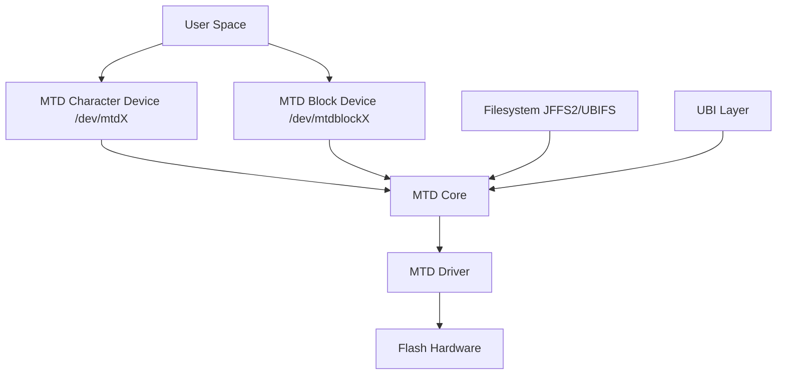

# Day 236: MTD Subsystem (Memory Technology Devices)
## Phase 2: Linux Kernel & Device Drivers | Week 35: Advanced Storage & Filesystems

---

> **📝 Content Creator Instructions:**
> This document is designed to produce **comprehensive, industry-grade educational content**. 
> - **Target Length:** The final filled document should be approximately **1000+ lines** of detailed markdown.
> - **Depth:** Do not skim over details. Explain *why*, not just *how*.
> - **Structure:** If a topic is complex, **DIVIDE IT INTO MULTIPLE PARTS** (Part 1, Part 2, etc.).
> - **Code:** Provide complete, compilable code examples, not just snippets.
> - **Visuals:** Use Mermaid diagrams for flows, architectures, and state machines.

---

## 🎯 Learning Objectives
*By the end of this day, the learner will be able to:*
1.  **Explain** the MTD subsystem architecture and its role in embedded systems.
2.  **Understand** the difference between NAND, NOR, and other flash technologies.
3.  **Use** MTD utilities (`mtdinfo`, `flash_erase`, `nandwrite`).
4.  **Register** a simple MTD device.
5.  **Understand** wear leveling, bad block management, and ECC.

---

## 📚 Prerequisites & Preparation
*   **Hardware Required:**
    *   Linux PC (preferably with MTD-enabled kernel).
    *   Optional: Development board with NAND/NOR flash.
*   **Software Required:**
    *   Kernel Source with MTD support.
    *   `mtd-utils` package.
*   **Prior Knowledge:**
    *   Day 211 (Block Devices).
    *   Basic understanding of flash memory.

---

## 📖 Theoretical Deep Dive

### 🔹 Part 1: What is MTD?

**Memory Technology Device (MTD)** is a Linux kernel subsystem that provides a uniform interface for accessing flash memory devices. Unlike block devices (hard drives, SSDs with FTL), MTD exposes the raw flash characteristics.

**Key Differences from Block Devices:**

| Feature | Block Device | MTD Device |
|---------|--------------|------------|
| **Erase** | Not needed | Must erase before write |
| **Write** | In-place | Cannot overwrite (must erase first) |
| **Bad Blocks** | Handled by controller | Must be managed by software |
| **Wear Leveling** | Done by FTL | Must be implemented |
| **Access** | Random | Often sequential (NAND) |

### 🔹 Part 2: Flash Memory Types

#### NOR Flash
*   **Characteristics:**
    *   Random access (like RAM).
    *   Execute-in-place (XIP) capable.
    *   Slower write, faster read.
    *   More expensive per byte.
*   **Use Cases:**
    *   Boot code storage.
    *   Firmware storage.
    *   Code execution directly from flash.

#### NAND Flash
*   **Characteristics:**
    *   Page-based access (typically 2KB-16KB pages).
    *   Block-based erase (typically 128KB-4MB blocks).
    *   Faster write, slower random read.
    *   Cheaper per byte.
    *   Prone to bit flips (needs ECC).
*   **Types:**
    *   **SLC (Single-Level Cell):** 1 bit per cell, most reliable, expensive.
    *   **MLC (Multi-Level Cell):** 2 bits per cell, less reliable, cheaper.
    *   **TLC (Triple-Level Cell):** 3 bits per cell, least reliable, cheapest.
*   **Use Cases:**
    *   File storage.
    *   Large data storage.
    *   SD cards, eMMC, USB drives.

### 🔹 Part 3: MTD Architecture



**Components:**

1.  **MTD Core:** Provides the abstraction layer.
2.  **MTD Drivers:** Hardware-specific drivers (NAND controller, SPI NOR, etc.).
3.  **MTD Users:**
    *   **Character Device:** Raw access (`/dev/mtd0`).
    *   **Block Device:** Emulated block device (`/dev/mtdblock0`).
    *   **Filesystems:** JFFS2, YAFFS2, UBIFS.
    *   **UBI:** Unsorted Block Images (wear leveling layer).

### 🔹 Part 4: MTD Operations

The `struct mtd_info` structure defines operations:

```c
struct mtd_info {
    uint64_t size;          // Total size
    uint32_t erasesize;     // Erase block size
    uint32_t writesize;     // Minimum write size (page size)
    uint32_t oobsize;       // Out-of-band (spare) area size
    
    int (*_erase)(struct mtd_info *mtd, struct erase_info *instr);
    int (*_read)(struct mtd_info *mtd, loff_t from, size_t len,
                 size_t *retlen, u_char *buf);
    int (*_write)(struct mtd_info *mtd, loff_t to, size_t len,
                  size_t *retlen, const u_char *buf);
    int (*_read_oob)(struct mtd_info *mtd, loff_t from,
                     struct mtd_oob_ops *ops);
    int (*_write_oob)(struct mtd_info *mtd, loff_t to,
                      struct mtd_oob_ops *ops);
    int (*_block_isbad)(struct mtd_info *mtd, loff_t ofs);
    int (*_block_markbad)(struct mtd_info *mtd, loff_t ofs);
    // ... many more
};
```

---

## 💻 Implementation: Simple MTD RAM Device

> **Instruction:** Create a virtual MTD device backed by RAM (for testing).

### 👨‍💻 Code Implementation

```c
#include <linux/module.h>
#include <linux/mtd/mtd.h>
#include <linux/slab.h>
#include <linux/vmalloc.h>

#define MTDRAM_SIZE     (4 * 1024 * 1024)  // 4MB
#define MTDRAM_ERASESIZE (128 * 1024)      // 128KB erase blocks
#define MTDRAM_WRITESIZE (2048)            // 2KB pages

static struct mtd_info *mtdram_mtd;
static u_char *mtdram_data;

static int mtdram_erase(struct mtd_info *mtd, struct erase_info *instr) {
    u_char *data = mtdram_data + instr->addr;
    
    if (instr->addr + instr->len > mtd->size)
        return -EINVAL;
    
    if (instr->addr % mtd->erasesize || instr->len % mtd->erasesize)
        return -EINVAL;
    
    // Erase = set to 0xFF
    memset(data, 0xFF, instr->len);
    
    return 0;
}

static int mtdram_read(struct mtd_info *mtd, loff_t from, size_t len,
                       size_t *retlen, u_char *buf) {
    if (from + len > mtd->size)
        return -EINVAL;
    
    memcpy(buf, mtdram_data + from, len);
    *retlen = len;
    
    return 0;
}

static int mtdram_write(struct mtd_info *mtd, loff_t to, size_t len,
                        size_t *retlen, const u_char *buf) {
    u_char *data = mtdram_data + to;
    size_t i;
    
    if (to + len > mtd->size)
        return -EINVAL;
    
    // Check if area is erased (all 0xFF)
    for (i = 0; i < len; i++) {
        if (data[i] != 0xFF && buf[i] != data[i]) {
            pr_err("mtdram: Cannot write to non-erased area at 0x%llx\n", to + i);
            return -EIO;
        }
    }
    
    // Write = AND operation (can only change 1->0)
    for (i = 0; i < len; i++)
        data[i] &= buf[i];
    
    *retlen = len;
    return 0;
}

static int __init mtdram_init(void) {
    int ret;
    
    // Allocate RAM
    mtdram_data = vmalloc(MTDRAM_SIZE);
    if (!mtdram_data)
        return -ENOMEM;
    
    // Initialize to erased state
    memset(mtdram_data, 0xFF, MTDRAM_SIZE);
    
    // Allocate MTD structure
    mtdram_mtd = kzalloc(sizeof(struct mtd_info), GFP_KERNEL);
    if (!mtdram_mtd) {
        vfree(mtdram_data);
        return -ENOMEM;
    }
    
    // Fill MTD info
    mtdram_mtd->name = "mtdram0";
    mtdram_mtd->type = MTD_RAM;
    mtdram_mtd->flags = MTD_CAP_RAM;
    mtdram_mtd->size = MTDRAM_SIZE;
    mtdram_mtd->erasesize = MTDRAM_ERASESIZE;
    mtdram_mtd->writesize = MTDRAM_WRITESIZE;
    mtdram_mtd->writebufsize = MTDRAM_WRITESIZE;
    mtdram_mtd->owner = THIS_MODULE;
    
    mtdram_mtd->_erase = mtdram_erase;
    mtdram_mtd->_read = mtdram_read;
    mtdram_mtd->_write = mtdram_write;
    
    // Register MTD device
    ret = mtd_device_register(mtdram_mtd, NULL, 0);
    if (ret) {
        kfree(mtdram_mtd);
        vfree(mtdram_data);
        return ret;
    }
    
    pr_info("mtdram: Registered %lluKB RAM MTD device\n",
            (unsigned long long)mtdram_mtd->size >> 10);
    
    return 0;
}

static void __exit mtdram_exit(void) {
    mtd_device_unregister(mtdram_mtd);
    kfree(mtdram_mtd);
    vfree(mtdram_data);
}

module_init(mtdram_init);
module_exit(mtdram_exit);

MODULE_LICENSE("GPL");
MODULE_AUTHOR("Embedded Engineer");
MODULE_DESCRIPTION("Simple RAM-based MTD device");
```

---

## 🔬 Lab Exercise: Lab 236.1 - Using MTD Utilities

### 1. Lab Objectives
- Load the MTD RAM device.
- Use MTD utilities to interact with it.

### 2. Step-by-Step Guide

1.  **Install MTD Utils:**
    ```bash
    sudo apt-get install mtd-utils
    ```

2.  **Load Module:**
    ```bash
    sudo insmod mtdram.ko
    ```

3.  **Check MTD Devices:**
    ```bash
    cat /proc/mtd
    # Should show:
    # mtd0: 00400000 00020000 "mtdram0"
    ```

4.  **Get Detailed Info:**
    ```bash
    sudo mtdinfo /dev/mtd0
    ```
    Output:
    ```
    mtd0
    Name:                           mtdram0
    Type:                           ram
    Eraseblock size:                131072 bytes, 128.0 KiB
    Amount of eraseblocks:          32 (4194304 bytes, 4.0 MiB)
    Minimum input/output unit size: 2048 bytes
    Sub-page size:                  2048 bytes
    ```

5.  **Erase a Block:**
    ```bash
    sudo flash_erase /dev/mtd0 0 1
    # Erases 1 block starting at offset 0
    ```

6.  **Write Data:**
    ```bash
    echo "Hello MTD" > testfile
    sudo nandwrite -p /dev/mtd0 testfile
    ```

7.  **Read Data:**
    ```bash
    sudo nanddump -f output.bin -l 512 /dev/mtd0
    hexdump -C output.bin | head
    ```

8.  **Try Writing Without Erase:**
    ```bash
    sudo nandwrite -p /dev/mtd0 testfile
    # Should fail or produce garbage
    ```

---

## 🧪 Additional / Advanced Labs

### Lab 2: Bad Block Simulation
- **Goal:** Simulate and handle bad blocks.
- **Task:**
    1.  Modify the driver to mark certain blocks as bad.
    2.  Implement `_block_isbad` and `_block_markbad`.
    3.  Use `nandwrite --skip-bad-blocks`.

### Lab 3: OOB (Out-of-Band) Data
- **Goal:** Work with spare area.
- **Task:**
    1.  Add `oobsize` to MTD info.
    2.  Implement `_read_oob` and `_write_oob`.
    3.  Use `nandwrite --oob` to write metadata.

### Lab 4: UBI Layer
- **Goal:** Use UBI on top of MTD.
- **Task:**
    ```bash
    # Attach MTD to UBI
    sudo ubiattach -p /dev/mtd0 -d 0
    
    # Create UBI volume
    sudo ubimkvol /dev/ubi0 -N testvol -s 2MiB
    
    # Mount UBIFS
    sudo mount -t ubifs ubi0:testvol /mnt
    
    # Use it like normal filesystem
    echo "test" > /mnt/file
    ```

### Lab 5: JFFS2 Filesystem
- **Goal:** Use JFFS2 on MTD.
- **Task:**
    ```bash
    # Erase MTD
    sudo flash_erase /dev/mtd0 0 0
    
    # Mount JFFS2
    sudo mount -t jffs2 /dev/mtdblock0 /mnt
    
    # Create files
    echo "JFFS2 test" > /mnt/test.txt
    ```

---

## 🐞 Debugging & Troubleshooting

### Common Issues

#### 1. "Device or resource busy"
*   **Cause:** MTD device is in use (mounted, UBI attached).
*   **Fix:** Unmount filesystems, detach UBI.

#### 2. Write failures
*   **Cause:** Writing to non-erased area.
*   **Fix:** Always erase before write.

#### 3. "Invalid argument" on erase
*   **Cause:** Offset/length not aligned to erase block size.
*   **Fix:** Ensure alignment.

#### 4. Kernel panic on unload
*   **Cause:** MTD device still registered or in use.
*   **Fix:** Proper cleanup in exit function.

---

## ⚡ Optimization & Best Practices

### 1. Wear Leveling
*   **Problem:** Flash has limited erase cycles (10K-100K for NAND).
*   **Solution:** Distribute writes evenly across blocks.
*   **Implementation:** Use UBI layer or implement in filesystem.

### 2. Bad Block Management
*   **Detection:** Factory-marked bad blocks (in OOB).
*   **Runtime:** Blocks that fail during operation.
*   **Strategy:** Skip bad blocks, maintain bad block table (BBT).

### 3. Error Correction Code (ECC)
*   **Purpose:** Correct bit flips in NAND.
*   **Types:**
    *   **Hamming:** Corrects 1 bit, detects 2 bits.
    *   **BCH:** Corrects multiple bits.
    *   **RS (Reed-Solomon):** Used in older systems.
*   **Implementation:** Usually in hardware (NAND controller) or MTD driver.

### 4. Write Buffering
*   **Problem:** Small writes are inefficient.
*   **Solution:** Buffer writes to page size.
*   **Implementation:** Filesystem or UBI layer.

---

## 📊 MTD vs Block Device Comparison

### When to Use MTD

**Use MTD when:**
- Direct access to flash characteristics is needed.
- Implementing custom wear leveling.
- Working with raw NAND/NOR flash.
- Boot loader or firmware storage.
- Embedded systems with limited resources.

**Use Block Device when:**
- Flash has built-in FTL (eMMC, SD cards, SSDs).
- Standard filesystems (ext4, FAT) are required.
- Simplicity is more important than control.

### Performance Characteristics

| Operation | NOR Flash | NAND Flash | eMMC (with FTL) |
|-----------|-----------|------------|-----------------|
| **Read** | Fast (100-150 MB/s) | Medium (40-50 MB/s) | Fast (200-400 MB/s) |
| **Write** | Slow (1-5 MB/s) | Medium (10-40 MB/s) | Fast (50-200 MB/s) |
| **Erase** | Slow (1s per block) | Medium (2ms per block) | Hidden by FTL |
| **Random Access** | Excellent | Poor | Good |

---

## 🧠 Assessment & Review

### Knowledge Check

1.  **Q:** Why must flash be erased before writing?
    *   **A:** Flash cells can only transition from 1 to 0 during write. Erase sets all bits to 1. To change a 0 to 1, you must erase the entire block.

2.  **Q:** What is the difference between page and block?
    *   **A:** Page is the minimum write unit (2KB-16KB). Block is the minimum erase unit (128KB-4MB). A block contains many pages.

3.  **Q:** What is OOB data used for?
    *   **A:** Out-of-band (spare) area stores metadata: ECC codes, bad block markers, filesystem metadata.

4.  **Q:** Why is UBI needed?
    *   **A:** UBI provides wear leveling, bad block handling, and volume management on top of raw MTD.

5.  **Q:** What is the difference between JFFS2 and UBIFS?
    *   **A:** JFFS2 works directly on MTD, does its own wear leveling. UBIFS works on UBI volumes, relies on UBI for wear leveling. UBIFS is faster and more scalable.

### Challenge Tasks

#### Challenge 1: "The Wear Counter"
> **Task:** Track erase counts per block.
> *   Add an array to store erase count for each block.
> *   Increment on each erase.
> *   Expose via sysfs or debugfs.
> *   Implement simple wear leveling (prefer blocks with lower counts).

#### Challenge 2: "The Bad Block Table"
> **Task:** Implement BBT management.
> *   Reserve last block for BBT.
> *   Store list of bad block numbers.
> *   Check BBT before each operation.
> *   Update BBT when marking blocks bad.

#### Challenge 3: "The ECC Engine"
> **Task:** Implement software ECC.
> *   Use Hamming code for 1-bit correction.
> *   Calculate ECC on write, store in OOB.
> *   Verify and correct on read.
> *   Report uncorrectable errors.

---

## 🔍 Deep Dive: NAND Flash Internals

### Physical Structure

```
Die
├── Plane 0
│   ├── Block 0
│   │   ├── Page 0 (2KB data + 64B OOB)
│   │   ├── Page 1
│   │   └── ... (64 pages)
│   ├── Block 1
│   └── ... (2048 blocks)
└── Plane 1
    └── ...
```

### Read Operation

1.  **Command:** Send READ command (0x00).
2.  **Address:** Send column and row address.
3.  **Wait:** Wait for R/B (Ready/Busy) signal.
4.  **Transfer:** Read data from flash buffer.
5.  **ECC:** Check and correct errors.

### Write Operation

1.  **Check:** Verify block is erased.
2.  **Command:** Send PROGRAM command (0x80).
3.  **Address:** Send column and row address.
4.  **Data:** Transfer data to flash buffer.
5.  **Execute:** Send PROGRAM EXECUTE command (0x10).
6.  **Wait:** Wait for completion.
7.  **Verify:** Check status register.

### Erase Operation

1.  **Command:** Send ERASE command (0x60).
2.  **Address:** Send block address.
3.  **Execute:** Send ERASE EXECUTE command (0xD0).
4.  **Wait:** Wait for completion (can be slow!).
5.  **Verify:** Check status register.

---

## 📚 Further Reading & References

### Kernel Documentation
- [Documentation/driver-api/mtdnand.rst](https://www.kernel.org/doc/html/latest/driver-api/mtdnand.html)
- [Documentation/filesystems/ubifs.rst](https://www.kernel.org/doc/html/latest/filesystems/ubifs.html)

### Source Code
- `drivers/mtd/mtdcore.c` - MTD core
- `drivers/mtd/nand/raw/` - Raw NAND drivers
- `drivers/mtd/devices/mtdram.c` - RAM MTD device
- `fs/jffs2/` - JFFS2 filesystem
- `fs/ubifs/` - UBIFS filesystem

### Tools
- `mtd-utils` - [GitHub](https://github.com/linux-mtd/mtd-utils)
- UBI tools documentation

### Specifications
- ONFI (Open NAND Flash Interface) specification
- JEDEC standards for flash memory

---

## 🎓 Summary

Today we learned:

1.  **MTD Subsystem:** Provides uniform interface for flash devices.
2.  **Flash Types:** NOR vs NAND characteristics and use cases.
3.  **MTD Operations:** Erase, read, write, and their constraints.
4.  **Tools:** `mtdinfo`, `flash_erase`, `nandwrite`, `nanddump`.
5.  **Advanced Topics:** Wear leveling, bad blocks, ECC.
6.  **Filesystems:** JFFS2, UBIFS, and UBI layer.

**Key Takeaway:** Flash memory requires special handling. The MTD subsystem abstracts hardware differences while exposing flash-specific operations that must be respected by upper layers.

---

## 🚀 Next Steps

Tomorrow (Day 237), we'll implement a **NAND Flash Driver**, diving deep into the NAND controller interface, timing parameters, and hardware-specific operations.

---
