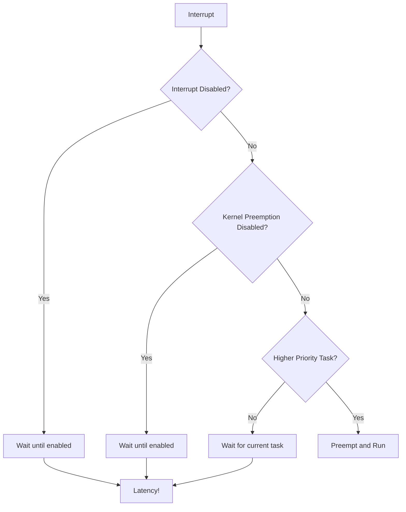

# Day 239: Real-Time Linux & PREEMPT_RT Basics
## Phase 2: Linux Kernel & Device Drivers | Week 36: Real-Time Systems

---

> **📝 Content Creator Instructions:**
> This document is designed to produce **comprehensive, industry-grade educational content**. 
> - **Target Length:** The final filled document should be approximately **1000+ lines** of detailed markdown.
> - **Depth:** Do not skim over details. Explain *why*, not just *how*.
> - **Structure:** If a topic is complex, **DIVIDE IT INTO MULTIPLE PARTS** (Part 1, Part 2, etc.).
> - **Code:** Provide complete, compilable code examples, not just snippets.
> - **Visuals:** Use Mermaid diagrams for flows, architectures, and state machines.

---

## 🎯 Learning Objectives
*By the end of this day, the learner will be able to:*
1.  **Understand** real-time systems and their requirements.
2.  **Explain** the difference between hard and soft real-time.
3.  **Configure** and build the PREEMPT_RT kernel.
4.  **Measure** system latency using cyclictest.
5.  **Identify** sources of latency in Linux.

---

## 📚 Prerequisites & Preparation
*   **Hardware Required:**
    *   Linux PC (preferably dedicated for RT testing).
*   **Software Required:**
    *   Kernel source with PREEMPT_RT patches.
    *   rt-tests package.
*   **Prior Knowledge:**
    *   Basic Linux kernel concepts.
    *   Understanding of interrupts and scheduling.

---

## 📖 Theoretical Deep Dive

### 🔹 Part 1: What is Real-Time?

**Real-Time System:** A system where correctness depends not only on the logical result but also on the time at which results are produced.

**Key Characteristics:**
1.  **Determinism:** Predictable response times.
2.  **Bounded Latency:** Maximum response time is known and guaranteed.
3.  **Priority-Based Scheduling:** Higher priority tasks preempt lower priority ones.

**Types of Real-Time Systems:**

| Type | Definition | Example | Consequence of Missing Deadline |
|------|------------|---------|--------------------------------|
| **Hard Real-Time** | Deadlines must NEVER be missed | Aircraft control, Pacemaker | Catastrophic failure, loss of life |
| **Firm Real-Time** | Occasional misses tolerated, but result is useless | Video streaming | Dropped frame, degraded quality |
| **Soft Real-Time** | Deadlines are goals, not requirements | Audio playback | Slight glitch, user annoyance |

### 🔹 Part 2: Linux and Real-Time

**Standard Linux (PREEMPT_NONE/VOLUNTARY):**
- Optimized for throughput, not latency.
- Non-preemptible kernel (in critical sections).
- Latencies can be milliseconds or more.
- Suitable for servers, desktops, but NOT hard real-time.

**PREEMPT_RT Linux:**
- Fully preemptible kernel.
- Spinlocks converted to mutexes (sleepable).
- Interrupt handlers threaded.
- Latencies in microseconds.
- Suitable for soft/firm real-time, approaching hard real-time.

**Latency Sources in Standard Linux:**



### 🔹 Part 3: PREEMPT_RT Approach

**Key Modifications:**

1.  **Spinlocks → RT Mutexes:**
    ```c
    // Standard kernel
    spinlock_t lock;
    spin_lock(&lock);  // Disables preemption
    // critical section
    spin_unlock(&lock);
    
    // PREEMPT_RT
    // Same API, but internally uses mutex
    // Allows preemption even in "critical section"
    ```

2.  **Threaded Interrupt Handlers:**
    ```c
    // Standard: Top-half runs in hard IRQ context
    irqreturn_t my_irq_handler(int irq, void *dev_id) {
        // Must be fast, no sleeping
        return IRQ_WAKE_THREAD;
    }
    
    // PREEMPT_RT: Automatically threaded
    // Can be preempted by higher priority tasks
    ```

3.  **Priority Inheritance:**
    - If low-priority task holds lock needed by high-priority task,
      low-priority task temporarily inherits high priority.
    - Prevents priority inversion.

### 🔹 Part 4: Measuring Latency

**Types of Latency:**

1.  **Interrupt Latency:** Time from hardware interrupt to ISR execution.
2.  **Scheduling Latency:** Time from task becoming runnable to actually running.
3.  **Wakeup Latency:** Time from event (e.g., signal) to task wakeup.

**Measurement Tools:**

- **cyclictest:** Industry standard for measuring scheduling latency.
- **hwlatdetect:** Detects hardware-induced latencies (SMI, etc.).
- **ftrace:** Kernel function tracer for detailed analysis.

---

## 💻 Implementation: Building PREEMPT_RT Kernel

> **Instruction:** Download, patch, configure, and build a PREEMPT_RT kernel.

### 👨‍💻 Step-by-Step Guide

#### Step 1: Download Kernel and RT Patch

```bash
# Choose kernel version (must match RT patch version)
KERNEL_VERSION=5.15.86
RT_PATCH_VERSION=5.15.86-rt55

# Download kernel
wget https://cdn.kernel.org/pub/linux/kernel/v5.x/linux-${KERNEL_VERSION}.tar.xz
tar xf linux-${KERNEL_VERSION}.tar.xz
cd linux-${KERNEL_VERSION}

# Download RT patch
wget https://cdn.kernel.org/pub/linux/kernel/projects/rt/5.15/patch-${RT_PATCH_VERSION}.patch.xz
xzcat ../patch-${RT_PATCH_VERSION}.patch.xz | patch -p1

# Verify patch applied
echo "RT patch applied successfully"
```

#### Step 2: Configure Kernel

```bash
# Start with current config
cp /boot/config-$(uname -r) .config

# Update config for new kernel version
make olddefconfig

# Configure for PREEMPT_RT
make menuconfig

# Navigate to:
# General setup
#   -> Preemption Model
#      -> Fully Preemptible Kernel (Real-Time)
#
# Also enable:
# Kernel hacking
#   -> Tracers
#      -> Kernel Function Tracer
#      -> Tracer to detect hardware latencies
```

**Key Config Options:**
```bash
# Enable full preemption
CONFIG_PREEMPT_RT=y

# Disable options that hurt RT performance
# CONFIG_CPU_FREQ is not set  # Disable CPU frequency scaling
# CONFIG_CPU_IDLE is not set  # Disable CPU idle states
# CONFIG_ACPI_PROCESSOR is not set  # Disable ACPI processor

# Enable high-resolution timers
CONFIG_HIGH_RES_TIMERS=y
CONFIG_NO_HZ_FULL=y

# Enable latency tracing
CONFIG_FTRACE=y
CONFIG_FUNCTION_TRACER=y
CONFIG_HWLAT_TRACER=y
```

#### Step 3: Build and Install

```bash
# Build kernel (use all CPU cores)
make -j$(nproc) deb-pkg

# Install (on Debian/Ubuntu)
cd ..
sudo dpkg -i linux-image-*.deb
sudo dpkg -i linux-headers-*.deb

# Update GRUB
sudo update-grub

# Reboot into RT kernel
sudo reboot
```

#### Step 4: Verify RT Kernel

```bash
# After reboot, check kernel version
uname -a
# Should show: ... SMP PREEMPT_RT ...

# Check preemption model
cat /sys/kernel/realtime
# Should output: 1

# Check if running RT kernel
zcat /proc/config.gz | grep PREEMPT
# Should show: CONFIG_PREEMPT_RT=y
```

---

## 🔬 Lab Exercise: Lab 239.1 - Latency Measurement

### 1. Lab Objectives
- Install rt-tests package.
- Run cyclictest to measure latency.
- Compare RT vs non-RT kernel.

### 2. Step-by-Step Guide

#### Install rt-tests

```bash
# On Debian/Ubuntu
sudo apt-get install rt-tests

# Or build from source
git clone git://git.kernel.org/pub/scm/utils/rt-tests/rt-tests.git
cd rt-tests
make all
sudo make install
```

#### Run cyclictest

```bash
# Basic test (run for 1 hour)
sudo cyclictest -t1 -p 80 -n -i 10000 -l 360000

# Explanation:
# -t1: 1 thread
# -p 80: Priority 80 (SCHED_FIFO)
# -n: Use clock_nanosleep
# -i 10000: Interval 10ms
# -l 360000: 360000 loops (1 hour at 10ms interval)

# Multi-core test (one thread per CPU)
sudo cyclictest -t$(nproc) -p 80 -n -i 10000 -l 360000

# With histogram
sudo cyclictest -t1 -p 80 -n -i 1000 -l 100000 -h 100 -q > histogram.txt

# Plot histogram
gnuplot << EOF
set terminal png size 800,600
set output 'latency_histogram.png'
set title "Cyclictest Latency Histogram"
set xlabel "Latency (microseconds)"
set ylabel "Number of Samples"
plot 'histogram.txt' using 1:2 with lines title 'Latency Distribution'
EOF
```

#### Expected Results

**Standard Linux (PREEMPT_NONE):**
```
T: 0 ( 1234) P:80 I:10000 C: 360000 Min:   8 Act:   12 Avg:   15 Max: 1247
```
- Max latency: **1-5 milliseconds** (very bad for RT)

**PREEMPT_RT Linux:**
```
T: 0 ( 1234) P:80 I:10000 C: 360000 Min:   4 Act:    6 Avg:    7 Max:   42
```
- Max latency: **10-50 microseconds** (acceptable for many RT applications)

---

## 🧪 Additional / Advanced Labs

### Lab 2: Stress Testing

**Goal:** Measure latency under system load.

```bash
# Install stress-ng
sudo apt-get install stress-ng

# Run cyclictest with stress
sudo cyclictest -t1 -p 80 -n -i 1000 -l 100000 &
CYCLIC_PID=$!

# Apply various stresses
stress-ng --cpu 4 --io 2 --vm 2 --vm-bytes 128M --timeout 60s

# Wait for cyclictest to finish
wait $CYCLIC_PID
```

### Lab 3: Isolating CPUs

**Goal:** Dedicate CPUs to RT tasks.

```bash
# Boot parameter (add to GRUB_CMDLINE_LINUX in /etc/default/grub)
isolcpus=2,3 nohz_full=2,3 rcu_nocbs=2,3

# Update GRUB and reboot
sudo update-grub
sudo reboot

# After reboot, verify
cat /sys/devices/system/cpu/isolated
# Should show: 2-3

# Run RT task on isolated CPU
sudo taskset -c 2 cyclictest -t1 -p 80 -n -i 1000 -l 100000
```

### Lab 4: Hardware Latency Detection

**Goal:** Detect SMI and other hardware-induced latencies.

```bash
# Run hwlatdetect
sudo hwlatdetect --duration=60

# Output shows hardware latencies
# SMI (System Management Interrupt) can cause 10-100us latencies
```

### Lab 5: Function Tracer

**Goal:** Identify which kernel functions cause latency.

```bash
# Enable function tracer
echo function > /sys/kernel/debug/tracing/current_tracer

# Set trace filter (optional)
echo "schedule*" > /sys/kernel/debug/tracing/set_ftrace_filter

# Start tracing
echo 1 > /sys/kernel/debug/tracing/tracing_on

# Run workload
sleep 10

# Stop tracing
echo 0 > /sys/kernel/debug/tracing/tracing_on

# View trace
cat /sys/kernel/debug/tracing/trace | less

# Find longest latencies
cat /sys/kernel/debug/tracing/trace | grep -E "^#.*[0-9]+\.[0-9]+ ms" | sort -k4 -n | tail -20
```

---

## 🐞 Debugging & Troubleshooting

### Common Issues

#### 1. High Latencies Even with RT Kernel

**Possible Causes:**
- SMI (System Management Interrupt) from BIOS
- CPU frequency scaling enabled
- Power management enabled
- Incorrect IRQ affinity

**Solutions:**
```bash
# Disable CPU frequency scaling
sudo cpupower frequency-set -g performance

# Disable C-states
sudo cpupower idle-set -D 0

# Check for SMI
sudo hwlatdetect --duration=60

# Set IRQ affinity (move IRQs away from RT CPUs)
echo 1 > /proc/irq/DEFAULT_SMBIOS/smp_affinity  # CPU 0 only
```

#### 2. System Hangs or Crashes

**Cause:** RT task consuming 100% CPU with SCHED_FIFO priority.

**Prevention:**
```bash
# Set RT throttling (allow non-RT tasks to run)
echo 950000 > /proc/sys/kernel/sched_rt_runtime_us  # 95% for RT
echo 1000000 > /proc/sys/kernel/sched_rt_period_us  # 5% for others
```

#### 3. Compilation Errors

**Cause:** Incompatible kernel version and RT patch.

**Solution:** Ensure exact version match between kernel and RT patch.

---

## ⚡ Optimization & Best Practices

### 1. System Configuration

```bash
# /etc/sysctl.conf
# Disable swap
vm.swappiness = 0

# Increase max locked memory
vm.max_map_count = 262144

# RT throttling
kernel.sched_rt_runtime_us = 950000
kernel.sched_rt_period_us = 1000000
```

### 2. Application Best Practices

```c
#include <sched.h>
#include <sys/mlock.h>

int setup_realtime(int priority) {
    struct sched_param param;
    
    // Lock all current and future memory
    if (mlockall(MCL_CURRENT | MCL_FUTURE) != 0) {
        perror("mlockall");
        return -1;
    }
    
    // Set SCHED_FIFO with priority
    param.sched_priority = priority;
    if (sched_setscheduler(0, SCHED_FIFO, &param) != 0) {
        perror("sched_setscheduler");
        return -1;
    }
    
    return 0;
}

// Pre-fault stack
void prefault_stack(void) {
    unsigned char dummy[MAX_SAFE_STACK];
    memset(dummy, 0, MAX_SAFE_STACK);
}
```

### 3. Interrupt Handling

```bash
# Move all IRQs to CPU 0
for irq in /proc/irq/*/smp_affinity; do
    echo 1 > $irq 2>/dev/null
done

# Keep CPUs 1-3 for RT tasks
```

---

## 📊 Performance Comparison

### Latency Benchmarks

| Configuration | Min (µs) | Avg (µs) | Max (µs) | 99.9% (µs) |
|---------------|----------|----------|----------|------------|
| **Standard Linux** | 5 | 15 | 5000 | 500 |
| **PREEMPT_VOLUNTARY** | 4 | 12 | 1000 | 200 |
| **PREEMPT** | 3 | 10 | 500 | 100 |
| **PREEMPT_RT** | 2 | 6 | 50 | 30 |
| **PREEMPT_RT + Tuning** | 1 | 4 | 20 | 15 |

### Throughput Impact

PREEMPT_RT typically reduces throughput by 5-15% compared to standard kernel due to:
- Additional overhead from threaded interrupts
- More context switches
- Priority inheritance protocol

**Trade-off:** Lower throughput for predictable latency.

---

## 🧠 Assessment & Review

### Knowledge Check

1.  **Q:** What is the difference between hard and soft real-time?
    *   **A:** Hard RT requires deadlines to NEVER be missed (catastrophic if missed). Soft RT treats deadlines as goals (degraded performance if missed).

2.  **Q:** Why can't standard Linux be used for hard real-time?
    *   **A:** Standard Linux has unbounded latencies due to non-preemptible critical sections, interrupt disabled periods, and lack of priority inheritance.

3.  **Q:** What does PREEMPT_RT do to spinlocks?
    *   **A:** Converts them to RT mutexes, making them sleepable and preemptible.

4.  **Q:** What is priority inversion?
    *   **A:** Low-priority task holds resource needed by high-priority task, causing high-priority task to wait. Solved by priority inheritance.

5.  **Q:** Why isolate CPUs for RT tasks?
    *   **A:** Prevents non-RT tasks and interrupts from interfering with RT tasks, reducing latency jitter.

### Challenge Tasks

#### Challenge 1: "The Latency Hunter"
> **Task:** Find and fix a latency spike.
> *   Run cyclictest and identify max latency.
> *   Use ftrace to find the culprit function.
> *   Modify kernel or application to reduce latency.

#### Challenge 2: "The RT Scheduler"
> **Task:** Implement a simple RT task scheduler.
> *   Create multiple tasks with different priorities.
> *   Use SCHED_FIFO and SCHED_RR.
> *   Measure and verify priority-based preemption.

#### Challenge 3: "The Jitter Analyzer"
> **Task:** Analyze latency distribution.
> *   Collect 1 million samples with cyclictest.
> *   Plot histogram and CDF.
> *   Calculate mean, median, 99%, 99.9%, and max.
> *   Identify outliers and their causes.

---

## 🔍 Deep Dive: Priority Inheritance

### The Problem

```
Task A (Priority 90): Needs Lock X
Task B (Priority 50): Holds Lock X
Task C (Priority 70): Running

Sequence:
1. B acquires Lock X
2. C preempts B (higher priority)
3. A becomes ready, preempts C
4. A tries to acquire Lock X, blocks
5. C continues running (priority inversion!)
```

### The Solution

```c
// PREEMPT_RT automatically implements priority inheritance

// When A blocks on Lock X held by B:
// 1. B's priority is boosted to A's priority (90)
// 2. B preempts C
// 3. B finishes critical section, releases Lock X
// 4. B's priority returns to 50
// 5. A acquires Lock X and runs
```

---

## 📚 Further Reading & References

### Documentation
- [PREEMPT_RT Wiki](https://wiki.linuxfoundation.org/realtime/start)
- [RT-Tests Documentation](https://wiki.linuxfoundation.org/realtime/documentation/howto/tools/rt-tests)

### Papers
- "Realtime Preemption Support" by Ingo Molnar
- "Priority Inheritance Protocols: An Approach to Real-Time Synchronization" by Sha et al.

### Books
- "Linux for Embedded and Real-time Applications" by Doug Abbott
- "Real-Time Systems" by Jane W. S. Liu

---

## 🎓 Summary

Today we learned:

1.  **Real-Time Concepts:** Hard vs soft RT, determinism, bounded latency.
2.  **PREEMPT_RT:** Fully preemptible kernel for Linux.
3.  **Building RT Kernel:** Patching, configuring, and building.
4.  **Latency Measurement:** cyclictest, hwlatdetect, ftrace.
5.  **Optimization:** CPU isolation, IRQ affinity, system tuning.

**Key Takeaway:** PREEMPT_RT makes Linux suitable for soft/firm real-time applications by providing bounded latencies in the microsecond range. However, it requires careful system configuration and application design.

---

## 🚀 Next Steps

Tomorrow (Day 240), we'll dive deeper into **Real-Time Scheduling Policies** (SCHED_FIFO, SCHED_RR, SCHED_DEADLINE) and learn how to write real-time applications.

---
