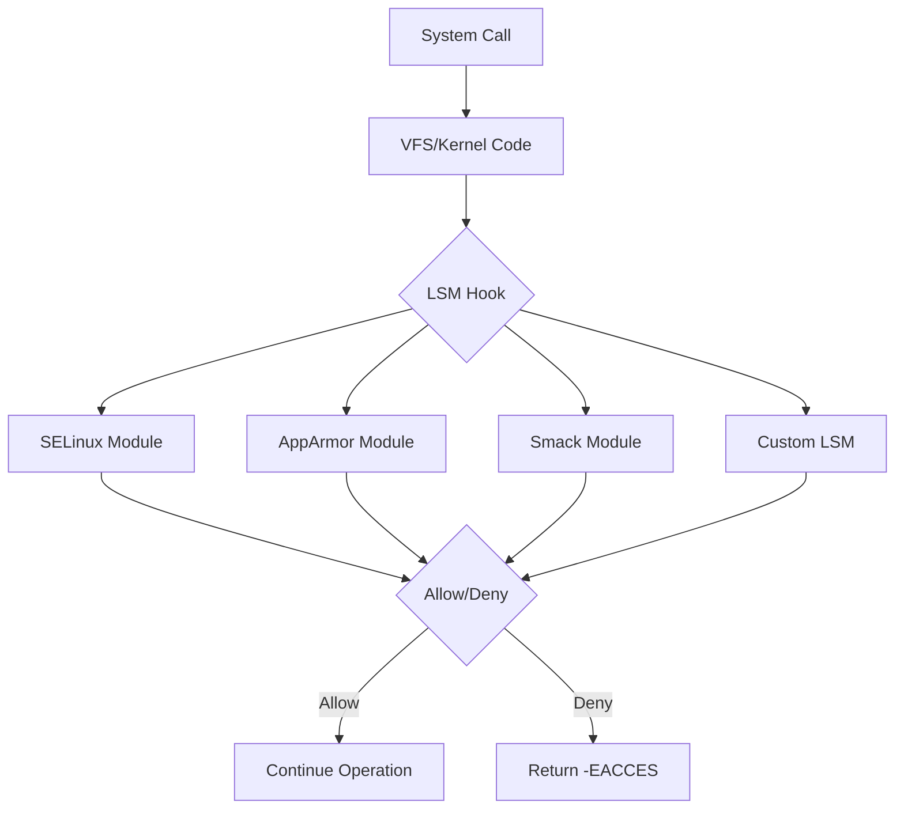

# Day 246: Linux Security Modules (LSM) Framework
## Phase 2: Linux Kernel & Device Drivers | Week 37: Kernel Security

---

## 🎯 Learning Objectives
*By the end of this day, the learner will be able to:*
1. **Understand** the LSM framework architecture and its role in kernel security
2. **Explain** how LSM hooks provide mandatory access control (MAC)
3. **Implement** a simple LSM module
4. **Compare** different LSM implementations (SELinux, AppArmor, Smack)
5. **Debug** LSM-related security issues

---

## 📚 Prerequisites & Preparation
*   **Hardware Required:** Linux PC with kernel source
*   **Software Required:** Kernel with LSM support, SELinux/AppArmor tools
*   **Prior Knowledge:** Kernel module development, security concepts

---

## 📖 Theoretical Deep Dive

### 🔹 Part 1: LSM Framework Overview

**Linux Security Modules (LSM)** is a framework that allows security modules to hook into kernel operations and enforce security policies.

**Key Concepts:**
- **Mandatory Access Control (MAC):** Security policy enforced by the system, not user-configurable
- **Discretionary Access Control (DAC):** Traditional Unix permissions (owner decides)
- **LSM Hooks:** Insertion points in kernel code where security checks occur

**LSM Architecture:**



### 🔹 Part 2: LSM Hook Points

LSM provides hooks at critical kernel operations:

**File Operations:**
- `inode_permission` - Check file access
- `file_open` - Check file open
- `file_mmap` - Check memory mapping
- `file_ioctl` - Check ioctl operations

**Process Operations:**
- `task_create` - Check process creation
- `task_kill` - Check signal sending
- `task_setpgid` - Check process group changes

**Network Operations:**
- `socket_create` - Check socket creation
- `socket_bind` - Check socket binding
- `socket_connect` - Check socket connection

**IPC Operations:**
- `msg_queue_msgrcv` - Check message queue receive
- `shm_shmat` - Check shared memory attach

### 🔹 Part 3: LSM vs Traditional Security

**Traditional Unix Security (DAC):**
```c
// Check if user can read file
if (current_uid() == file->uid || 
    current_gid() == file->gid ||
    file->mode & S_IROTH) {
    // Allow access
}
```

**LSM Security (MAC):**
```c
// DAC check first
if (!dac_check(file)) return -EACCES;

// Then LSM hook
if (security_inode_permission(inode, MAY_READ))
    return -EACCES;

// Both must pass
```

### 🔹 Part 4: Major LSM Implementations

| LSM | Type | Policy | Complexity | Use Case |
|-----|------|--------|------------|----------|
| **SELinux** | Label-based | Type Enforcement | High | Enterprise, Government |
| **AppArmor** | Path-based | Profiles | Medium | Ubuntu, SUSE |
| **Smack** | Label-based | Simple labels | Low | Embedded, IoT |
| **TOMOYO** | Path-based | Learning mode | Medium | Embedded |
| **Yama** | Restrictions | ptrace limits | Low | Desktop hardening |

---

## 💻 Implementation: Simple LSM Module

### Example 1: Basic LSM Module Structure

```c
// simple_lsm.c
#include <linux/module.h>
#include <linux/lsm_hooks.h>
#include <linux/security.h>
#include <linux/sched.h>
#include <linux/fs.h>

#define LSM_NAME "simple_lsm"

// Statistics
static atomic_t checks_total = ATOMIC_INIT(0);
static atomic_t checks_denied = ATOMIC_INIT(0);

// Hook: Check file permissions
static int simple_inode_permission(struct inode *inode, int mask)
{
    atomic_inc(&checks_total);
    
    // Example policy: Deny write access to /etc/passwd
    if (mask & MAY_WRITE) {
        struct dentry *dentry = d_find_alias(inode);
        if (dentry) {
            char *path = dentry_path_raw(dentry, NULL, 0);
            if (path && strcmp(path, "/etc/passwd") == 0) {
                pr_info("simple_lsm: Denied write to /etc/passwd by %s (pid %d)\n",
                        current->comm, current->pid);
                dput(dentry);
                atomic_inc(&checks_denied);
                return -EACCES;
            }
            dput(dentry);
        }
    }
    
    return 0;  // Allow
}

// Hook: Check process creation
static int simple_task_create(unsigned long clone_flags)
{
    atomic_inc(&checks_total);
    
    // Example policy: Limit number of processes per user
    if (current_uid().val >= 1000) {  // Regular users
        int count = 0;
        struct task_struct *p;
        
        rcu_read_lock();
        for_each_process(p) {
            if (task_uid(p).val == current_uid().val)
                count++;
        }
        rcu_read_unlock();
        
        if (count > 100) {
            pr_info("simple_lsm: User %d exceeded process limit\n",
                    current_uid().val);
            atomic_inc(&checks_denied);
            return -EAGAIN;
        }
    }
    
    return 0;
}

// Hook: Check socket creation
static int simple_socket_create(int family, int type, int protocol, int kern)
{
    atomic_inc(&checks_total);
    
    // Example policy: Deny raw sockets for non-root
    if (type == SOCK_RAW && !capable(CAP_NET_RAW)) {
        pr_info("simple_lsm: Denied raw socket creation by %s (uid %d)\n",
                current->comm, current_uid().val);
        atomic_inc(&checks_denied);
        return -EPERM;
    }
    
    return 0;
}

// Hook: Check file open
static int simple_file_open(struct file *file)
{
    atomic_inc(&checks_total);
    
    // Example policy: Log all opens of sensitive files
    struct dentry *dentry = file->f_path.dentry;
    if (dentry) {
        const char *name = dentry->d_name.name;
        if (strstr(name, "shadow") || strstr(name, "passwd")) {
            pr_info("simple_lsm: %s (uid %d) opened %s\n",
                    current->comm, current_uid().val, name);
        }
    }
    
    return 0;
}

// LSM hook list
static struct security_hook_list simple_hooks[] __lsm_ro_after_init = {
    LSM_HOOK_INIT(inode_permission, simple_inode_permission),
    LSM_HOOK_INIT(task_create, simple_task_create),
    LSM_HOOK_INIT(socket_create, simple_socket_create),
    LSM_HOOK_INIT(file_open, simple_file_open),
};

// Initialize LSM
static int __init simple_lsm_init(void)
{
    pr_info("simple_lsm: Initializing\n");
    
    // Register hooks
    security_add_hooks(simple_hooks, ARRAY_SIZE(simple_hooks), LSM_NAME);
    
    pr_info("simple_lsm: Registered %zu hooks\n", ARRAY_SIZE(simple_hooks));
    return 0;
}

// LSM registration
DEFINE_LSM(simple_lsm) = {
    .name = LSM_NAME,
    .init = simple_lsm_init,
};

// Module info
MODULE_LICENSE("GPL");
MODULE_AUTHOR("Embedded Engineer");
MODULE_DESCRIPTION("Simple LSM demonstration module");
```

### Example 2: LSM with Configurable Policy

```c
// policy_lsm.c
#include <linux/module.h>
#include <linux/lsm_hooks.h>
#include <linux/security.h>
#include <linux/seq_file.h>
#include <linux/proc_fs.h>

#define MAX_BLOCKED_PATHS 100

// Policy configuration
static char *blocked_paths[MAX_BLOCKED_PATHS];
static int num_blocked_paths = 0;
static DEFINE_SPINLOCK(policy_lock);

// Check if path is blocked
static bool is_path_blocked(const char *path)
{
    int i;
    bool blocked = false;
    
    spin_lock(&policy_lock);
    for (i = 0; i < num_blocked_paths; i++) {
        if (blocked_paths[i] && strstr(path, blocked_paths[i])) {
            blocked = true;
            break;
        }
    }
    spin_unlock(&policy_lock);
    
    return blocked;
}

// Hook: Check file access
static int policy_inode_permission(struct inode *inode, int mask)
{
    struct dentry *dentry;
    char *path_buf, *path;
    int ret = 0;
    
    if (!(mask & MAY_WRITE))
        return 0;  // Only check writes
    
    dentry = d_find_alias(inode);
    if (!dentry)
        return 0;
    
    path_buf = kmalloc(PATH_MAX, GFP_KERNEL);
    if (!path_buf) {
        dput(dentry);
        return 0;
    }
    
    path = dentry_path_raw(dentry, path_buf, PATH_MAX);
    if (!IS_ERR(path)) {
        if (is_path_blocked(path)) {
            pr_info("policy_lsm: Blocked write to %s by %s\n",
                    path, current->comm);
            ret = -EACCES;
        }
    }
    
    kfree(path_buf);
    dput(dentry);
    return ret;
}

// Proc interface for policy configuration
static ssize_t policy_write(struct file *file, const char __user *buf,
                           size_t count, loff_t *ppos)
{
    char *kbuf;
    char *path;
    
    if (count >= PATH_MAX)
        return -EINVAL;
    
    kbuf = kmalloc(count + 1, GFP_KERNEL);
    if (!kbuf)
        return -ENOMEM;
    
    if (copy_from_user(kbuf, buf, count)) {
        kfree(kbuf);
        return -EFAULT;
    }
    kbuf[count] = '\0';
    
    // Remove trailing newline
    if (kbuf[count - 1] == '\n')
        kbuf[count - 1] = '\0';
    
    spin_lock(&policy_lock);
    
    if (num_blocked_paths < MAX_BLOCKED_PATHS) {
        path = kstrdup(kbuf, GFP_ATOMIC);
        if (path) {
            blocked_paths[num_blocked_paths++] = path;
            pr_info("policy_lsm: Added blocked path: %s\n", path);
        }
    }
    
    spin_unlock(&policy_lock);
    
    kfree(kbuf);
    return count;
}

static int policy_show(struct seq_file *m, void *v)
{
    int i;
    
    spin_lock(&policy_lock);
    seq_printf(m, "Blocked paths (%d):\n", num_blocked_paths);
    for (i = 0; i < num_blocked_paths; i++) {
        if (blocked_paths[i])
            seq_printf(m, "  %s\n", blocked_paths[i]);
    }
    spin_unlock(&policy_lock);
    
    return 0;
}

static int policy_open(struct inode *inode, struct file *file)
{
    return single_open(file, policy_show, NULL);
}

static const struct proc_ops policy_ops = {
    .proc_open = policy_open,
    .proc_read = seq_read,
    .proc_write = policy_write,
    .proc_lseek = seq_lseek,
    .proc_release = single_release,
};

static struct security_hook_list policy_hooks[] __lsm_ro_after_init = {
    LSM_HOOK_INIT(inode_permission, policy_inode_permission),
};

static int __init policy_lsm_init(void)
{
    // Create proc interface
    proc_create("lsm_policy", 0600, NULL, &policy_ops);
    
    // Register hooks
    security_add_hooks(policy_hooks, ARRAY_SIZE(policy_hooks), "policy_lsm");
    
    pr_info("policy_lsm: Initialized (configure via /proc/lsm_policy)\n");
    return 0;
}

DEFINE_LSM(policy_lsm) = {
    .name = "policy_lsm",
    .init = policy_lsm_init,
};

MODULE_LICENSE("GPL");
```

---

## 🔬 Lab Exercises

### Lab 1: Enable and Test Simple LSM

```bash
# 1. Build kernel with LSM support
cd linux-source
make menuconfig
# Enable: Security options -> Enable different security models

# 2. Build LSM module
make M=security/simple_lsm modules

# 3. Load module
sudo insmod security/simple_lsm/simple_lsm.ko

# 4. Test protection
echo "test" > /etc/passwd  # Should be denied

# 5. Check logs
dmesg | grep simple_lsm
```

### Lab 2: Configure Policy LSM

```bash
# Load policy LSM
sudo insmod policy_lsm.ko

# Add blocked paths
echo "/tmp/secret" | sudo tee /proc/lsm_policy
echo "/home/user/private" | sudo tee -a /proc/lsm_policy

# View policy
cat /proc/lsm_policy

# Test
touch /tmp/secret/file  # Should be denied
```

### Lab 3: Compare LSM Implementations

```bash
# Check active LSMs
cat /sys/kernel/security/lsm

# SELinux status
sestatus

# AppArmor status
sudo aa-status

# Test with different LSMs
# Disable SELinux temporarily
sudo setenforce 0

# Enable AppArmor profile
sudo aa-enforce /etc/apparmor.d/usr.bin.firefox
```

---

## 🧪 Advanced Labs

### Lab 4: LSM Hook Tracing

```c
// Trace all LSM hooks
#include <linux/module.h>
#include <linux/lsm_hooks.h>
#include <linux/kprobes.h>

static int hook_counter[100];

static int trace_handler(struct kprobe *p, struct pt_regs *regs)
{
    // Count hook invocations
    int hook_id = (int)(long)p->addr % 100;
    hook_counter[hook_id]++;
    return 0;
}

// Register kprobes on LSM hooks
static int __init trace_init(void)
{
    struct kprobe *kp;
    
    // Probe security_inode_permission
    kp = kzalloc(sizeof(*kp), GFP_KERNEL);
    kp->symbol_name = "security_inode_permission";
    kp->pre_handler = trace_handler;
    register_kprobe(kp);
    
    return 0;
}
```

### Lab 5: Performance Impact Measurement

```bash
# Benchmark without LSM
sudo setenforce 0
time find / -type f 2>/dev/null | wc -l

# Benchmark with LSM
sudo setenforce 1
time find / -type f 2>/dev/null | wc -l

# Measure overhead
# Typical: 1-5% for SELinux, <1% for AppArmor
```

---

## 🐞 Debugging & Troubleshooting

### Common Issues

**1. LSM Module Not Loading**
```bash
# Check if LSM framework is enabled
zcat /proc/config.gz | grep CONFIG_SECURITY

# Check LSM order
cat /sys/kernel/security/lsm

# Force LSM order at boot
# Add to kernel command line:
lsm=lockdown,yama,apparmor,selinux
```

**2. Permission Denied Errors**
```bash
# Check which LSM denied access
ausearch -m AVC -ts recent  # SELinux
dmesg | grep apparmor       # AppArmor
dmesg | grep simple_lsm     # Custom LSM

# Temporarily disable for testing
setenforce 0  # SELinux
aa-complain /path/to/profile  # AppArmor
```

**3. LSM Hook Not Called**
```c
// Verify hook registration
static int __init my_lsm_init(void)
{
    int ret;
    
    ret = security_add_hooks(my_hooks, ARRAY_SIZE(my_hooks), "my_lsm");
    if (ret) {
        pr_err("Failed to register hooks: %d\n", ret);
        return ret;
    }
    
    pr_info("Registered %zu hooks successfully\n", ARRAY_SIZE(my_hooks));
    return 0;
}
```

---

## ⚡ Optimization & Best Practices

### 1. Minimize Hook Overhead

```c
// BAD: Expensive operation in hot path
static int slow_hook(struct inode *inode, int mask)
{
    char *path = get_full_path(inode);  // Expensive!
    bool blocked = check_policy(path);   // Expensive!
    kfree(path);
    return blocked ? -EACCES : 0;
}

// GOOD: Fast path for common case
static int fast_hook(struct inode *inode, int mask)
{
    // Quick check first
    if (likely(!policy_enabled))
        return 0;
    
    // Only do expensive work if needed
    if (mask & MAY_WRITE) {
        return slow_path_check(inode);
    }
    
    return 0;
}
```

### 2. Use Caching

```c
// Cache policy decisions
struct policy_cache {
    unsigned long inode_no;
    int decision;
    unsigned long timestamp;
};

static struct policy_cache cache[1024];

static int cached_check(struct inode *inode)
{
    int idx = inode->i_ino % 1024;
    unsigned long now = jiffies;
    
    // Check cache (valid for 1 second)
    if (cache[idx].inode_no == inode->i_ino &&
        time_before(now, cache[idx].timestamp + HZ)) {
        return cache[idx].decision;
    }
    
    // Compute and cache
    int decision = compute_decision(inode);
    cache[idx].inode_no = inode->i_ino;
    cache[idx].decision = decision;
    cache[idx].timestamp = now;
    
    return decision;
}
```

### 3. Avoid Locks in Hot Paths

```c
// Use RCU for read-heavy policy lookups
static struct policy_entry __rcu *policy_list;

static bool check_policy_rcu(const char *path)
{
    struct policy_entry *entry;
    bool blocked = false;
    
    rcu_read_lock();
    entry = rcu_dereference(policy_list);
    while (entry) {
        if (strcmp(entry->path, path) == 0) {
            blocked = true;
            break;
        }
        entry = rcu_dereference(entry->next);
    }
    rcu_read_unlock();
    
    return blocked;
}
```

---

## 📊 Performance Analysis

### LSM Overhead Comparison

| LSM | Overhead (%) | Memory (MB) | Context |
|-----|--------------|-------------|---------|
| **None** | 0% | 0 | Baseline |
| **Yama** | <0.1% | <1 | Minimal |
| **AppArmor** | 0.5-1% | 2-5 | Path-based |
| **SELinux** | 2-5% | 10-20 | Label-based |
| **Custom (Simple)** | 0.1-0.5% | 1-2 | Depends on hooks |

### Hook Frequency (typical workload)

| Hook | Calls/sec | Impact |
|------|-----------|--------|
| `inode_permission` | 10,000+ | High |
| `file_open` | 1,000+ | Medium |
| `task_create` | 100+ | Low |
| `socket_create` | 50+ | Low |

---

## 🧠 Assessment & Review

### Knowledge Check

1. **Q:** What is the difference between DAC and MAC?
   **A:** DAC (Discretionary Access Control) allows owners to set permissions. MAC (Mandatory Access Control) enforces system-wide policy that users cannot override.

2. **Q:** Why are LSM hooks placed after DAC checks?
   **A:** DAC provides baseline security. LSM adds additional mandatory controls on top. Both must pass for access to be granted.

3. **Q:** Can multiple LSMs be active simultaneously?
   **A:** Yes, with LSM stacking (since kernel 4.2). Multiple LSMs can be loaded, each adding its own security checks.

4. **Q:** What happens if an LSM hook returns non-zero?
   **A:** The operation is denied, and the error code is returned to userspace (typically -EACCES or -EPERM).

5. **Q:** How does LSM affect performance?
   **A:** Minimal (<1%) for simple LSMs, 2-5% for complex ones like SELinux. Depends on number of hooks and policy complexity.

---

## 📚 Further Reading

### Documentation
- [LSM Framework Documentation](https://www.kernel.org/doc/html/latest/security/lsm.html)
- [SELinux Project](https://github.com/SELinuxProject)
- [AppArmor Wiki](https://gitlab.com/apparmor/apparmor/-/wikis/home)

### Papers
- "Linux Security Modules: General Security Hooks for Linux" by Wright et al.
- "Implementing and Integrating LSM" by Smalley & Vance

### Source Code
- `security/security.c` - LSM framework core
- `security/selinux/` - SELinux implementation
- `security/apparmor/` - AppArmor implementation

---

## 🎓 Summary

Today we learned:
1. **LSM Framework:** Architecture and hook points
2. **Implementation:** Creating custom LSM modules
3. **Comparison:** SELinux vs AppArmor vs Smack
4. **Performance:** Overhead analysis and optimization
5. **Debugging:** Tools and techniques for LSM issues

**Key Takeaway:** LSM provides a flexible framework for implementing mandatory access control in Linux. Custom LSMs can enforce organization-specific security policies with minimal performance impact.

---

## 🚀 Next Steps

Day 247: SELinux Deep Dive - Policies, Contexts, and Type Enforcement

---
