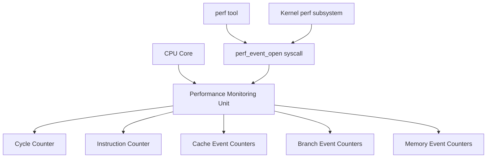

# Day 253: Kernel Profiling with perf
## Phase 2: Linux Kernel & Device Drivers | Week 38: Performance Optimization

---

> **📝 Content Creator Instructions:**
> This document is designed to produce **comprehensive, industry-grade educational content**. 
> - **Target Length:** The final filled document should be approximately **1000+ lines** of detailed markdown.
> - **Depth:** Do not skim over details. Explain *why*, not just *how*.
> - **Structure:** If a topic is complex, **DIVIDE IT INTO MULTIPLE PARTS** (Part 1, Part 2, etc.).
> - **Code:** Provide complete, compilable code examples, not just snippets.
> - **Visuals:** Use Mermaid diagrams for flows, architectures, and state machines.

---

## 🎯 Learning Objectives
*By the end of this day, the learner will be able to:*
1. **Understand** Linux perf subsystem architecture and capabilities
2. **Use** perf for CPU profiling, cache analysis, and performance monitoring
3. **Analyze** performance bottlenecks using perf report and annotate
4. **Generate** flame graphs for visualization
5. **Profile** both kernel and userspace code
6. **Optimize** code based on profiling data

---

## 📚 Prerequisites & Preparation
*   **Hardware Required:** Linux PC with performance counter support
*   **Software Required:** perf tools, kernel with perf events enabled
*   **Prior Knowledge:** C programming, basic kernel concepts

---

## 📖 Theoretical Deep Dive

### 🔹 Part 1: Performance Monitoring Unit (PMU)

**Hardware Performance Counters** are special CPU registers that track:
- **CPU Cycles:** Total cycles executed
- **Instructions:** Instructions retired
- **Cache Events:** L1/L2/L3 hits and misses
- **Branch Events:** Predictions, mispredictions
- **Memory Events:** Loads, stores, TLB misses
- **Bus Events:** Memory bus transactions

**PMU Architecture:**



### 🔹 Part 2: perf Events

**Event Types:**

1. **Hardware Events:**
   ```bash
   cpu-cycles (or cycles)
   instructions
   cache-references
   cache-misses
   branch-instructions (or branches)
   branch-misses
   bus-cycles
   ```

2. **Software Events:**
   ```bash
   cpu-clock
   task-clock
   page-faults (or faults)
   context-switches (or cs)
   cpu-migrations
   minor-faults
   major-faults
   ```

3. **Hardware Cache Events:**
   ```bash
   L1-dcache-loads
   L1-dcache-load-misses
   L1-dcache-stores
   L1-icache-loads
   L1-icache-load-misses
   LLC-loads (Last Level Cache)
   LLC-load-misses
   LLC-stores
   LLC-store-misses
   ```

4. **Tracepoint Events:**
   ```bash
   syscalls:sys_enter_*
   sched:sched_switch
   irq:irq_handler_entry
   block:block_rq_issue
   ```

### 🔹 Part 3: Sampling vs Counting

**Counting Mode:**
- Counts events over entire run
- Low overhead
- Good for overall statistics

```bash
perf stat ./myapp
```

**Sampling Mode:**
- Periodically samples program counter
- Records call stacks
- Identifies hotspots
- Higher overhead

```bash
perf record ./myapp
```

### 🔹 Part 4: perf Subsystem Architecture

```
┌─────────────────────────────────────┐
│         User Space                  │
│  ┌──────────┐      ┌──────────┐   │
│  │perf tool │      │  App     │   │
│  └────┬─────┘      └────┬─────┘   │
└───────┼─────────────────┼──────────┘
        │                 │
        │ perf_event_open │
        ▼                 ▼
┌─────────────────────────────────────┐
│         Kernel Space                │
│  ┌──────────────────────────────┐  │
│  │   perf_event subsystem       │  │
│  │  - Event management          │  │
│  │  - Sampling                  │  │
│  │  - Ring buffer               │  │
│  └──────────┬───────────────────┘  │
│             │                       │
│             ▼                       │
│  ┌──────────────────────────────┐  │
│  │   PMU drivers                │  │
│  │  - x86 PMU                   │  │
│  │  - ARM PMU                   │  │
│  │  - Software events           │  │
│  └──────────┬───────────────────┘  │
└─────────────┼────────────────────────┘
              │
              ▼
        Hardware PMU
```

---

## 💻 Implementation: Comprehensive perf Usage

### Example 1: Basic CPU Profiling

```bash
#!/bin/bash
# cpu_profile.sh - Comprehensive CPU profiling script

APP="./myapp"

echo "=== CPU Profiling with perf ==="

# 1. Quick statistics
echo -e "\n1. Overall Statistics:"
perf stat -d $APP

# Output explanation:
# Performance counter stats for './myapp':
#
#     1,234.56 msec task-clock                #    0.999 CPUs utilized
#           12      context-switches          #    9.720 /sec
#            0      cpu-migrations            #    0.000 /sec
#          456      page-faults               #  369.234 /sec
#  4,567,890,123      cycles                  #    3.699 GHz
#  3,456,789,012      instructions            #    0.76  insn per cycle
#    678,901,234      branches                #  549.876 M/sec
#      1,234,567      branch-misses           #    0.18% of all branches
#
# Interpretation:
# - CPUs utilized: Should be close to 1.0 for CPU-bound apps
# - insn per cycle: Higher is better (>1.0 good, <0.5 poor)
# - branch-misses: Lower is better (<5% good)

# 2. Detailed cache statistics
echo -e "\n2. Cache Statistics:"
perf stat -e cache-references,cache-misses,L1-dcache-loads,L1-dcache-load-misses,LLC-loads,LLC-load-misses $APP

# 3. Record with call graphs
echo -e "\n3. Recording with call graphs:"
perf record -F 99 -g --call-graph dwarf $APP

# Options explained:
# -F 99: Sample at 99 Hz (99 samples/second)
# -g: Enable call graph recording
# --call-graph dwarf: Use DWARF debug info for accurate call graphs

# 4. Generate report
echo -e "\n4. Performance Report:"
perf report --stdio --no-children | head -50

# 5. Annotate hottest function
echo -e "\n5. Annotating hottest function:"
HOTTEST=$(perf report --stdio --no-children | grep -v "^#" | head -1 | awk '{print $NF}')
perf annotate --stdio $HOTTEST | head -100
```

### Example 2: Advanced Profiling Techniques

```bash
#!/bin/bash
# advanced_profile.sh

APP="./myapp"
PID=$(pgrep myapp)

# 1. System-wide profiling
echo "=== System-wide profiling for 10 seconds ==="
perf record -a -g -F 997 sleep 10
perf report --stdio

# 2. Profile specific CPU
echo "=== Profile CPU 0 only ==="
perf record -C 0 -g sleep 5

# 3. Profile specific events
echo "=== Profile cache misses ==="
perf record -e cache-misses -g $APP

# 4. Profile with multiple events
echo "=== Multi-event profiling ==="
perf record -e cycles,instructions,cache-misses,branch-misses -g $APP

# 5. Off-CPU profiling (waiting time)
echo "=== Off-CPU profiling ==="
perf record -e sched:sched_switch -e sched:sched_stat_sleep -g -a sleep 10

# 6. Memory access profiling
echo "=== Memory profiling ==="
perf mem record $APP
perf mem report

# 7. Lock contention profiling
echo "=== Lock contention ==="
perf lock record $APP
perf lock report

# 8. I/O profiling
echo "=== I/O profiling ==="
perf record -e block:block_rq_issue -e block:block_rq_complete -g $APP
```

### Example 3: Flame Graph Generation

```bash
#!/bin/bash
# flamegraph.sh - Generate flame graphs

# Prerequisites:
# git clone https://github.com/brendangregg/FlameGraph
# export PATH=$PATH:/path/to/FlameGraph

APP="./myapp"

echo "=== Generating Flame Graph ==="

# 1. Record with call graphs
perf record -F 99 -g --call-graph dwarf $APP

# 2. Convert to flame graph format
perf script | stackcollapse-perf.pl > out.folded

# 3. Generate SVG
flamegraph.pl out.folded > flamegraph.svg

echo "Flame graph saved to flamegraph.svg"

# 4. Generate differential flame graph (compare two runs)
echo "=== Differential Flame Graph ==="

# Baseline
perf record -F 99 -g -o perf.data.old $APP

# After optimization
perf record -F 99 -g -o perf.data.new $APP

# Generate diff
perf script -i perf.data.old | stackcollapse-perf.pl > old.folded
perf script -i perf.data.new | stackcollapse-perf.pl > new.folded
difffolded.pl old.folded new.folded | flamegraph.pl > diff.svg

echo "Differential flame graph saved to diff.svg"
```

### Example 4: Custom Performance Analysis Tool

```c
// perf_analyzer.c - Custom tool using perf_event_open
#include <stdio.h>
#include <stdlib.h>
#include <string.h>
#include <unistd.h>
#include <sys/syscall.h>
#include <linux/perf_event.h>
#include <linux/hw_breakpoint.h>

static long perf_event_open(struct perf_event_attr *hw_event, pid_t pid,
                            int cpu, int group_fd, unsigned long flags) {
    return syscall(__NR_perf_event_open, hw_event, pid, cpu, group_fd, flags);
}

// Measure CPU cycles and instructions
void measure_performance(void (*func)(void)) {
    struct perf_event_attr pe_cycles, pe_instructions;
    int fd_cycles, fd_instructions;
    long long count_cycles, count_instructions;
    
    // Setup cycles counter
    memset(&pe_cycles, 0, sizeof(pe_cycles));
    pe_cycles.type = PERF_TYPE_HARDWARE;
    pe_cycles.size = sizeof(pe_cycles);
    pe_cycles.config = PERF_COUNT_HW_CPU_CYCLES;
    pe_cycles.disabled = 1;
    pe_cycles.exclude_kernel = 1;
    pe_cycles.exclude_hv = 1;
    
    fd_cycles = perf_event_open(&pe_cycles, 0, -1, -1, 0);
    if (fd_cycles == -1) {
        perror("perf_event_open cycles");
        return;
    }
    
    // Setup instructions counter
    memset(&pe_instructions, 0, sizeof(pe_instructions));
    pe_instructions.type = PERF_TYPE_HARDWARE;
    pe_instructions.size = sizeof(pe_instructions);
    pe_instructions.config = PERF_COUNT_HW_INSTRUCTIONS;
    pe_instructions.disabled = 1;
    pe_instructions.exclude_kernel = 1;
    pe_instructions.exclude_hv = 1;
    
    fd_instructions = perf_event_open(&pe_instructions, 0, -1, -1, 0);
    if (fd_instructions == -1) {
        perror("perf_event_open instructions");
        close(fd_cycles);
        return;
    }
    
    // Start counting
    ioctl(fd_cycles, PERF_EVENT_IOC_RESET, 0);
    ioctl(fd_instructions, PERF_EVENT_IOC_RESET, 0);
    ioctl(fd_cycles, PERF_EVENT_IOC_ENABLE, 0);
    ioctl(fd_instructions, PERF_EVENT_IOC_ENABLE, 0);
    
    // Run function
    func();
    
    // Stop counting
    ioctl(fd_cycles, PERF_EVENT_IOC_DISABLE, 0);
    ioctl(fd_instructions, PERF_EVENT_IOC_DISABLE, 0);
    
    // Read results
    read(fd_cycles, &count_cycles, sizeof(count_cycles));
    read(fd_instructions, &count_instructions, sizeof(count_instructions));
    
    printf("Cycles: %lld\n", count_cycles);
    printf("Instructions: %lld\n", count_instructions);
    printf("IPC (Instructions Per Cycle): %.2f\n", 
           (double)count_instructions / count_cycles);
    
    close(fd_cycles);
    close(fd_instructions);
}

// Test function
void test_function(void) {
    volatile long sum = 0;
    for (long i = 0; i < 10000000; i++) {
        sum += i;
    }
}

int main(void) {
    printf("Measuring performance of test function:\n");
    measure_performance(test_function);
    return 0;
}

// Compile: gcc -o perf_analyzer perf_analyzer.c
```

---

## 🔬 Lab Exercises

### Lab 1: Identify CPU Hotspots

**Objective:** Find and optimize the hottest function in an application.

```bash
# 1. Profile application
perf record -g ./myapp

# 2. View report
perf report

# 3. Identify hottest function (top of list)
# Example output:
#   45.67%  myapp  myapp  [.] compute_heavy
#   23.45%  myapp  myapp  [.] process_data
#   12.34%  myapp  myapp  [.] main

# 4. Annotate hottest function
perf annotate compute_heavy

# 5. View source-level annotation
perf annotate --source compute_heavy

# Example annotation:
#        :    void compute_heavy(int *data, int size) {
#   0.00 :      push   %rbp
#   0.00 :      mov    %rsp,%rbp
#        :      for (int i = 0; i < size; i++) {
#  12.34 :      xor    %eax,%eax
#        :          data[i] = data[i] * 2 + 1;  // Hot line!
#  78.90 :      imul   $0x2,(%rdi,%rax,4),%ecx
#   8.76 :      add    $0x1,%ecx
#        :      mov    %ecx,(%rdi,%rax,4)
```

### Lab 2: Cache Miss Analysis

**Objective:** Analyze and reduce cache misses.

```c
// cache_test.c - Test program with cache issues
#include <stdio.h>
#include <stdlib.h>
#include <time.h>

#define SIZE (64 * 1024 * 1024)  // 64MB

// BAD: Poor cache locality
void bad_access(int *array, int size) {
    for (int i = 0; i < size; i += 16) {  // Stride of 16 (64 bytes)
        array[i] = i;
    }
}

// GOOD: Good cache locality
void good_access(int *array, int size) {
    for (int i = 0; i < size; i++) {  // Sequential access
        array[i] = i;
    }
}

int main(int argc, char *argv[]) {
    int *array = malloc(SIZE * sizeof(int));
    
    if (argc > 1 && argv[1][0] == 'b') {
        printf("Running BAD access pattern\n");
        bad_access(array, SIZE);
    } else {
        printf("Running GOOD access pattern\n");
        good_access(array, SIZE);
    }
    
    free(array);
    return 0;
}
```

```bash
# Compile
gcc -O2 -o cache_test cache_test.c

# Profile bad access
perf stat -e cache-references,cache-misses,L1-dcache-load-misses ./cache_test b

# Profile good access
perf stat -e cache-references,cache-misses,L1-dcache-load-misses ./cache_test g

# Compare results:
# BAD:  cache-miss-rate: ~25%
# GOOD: cache-miss-rate: ~3%
```

### Lab 3: Branch Misprediction Analysis

```c
// branch_test.c - Test branch prediction
#include <stdio.h>
#include <stdlib.h>
#include <time.h>

#define SIZE 1000000

// Unpredictable branches
void unpredictable_branches(int *data, int size) {
    int sum = 0;
    for (int i = 0; i < size; i++) {
        if (data[i] > 50) {  // Random, unpredictable
            sum += data[i];
        }
    }
    printf("Sum: %d\n", sum);
}

// Predictable branches
void predictable_branches(int *data, int size) {
    int sum = 0;
    for (int i = 0; i < size; i++) {
        if (i < size/2) {  // Predictable pattern
            sum += data[i];
        }
    }
    printf("Sum: %d\n", sum);
}

int main(int argc, char *argv[]) {
    int *data = malloc(SIZE * sizeof(int));
    
    // Fill with random data
    srand(time(NULL));
    for (int i = 0; i < SIZE; i++) {
        data[i] = rand() % 100;
    }
    
    if (argc > 1 && argv[1][0] == 'u') {
        unpredictable_branches(data, SIZE);
    } else {
        predictable_branches(data, SIZE);
    }
    
    free(data);
    return 0;
}
```

```bash
# Profile branch mispredictions
perf stat -e branches,branch-misses ./branch_test u
perf stat -e branches,branch-misses ./branch_test p

# Results:
# Unpredictable: ~20% branch misses
# Predictable:   ~1% branch misses
```

---

## 🧪 Advanced Labs

### Lab 4: Kernel Function Profiling

```bash
# Profile kernel functions
sudo perf record -a -g -e cycles:k sleep 10

# View kernel hotspots
sudo perf report

# Annotate kernel function
sudo perf annotate --vmlinux=/usr/lib/debug/boot/vmlinux-$(uname -r) <function>
```

### Lab 5: Hardware Event Correlation

```bash
# Record multiple events simultaneously
perf record -e cycles,instructions,cache-misses,branch-misses -g ./myapp

# Analyze correlation
perf report --stdio | grep -A 5 "Event count"

# Calculate metrics
# IPC = instructions / cycles
# Cache miss rate = cache-misses / cache-references
# Branch miss rate = branch-misses / branches
```

---

## 🐞 Debugging & Troubleshooting

### Common Issues

**1. "perf not found"**
```bash
# Install perf
sudo apt-get install linux-tools-common linux-tools-$(uname -r)
```

**2. "Permission denied"**
```bash
# Allow non-root perf
sudo sysctl -w kernel.perf_event_paranoid=-1

# Or run as root
sudo perf record ./myapp
```

**3. "No symbols in report"**
```bash
# Compile with debug symbols
gcc -g -O2 -o myapp myapp.c

# Install debug symbols for libraries
sudo apt-get install libc6-dbg
```

**4. "Overhead too high"**
```bash
# Reduce sampling frequency
perf record -F 49 -g ./myapp  # 49 Hz instead of 99 Hz

# Use hardware events instead of software
perf record -e cycles -g ./myapp
```

---

## ⚡ Optimization & Best Practices

### 1. Sampling Frequency Selection

```bash
# Low overhead (good for production)
perf record -F 49 -g ./myapp

# Medium overhead (development)
perf record -F 99 -g ./myapp

# High overhead (detailed analysis)
perf record -F 997 -g ./myapp
```

### 2. Call Graph Methods

```bash
# Frame pointer (fast, less accurate)
perf record -g --call-graph fp ./myapp

# DWARF (slower, more accurate)
perf record -g --call-graph dwarf ./myapp

# LBR (Last Branch Record - Intel only, very accurate)
perf record -g --call-graph lbr ./myapp
```

### 3. Filtering

```bash
# Profile only specific function
perf record -e cycles -g --filter 'function==my_function' ./myapp

# Profile only userspace
perf record -e cycles:u -g ./myapp

# Profile only kernel
perf record -e cycles:k -g ./myapp
```

---

## 📊 Performance Metrics Interpretation

### Key Metrics

| Metric | Good | Acceptable | Poor | Action |
|--------|------|------------|------|--------|
| **IPC** | >1.5 | 0.8-1.5 | <0.8 | Optimize algorithm |
| **Cache Miss Rate** | <3% | 3-10% | >10% | Improve locality |
| **Branch Miss Rate** | <2% | 2-5% | >5% | Reduce unpredictability |
| **CPU Utilization** | >90% | 70-90% | <70% | Check I/O waits |

---

## 🧠 Assessment & Review

### Knowledge Check

1. **Q:** What is the difference between `perf stat` and `perf record`?
   **A:** `perf stat` counts events (summary), `perf record` samples (detailed profile with call stacks).

2. **Q:** What does IPC (Instructions Per Cycle) indicate?
   **A:** How efficiently the CPU executes instructions. Higher is better. Low IPC suggests stalls (cache misses, branch mispredictions, dependencies).

3. **Q:** How to reduce cache misses?
   **A:** Improve data locality, use cache-friendly data structures, prefetch data, reduce working set size.

4. **Q:** What causes branch mispredictions?
   **A:** Unpredictable conditional branches (random data, complex conditions). Use branchless code or make patterns more predictable.

5. **Q:** How to profile kernel code?
   **A:** Use `perf record -a -g -e cycles:k` for kernel-only profiling, requires root or relaxed perf_event_paranoid.

---

## 📚 Further Reading

### Documentation
- [perf Wiki](https://perf.wiki.kernel.org/)
- [Brendan Gregg's perf Examples](http://www.brendangregg.com/perf.html)
- [Intel Performance Analysis Guide](https://software.intel.com/content/www/us/en/develop/documentation/vtune-help/)

### Books
- "Systems Performance" by Brendan Gregg
- "Computer Architecture: A Quantitative Approach" by Hennessy & Patterson

### Tools
- FlameGraph: https://github.com/brendangregg/FlameGraph
- perf-tools: https://github.com/brendangregg/perf-tools

---

## 🎓 Summary

Today we learned:
1. **perf Architecture:** PMU, events, sampling vs counting
2. **CPU Profiling:** Identifying hotspots, call graphs, flame graphs
3. **Cache Analysis:** Measuring and reducing cache misses
4. **Branch Analysis:** Understanding and optimizing branch predictions
5. **Advanced Techniques:** Multi-event profiling, kernel profiling, custom tools

**Key Takeaway:** perf is the most powerful performance analysis tool for Linux. Understanding hardware performance counters and how to interpret perf data is essential for writing high-performance code.

---

## 🚀 Next Steps

Day 254: Ftrace and Function Tracing - Deep dive into kernel function tracing, trace events, and dynamic tracing.

---
