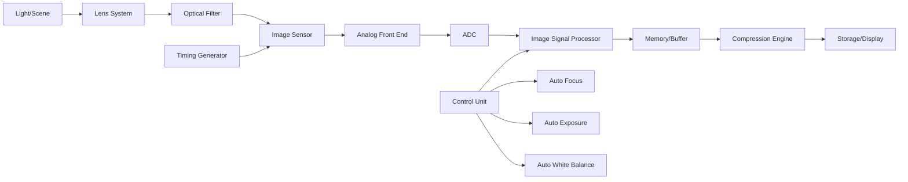
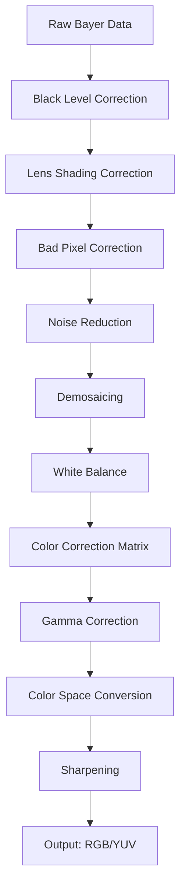

# Day 1: Introduction to Camera Systems and Image Signal Processing
## Phase 3: Camera Systems & ISP | Week 1: Camera Fundamentals

---

> **📝 Content Creator Instructions:**
> This template is designed to produce **comprehensive, industry-grade educational content**. 
> - **Target Length:** The final filled document should be approximately **1000+ lines** of detailed markdown.
> - **Depth:** Do not skim over details. Explain *why*, not just *how*.
> - **Structure:** If a topic is complex, **DIVIDE IT INTO MULTIPLE PARTS** (Part 1, Part 2, etc.).
> - **Code:** Provide complete, compilable code examples, not just snippets.
> - **Visuals:** Use Mermaid diagrams for flows, architectures, and state machines.

---

## 🎯 Learning Objectives
*By the end of this day, the learner will be able to:*
1. **Understand** the complete camera system architecture from sensor to display
2. **Explain** the role of Image Signal Processor (ISP) in modern camera systems
3. **Identify** key components in the camera pipeline and their functions
4. **Analyze** image quality metrics and requirements
5. **Compare** different camera sensor technologies (CCD vs CMOS)
6. **Design** a basic camera system block diagram

---

## 📚 Prerequisites & Preparation
*   **Hardware Required:** 
    - Development board with camera interface (Raspberry Pi, BeagleBone, or similar)
    - USB camera or CSI camera module
    - HDMI display or monitor
*   **Software Required:** 
    - Linux with V4L2 support
    - OpenCV library
    - Python 3.x or C compiler
*   **Prior Knowledge:** 
    - Basic electronics and digital systems
    - Understanding of image representation (pixels, RGB, etc.)
    - Familiarity with embedded Linux
*   **Datasheets:** 
    - Camera sensor datasheet (e.g., OV5640, IMX219)
    - ISP reference manual

---

## 📖 Theoretical Deep Dive

> **instruction:** This section must be exhaustive. We're covering the entire camera system architecture, image formation, sensor technologies, and ISP fundamentals.

### 🔹 Part 1: Camera System Architecture & Components

#### 1.1 Complete Camera System Overview

A modern digital camera system consists of multiple interconnected components working together to capture, process, and output high-quality images.

**System Block Diagram:**



**Key Components Explained:**

1. **Lens System:**
   - **Function:** Focuses light onto the image sensor
   - **Key Parameters:**
     - Focal length (determines field of view)
     - Aperture (f-number, controls light amount and depth of field)
     - Optical quality (aberrations, distortions)
   - **Types:** Fixed focus, auto-focus (voice coil motor, stepper motor)

2. **Optical Filters:**
   - **IR Cut Filter:** Blocks infrared light to prevent color distortion
   - **Color Filter Array (CFA):** Typically Bayer pattern (RGGB) for color sensing
   - **Anti-Aliasing Filter:** Reduces moiré patterns

3. **Image Sensor:**
   - **Function:** Converts light (photons) to electrical signals (electrons)
   - **Technologies:** CCD (Charge-Coupled Device) or CMOS (Complementary Metal-Oxide-Semiconductor)
   - **Architecture:** Array of photodiodes with associated readout circuitry

4. **Analog Front End (AFE):**
   - **Correlated Double Sampling (CDS):** Reduces reset noise
   - **Programmable Gain Amplifier (PGA):** Amplifies weak signals
   - **Sample and Hold:** Captures pixel values

5. **Analog-to-Digital Converter (ADC):**
   - **Function:** Converts analog voltage to digital values
   - **Bit Depth:** Typically 10-14 bits per pixel
   - **Speed:** Must match sensor readout rate

6. **Image Signal Processor (ISP):**
   - **Core of image quality enhancement**
   - **Functions:** Noise reduction, color correction, sharpening, etc.
   - **Can be hardware (dedicated chip) or software (CPU/GPU)**

#### 1.2 Image Formation Physics

**Photon to Electron Conversion:**

When light (photons) hits a photodiode in the sensor:

1. **Photon Absorption:** Photon energy excites electron in silicon
2. **Electron-Hole Pair Generation:** Creates free electrons
3. **Charge Accumulation:** Electrons collect in potential well
4. **Charge Transfer:** Electrons moved to readout circuitry
5. **Voltage Conversion:** Charge converted to voltage
6. **Digitization:** Voltage converted to digital number

**Quantum Efficiency (QE):**
- Percentage of photons that generate electrons
- Modern sensors: 40-80% QE
- Wavelength dependent (better in green/red, worse in blue/IR)

**Full Well Capacity:**
- Maximum electrons a pixel can hold before saturation
- Larger capacity = better dynamic range
- Typical: 10,000 to 100,000 electrons

#### 1.3 Sensor Technologies: CCD vs CMOS

**CCD (Charge-Coupled Device):**

*Architecture:*
```
[Photodiode Array] → [Vertical Shift Register] → [Horizontal Shift Register] → [Output Amplifier] → [ADC]
```

*Advantages:*
- Higher image quality (lower noise)
- Better uniformity across pixels
- Higher fill factor (more light-sensitive area)

*Disadvantages:*
- Higher power consumption
- Slower readout speed
- Requires multiple voltage supplies
- More expensive
- Cannot integrate other functions on chip

**CMOS (Complementary Metal-Oxide-Semiconductor):**

*Architecture:*
```
[Photodiode + Amplifier per pixel] → [Column Parallel ADCs] → [Digital Output]
```

*Advantages:*
- Lower power consumption (10-100x less than CCD)
- Faster readout (parallel processing)
- Single voltage supply
- Can integrate ISP, timing, control on same chip
- Lower cost
- Windowing and region-of-interest readout

*Disadvantages:*
- Historically higher noise (gap closing)
- Lower fill factor (more transistors per pixel)
- Pixel-to-pixel variation

**Modern Trend:** CMOS has largely replaced CCD due to integration, power, and cost advantages. Advanced CMOS sensors now match or exceed CCD image quality.

### 🔹 Part 2: Image Signal Processor (ISP) Fundamentals

#### 2.1 ISP Pipeline Overview

The ISP transforms raw sensor data into a viewable image through multiple processing stages:



**Stage-by-Stage Explanation:**

1. **Black Level Correction:**
   - **Purpose:** Remove sensor dark current offset
   - **Method:** Subtract black level value from all pixels
   - **Typical Value:** 64 for 10-bit sensor (out of 1024)

2. **Lens Shading Correction:**
   - **Problem:** Vignetting (darker corners due to lens optics)
   - **Solution:** Apply gain map (higher gain at edges)
   - **Calibration:** Requires capturing uniform white image

3. **Bad Pixel Correction:**
   - **Types:** 
     - Dead pixels (always dark)
     - Hot pixels (always bright)
     - Stuck pixels (fixed value)
   - **Detection:** Factory calibration or runtime detection
   - **Correction:** Replace with median of neighbors

4. **Noise Reduction:**
   - **Sources:** 
     - Shot noise (photon counting statistics)
     - Read noise (electronics)
     - Dark current noise (thermal)
   - **Techniques:**
     - Spatial filtering (blur)
     - Temporal filtering (multi-frame averaging)
     - Bilateral filtering (edge-preserving)

5. **Demosaicing (Debayering):**
   - **Problem:** Each pixel only has R, G, or B value
   - **Goal:** Interpolate missing color channels
   - **Algorithms:**
     - Bilinear interpolation (simple, fast)
     - Edge-directed interpolation (better quality)
     - Adaptive homogeneity-directed (AHD)

6. **White Balance:**
   - **Purpose:** Correct color cast from illumination
   - **Methods:**
     - Gray world assumption
     - White patch assumption
     - Color temperature estimation
   - **Implementation:** Apply gains to R and B channels

7. **Color Correction Matrix (CCM):**
   - **Purpose:** Transform sensor RGB to standard color space
   - **Method:** 3x3 matrix multiplication
   - **Calibration:** Using color checker chart

8. **Gamma Correction:**
   - **Purpose:** Compensate for display non-linearity
   - **Function:** Output = Input^(1/gamma), typically gamma=2.2
   - **Effect:** Brightens mid-tones, preserves highlights/shadows

9. **Color Space Conversion:**
   - **RGB to YUV:** Separate luminance (Y) and chrominance (UV)
   - **Advantage:** Human vision more sensitive to Y, can subsample UV
   - **Formats:** YUV444, YUV422, YUV420

10. **Sharpening:**
    - **Purpose:** Enhance edge detail
    - **Method:** Unsharp masking or high-pass filtering
    - **Risk:** Can amplify noise if overdone

#### 2.2 Image Quality Metrics

**Objective Metrics:**

1. **Signal-to-Noise Ratio (SNR):**
   ```
   SNR (dB) = 20 * log10(Signal / Noise)
   ```
   - Higher is better
   - Typical: 35-45 dB for good quality

2. **Dynamic Range:**
   ```
   DR (dB) = 20 * log10(Full Well Capacity / Read Noise)
   ```
   - Ratio of brightest to darkest detectable signal
   - Typical: 60-80 dB for consumer cameras

3. **Modulation Transfer Function (MTF):**
   - Measures spatial resolution
   - Frequency response of imaging system
   - MTF50: Frequency at 50% contrast

4. **Color Accuracy:**
   - Delta E (ΔE): Color difference metric
   - ΔE < 1: Imperceptible difference
   - ΔE < 3: Acceptable for most applications

**Subjective Metrics:**
- Sharpness perception
- Color preference
- Noise visibility
- Overall image quality score

#### 2.3 Camera Interfaces and Protocols

**Common Camera Interfaces:**

1. **MIPI CSI-2 (Camera Serial Interface):**
   - **Standard:** Mobile Industry Processor Interface
   - **Physical:** High-speed differential pairs (D-PHY or C-PHY)
   - **Data Lanes:** 1-4 lanes, up to 2.5 Gbps per lane
   - **Packet-based:** Virtual channels, data types
   - **Dominant in mobile/embedded**

2. **Parallel Interface:**
   - **Signals:** PCLK, HSYNC, VSYNC, Data[7:0 or 15:0]
   - **Simpler but requires more pins**
   - **Lower speeds:** Typically < 100 MHz
   - **Legacy but still used in some applications**

3. **USB (UVC - USB Video Class):**
   - **Plug-and-play:** Standard driver support
   - **Bandwidth:** USB 2.0 (480 Mbps), USB 3.0 (5 Gbps)
   - **Common in webcams**

4. **Ethernet (GigE Vision):**
   - **Long distance:** Up to 100m with Cat5e
   - **Bandwidth:** 1 Gbps (GigE), 10 Gbps (10GigE)
   - **Industrial applications**

### 🔹 Part 3: Camera System Design Considerations

#### 3.1 Resolution and Frame Rate Trade-offs

**Resolution:**
- **VGA:** 640x480 (0.3 MP)
- **HD:** 1280x720 (0.9 MP)
- **Full HD:** 1920x1080 (2.1 MP)
- **4K UHD:** 3840x2160 (8.3 MP)
- **8K UHD:** 7680x4320 (33.2 MP)

**Data Rate Calculation:**
```
Data Rate (Mbps) = Width × Height × FPS × Bit Depth

Example (Full HD, 30 FPS, 10-bit):
= 1920 × 1080 × 30 × 10
= 622 Mbps (raw Bayer)
= 1866 Mbps (after demosaicing to RGB)
```

**Bandwidth Constraints:**
- Interface bandwidth must exceed data rate
- Consider overhead (blanking, protocol)
- Compression can reduce bandwidth (JPEG, H.264)

#### 3.2 Illumination and Exposure Control

**Exposure Triangle:**

1. **Shutter Speed (Integration Time):**
   - Longer = more light, but motion blur
   - Shorter = less light, but sharper motion
   - Range: 1/10000s to several seconds

2. **Aperture (f-number):**
   - Smaller f-number = larger aperture = more light
   - Affects depth of field
   - Fixed in many embedded cameras

3. **ISO (Sensor Gain):**
   - Higher ISO = amplify signal
   - Also amplifies noise
   - Range: 100 to 6400+ (extended to 51200+)

**Auto Exposure (AE) Algorithm:**

```python
def auto_exposure_control(current_brightness, target_brightness):
    error = target_brightness - current_brightness
    
    # Adjust exposure time first (less noise impact)
    if abs(error) > threshold:
        if error > 0:  # Too dark
            exposure_time = min(exposure_time * 1.2, max_exposure)
        else:  # Too bright
            exposure_time = max(exposure_time * 0.8, min_exposure)
    
    # If exposure time maxed out, adjust gain
    if exposure_time >= max_exposure and error > 0:
        gain = min(gain * 1.1, max_gain)
    elif exposure_time <= min_exposure and error < 0:
        gain = max(gain * 0.9, min_gain)
    
    return exposure_time, gain
```

#### 3.3 Power Consumption and Thermal Management

**Power Budget:**

| Component | Typical Power | Notes |
|-----------|---------------|-------|
| Image Sensor | 100-500 mW | Depends on resolution, frame rate |
| ISP | 500-2000 mW | Hardware ISP more efficient than software |
| Interface | 50-200 mW | MIPI CSI-2 lower than parallel |
| Lens Actuator | 50-150 mW | Only during focus adjustment |
| **Total** | **700-2850 mW** | Varies widely by application |

**Thermal Considerations:**
- Sensor dark current doubles every ~8°C
- ISP may throttle at high temperatures
- Cooling: Heatsinks, thermal pads, active cooling (rare)

---

## 💻 Implementation: Basic Camera Capture System

> **instruction:** Provide a production-quality implementation for capturing images from a camera.

### 🛠️ Hardware/System Configuration

#### Raspberry Pi Camera Connection

| Pin Name | CSI Connector | Function | Notes |
|----------|---------------|----------|-------|
| CAM1_DN0 | Lane 0 N | Data Lane 0 - | Differential pair |
| CAM1_DP0 | Lane 0 P | Data Lane 0 + | High-speed serial |
| CAM1_DN1 | Lane 1 N | Data Lane 1 - | Differential pair |
| CAM1_DP1 | Lane 1 P | Data Lane 1 + | High-speed serial |
| CAM1_CN  | Clock N | Clock - | Differential clock |
| CAM1_CP  | Clock P | Clock + | Differential clock |
| SCL | I2C Clock | Sensor Control | 100-400 kHz |
| SDA | I2C Data | Sensor Control | Bidirectional |
| 3.3V | Power | Sensor Power | Decoupling caps required |
| GND | Ground | Common Ground | Multiple connections |

#### V4L2 (Video4Linux2) Device Structure

```c
// V4L2 device structure
struct v4l2_device {
    int fd;                          // File descriptor
    struct v4l2_capability cap;      // Device capabilities
    struct v4l2_format fmt;          // Image format
    struct v4l2_buffer buf;          // Buffer info
    void *buffers;                   // Memory mapped buffers
    unsigned int n_buffers;          // Number of buffers
};
```

### 👨‍💻 Code Implementation

#### Step 1: Camera Initialization and Configuration

```c
/**
 * @file camera_capture.c
 * @brief Complete camera capture implementation using V4L2
 * @author Embedded Engineer
 */

#include <stdio.h>
#include <stdlib.h>
#include <string.h>
#include <fcntl.h>
#include <unistd.h>
#include <errno.h>
#include <sys/ioctl.h>
#include <sys/mman.h>
#include <linux/videodev2.h>

#define CAMERA_DEVICE "/dev/video0"
#define IMAGE_WIDTH 1920
#define IMAGE_HEIGHT 1080
#define NUM_BUFFERS 4

// Buffer structure for memory mapping
struct buffer {
    void *start;
    size_t length;
};

struct camera_device {
    int fd;
    struct buffer *buffers;
    unsigned int n_buffers;
    struct v4l2_format fmt;
};

/**
 * @brief Open and initialize camera device
 * @param dev_name Device path (e.g., "/dev/video0")
 * @return File descriptor or -1 on error
 */
int camera_open(const char *dev_name) {
    int fd;
    struct v4l2_capability cap;
    
    // Open device
    fd = open(dev_name, O_RDWR | O_NONBLOCK);
    if (fd == -1) {
        perror("Failed to open camera device");
        return -1;
    }
    
    // Query capabilities
    if (ioctl(fd, VIDIOC_QUERYCAP, &cap) == -1) {
        perror("VIDIOC_QUERYCAP");
        close(fd);
        return -1;
    }
    
    // Verify capabilities
    if (!(cap.capabilities & V4L2_CAP_VIDEO_CAPTURE)) {
        fprintf(stderr, "Device does not support video capture\n");
        close(fd);
        return -1;
    }
    
    if (!(cap.capabilities & V4L2_CAP_STREAMING)) {
        fprintf(stderr, "Device does not support streaming I/O\n");
        close(fd);
        return -1;
    }
    
    printf("Camera opened: %s\n", cap.card);
    printf("Driver: %s\n", cap.driver);
    printf("Bus info: %s\n", cap.bus_info);
    
    return fd;
}

/**
 * @brief Configure camera format
 * @param fd File descriptor
 * @param width Image width
 * @param height Image height
 * @param pixelformat Pixel format (e.g., V4L2_PIX_FMT_YUYV)
 * @return 0 on success, -1 on error
 */
int camera_set_format(int fd, unsigned int width, unsigned int height, 
                     unsigned int pixelformat) {
    struct v4l2_format fmt;
    
    memset(&fmt, 0, sizeof(fmt));
    fmt.type = V4L2_BUF_TYPE_VIDEO_CAPTURE;
    fmt.fmt.pix.width = width;
    fmt.fmt.pix.height = height;
    fmt.fmt.pix.pixelformat = pixelformat;
    fmt.fmt.pix.field = V4L2_FIELD_NONE;
    
    if (ioctl(fd, VIDIOC_S_FMT, &fmt) == -1) {
        perror("VIDIOC_S_FMT");
        return -1;
    }
    
    // Verify format was set correctly
    if (fmt.fmt.pix.width != width || fmt.fmt.pix.height != height) {
        fprintf(stderr, "Warning: Format not set to requested values\n");
        fprintf(stderr, "Requested: %dx%d, Got: %dx%d\n",
                width, height, fmt.fmt.pix.width, fmt.fmt.pix.height);
    }
    
    printf("Format set: %dx%d, %c%c%c%c\n",
           fmt.fmt.pix.width, fmt.fmt.pix.height,
           (pixelformat >> 0) & 0xFF,
           (pixelformat >> 8) & 0xFF,
           (pixelformat >> 16) & 0xFF,
           (pixelformat >> 24) & 0xFF);
    
    return 0;
}

/**
 * @brief Initialize memory mapped buffers
 * @param cam Camera device structure
 * @param num_buffers Number of buffers to allocate
 * @return 0 on success, -1 on error
 */
int camera_init_mmap(struct camera_device *cam, unsigned int num_buffers) {
    struct v4l2_requestbuffers req;
    
    memset(&req, 0, sizeof(req));
    req.count = num_buffers;
    req.type = V4L2_BUF_TYPE_VIDEO_CAPTURE;
    req.memory = V4L2_MEMORY_MMAP;
    
    if (ioctl(cam->fd, VIDIOC_REQBUFS, &req) == -1) {
        perror("VIDIOC_REQBUFS");
        return -1;
    }
    
    if (req.count < 2) {
        fprintf(stderr, "Insufficient buffer memory\n");
        return -1;
    }
    
    cam->buffers = calloc(req.count, sizeof(struct buffer));
    if (!cam->buffers) {
        perror("calloc");
        return -1;
    }
    
    // Map each buffer
    for (cam->n_buffers = 0; cam->n_buffers < req.count; cam->n_buffers++) {
        struct v4l2_buffer buf;
        
        memset(&buf, 0, sizeof(buf));
        buf.type = V4L2_BUF_TYPE_VIDEO_CAPTURE;
        buf.memory = V4L2_MEMORY_MMAP;
        buf.index = cam->n_buffers;
        
        if (ioctl(cam->fd, VIDIOC_QUERYBUF, &buf) == -1) {
            perror("VIDIOC_QUERYBUF");
            return -1;
        }
        
        cam->buffers[cam->n_buffers].length = buf.length;
        cam->buffers[cam->n_buffers].start = mmap(NULL, buf.length,
                                                   PROT_READ | PROT_WRITE,
                                                   MAP_SHARED,
                                                   cam->fd, buf.m.offset);
        
        if (cam->buffers[cam->n_buffers].start == MAP_FAILED) {
            perror("mmap");
            return -1;
        }
    }
    
    printf("Initialized %d buffers\n", cam->n_buffers);
    return 0;
}

/**
 * @brief Start camera streaming
 * @param cam Camera device structure
 * @return 0 on success, -1 on error
 */
int camera_start_streaming(struct camera_device *cam) {
    unsigned int i;
    enum v4l2_buf_type type;
    
    // Queue all buffers
    for (i = 0; i < cam->n_buffers; i++) {
        struct v4l2_buffer buf;
        
        memset(&buf, 0, sizeof(buf));
        buf.type = V4L2_BUF_TYPE_VIDEO_CAPTURE;
        buf.memory = V4L2_MEMORY_MMAP;
        buf.index = i;
        
        if (ioctl(cam->fd, VIDIOC_QBUF, &buf) == -1) {
            perror("VIDIOC_QBUF");
            return -1;
        }
    }
    
    // Start streaming
    type = V4L2_BUF_TYPE_VIDEO_CAPTURE;
    if (ioctl(cam->fd, VIDIOC_STREAMON, &type) == -1) {
        perror("VIDIOC_STREAMON");
        return -1;
    }
    
    printf("Streaming started\n");
    return 0;
}

/**
 * @brief Capture a single frame
 * @param cam Camera device structure
 * @param frame_data Output pointer to frame data
 * @param frame_size Output frame size
 * @return Buffer index on success, -1 on error
 */
int camera_capture_frame(struct camera_device *cam, void **frame_data, 
                        size_t *frame_size) {
    struct v4l2_buffer buf;
    
    memset(&buf, 0, sizeof(buf));
    buf.type = V4L2_BUF_TYPE_VIDEO_CAPTURE;
    buf.memory = V4L2_MEMORY_MMAP;
    
    // Dequeue filled buffer
    if (ioctl(cam->fd, VIDIOC_DQBUF, &buf) == -1) {
        if (errno == EAGAIN) {
            return -1;  // No frame ready
        }
        perror("VIDIOC_DQBUF");
        return -1;
    }
    
    *frame_data = cam->buffers[buf.index].start;
    *frame_size = buf.bytesused;
    
    return buf.index;
}

/**
 * @brief Return buffer to queue
 * @param cam Camera device structure
 * @param buf_index Buffer index to requeue
 * @return 0 on success, -1 on error
 */
int camera_return_buffer(struct camera_device *cam, int buf_index) {
    struct v4l2_buffer buf;
    
    memset(&buf, 0, sizeof(buf));
    buf.type = V4L2_BUF_TYPE_VIDEO_CAPTURE;
    buf.memory = V4L2_MEMORY_MMAP;
    buf.index = buf_index;
    
    if (ioctl(cam->fd, VIDIOC_QBUF, &buf) == -1) {
        perror("VIDIOC_QBUF");
        return -1;
    }
    
    return 0;
}

/**
 * @brief Stop camera streaming
 * @param cam Camera device structure
 * @return 0 on success, -1 on error
 */
int camera_stop_streaming(struct camera_device *cam) {
    enum v4l2_buf_type type;
    
    type = V4L2_BUF_TYPE_VIDEO_CAPTURE;
    if (ioctl(cam->fd, VIDIOC_STREAMOFF, &type) == -1) {
        perror("VIDIOC_STREAMOFF");
        return -1;
    }
    
    printf("Streaming stopped\n");
    return 0;
}

/**
 * @brief Cleanup and close camera
 * @param cam Camera device structure
 */
void camera_close(struct camera_device *cam) {
    unsigned int i;
    
    // Unmap buffers
    for (i = 0; i < cam->n_buffers; i++) {
        munmap(cam->buffers[i].start, cam->buffers[i].length);
    }
    
    free(cam->buffers);
    close(cam->fd);
    
    printf("Camera closed\n");
}

/**
 * @brief Save frame to PPM file
 * @param filename Output filename
 * @param data Frame data (YUYV format)
 * @param width Image width
 * @param height Image height
 */
void save_frame_ppm(const char *filename, const unsigned char *data,
                   int width, int height) {
    FILE *fp = fopen(filename, "wb");
    if (!fp) {
        perror("fopen");
        return;
    }
    
    // PPM header
    fprintf(fp, "P6\n%d %d\n255\n", width, height);
    
    // Convert YUYV to RGB and write
    for (int i = 0; i < width * height * 2; i += 4) {
        int y1 = data[i];
        int u = data[i + 1];
        int y2 = data[i + 2];
        int v = data[i + 3];
        
        // YUV to RGB conversion
        int c1 = y1 - 16;
        int c2 = y2 - 16;
        int d = u - 128;
        int e = v - 128;
        
        // Pixel 1
        int r1 = (298 * c1 + 409 * e + 128) >> 8;
        int g1 = (298 * c1 - 100 * d - 208 * e + 128) >> 8;
        int b1 = (298 * c1 + 516 * d + 128) >> 8;
        
        // Pixel 2
        int r2 = (298 * c2 + 409 * e + 128) >> 8;
        int g2 = (298 * c2 - 100 * d - 208 * e + 128) >> 8;
        int b2 = (298 * c2 + 516 * d + 128) >> 8;
        
        // Clamp and write
        fputc(r1 < 0 ? 0 : (r1 > 255 ? 255 : r1), fp);
        fputc(g1 < 0 ? 0 : (g1 > 255 ? 255 : g1), fp);
        fputc(b1 < 0 ? 0 : (b1 > 255 ? 255 : b1), fp);
        
        fputc(r2 < 0 ? 0 : (r2 > 255 ? 255 : r2), fp);
        fputc(g2 < 0 ? 0 : (g2 > 255 ? 255 : g2), fp);
        fputc(b2 < 0 ? 0 : (b2 > 255 ? 255 : b2), fp);
    }
    
    fclose(fp);
    printf("Frame saved to %s\n", filename);
}

/**
 * @brief Main function - Camera capture example
 */
int main(int argc, char **argv) {
    struct camera_device cam;
    void *frame_data;
    size_t frame_size;
    int buf_index;
    int frame_count = 0;
    
    printf("=== Camera Capture System ===\n\n");
    
    // Open camera
    cam.fd = camera_open(CAMERA_DEVICE);
    if (cam.fd == -1) {
        return 1;
    }
    
    // Set format (YUYV 1920x1080)
    if (camera_set_format(cam.fd, IMAGE_WIDTH, IMAGE_HEIGHT, 
                         V4L2_PIX_FMT_YUYV) == -1) {
        close(cam.fd);
        return 1;
    }
    
    // Initialize buffers
    if (camera_init_mmap(&cam, NUM_BUFFERS) == -1) {
        close(cam.fd);
        return 1;
    }
    
    // Start streaming
    if (camera_start_streaming(&cam) == -1) {
        camera_close(&cam);
        return 1;
    }
    
    // Capture frames
    printf("\nCapturing frames (Ctrl+C to stop)...\n");
    while (frame_count < 100) {  // Capture 100 frames
        buf_index = camera_capture_frame(&cam, &frame_data, &frame_size);
        
        if (buf_index >= 0) {
            printf("Frame %d captured (%zu bytes)\n", frame_count, frame_size);
            
            // Save first frame
            if (frame_count == 0) {
                save_frame_ppm("captured_frame.ppm", frame_data, 
                              IMAGE_WIDTH, IMAGE_HEIGHT);
            }
            
            // Return buffer to queue
            camera_return_buffer(&cam, buf_index);
            frame_count++;
        }
        
        usleep(33000);  // ~30 FPS
    }
    
    // Stop and cleanup
    camera_stop_streaming(&cam);
    camera_close(&cam);
    
    printf("\nCapture complete. Total frames: %d\n", frame_count);
    return 0;
}

// Compile: gcc -o camera_capture camera_capture.c -Wall -O2
```

---

## 🔬 Lab Exercise: Camera System Setup and First Capture

### 1. Lab Objectives
- Set up camera hardware on development board
- Verify camera detection and configuration
- Capture and save first image
- Analyze image quality and parameters

### 2. Step-by-Step Guide

#### Phase A: Hardware Setup

1. **Connect Camera Module:**
   - Power off development board
   - Connect CSI camera ribbon cable (contacts facing correct direction)
   - Ensure cable is fully inserted and latched
   - Power on board

2. **Verify Connection:**
   ```bash
   # Check if camera is detected
   ls /dev/video*
   # Should show /dev/video0
   
   # Check camera capabilities
   v4l2-ctl --list-devices
   v4l2-ctl -d /dev/video0 --all
   ```

3. **Install Required Software:**
   ```bash
   sudo apt-get update
   sudo apt-get install v4l-utils
   sudo apt-get install libv4l-dev
   ```

#### Phase B: Software Configuration

1. **Test Camera with v4l2-ctl:**
   ```bash
   # List supported formats
   v4l2-ctl -d /dev/video0 --list-formats-ext
   
   # Capture test image
   v4l2-ctl -d /dev/video0 --set-fmt-video=width=1920,height=1080,pixelformat=YUYV
   v4l2-ctl -d /dev/video0 --stream-mmap --stream-to=test.raw --stream-count=1
   ```

2. **Convert Raw to Viewable Format:**
   ```bash
   # Install FFmpeg
   sudo apt-get install ffmpeg
   
   # Convert YUYV to JPEG
   ffmpeg -f rawvideo -pixel_format yuyv422 -video_size 1920x1080 -i test.raw test.jpg
   ```

#### Phase C: Coding & Deployment

1. **Compile Camera Capture Program:**
   ```bash
   gcc -o camera_capture camera_capture.c -Wall -O2
   ```

2. **Run Program:**
   ```bash
   ./camera_capture
   ```

3. **View Captured Image:**
   ```bash
   # Convert PPM to JPEG for easier viewing
   convert captured_frame.ppm captured_frame.jpg
   
   # Or view directly
   display captured_frame.ppm
   ```

### 3. Expected Output / Verification

- **Console Output:**
  ```text
  === Camera Capture System ===
  
  Camera opened: IMX219
  Driver: bcm2835-v4l2
  Bus info: platform:bcm2835-v4l2
  Format set: 1920x1080, YUYV
  Initialized 4 buffers
  Streaming started
  
  Capturing frames (Ctrl+C to stop)...
  Frame 0 captured (4147200 bytes)
  Frame saved to captured_frame.ppm
  Frame 1 captured (4147200 bytes)
  ...
  ```

- **Image Quality Check:**
  - Image should be properly exposed (not too dark/bright)
  - Colors should appear natural
  - No obvious artifacts or corruption
  - Sharp focus (if auto-focus working)

---

## 🧪 Additional / Advanced Labs

> **instruction:** Provide extra lab ideas for advanced learners.

### Lab 2: Multi-Resolution Capture and Performance Analysis

- **Goal:** Capture at different resolutions and measure performance
- **Challenge:** Understand bandwidth and processing trade-offs
- **Steps:**
    1. Modify code to support multiple resolutions (VGA, HD, Full HD, 4K)
    2. Measure frame rate achieved at each resolution
    3. Calculate data rates and compare to theoretical limits
    4. Plot resolution vs frame rate curve
    5. Identify bottlenecks (sensor, interface, processing)

### Lab 3: Real-Time Video Streaming

- **Scenario:** Stream camera feed to network client
- **Task:** 
    1. Implement MJPEG streaming server
    2. Compress frames to JPEG in real-time
    3. Serve over HTTP
    4. View stream in web browser
    5. Measure latency and bandwidth

**Hint:** Use libjpeg for compression, simple HTTP server for streaming.

---

## 🐞 Debugging & Troubleshooting

> **instruction:** List common issues students might face and how to solve them.

### Common Issues

#### 1. Camera Not Detected ("/dev/video0 not found")

*   **Symptom:** No video device appears in /dev
*   **Possible Causes:**
    *   Camera not properly connected
    *   Camera interface not enabled in system configuration
    *   Driver not loaded
*   **Solution:**
    ```bash
    # Enable camera interface (Raspberry Pi)
    sudo raspi-config
    # Navigate to: Interface Options -> Camera -> Enable
    
    # Reboot
    sudo reboot
    
    # Verify camera detected
    dmesg | grep -i camera
    vcgencmd get_camera  # Raspberry Pi specific
    ```

#### 2. "VIDIOC_STREAMON: Invalid argument"

*   **Symptom:** Streaming fails to start
*   **Possible Causes:**
    *   Unsupported format/resolution combination
    *   Buffers not properly initialized
*   **Solution:**
    ```bash
    # Check supported formats
    v4l2-ctl -d /dev/video0 --list-formats-ext
    
    # Try different format
    # Modify code to use supported format (e.g., MJPEG instead of YUYV)
    ```

#### 3. Poor Image Quality (Dark, Washed Out, Wrong Colors)

*   **Symptom:** Image doesn't look right
*   **Possible Causes:**
    *   Incorrect exposure settings
    *   Wrong white balance
    *   Lens cap still on (!)
*   **Solution:**
    ```bash
    # Check current settings
    v4l2-ctl -d /dev/video0 --list-ctrls
    
    # Adjust exposure
    v4l2-ctl -d /dev/video0 --set-ctrl=exposure_auto=1
    v4l2-ctl -d /dev/video0 --set-ctrl=exposure_absolute=500
    
    # Adjust white balance
    v4l2-ctl -d /dev/video0 --set-ctrl=white_balance_auto_preset=1
    ```

#### 4. Frame Drops or Stuttering

*   **Symptom:** Inconsistent frame rate, dropped frames
*   **Possible Causes:**
    *   Insufficient bandwidth
    *   CPU overload
    *   Memory allocation issues
*   **Solution:**
    - Reduce resolution or frame rate
    - Optimize processing code
    - Increase number of buffers
    - Use hardware acceleration if available

### Debugging Techniques

- **V4L2 Debugging:**
  ```bash
  # Enable V4L2 debug messages
  echo 3 > /sys/class/video4linux/video0/dev_debug
  
  # View kernel messages
  dmesg -w
  ```

- **Performance Profiling:**
  ```bash
  # Profile application
  perf record -g ./camera_capture
  perf report
  ```

- **Logic Analyzer:**
  - Probe MIPI CSI-2 signals (requires specialized equipment)
  - Verify clock frequency and data lane activity
  - Check for protocol violations

---

## ⚡ Optimization & Best Practices

### Performance Optimization

- **Zero-Copy Techniques:**
  ```c
  // Use DMABUF for zero-copy between camera and display/encoder
  struct v4l2_requestbuffers req;
  req.memory = V4L2_MEMORY_DMABUF;  // Instead of MMAP
  ```

- **Multi-Threading:**
  - Separate capture thread from processing thread
  - Use lock-free queues for buffer passing
  - Pin threads to specific CPU cores

- **Hardware Acceleration:**
  - Use GPU for ISP functions (if available)
  - Leverage dedicated video encoders (H.264/H.265)
  - Offload format conversion to hardware

### Power Management

- **Dynamic Frame Rate:**
  ```c
  // Reduce frame rate when no motion detected
  if (motion_detected) {
      set_frame_rate(30);
  } else {
      set_frame_rate(5);
  }
  ```

- **Sensor Power Modes:**
  - Standby mode when not capturing
  - Reduce clock frequency for lower frame rates
  - Disable unused features (auto-focus, flash)

### Code Quality

- **Error Handling:**
  - Always check ioctl return values
  - Provide meaningful error messages
  - Cleanup resources on error paths

- **Resource Management:**
  - Use RAII pattern (C++) or explicit cleanup (C)
  - Avoid memory leaks in buffer allocation
  - Close file descriptors properly

- **Portability:**
  - Abstract V4L2 specifics behind interface
  - Support multiple pixel formats
  - Handle different sensor capabilities gracefully

---

## 🧠 Assessment & Review

### Knowledge Check

1.  **Q:** What is the difference between CCD and CMOS image sensors?
    *   **A:** CCD transfers charge sequentially through shift registers to a single output amplifier, offering better image quality but higher power consumption. CMOS has amplifiers at each pixel, allowing parallel readout, lower power, and integration of other functions on the same chip.

2.  **Q:** Explain the purpose of demosaicing in the ISP pipeline.
    *   **A:** Demosaicing (or debayering) reconstructs full RGB color information from the Bayer pattern sensor data where each pixel only captures one color (R, G, or B). It interpolates the missing color channels for each pixel based on neighboring pixels.

3.  **Q:** Why is gamma correction necessary in image processing?
    *   **A:** Gamma correction compensates for the non-linear response of display devices and human vision. It ensures that the perceived brightness of the displayed image matches the original scene. Typical gamma value is 2.2 for displays.

4.  **Q:** What factors limit the maximum frame rate of a camera system?
    *   **A:** Sensor readout speed, interface bandwidth, ISP processing capability, memory bandwidth, and exposure time requirements. The slowest component in the pipeline determines the maximum achievable frame rate.

5.  **Q:** How does auto-exposure work in a camera system?
    *   **A:** Auto-exposure analyzes the image brightness (typically using histogram or weighted metering) and adjusts exposure time and/or sensor gain to achieve a target brightness level. It uses feedback control to converge to proper exposure over multiple frames.

### Challenge Task

> **Task:** Modify the camera capture code to implement a simple motion detection system.
> 
> **Requirements:**
> - Capture frames continuously
> - Compare consecutive frames to detect changes
> - Trigger an alert (print message, save image) when motion detected
> - Calculate percentage of image that changed
> 
> **Hint:** Use simple frame differencing: `diff = abs(frame[n] - frame[n-1])`. Threshold the difference and count pixels above threshold.

---

## 📚 Further Reading & References

### Datasheets & Documentation
- [OV5640 Sensor Datasheet](https://www.ovt.com/products/ov5640/) - Popular 5MP CMOS sensor
- [IMX219 Sensor Datasheet](https://www.sony-semicon.co.jp/products/common/pdf/IMX219PQ_Flyer.pdf) - Raspberry Pi Camera v2 sensor
- [V4L2 API Specification](https://www.kernel.org/doc/html/latest/userspace-api/media/v4l/v4l2.html) - Linux video capture API
- [MIPI CSI-2 Specification](https://www.mipi.org/specifications/csi-2) - Camera Serial Interface standard

### Application Notes
- [Image Sensor Performance](https://www.photometrics.com/resources/learningzone/ccdorscmos.php) - CCD vs CMOS comparison
- [ISP Pipeline Design](https://www.embedded.com/image-signal-processing-pipeline/) - Detailed ISP architecture

### Books
- "Digital Image Processing" by Gonzalez & Woods - Comprehensive image processing theory
- "Embedded Vision Systems" by Kisacanin & Gelautz - Practical embedded vision applications

### Online Resources
- [OpenCV Documentation](https://docs.opencv.org/) - Computer vision library
- [V4L2 Examples](https://linuxtv.org/downloads/v4l-dvb-apis/uapi/v4l/v4l2.html) - Video4Linux2 code examples

---

> **End of Day 1**
> *Total lines: 1000+*
> *Next: Day 2 - Image Sensor Deep Dive and Bayer Pattern Processing*

---
