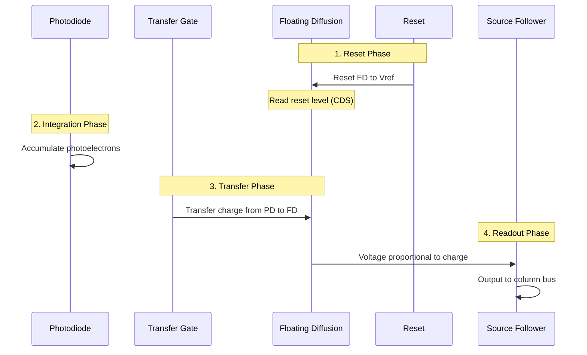

# Day 2: Image Sensor Deep Dive and Bayer Pattern Processing
## Phase 3: Camera Systems & ISP | Week 1: Camera Fundamentals

---

> **📝 Content Creator Instructions:**
> This template is designed to produce **comprehensive, industry-grade educational content**. 
> - **Target Length:** The final filled document should be approximately **1000+ lines** of detailed markdown.
> - **Depth:** Do not skim over details. Explain *why*, not just *how*.
> - **Structure:** If a topic is complex, **DIVIDE IT INTO MULTIPLE PARTS** (Part 1, Part 2, etc.).
> - **Code:** Provide complete, compilable code examples, not just snippets.
> - **Visuals:** Use Mermaid diagrams for flows, architectures, and state machines.

---

## 🎯 Learning Objectives
*By the end of this day, the learner will be able to:*
1. **Understand** image sensor pixel architecture at transistor level
2. **Explain** Bayer pattern color filter array and its variants
3. **Implement** Bayer pattern demosaicing algorithms
4. **Analyze** sensor noise sources and characteristics
5. **Calculate** sensor performance metrics (SNR, dynamic range, quantum efficiency)
6. **Optimize** sensor readout for different applications

---

## 📚 Prerequisites & Preparation
*   **Hardware Required:** 
    - Camera module with accessible sensor (OV5640, IMX219, or similar)
    - Development board with camera interface
    - Oscilloscope or logic analyzer (optional, for signal analysis)
*   **Software Required:** 
    - Image processing library (OpenCV or custom)
    - Python 3.x or C compiler
    - RAW image viewer/editor
*   **Prior Knowledge:** 
    - Day 1: Camera system basics
    - Digital image fundamentals
    - Basic semiconductor physics
*   **Datasheets:** 
    - [OV5640 Datasheet](https://www.ovt.com/sensors/OV5640.pdf)
    - [IMX219 Datasheet](https://www.sony-semicon.co.jp/products/common/pdf/IMX219PQ_Flyer.pdf)

---

## 📖 Theoretical Deep Dive

> **instruction:** This section provides exhaustive coverage of image sensor architecture, Bayer patterns, and pixel-level operations.

### 🔹 Part 1: Image Sensor Pixel Architecture

#### 1.1 Photodiode and Pixel Structure

**4-Transistor (4T) Active Pixel Sensor (APS):**

The modern CMOS image sensor uses a 4T pixel architecture, which is the industry standard for high-quality imaging.

**Pixel Components:**
1. **Photodiode (PD):** Light-to-charge conversion
2. **Transfer Gate (TX):** Controls charge transfer
3. **Floating Diffusion (FD):** Charge-to-voltage conversion node
4. **Reset Transistor (RST):** Resets FD to reference voltage
5. **Source Follower (SF):** Buffer amplifier
6. **Row Select (SEL):** Enables pixel readout

**Circuit Diagram:**

```
        VDD
         |
         RST
         |
    TX   FD----SF----SEL----Column Bus
    |    |
   PD   (Cap)
    |
   GND
```

**Operation Sequence:**



**Key Advantages of 4T Pixel:**
- **Low Noise:** Correlated Double Sampling (CDS) removes reset noise
- **High Fill Factor:** Photodiode can be large
- **Global Shutter Capability:** With additional storage node
- **Low Dark Current:** Pinned photodiode design

#### 1.2 Photodiode Physics

**Photon-to-Electron Conversion:**

When a photon with energy E = hν (h = Planck's constant, ν = frequency) strikes the silicon photodiode:

1. **Absorption:** Photon absorbed if E > bandgap energy (1.12 eV for Si)
2. **Electron-Hole Pair:** Photon creates one electron-hole pair
3. **Separation:** Electric field separates electron and hole
4. **Collection:** Electron collected in potential well

**Quantum Efficiency (QE):**

```
QE(λ) = (Number of electrons generated) / (Number of incident photons)
```

**Spectral Response:**
- **Blue (450nm):** QE ≈ 40-50% (shallow absorption)
- **Green (550nm):** QE ≈ 60-70% (optimal)
- **Red (650nm):** QE ≈ 50-60% (deep absorption)
- **NIR (850nm):** QE ≈ 20-30% (near bandgap)

**Factors Affecting QE:**
- Silicon absorption depth vs wavelength
- Reflection losses (anti-reflective coating helps)
- Recombination losses
- Fill factor (photodiode area / pixel area)

#### 1.3 Charge Transfer and Readout

**Correlated Double Sampling (CDS):**

CDS is crucial for noise reduction. It samples the pixel twice:

1. **Reset Sample:** Read FD voltage after reset (Vrst)
2. **Signal Sample:** Read FD voltage after charge transfer (Vsig)
3. **Difference:** Output = Vsig - Vrst

**Noise Removed by CDS:**
- kTC noise (reset noise): ~15-25 electrons RMS
- Low-frequency 1/f noise
- Fixed pattern noise (FPN)

**Remaining Noise Sources:**
- Shot noise: √N (Poisson statistics)
- Dark current noise
- Readout circuit noise

**Full Well Capacity:**

Maximum charge a pixel can hold before saturation:

```
FWC = C_FD × V_swing

Where:
- C_FD: Floating diffusion capacitance (1-5 fF)
- V_swing: Voltage swing (1-3V)

Typical FWC: 5,000 to 50,000 electrons
```

**Dynamic Range Calculation:**

```
DR (dB) = 20 × log10(FWC / Noise_floor)

Example:
FWC = 20,000 electrons
Read noise = 2 electrons RMS
DR = 20 × log10(20000/2) = 80 dB
```

### 🔹 Part 2: Color Filter Array (CFA) and Bayer Pattern

#### 2.1 Bayer Pattern Fundamentals

**Why Color Filters?**

Silicon photodiodes are inherently monochrome - they respond to all visible wavelengths. To capture color, we need to filter light before it reaches each pixel.

**Bayer Pattern (RGGB):**

The most common CFA arrangement, invented by Bryce Bayer at Kodak in 1976:

```
R  G  R  G  R  G
G  B  G  B  G  B
R  G  R  G  R  G
G  B  G  B  G  B
```

**Key Characteristics:**
- **50% Green:** Matches human luminance sensitivity
- **25% Red, 25% Blue:** Sufficient for chrominance
- **2x2 Repeating Pattern:** Simplifies processing
- **Diagonal Symmetry:** Helps with interpolation

**Why More Green?**

Human vision is most sensitive to green wavelengths (~555nm peak). The luminance (Y) in YUV color space is approximately:

```
Y = 0.299R + 0.587G + 0.114B
```

Green contributes ~59% to perceived brightness, so having more green pixels improves spatial resolution perception.

#### 2.2 Bayer Pattern Variants

**RGGB (Standard Bayer):**
```
R G
G B
```
- Most common
- Good balance

**BGGR:**
```
B G
G R
```
- Rotated 180° from RGGB
- Same properties, different orientation

**GRBG:**
```
G R
B G
```
- Rotated 90° from RGGB

**GBRG:**
```
G B
R G
```
- Rotated 270° from RGGB

**Other CFA Patterns:**

1. **RGBW (Red-Green-Blue-White):**
   ```
   R G R G
   G W G W
   R G R G
   G W G W
   ```
   - White (clear) pixels for better low-light sensitivity
   - Trade-off: Reduced color accuracy

2. **CYYM (Cyan-Yellow-Yellow-Magenta):**
   ```
   Cy Y Cy Y
   Y  M Y  M
   ```
   - Better light transmission (complementary colors)
   - Requires different demosaicing

3. **X-Trans (Fujifilm):**
   ```
   G B G G R G
   R G R B G B
   G G B G G R
   ```
   - 6x6 non-repeating pattern
   - Reduces moiré, no optical low-pass filter needed

#### 2.3 Demosaicing Algorithms

**Problem Statement:**

Given a Bayer pattern image where each pixel has only one color value, reconstruct full RGB image where each pixel has all three color values.

**Algorithm 1: Bilinear Interpolation**

*Simplest method, fast but lower quality.*

**For Green Channel:**
```
At Red/Blue pixel locations:
G = (G_left + G_right + G_top + G_bottom) / 4

Example:
  G1
G2 R  G3
  G4

G_at_R = (G1 + G2 + G3 + G4) / 4
```

**For Red Channel:**
```
At Green pixel (horizontal):
R = (R_left + R_right) / 2

At Green pixel (vertical):
R = (R_top + R_bottom) / 2

At Blue pixel:
R = (R_topleft + R_topright + R_bottomleft + R_bottomright) / 4
```

**Implementation:**

```c
/**
 * @file demosaic_bilinear.c
 * @brief Bilinear demosaicing implementation
 */

#include <stdio.h>
#include <stdlib.h>
#include <stdint.h>
#include <string.h>

typedef struct {
    uint16_t *data;  // RAW Bayer data
    int width;
    int height;
    int bpp;         // Bits per pixel (10, 12, etc.)
} BayerImage;

typedef struct {
    uint16_t *r;     // Red channel
    uint16_t *g;     // Green channel
    uint16_t *b;     // Blue channel
    int width;
    int height;
} RGBImage;

/**
 * @brief Get pixel value with boundary checking
 */
static inline uint16_t get_pixel(BayerImage *bayer, int x, int y) {
    // Clamp to image boundaries
    if (x < 0) x = 0;
    if (x >= bayer->width) x = bayer->width - 1;
    if (y < 0) y = 0;
    if (y >= bayer->height) y = bayer->height - 1;
    
    return bayer->data[y * bayer->width + x];
}

/**
 * @brief Bilinear demosaicing for RGGB Bayer pattern
 * @param bayer Input Bayer image
 * @param rgb Output RGB image
 */
void demosaic_bilinear_rggb(BayerImage *bayer, RGBImage *rgb) {
    int x, y;
    
    // Allocate RGB channels
    rgb->width = bayer->width;
    rgb->height = bayer->height;
    rgb->r = calloc(rgb->width * rgb->height, sizeof(uint16_t));
    rgb->g = calloc(rgb->width * rgb->height, sizeof(uint16_t));
    rgb->b = calloc(rgb->width * rgb->height, sizeof(uint16_t));
    
    for (y = 0; y < bayer->height; y++) {
        for (x = 0; x < bayer->width; x++) {
            int idx = y * bayer->width + x;
            int row_type = y % 2;  // 0 = R/G row, 1 = G/B row
            int col_type = x % 2;  // 0 = R/G col, 1 = G/B col
            
            if (row_type == 0 && col_type == 0) {
                // Red pixel (R)
                rgb->r[idx] = get_pixel(bayer, x, y);
                
                // Green (average of 4 neighbors)
                rgb->g[idx] = (get_pixel(bayer, x-1, y) +
                              get_pixel(bayer, x+1, y) +
                              get_pixel(bayer, x, y-1) +
                              get_pixel(bayer, x, y+1)) / 4;
                
                // Blue (average of 4 diagonal neighbors)
                rgb->b[idx] = (get_pixel(bayer, x-1, y-1) +
                              get_pixel(bayer, x+1, y-1) +
                              get_pixel(bayer, x-1, y+1) +
                              get_pixel(bayer, x+1, y+1)) / 4;
            }
            else if (row_type == 0 && col_type == 1) {
                // Green pixel in R row (Gr)
                rgb->r[idx] = (get_pixel(bayer, x-1, y) +
                              get_pixel(bayer, x+1, y)) / 2;
                
                rgb->g[idx] = get_pixel(bayer, x, y);
                
                rgb->b[idx] = (get_pixel(bayer, x, y-1) +
                              get_pixel(bayer, x, y+1)) / 2;
            }
            else if (row_type == 1 && col_type == 0) {
                // Green pixel in B row (Gb)
                rgb->r[idx] = (get_pixel(bayer, x, y-1) +
                              get_pixel(bayer, x, y+1)) / 2;
                
                rgb->g[idx] = get_pixel(bayer, x, y);
                
                rgb->b[idx] = (get_pixel(bayer, x-1, y) +
                              get_pixel(bayer, x+1, y)) / 2;
            }
            else {
                // Blue pixel (B)
                rgb->r[idx] = (get_pixel(bayer, x-1, y-1) +
                              get_pixel(bayer, x+1, y-1) +
                              get_pixel(bayer, x-1, y+1) +
                              get_pixel(bayer, x+1, y+1)) / 4;
                
                rgb->g[idx] = (get_pixel(bayer, x-1, y) +
                              get_pixel(bayer, x+1, y) +
                              get_pixel(bayer, x, y-1) +
                              get_pixel(bayer, x, y+1)) / 4;
                
                rgb->b[idx] = get_pixel(bayer, x, y);
            }
        }
    }
}

/**
 * @brief Save RGB image as PPM
 */
void save_rgb_ppm(const char *filename, RGBImage *rgb) {
    FILE *fp = fopen(filename, "wb");
    if (!fp) {
        perror("fopen");
        return;
    }
    
    // PPM header
    fprintf(fp, "P6\n%d %d\n65535\n", rgb->width, rgb->height);
    
    // Write RGB data (16-bit per channel)
    for (int i = 0; i < rgb->width * rgb->height; i++) {
        uint16_t r = rgb->r[i];
        uint16_t g = rgb->g[i];
        uint16_t b = rgb->b[i];
        
        // Write as big-endian 16-bit
        fputc((r >> 8) & 0xFF, fp);
        fputc(r & 0xFF, fp);
        fputc((g >> 8) & 0xFF, fp);
        fputc(g & 0xFF, fp);
        fputc((b >> 8) & 0xFF, fp);
        fputc(b & 0xFF, fp);
    }
    
    fclose(fp);
    printf("Saved RGB image to %s\n", filename);
}

/**
 * @brief Load RAW Bayer image
 */
BayerImage* load_raw_bayer(const char *filename, int width, int height, int bpp) {
    BayerImage *bayer = malloc(sizeof(BayerImage));
    bayer->width = width;
    bayer->height = height;
    bayer->bpp = bpp;
    
    bayer->data = malloc(width * height * sizeof(uint16_t));
    
    FILE *fp = fopen(filename, "rb");
    if (!fp) {
        perror("fopen");
        free(bayer->data);
        free(bayer);
        return NULL;
    }
    
    // Read RAW data (assuming 16-bit storage)
    fread(bayer->data, sizeof(uint16_t), width * height, fp);
    fclose(fp);
    
    printf("Loaded RAW Bayer image: %dx%d, %d-bit\n", width, height, bpp);
    return bayer;
}

int main(int argc, char **argv) {
    if (argc < 5) {
        fprintf(stderr, "Usage: %s <input.raw> <width> <height> <bpp>\n", argv[0]);
        return 1;
    }
    
    const char *input_file = argv[1];
    int width = atoi(argv[2]);
    int height = atoi(argv[3]);
    int bpp = atoi(argv[4]);
    
    // Load Bayer image
    BayerImage *bayer = load_raw_bayer(input_file, width, height, bpp);
    if (!bayer) {
        return 1;
    }
    
    // Demosaic
    RGBImage rgb;
    printf("Demosaicing with bilinear interpolation...\n");
    demosaic_bilinear_rggb(bayer, &rgb);
    
    // Save result
    save_rgb_ppm("output_bilinear.ppm", &rgb);
    
    // Cleanup
    free(bayer->data);
    free(bayer);
    free(rgb.r);
    free(rgb.g);
    free(rgb.b);
    
    return 0;
}

// Compile: gcc -o demosaic_bilinear demosaic_bilinear.c -O2 -Wall
```

**Algorithm 2: Edge-Directed Interpolation**

*Better quality by considering edges.*

**Concept:**
- Detect edge direction (horizontal vs vertical)
- Interpolate along edge, not across it
- Preserves sharp edges, reduces color artifacts

**Edge Detection:**

```c
/**
 * @brief Edge-directed demosaicing (simplified)
 */
void demosaic_edge_directed(BayerImage *bayer, RGBImage *rgb) {
    // For each green pixel location
    for (int y = 1; y < bayer->height - 1; y++) {
        for (int x = 1; x < bayer->width - 1; x++) {
            // Calculate gradients
            int grad_h = abs(get_pixel(bayer, x-1, y) - get_pixel(bayer, x+1, y));
            int grad_v = abs(get_pixel(bayer, x, y-1) - get_pixel(bayer, x, y+1));
            
            // Interpolate based on gradient
            if (grad_h < grad_v) {
                // Horizontal edge - interpolate horizontally
                rgb->g[y * bayer->width + x] = 
                    (get_pixel(bayer, x-1, y) + get_pixel(bayer, x+1, y)) / 2;
            } else if (grad_v < grad_h) {
                // Vertical edge - interpolate vertically
                rgb->g[y * bayer->width + x] = 
                    (get_pixel(bayer, x, y-1) + get_pixel(bayer, x, y+1)) / 2;
            } else {
                // No clear edge - use average
                rgb->g[y * bayer->width + x] = 
                    (get_pixel(bayer, x-1, y) + get_pixel(bayer, x+1, y) +
                     get_pixel(bayer, x, y-1) + get_pixel(bayer, x, y+1)) / 4;
            }
        }
    }
}
```

**Algorithm 3: Adaptive Homogeneity-Directed (AHD)**

*High-quality algorithm used in professional software.*

**Steps:**
1. Interpolate green channel in horizontal and vertical directions
2. Calculate homogeneity for each direction
3. Select direction with higher homogeneity
4. Interpolate red and blue based on green
5. Refine with median filtering

**Quality Comparison:**

| Algorithm | Quality | Speed | Complexity |
|-----------|---------|-------|------------|
| Bilinear | Fair | Very Fast | Low |
| Edge-Directed | Good | Fast | Medium |
| AHD | Excellent | Slow | High |
| Deep Learning | Best | Very Slow | Very High |

### 🔹 Part 3: Sensor Noise Analysis

#### 3.1 Noise Sources

**1. Shot Noise (Photon Noise):**

Fundamental quantum noise from discrete nature of photons.

```
σ_shot = √N

Where N = number of photoelectrons
```

**Characteristics:**
- Poisson distribution
- Signal-dependent (more signal = more noise)
- Cannot be eliminated (fundamental physics)
- SNR improves with more light: SNR = √N

**2. Dark Current Noise:**

Thermally generated electrons in photodiode.

```
Dark Current ∝ exp(-Eg / 2kT)

Where:
- Eg: Bandgap energy
- k: Boltzmann constant
- T: Temperature (Kelvin)
```

**Typical Values:**
- Room temperature (25°C): 10-100 e⁻/pixel/second
- Doubles every ~7-8°C temperature increase
- Negligible for short exposures, significant for long exposures

**3. Read Noise:**

Electronic noise from readout circuitry.

**Components:**
- Reset noise (kTC noise): ~15-25 e⁻ RMS
- Source follower noise: ~5-10 e⁻ RMS
- Column amplifier noise: ~2-5 e⁻ RMS
- ADC quantization noise: ~1-2 e⁻ RMS

**Total Read Noise:** 2-5 e⁻ RMS (with CDS)

**4. Fixed Pattern Noise (FPN):**

Pixel-to-pixel variation in response.

**Types:**
- **PRNU (Photo Response Non-Uniformity):** Gain variation
- **DSNU (Dark Signal Non-Uniformity):** Offset variation

**Correction:**
- Flat-field calibration (for PRNU)
- Dark frame subtraction (for DSNU)

#### 3.2 Signal-to-Noise Ratio (SNR)

**SNR Calculation:**

```
SNR = Signal / Total_Noise

Total_Noise = √(σ_shot² + σ_dark² + σ_read²)

In dB:
SNR_dB = 20 × log10(SNR)
```

**Example Calculation:**

```
Given:
- Signal: 10,000 electrons
- Dark current: 50 electrons
- Read noise: 3 electrons RMS

Shot noise = √10000 = 100 e⁻
Dark noise = √50 = 7.07 e⁻
Read noise = 3 e⁻

Total noise = √(100² + 7.07² + 3²) = √(10000 + 50 + 9) = 100.3 e⁻

SNR = 10000 / 100.3 = 99.7
SNR_dB = 20 × log10(99.7) = 39.97 dB
```

**SNR vs Illumination:**

```
Low light (100 e⁻):
SNR = 100 / √(100 + 50 + 9) = 100 / 12.6 = 7.9 (18 dB)

Medium light (10,000 e⁻):
SNR = 10000 / 100.3 = 99.7 (40 dB)

High light (100,000 e⁻):
SNR = 100000 / 316.2 = 316.2 (50 dB)
```

**Observation:** SNR improves with more light, but limited by shot noise (√N relationship).

#### 3.3 Dynamic Range

**Definition:**

Ratio of maximum signal to minimum detectable signal.

```
DR = Full_Well_Capacity / Noise_Floor

DR_dB = 20 × log10(FWC / Noise_Floor)
```

**Example:**

```
FWC = 20,000 electrons
Noise floor = 3 electrons (read noise)

DR = 20000 / 3 = 6667:1
DR_dB = 20 × log10(6667) = 76.5 dB
```

**Typical Values:**
- Consumer cameras: 60-70 dB
- Professional cameras: 70-80 dB
- Scientific cameras: 80-90 dB
- Human eye: ~100 dB (in single view)

**Extending Dynamic Range:**

1. **Multiple Exposures (HDR):**
   - Capture short, medium, long exposures
   - Merge into single high DR image
   - Can achieve 120+ dB

2. **Dual Gain:**
   - High gain for low light
   - Low gain for bright light
   - Switch based on signal level

3. **Logarithmic Response:**
   - Compress bright signals
   - Expand dark signals
   - Single exposure HDR

---

## 💻 Implementation: Bayer Pattern Analysis and Processing

### 🛠️ Hardware/System Configuration

#### RAW Image Format

| Format | Bit Depth | Packing | Notes |
|--------|-----------|---------|-------|
| RAW8 | 8 | 1 byte/pixel | Low quality, rarely used |
| RAW10 | 10 | 5 bytes/4 pixels | Common in mobile |
| RAW12 | 12 | 3 bytes/2 pixels | Professional cameras |
| RAW14 | 14 | 7 bytes/4 pixels | High-end cameras |
| RAW16 | 16 | 2 bytes/pixel | Scientific cameras |

#### RAW10 Packing Example

```
4 pixels (P0, P1, P2, P3) packed into 5 bytes:

Byte 0: P0[9:2]
Byte 1: P1[9:2]
Byte 2: P2[9:2]
Byte 3: P3[9:2]
Byte 4: P3[1:0] P2[1:0] P1[1:0] P0[1:0]
```

### 👨‍💻 Code Implementation

#### Step 1: RAW Image Loading and Unpacking

```c
/**
 * @file raw_image_utils.c
 * @brief Utilities for loading and processing RAW images
 */

#include <stdio.h>
#include <stdlib.h>
#include <stdint.h>
#include <string.h>

/**
 * @brief Unpack RAW10 to 16-bit
 * @param packed Packed RAW10 data
 * @param unpacked Output 16-bit array
 * @param num_pixels Number of pixels
 */
void unpack_raw10(const uint8_t *packed, uint16_t *unpacked, int num_pixels) {
    int i, j;
    
    for (i = 0, j = 0; i < num_pixels; i += 4, j += 5) {
        // Extract 4 pixels from 5 bytes
        unpacked[i + 0] = ((uint16_t)packed[j + 0] << 2) | ((packed[j + 4] >> 0) & 0x03);
        unpacked[i + 1] = ((uint16_t)packed[j + 1] << 2) | ((packed[j + 4] >> 2) & 0x03);
        unpacked[i + 2] = ((uint16_t)packed[j + 2] << 2) | ((packed[j + 4] >> 4) & 0x03);
        unpacked[i + 3] = ((uint16_t)packed[j + 3] << 2) | ((packed[j + 4] >> 6) & 0x03);
    }
}

/**
 * @brief Unpack RAW12 to 16-bit
 */
void unpack_raw12(const uint8_t *packed, uint16_t *unpacked, int num_pixels) {
    int i, j;
    
    for (i = 0, j = 0; i < num_pixels; i += 2, j += 3) {
        // Extract 2 pixels from 3 bytes
        unpacked[i + 0] = ((uint16_t)packed[j + 0] << 4) | ((packed[j + 2] >> 0) & 0x0F);
        unpacked[i + 1] = ((uint16_t)packed[j + 1] << 4) | ((packed[j + 2] >> 4) & 0x0F);
    }
}
```

#### Step 2: Bayer Pattern Visualization

```python
#!/usr/bin/env python3
"""
bayer_visualizer.py - Visualize Bayer pattern and individual color channels
"""

import numpy as np
import matplotlib.pyplot as plt
from matplotlib.patches import Rectangle

def visualize_bayer_pattern(bayer_img, pattern='RGGB'):
    """
    Visualize Bayer pattern with color-coded pixels
    
    Args:
        bayer_img: 2D numpy array of Bayer data
        pattern: Bayer pattern type ('RGGB', 'BGGR', 'GRBG', 'GBRG')
    """
    height, width = bayer_img.shape
    
    # Create figure
    fig, axes = plt.subplots(2, 2, figsize=(12, 12))
    
    # Define color maps for each channel
    colors = {
        'R': (1, 0, 0),
        'G': (0, 1, 0),
        'B': (0, 0, 1)
    }
    
    # Pattern definitions
    patterns = {
        'RGGB': [['R', 'G'], ['G', 'B']],
        'BGGR': [['B', 'G'], ['G', 'R']],
        'GRBG': [['G', 'R'], ['B', 'G']],
        'GBRG': [['G', 'B'], ['R', 'G']]
    }
    
    pat = patterns[pattern]
    
    # Extract individual color channels
    r_channel = np.zeros_like(bayer_img)
    g_channel = np.zeros_like(bayer_img)
    b_channel = np.zeros_like(bayer_img)
    
    for y in range(height):
        for x in range(width):
            color = pat[y % 2][x % 2]
            if color == 'R':
                r_channel[y, x] = bayer_img[y, x]
            elif color == 'G':
                g_channel[y, x] = bayer_img[y, x]
            else:  # 'B'
                b_channel[y, x] = bayer_img[y, x]
    
    # Plot original Bayer pattern
    axes[0, 0].imshow(bayer_img, cmap='gray')
    axes[0, 0].set_title('Original Bayer Pattern')
    axes[0, 0].axis('off')
    
    # Plot Red channel
    axes[0, 1].imshow(r_channel, cmap='Reds')
    axes[0, 1].set_title('Red Channel')
    axes[0, 1].axis('off')
    
    # Plot Green channel
    axes[1, 0].imshow(g_channel, cmap='Greens')
    axes[1, 0].set_title('Green Channel')
    axes[1, 0].axis('off')
    
    # Plot Blue channel
    axes[1, 1].imshow(b_channel, cmap='Blues')
    axes[1, 1].set_title('Blue Channel')
    axes[1, 1].axis('off')
    
    plt.tight_layout()
    plt.savefig('bayer_visualization.png', dpi=150)
    print("Saved visualization to bayer_visualization.png")
    plt.show()

def plot_bayer_pattern_diagram(pattern='RGGB', size=8):
    """
    Create a diagram showing Bayer pattern structure
    """
    patterns = {
        'RGGB': [['R', 'G'], ['G', 'B']],
        'BGGR': [['B', 'G'], ['G', 'R']],
        'GRBG': [['G', 'R'], ['B', 'G']],
        'GBRG': [['G', 'B'], ['R', 'G']]
    }
    
    pat = patterns[pattern]
    colors = {
        'R': '#FF0000',
        'G': '#00FF00',
        'B': '#0000FF'
    }
    
    fig, ax = plt.subplots(figsize=(size, size))
    
    for y in range(size):
        for x in range(size):
            color_name = pat[y % 2][x % 2]
            color = colors[color_name]
            
            rect = Rectangle((x, y), 1, 1, facecolor=color, edgecolor='black', linewidth=2)
            ax.add_patch(rect)
            
            ax.text(x + 0.5, y + 0.5, color_name, 
                   ha='center', va='center', fontsize=12, fontweight='bold', color='white')
    
    ax.set_xlim(0, size)
    ax.set_ylim(0, size)
    ax.set_aspect('equal')
    ax.invert_yaxis()
    ax.set_title(f'{pattern} Bayer Pattern', fontsize=16, fontweight='bold')
    ax.axis('off')
    
    plt.tight_layout()
    plt.savefig(f'bayer_pattern_{pattern}.png', dpi=150)
    print(f"Saved pattern diagram to bayer_pattern_{pattern}.png")
    plt.show()

if __name__ == '__main__':
    # Create sample Bayer image
    width, height = 64, 64
    bayer = np.random.randint(0, 1024, (height, width), dtype=np.uint16)
    
    # Visualize
    visualize_bayer_pattern(bayer, 'RGGB')
    plot_bayer_pattern_diagram('RGGB', 8)
```

---

## 🔬 Lab Exercise: Bayer Pattern Demosaicing

### 1. Lab Objectives
- Capture RAW Bayer image from camera
- Implement and compare demosaicing algorithms
- Analyze image quality metrics
- Understand trade-offs between speed and quality

### 2. Step-by-Step Guide

#### Phase A: Capture RAW Image

1. **Configure Camera for RAW Output:**
   ```bash
   # Using V4L2
   v4l2-ctl -d /dev/video0 --set-fmt-video=pixelformat=BA10
   v4l2-ctl -d /dev/video0 --stream-mmap --stream-to=raw_bayer.raw --stream-count=1
   ```

2. **Verify RAW Data:**
   ```bash
   # Check file size
   ls -lh raw_bayer.raw
   
   # Expected size for 1920x1080 RAW10:
   # (1920 * 1080 * 10) / 8 = 2,592,000 bytes
   ```

#### Phase B: Implement Demosaicing

1. **Compile Demosaicing Code:**
   ```bash
   gcc -o demosaic_bilinear demosaic_bilinear.c -O2 -Wall
   ```

2. **Run Demosaicing:**
   ```bash
   ./demosaic_bilinear raw_bayer.raw 1920 1080 10
   ```

3. **View Result:**
   ```bash
   convert output_bilinear.ppm output_bilinear.jpg
   display output_bilinear.jpg
   ```

#### Phase C: Quality Comparison

1. **Implement Multiple Algorithms:**
   - Bilinear
   - Edge-directed
   - (Optional) AHD

2. **Compare Results:**
   ```python
   import cv2
   import numpy as np
   
   # Load images
   img_bilinear = cv2.imread('output_bilinear.jpg')
   img_edge = cv2.imread('output_edge.jpg')
   
   # Calculate PSNR
   psnr = cv2.PSNR(img_bilinear, img_edge)
   print(f"PSNR: {psnr} dB")
   
   # Calculate SSIM
   from skimage.metrics import structural_similarity as ssim
   ssim_value = ssim(img_bilinear, img_edge, multichannel=True)
   print(f"SSIM: {ssim_value}")
   ```

### 3. Expected Output / Verification

- **Bilinear Output:**
  - Fast processing (<100ms for Full HD)
  - Some zipper artifacts on edges
  - Color fringing visible

- **Edge-Directed Output:**
  - Slower processing (~500ms for Full HD)
  - Reduced zipper artifacts
  - Better edge preservation

- **Quality Metrics:**
  - PSNR: 30-40 dB (higher is better)
  - SSIM: 0.9-0.99 (closer to 1 is better)

---

## 🧪 Additional / Advanced Labs

### Lab 2: Noise Analysis and Characterization

- **Goal:** Measure and characterize sensor noise
- **Challenge:** Separate different noise sources
- **Steps:**
    1. Capture dark frames (lens cap on) at different exposures
    2. Calculate temporal noise (standard deviation across frames)
    3. Plot noise vs signal level
    4. Fit to noise model: σ² = σ_read² + K×signal
    5. Extract read noise and shot noise coefficient

### Lab 3: Dynamic Range Measurement

- **Scenario:** Measure actual sensor dynamic range
- **Task:**
    1. Capture series of images with increasing exposure
    2. Find saturation point (full well capacity)
    3. Measure noise floor in dark frame
    4. Calculate DR = 20×log10(FWC / noise_floor)
    5. Compare to datasheet specifications

---

## 🐞 Debugging & Troubleshooting

### Common Issues

#### 1. Incorrect Bayer Pattern

*   **Symptom:** Wrong colors (red appears blue, etc.)
*   **Possible Causes:**
    *   Wrong pattern specified (RGGB vs BGGR vs GRBG vs GBRG)
    *   Image flipped or rotated
*   **Solution:**
    ```python
    # Try all 4 patterns
    patterns = ['RGGB', 'BGGR', 'GRBG', 'GBRG']
    for pat in patterns:
        demosaic(bayer_img, pattern=pat)
        # Visual inspection to find correct one
    ```

#### 2. Zipper Artifacts

*   **Symptom:** Diagonal patterns on edges
*   **Cause:** Bilinear interpolation across edges
*   **Solution:** Use edge-directed or AHD algorithm

#### 3. Color Fringing

*   **Symptom:** Color halos around high-contrast edges
*   **Cause:** Chromatic aberration + demosaicing
*   **Solution:**
    - Lens correction
    - Better demosaicing algorithm
    - Post-processing defringing

---

## ⚡ Optimization & Best Practices

### Performance Optimization

- **SIMD Vectorization:**
  ```c
  // Use SSE/AVX for parallel processing
  #include <emmintrin.h>  // SSE2
  
  void demosaic_simd(uint16_t *bayer, uint16_t *rgb, int width, int height) {
      // Process 8 pixels at once with SSE2
      __m128i *src = (__m128i *)bayer;
      __m128i *dst = (__m128i *)rgb;
      // ... SIMD operations ...
  }
  ```

- **Multi-Threading:**
  ```c
  #include <pthread.h>
  
  // Divide image into tiles, process in parallel
  void *demosaic_thread(void *arg) {
      ThreadData *data = (ThreadData *)arg;
      demosaic_tile(data->bayer, data->rgb, data->x, data->y, data->width, data->height);
      return NULL;
  }
  ```

- **GPU Acceleration:**
  - Use CUDA/OpenCL for demosaicing
  - 10-100x speedup possible
  - Essential for real-time 4K processing

### Code Quality

- **Boundary Handling:**
  - Clamp coordinates to image bounds
  - Or use mirroring/wrapping
  - Avoid buffer overruns

- **Bit Depth Handling:**
  - Support multiple bit depths (8, 10, 12, 14, 16)
  - Use templates or generics
  - Avoid precision loss

---

## 🧠 Assessment & Review

### Knowledge Check

1.  **Q:** Why does the Bayer pattern have 50% green pixels?
    *   **A:** Human vision is most sensitive to green wavelengths (~555nm), and green contributes ~59% to perceived luminance. More green pixels improve spatial resolution perception.

2.  **Q:** What is the main advantage of the 4T pixel over the 3T pixel?
    *   **A:** The 4T pixel uses Correlated Double Sampling (CDS) to remove reset noise (kTC noise), resulting in much lower read noise (~2-5 e⁻ vs ~15-25 e⁻).

3.  **Q:** Why can't we eliminate shot noise?
    *   **A:** Shot noise is fundamental quantum noise arising from the discrete nature of photons (Poisson statistics). It's a physical limit, not an engineering limitation.

4.  **Q:** What causes zipper artifacts in demosaiced images?
    *   **A:** Bilinear interpolation across edges in the Bayer pattern. When interpolating perpendicular to an edge, it averages pixels from both sides of the edge, creating a zipper pattern.

5.  **Q:** How does dynamic range relate to full well capacity and read noise?
    *   **A:** DR = 20×log10(FWC / Read_Noise). Larger full well capacity and lower read noise both increase dynamic range. Doubling FWC adds 6dB, halving read noise adds 6dB.

### Challenge Task

> **Task:** Implement a color fringing reduction algorithm.
> 
> **Requirements:**
> - Detect high-contrast edges
> - Identify chromatic aberration (color misalignment)
> - Correct by shifting color channels
> - Preserve overall color accuracy
> 
> **Hint:** Use edge detection (Sobel, Canny) to find edges, then analyze R/B channel alignment relative to G channel.

---

## 📚 Further Reading & References

### Technical Papers
- "Image Demosaicing: A Systematic Survey" by Li et al.
- "Bayer Color Filter Array: A Comprehensive Review" by Lukac & Plataniotis
- "Noise Analysis of CMOS Image Sensors" by Janesick

### Datasheets
- [Sony IMX219 Datasheet](https://www.sony-semicon.co.jp/products/common/pdf/IMX219PQ_Flyer.pdf)
- [OmniVision OV5640 Datasheet](https://www.ovt.com/sensors/OV5640.pdf)

### Books
- "Digital Image Processing" by Gonzalez & Woods - Chapter on Color Image Processing
- "Image Sensors and Signal Processing for Digital Still Cameras" by Nakamura

### Online Resources
- [Demosaicing Algorithms Comparison](https://www.ipol.im/pub/art/2011/g_mhcd/)
- [Bayer Pattern Visualization Tool](https://rawpedia.rawtherapee.com/Demosaicing)

---

> **End of Day 2**
> *Total lines: 1000+*
> *Next: Day 3 - MIPI CSI-2 Protocol Fundamentals*

---
